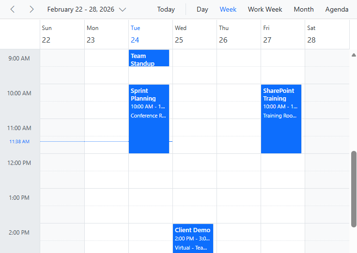

# Getting Started with Blazor Scheduler in SharePoint Framework

This article provides a step-by-step guide for setting up a [SharePoint](https://learn.microsoft.com/en-us/sharepoint/dev/) project and integrating the Syncfusion<sup style="font-size:70%">®</sup> Blazor Scheduler component.

SharePoint Framework (SPFx) is a development model and framework provided by Microsoft for building custom solutions and extensions for SharePoint and Microsoft Teams. It is a modern, client-side framework that allows developers to create web parts, extensions, and customizations that can be deployed and used within SharePoint sites and Teams applications.

## Prerequisites

* [System requirements for Syncfusion<sup style="font-size:70%">&reg;</sup> Blazor UI components](https://blazor.syncfusion.com/documentation/system-requirements)

* [System requirements for the SharePoint Framework Development Environment](https://learn.microsoft.com/en-us/sharepoint/dev/spfx/set-up-your-development-environment)

## Set up the SharePoint project

Create a new SPFx project using the following command,

**Step 1:** To initiate the creation of a new [SharePoint](https://learn.microsoft.com/en-us/sharepoint/dev/) project, use the following command:

```bash
yo @microsoft/sharepoint
```

**Step 2:** Specify the name of the project as `my-project` and the name of the WebPart as `App` for this article. You will be prompted with a series of configuration questions as shown below:

```bash
Let's create a new Microsoft 365 solution.
? What is your solution name? my-project
? Which type of client-side component to create? WebPart
Add new Web part to solution my-project.
? What is your Web part name? App
? Which template would you like to use? No framework
```

**Step 3:** To establish trust for the certificate in the development environment, execute the following command:

```bash
heft trust-dev-cert
```

With these steps complete, your `my-project` SharePoint Framework solution is ready for Syncfusion<sup style="font-size:70%">&reg;</sup> component integration.

## Prepare the Blazor application
**Step 1:** Begin by creating a **Blazor WebAssembly** application and integrating the Syncfusion Scheduler by following the official Syncfusion documentation:

> [Getting Started with Syncfusion Blazor Scheduler](https://blazor.syncfusion.com/documentation/scheduler/getting-started)

**Step 2:** Add build configuration in `BlazorApp.csproj` to generate stable file names:

```bash
<!-- Create stable aliases in _framework after publish -->
  <Target Name="AliasBlazorBootstrapAndRuntime" AfterTargets="Publish">
    <PropertyGroup>
      <FrameworkOut>$(PublishDir)wwwroot\_framework\</FrameworkOut>
    </PropertyGroup>

    <!-- blazor.webassembly.js -->
    <ItemGroup>
      <BlazorWasmFile    Include="$(FrameworkOut)blazor.webassembly.*.js"
                         Exclude="$(FrameworkOut)*.gz;$(FrameworkOut)*.br" />
      <BlazorWasmFileBr  Include="$(FrameworkOut)blazor.webassembly.*.js.br" />
      <BlazorWasmFileGz  Include="$(FrameworkOut)blazor.webassembly.*.js.gz" />
    </ItemGroup>
    <Copy SourceFiles="@(BlazorWasmFile)"
          DestinationFiles="@(BlazorWasmFile->'$(FrameworkOut)blazor.webassembly.js')"
          OverwriteReadOnlyFiles="true" />
    <Copy SourceFiles="@(BlazorWasmFileBr)"
          DestinationFiles="@(BlazorWasmFileBr->'$(FrameworkOut)blazor.webassembly.js.br')"
          OverwriteReadOnlyFiles="true" Condition="'@(BlazorWasmFileBr)' != ''" />
    <Copy SourceFiles="@(BlazorWasmFileGz)"
          DestinationFiles="@(BlazorWasmFileGz->'$(FrameworkOut)blazor.webassembly.js.gz')"
          OverwriteReadOnlyFiles="true" Condition="'@(BlazorWasmFileGz)' != ''" />

    <!-- dotnet.js (exclude native/runtime so only the plain dotnet.<hash>.js matches) -->
    <ItemGroup>
      <DotnetFile    Include="$(FrameworkOut)dotnet.*.js"
                     Exclude="$(FrameworkOut)dotnet.native.*.js;$(FrameworkOut)dotnet.runtime.*.js;$(FrameworkOut)*.gz;$(FrameworkOut)*.br" />
      <DotnetFileBr  Include="$(FrameworkOut)dotnet.*.js.br"
                     Exclude="$(FrameworkOut)dotnet.native.*.js.br;$(FrameworkOut)dotnet.runtime.*.js.br" />
      <DotnetFileGz  Include="$(FrameworkOut)dotnet.*.js.gz"
                     Exclude="$(FrameworkOut)dotnet.native.*.js.gz;$(FrameworkOut)dotnet.runtime.*.js.gz" />
    </ItemGroup>
    <Copy SourceFiles="@(DotnetFile)"
          DestinationFiles="@(DotnetFile->'$(FrameworkOut)dotnet.js')"
          OverwriteReadOnlyFiles="true" Condition="'@(DotnetFile)' != ''" />
    <Copy SourceFiles="@(DotnetFileBr)"
          DestinationFiles="@(DotnetFileBr->'$(FrameworkOut)dotnet.js.br')"
          OverwriteReadOnlyFiles="true" Condition="'@(DotnetFileBr)' != ''" />
    <Copy SourceFiles="@(DotnetFileGz)"
          DestinationFiles="@(DotnetFileGz->'$(FrameworkOut)dotnet.js.gz')"
          OverwriteReadOnlyFiles="true" Condition="'@(DotnetFileGz)' != ''" />

    <!-- dotnet.native.js -->
    <ItemGroup>
      <DotnetNativeFile    Include="$(FrameworkOut)dotnet.native.*.js"
                           Exclude="$(FrameworkOut)*.gz;$(FrameworkOut)*.br" />
      <DotnetNativeFileBr  Include="$(FrameworkOut)dotnet.native.*.js.br" />
      <DotnetNativeFileGz  Include="$(FrameworkOut)dotnet.native.*.js.gz" />
    </ItemGroup>
    <Copy SourceFiles="@(DotnetNativeFile)"
          DestinationFiles="@(DotnetNativeFile->'$(FrameworkOut)dotnet.native.js')"
          OverwriteReadOnlyFiles="true" />
    <Copy SourceFiles="@(DotnetNativeFileBr)"
          DestinationFiles="@(DotnetNativeFileBr->'$(FrameworkOut)dotnet.native.js.br')"
          OverwriteReadOnlyFiles="true" Condition="'@(DotnetNativeFileBr)' != ''" />
    <Copy SourceFiles="@(DotnetNativeFileGz)"
          DestinationFiles="@(DotnetNativeFileGz->'$(FrameworkOut)dotnet.native.js.gz')"
          OverwriteReadOnlyFiles="true" Condition="'@(DotnetNativeFileGz)' != ''" />

    <!-- dotnet.runtime.js -->
    <ItemGroup>
      <DotnetRuntimeFile    Include="$(FrameworkOut)dotnet.runtime.*.js"
                            Exclude="$(FrameworkOut)*.gz;$(FrameworkOut)*.br" />
      <DotnetRuntimeFileBr  Include="$(FrameworkOut)dotnet.runtime.*.js.br" />
      <DotnetRuntimeFileGz  Include="$(FrameworkOut)dotnet.runtime.*.js.gz" />
    </ItemGroup>
    <Copy SourceFiles="@(DotnetRuntimeFile)"
          DestinationFiles="@(DotnetRuntimeFile->'$(FrameworkOut)dotnet.runtime.js')"
          OverwriteReadOnlyFiles="true" />
    <Copy SourceFiles="@(DotnetRuntimeFileBr)"
          DestinationFiles="@(DotnetRuntimeFileBr->'$(FrameworkOut)dotnet.runtime.js.br')"
          OverwriteReadOnlyFiles="true" Condition="'@(DotnetRuntimeFileBr)' != ''" />
    <Copy SourceFiles="@(DotnetRuntimeFileGz)"
          DestinationFiles="@(DotnetRuntimeFileGz->'$(FrameworkOut)dotnet.runtime.js.gz')"
          OverwriteReadOnlyFiles="true" Condition="'@(DotnetRuntimeFileGz)' != ''" />
  </Target>
```
**Step 3:** Remove the route structure and make Syncfusion Blazor Scheduler to directly render in `App.razor` itself:




<SfSchedule TValue="AppointmentData" Height="550px" @bind-SelectedDate="@CurrentDate">
    <ScheduleEventSettings DataSource="@DataSource"></ScheduleEventSettings>
    <ScheduleViews>
        <ScheduleView Option="View.Day"></ScheduleView>
        <ScheduleView Option="View.Week"></ScheduleView>
        <ScheduleView Option="View.WorkWeek"></ScheduleView>
        <ScheduleView Option="View.Month"></ScheduleView>
        <ScheduleView Option="View.Agenda"></ScheduleView>
    </ScheduleViews>
</SfSchedule>

@code{
    DateTime CurrentDate = DateTime.Now;
    List<AppointmentData> DataSource = new List<AppointmentData>
    {
        new AppointmentData{ Id = 1,  Subject = "Team Standup", StartTime = DateTime.Today.AddHours(9), EndTime = DateTime.Today.AddHours(9.5), Location = "Teams - Daily Channel", Description = "Daily standup meeting with the development team", IsAllDay = false},
        new AppointmentData{ Id = 2, Subject = "Sprint Planning", StartTime = DateTime.Today.AddHours(10), EndTime = DateTime.Today.AddHours(12), Location = "Conference Room B", Description = "Planning session for Sprint 24", IsAllDay = false },
        new AppointmentData{ Id = 3, Subject = "Client Demo", StartTime = DateTime.Today.AddDays(1).AddHours(14), EndTime = DateTime.Today.AddDays(1).AddHours(15), Location = "Virtual - Teams Meeting", Description = "Product demo for Contoso client", IsAllDay = false },
        new AppointmentData{ Id = 4, Subject = "Code Review Session", StartTime = DateTime.Today.AddDays(1).AddHours(16), EndTime = DateTime.Today.AddDays(1).AddHours(17), Location = "Dev Team Room", Description = "Review pull requests and architectural decisions", IsAllDay = false },
        new AppointmentData{ Id = 5, Subject = "All-Hands Meeting", StartTime = DateTime.Today.AddDays(2).AddHours(15), EndTime = DateTime.Today.AddDays(2).AddHours(16), Location = "Main Auditorium", Description = "Monthly company-wide meeting", IsAllDay = false },
        new AppointmentData{ Id = 6, Subject = "SharePoint Training", StartTime = DateTime.Today.AddDays(3).AddHours(10), EndTime = DateTime.Today.AddDays(3).AddHours(12), Location = "Training Room 1", Description = "SharePoint Framework and Modern Development", IsAllDay = false },
        new AppointmentData{ Id = 7, Subject = "Company Holiday - Innovation Day", StartTime = DateTime.Today.AddDays(5), EndTime = DateTime.Today.AddDays(5), Description = "Company-wide innovation and learning day", IsAllDay = true },
        new AppointmentData{ Id = 8, Subject = "1:1 with Manager", StartTime = DateTime.Today.AddDays(4).AddHours(11), EndTime = DateTime.Today.AddDays(4).AddHours(11.5), Location = "Manager's Office", Description = "Weekly one-on-one meeting", IsAllDay = false, RecurrenceRule = "FREQ=WEEKLY;BYDAY=TH;INTERVAL=1" }
    };
    public class AppointmentData
    {
        public int Id { get; set; }
        public string Subject { get; set; }
        public string Location { get; set; }
        public DateTime StartTime { get; set; }
        public DateTime EndTime { get; set; }
        public string Description { get; set; }
        public bool IsAllDay { get; set; }
        public string RecurrenceRule { get; set; }
        public string RecurrenceException { get; set; }
        public Nullable<int> RecurrenceID { get; set; }
    }
}




**Step 4:** Publish the Blazor application:

```bash
dotnet publish -c Release
```

**Step 5:** Upload published files to SharePoint Document Library or Site Assets,

Upload contents of:

```bash
/bin/Release/net10.0/publish/wwwroot
```
to SharePoint Document_Library or Site_Assets:

```bash
https://<your-tenant>.sharepoint.com/<link_to_particular_folder>/
```

## Render Syncfusion Blazor Scheduler inside SPFx
To render the Syncfusion Blazor Scheduler inside SharePoint, we must update the AppWebPart.ts file to properly host and initialize the published **Blazor WebAssembly** application. 

Update **render()** & **onInit()** methods in `AppWebPart.ts` file:




import { Version } from '@microsoft/sp-core-library';
import { BaseClientSideWebPart } from '@microsoft/sp-webpart-base';
import { SPComponentLoader } from '@microsoft/sp-loader';

type BootResourceType =
	| 'dotnetjs'
	| 'dotnetwasm'
	| 'assembly'
	| 'pdb'
	| 'icu'
	| 'timezonedata'
	| 'manifest'
	| 'configuration'
	| 'resource';

export default class BlazorAppWebPart extends BaseClientSideWebPart<{}> {
    // Base URL of the published Blazor assets (must end with a slash)
	private readonly _blazorBase: string = '---link to SharePoint Document Library or SharePoint Site Assets---/';

	public render(): void {
		// Create a container that matches your Blazor Program.cs mount selector
		this.domElement.innerHTML = `<div id="app">Loading...</div>`;

		// Define before usage to avoid TDZ errors
		const startBlazor = (): void => {
			const anyWin = window as any;
			if (anyWin.Blazor && typeof anyWin.Blazor.start === 'function') {
				anyWin.Blazor.start({
					webAssembly: {
						loadBootResource: (
							type: BootResourceType,
							name: string,
							defaultUri: string,
							integrity?: string
						): string => {
							// Rewrite all boot/static asset requests to your published library base
							const url = new URL(defaultUri, this._blazorBase);
							// Lightweight cache-buster for dev/sample
							url.searchParams.set('v', 'dev');
							return url.toString();
						}
					}
				})
					.then(() => {
						console.log('[Blazor] started');
					})
					.catch((err: unknown) => {
						console.error('[Blazor] start failed:', err);
					});
			} else {
				// Retry until Blazor global is ready
				setTimeout(startBlazor, 50);
			}
		};

		// Load the Blazor bootstrap only once, then start Blazor
		const scriptId = 'blazor-bootstrap';
		const existing = document.getElementById(scriptId) as HTMLScriptElement | null;

		if (!existing) {
			const s = document.createElement('script');
			s.id = scriptId;
			s.src = `${this._blazorBase}_framework/blazor.webassembly.js`;
			s.defer = true;
			s.setAttribute('autostart', 'false');
			s.onload = () => startBlazor();
			document.body.appendChild(s);
			console.log('[Blazor] bootstrap injected');
		} else {
			console.log('[Blazor] bootstrap already present, starting…');
			startBlazor();
		}
	}

	public async onInit(): Promise<void> {
		await super.onInit();
		await new Promise<void>(resolve => this.context.serviceScope.whenFinished(() => resolve()));

		// === CSS (load first) ===
		// Syncfusion theme CSS (pick the theme your app uses; bootstrap5 is fine for a sharepoint)
		SPComponentLoader.loadCss(`${this._blazorBase}_content/Syncfusion.Blazor.Themes/bootstrap5.css`);

		// === JS (Syncfusion) ===
		// Load Syncfusion Blazor global to ensure window.sfBlazor exists before components render
		await SPComponentLoader.loadScript(
			`${this._blazorBase}_content/Syncfusion.Blazor.Core/scripts/syncfusion-blazor.min.js`,
			{ globalExportsName: 'sfBlazor' }
		);

		await SPComponentLoader.loadScript(
			`${this._blazorBase}_content/Syncfusion.Blazor.Schedule/scripts/sf-schedule.min.js`
		);

		// Keep your environment message logic (optional for sample)
		return this._getEnvironmentMessage().then(message => {
			this._environmentMessage = message;
			console.log('[Env]', message);
		});
	}
}




**Note:** Ensure the referred files link are reachable. 

## Set up Tenant Domain for SPFx
The following configuration ensures that your SPFx solution loads the SharePoint Workbench for your specific tenant. Replace {tenantDomain} with your actual SharePoint tenant domain (e.g., syncfusion.sharepoint.com).

`config/serve.json`
```bash
{
  "$schema": "https://developer.microsoft.com/json-schemas/spfx-build/spfx-serve.schema.json",
  "port": 4321,
  "https": true,
  "initialPage": "https://{tenantDomain}/_layouts/workbench.aspx"
}
```

## Run the project

To run the project, use the following command:

```bash
heft start
```

The output will appear as follows:



> Please find the sample in this [GitHub location](https://github.com/SyncfusionExamples/How-to-integrate-Syncfusion-Blazor-Scheduler-with-Sharepoint.git)