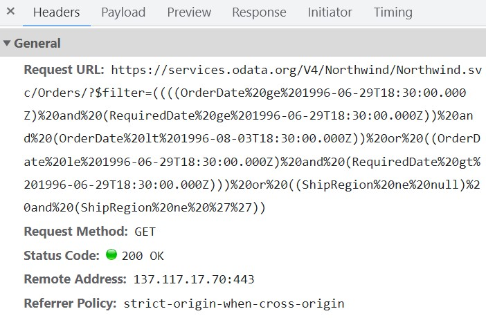

```markdown
---
layout: post
title: Data Binding in Blazor Scheduler Component | Syncfusion
description: This section explains how to bind various data sources to the Syncfusion Blazor Scheduler component, covering list binding, dynamic object binding, custom adaptors, and remote data services using DataManager adaptors.
platform: Blazor
control: Scheduler
documentation: ug
---

# Data Binding in Blazor Scheduler Component

The Scheduler component utilizes [`DataManager`](https://help.syncfusion.com/cr/blazor/Syncfusion.Blazor.DataManager.html) to handle data binding, supporting both RESTful data service binding and direct data source collections. The [`DataSource`](https://help.syncfusion.com/cr/blazor/Syncfusion.Blazor.Schedule.ScheduleEventSettings-1.html#Syncfusion_Blazor_Schedule_ScheduleEventSettings_1_DataSource) property within `ScheduleEventSettings` can be assigned either an instance of `DataManager` or a list of data source collections.

The Scheduler supports the following primary methods for data binding:

*   List Binding
*   Remote Data Binding

Please take a moment to watch this video to learn about data binding in the Blazor Scheduler.



## List Binding

To bind data from a local list to the Scheduler, simply assign a collection of data objects (implementing `IEnumerable`) to the [`DataSource`](https://help.syncfusion.com/cr/blazor/Syncfusion.Blazor.Schedule.ScheduleEventSettings-1.html#Syncfusion_Blazor_Schedule_ScheduleEventSettings_1_DataSource) property within the `<ScheduleEventSettings>` tag. The list data source can also be provided as an instance of [`SfDataManager`](https://help.syncfusion.com/cr/blazor/Syncfusion.Blazor.Data.SfDataManager.html) or by directly using the `<SfDataManager>` component.

```cshtml
@using Syncfusion.Blazor.Schedule

<SfSchedule TValue="AppointmentData" Height="550px" SelectedDate="@(new DateTime(2020, 2, 12))">
    <ScheduleEventSettings DataSource="@DataSource"></ScheduleEventSettings>
</SfSchedule>

@code{
    List<AppointmentData> DataSource { get; set; } = new List<AppointmentData>
    {
        new AppointmentData { Id = 1, Subject = "Testing", StartTime = new DateTime(2020, 2, 13, 9, 30, 0) , EndTime = new DateTime(2020, 2, 13, 10, 30, 0)},
        new AppointmentData { Id = 2, Subject = "Conference", StartTime = new DateTime(2020, 2, 11, 10, 30, 0) , EndTime = new DateTime(2020, 2, 11, 12, 0, 0)},
        new AppointmentData { Id = 3, Subject = "Meeting", StartTime = new DateTime(2020, 2, 9, 9, 30, 0) , EndTime = new DateTime(2020, 2, 9, 11, 30, 0)},
        new AppointmentData { Id = 4, Subject = "Vacation", StartTime = new DateTime(2020, 2, 14, 11, 30, 0) , EndTime = new DateTime(2020, 2, 14, 13, 0, 0)}
    };
    public class AppointmentData
    {
        public int Id { get; set; }
        public string? Subject { get; set; }
        public string? Location { get; set; }
        public DateTime StartTime { get; set; }
        public DateTime EndTime { get; set; }
        public string? Description { get; set; }
        public bool IsAllDay { get; set; }
        public string? RecurrenceRule { get; set; }
        public string? RecurrenceException { get; set; }
        public int? RecurrenceID { get; set; }
    }
}
```

N> By default, `DataManager` utilizes `BlazorAdaptor` for binding local data.
> You can also bind different field names to the default event fields and include additional `custom fields` in the event object collection. Refer to the [Appointment Customization documentation](./appointment-customization.md) for more details.

## ExpandoObject Binding

The Scheduler is a generic component that is strongly bound to a model type. However, for scenarios where the model type is unknown at compile-time or runtime, **ExpandoObject** binding can be used. This allows data to be bound as a list of dynamic objects.

**ExpandoObject** implements the `IDictionary<string, object>` interface, enabling the addition of properties and values dynamically at runtime, similar to a dictionary. This provides a flexible way to bind data without requiring a predefined class or strict data structure, particularly useful for data sources with varying structures.

To bind data using `ExpandoObject`, create a list of `ExpandoObject` instances and set it as the `DataSource` property of the Scheduler's `ScheduleEventSettings` component. The Scheduler supports all data operations and editing functionalities with `ExpandoObject` binding.

```csharp
@using System.Dynamic // Required for ExpandoObject
@using Syncfusion.Blazor.Schedule
<SfSchedule TValue="ExpandoObject" @bind-SelectedDate="@CurrentDate" Width="100%" Height="550px">
    <ScheduleEventSettings DataSource="@EventsCollection" AllowEditFollowingEvents="true"></ScheduleEventSettings>
    <ScheduleViews>
        <ScheduleView Option="View.Day"></ScheduleView>
        <ScheduleView Option="View.Week"></ScheduleView>
        <ScheduleView Option="View.WorkWeek"></ScheduleView>
        <ScheduleView Option="View.Month"></ScheduleView>
        <ScheduleView Option="View.Agenda"></ScheduleView>
    </ScheduleViews>
</SfSchedule>
@code {
    DateTime CurrentDate { get; set; } = new DateTime(2021, 8, 10);
    public List<ExpandoObject> EventsCollection { get; set; } = new List<ExpandoObject>();
    
    protected override void OnInitialized()
    {
        DateTime scheduleStart = new DateTime(2021, 8, 8, 10, 0, 0);
        var random = new Random(); // Single instance for better randomness
        EventsCollection = Enumerable.Range(1, 5).Select((x) =>
        {
            scheduleStart = scheduleStart.AddDays(1);
            dynamic d = new ExpandoObject();
            d.Id = 1000 + x;
            d.Subject = (new string[] { "Project Discussion", "Work Flow Analysis", "Report", "Meeting", "Project Demo" })[random.Next(5)];
            d.StartTime = scheduleStart;
            d.EndTime = scheduleStart.AddHours(1);
            d.IsAllDay = false;
            // Recurrence properties are set to null as they are not used in this basic example
            d.RecurrenceRule = null;
            d.RecurrenceException = null;
            d.RecurrenceID = null;
            return d;
        }).Cast<ExpandoObject>().ToList<ExpandoObject>();
    }
}
```

## DynamicObject Binding

**DynamicObject** binding offers another method for data binding when the model type is unknown at compile time. This approach leverages the `dynamic` keyword, allowing variables to hold objects that can dynamically add or manage properties at runtime.

To bind data using `DynamicObject`, create a list of custom `DynamicObject` instances and set it as the `DataSource` property of the Scheduler's `ScheduleEventSettings` component. This enables the use of the Scheduler's built-in data operations and editing features with dynamically behaving objects.

**DynamicObject** implements the `IDynamicMetaObjectProvider` interface, which allows overriding member access operations like `GetMember` and `SetMember` for custom logic. This is particularly useful for scenarios where object behavior is determined at runtime.

N> For data operations and editing to function correctly, the [`GetDynamicMemberNames`](https://learn.microsoft.com/en-us/dotnet/api/system.dynamic.dynamicobject.getdynamicmembernames?view=net-7.0) method of the `DynamicObject` class must be overridden to return the names of the available properties.

```csharp
@using System.Dynamic
@using Syncfusion.Blazor.Schedule

<SfSchedule TValue="DynamicDictionary" @bind-SelectedDate="@CurrentDate" Width="100%" Height="550px">
    <ScheduleEventSettings DataSource="@EventsCollection"></ScheduleEventSettings>
    <ScheduleViews>
        <ScheduleView Option="View.Day"></ScheduleView>
        <ScheduleView Option="View.Week"></ScheduleView>
        <ScheduleView Option="View.WorkWeek"></ScheduleView>
        <ScheduleView Option="View.Month"></ScheduleView>
        <ScheduleView Option="View.Agenda"></ScheduleView>
    </ScheduleViews>
</SfSchedule>
@code {
    DateTime CurrentDate { get; set; } = new DateTime(2021, 8, 10);
    public List<DynamicDictionary> EventsCollection { get; set; } = new List<DynamicDictionary>();
    
    protected override void OnInitialized()
    {
        DateTime scheduleStart = new DateTime(2021, 8, 8, 10, 0, 0);
        var random = new Random(); // Single instance for better randomness
        EventsCollection = Enumerable.Range(1, 5).Select((x) =>
        {
            scheduleStart = scheduleStart.AddDays(1);
            dynamic d = new DynamicDictionary();
            d.Id = 1000 + x;
            d.Subject = (new string[] { "Project Discussion", "Work Flow Analysis", "Report", "Meeting", "Project Demo" })[random.Next(5)];
            d.StartTime = scheduleStart;
            d.EndTime = scheduleStart.AddHours(1);
            d.IsAllDay = false; // Example added for clarity
            // Recurrence properties are set to null as they are not used in this basic example
            d.RecurrenceRule = null; 
            d.RecurrenceException = null;
            d.RecurrenceID = null;
            return d;
        }).Cast<DynamicDictionary>().ToList<DynamicDictionary>();
    }

    // Custom DynamicObject implementation
    public class DynamicDictionary : System.Dynamic.DynamicObject
    {
        private Dictionary<string, object> dictionary = new Dictionary<string, object>();

        // Provides the mechanism for operations that get a member by name.
        public override bool TryGetMember(GetMemberBinder binder, out object result)
        {
            string name = binder.Name;
            return dictionary.TryGetValue(name, out result);
        }

        // Provides the mechanism for operations that set a member by name.
        public override bool TrySetMember(SetMemberBinder binder, object value)
        {
            dictionary[binder.Name] = value;
            return true;
        }

        // Provides the enumeration of all dynamic member names.
        public override System.Collections.Generic.IEnumerable<string> GetDynamicMemberNames()
        {
            return this.dictionary.Keys;
        }
    }
}
```

## ObservableCollection

Utilizing [`ObservableCollection`](https://learn.microsoft.com/en-us/dotnet/api/system.collections.objectmodel.observablecollection-1?view=net-7.0) (a dynamic data collection) provides notifications when items are added, removed, or moved. This collection implements [`INotifyCollectionChanged`](https://learn.microsoft.com/en-us/dotnet/api/system.collections.specialized.inotifycollectionchanged?view=net-7.0), informing the Scheduler of dynamic changes such as additions, removals, moves, or clearing of items. Furthermore, the `AppointmentData` class implements [`INotifyPropertyChanged`](https://learn.microsoft.com/en-us/dotnet/api/system.componentmodel.inotifypropertychanged?view=net-7.0), which notifies the UI when a property value (e.g., `Subject`) has changed on the client side.

In this example, the `AppointmentData` class implements `INotifyPropertyChanged`, raising an event when the `Subject` property value is modified.

```csharp
@using Syncfusion.Blazor.Schedule
@using Syncfusion.Blazor.Buttons
@using System.Collections.ObjectModel
@using System.ComponentModel

<SfButton @onclick="AddRecord">Add Data</SfButton>
<SfButton @onclick="UpdateRecord" Disabled="@(ObservableData?.Count == 0)">Update Data</SfButton> @* Disabled if no data exists *@
<SfButton @onclick="DeleteRecord" Disabled="@(ObservableData?.Count == 0)">Delete Data</SfButton> @* Disabled if no data exists *@

<SfSchedule TValue="AppointmentData" @bind-SelectedDate="@CurrentDate" Width="100%" Height="550px">
    <ScheduleEventSettings DataSource="@ObservableData"></ScheduleEventSettings>
    <ScheduleViews>
        <ScheduleView Option="View.Day"></ScheduleView>
        <ScheduleView Option="View.Week"></ScheduleView>
        <ScheduleView Option="View.WorkWeek"></ScheduleView>
        <ScheduleView Option="View.Month"></ScheduleView>
        <ScheduleView Option="View.Agenda"></ScheduleView>
    </ScheduleViews>
</SfSchedule>

@code{
    DateTime CurrentDate { get; set; } = new DateTime(2020, 3, 10);
    // Initialize ObservableData directly in the property
    public ObservableCollection<AppointmentData> ObservableData { get; set; } = new ObservableCollection<AppointmentData>();
    private int uniqueid = 0; // Start unique IDs from 0 or higher

    protected override void OnInitialized()
    {
        var random = new Random(); // Use a single Random instance
        uniqueid = 0; // Reset unique ID counter if re-initialized

        // Populate initial data for ObservableCollection
        for (int x = 1; x <= 4; x++)
        {
            uniqueid++;
            ObservableData.Add(new AppointmentData()
            {
                Id = uniqueid,
                Subject = (new string[] { "Project Discussion", "Work Flow Analysis", "Report", "Meeting", "Project Demo" })[random.Next(5)],
                StartTime = new DateTime(2020, 3, 8 + x, 9, 0, 0),
                EndTime = new DateTime(2020, 3, 8 + x, 11, 0, 0)
            });
        }
    }

    public void AddRecord()
    {
        uniqueid++;
        ObservableData.Add(new AppointmentData() { Id = uniqueid, Subject = "New Meeting", StartTime = new DateTime(2020, 3, 13, 9, 0, 0), EndTime = new DateTime(2020, 3, 13, 11, 0, 0) });
    }

    public void DeleteRecord()
    {
        if (ObservableData.Any()) // Check if collection is not empty
        {
            ObservableData.Remove(ObservableData.First());
        }
    }

    public void UpdateRecord()
    {
        if (ObservableData.Any()) // Check if collection is not empty
        {
            var data = ObservableData.First();
            data.Subject = "Event Updated via INotifyPropertyChanged"; // This will trigger UI update
        }
    }

    public class AppointmentData : INotifyPropertyChanged
    {
        public int Id { get; set; }
        private string? _subject; // Backing field for Subject property
        public string? Subject
        {
            get { return _subject; }
            set
            {
                if (_subject != value) // Only notify if value has truly changed
                {
                    _subject = value;
                    NotifyPropertyChanged(nameof(Subject));
                }
            }
        }
        public string? Location { get; set; }
        public DateTime StartTime { get; set; }
        public DateTime EndTime { get; set; }
        public string? Description { get; set; }
        public bool IsAllDay { get; set; }
        public string? RecurrenceRule { get; set; }
        public string? RecurrenceException { get; set; }
        public int? RecurrenceID { get; set; }
        public string? StartTimezone { get; set; }
        public string? EndTimezone { get; set; }

        public event PropertyChangedEventHandler? PropertyChanged; // Nullable event handler
        private void NotifyPropertyChanged(string propertyName)
        {
            PropertyChanged?.Invoke(this, new PropertyChangedEventArgs(propertyName));
        }
    }
}
```

## Custom Binding (Custom Adaptor)

It is possible to create a custom `DataAdaptor` by extending the built-in `DataAdaptor` class. This allows for binding data from a custom service and performing CRUD operations using the methods of the `DataAdaptor` abstract class.

The following example demonstrates the usage of a custom adaptor to bind data with a custom service. The `CustomAdaptor` overrides methods like `ReadAsync`, `InsertAsync`, `UpdateAsync`, and `RemoveAsync` to interact with a local `List<AppointmentData>`.

```cshtml
@using Syncfusion.Blazor
@using Syncfusion.Blazor.Schedule
@using Syncfusion.Blazor.Data

<SfSchedule TValue="AppointmentData" Width="100%" Height="650px" SelectedDate="@(new DateTime(2020, 1, 9))">
    <ScheduleResources>
        <ScheduleResource TItem="ResourceData" TValue="int" DataSource="@ProjectData" Field="ProjectId" Title="Choose Project" Name="Projects" TextField="Text" IdField="Id" ColorField="Color">
        </ScheduleResource>
    </ScheduleResources>
    <ScheduleEventSettings TValue="AppointmentData">
        <SfDataManager AdaptorInstance="@typeof(CustomAdaptor)" Adaptor="Adaptors.CustomAdaptor"></SfDataManager>
    </ScheduleEventSettings>
</SfSchedule>

@code {
    public class CustomAdaptor : DataAdaptor
    {
        // This is a static list to simulate a data store for the custom adaptor
        // In a real application, this would interact with a database or external service.
        private static List<AppointmentData> EventDataStore = DataList();

        public async override Task<object> ReadAsync(DataManagerRequest dataManagerRequest, string key = null)
        {
            // To mimic asynchronous operation, we delay this operation
            await Task.Delay(100); 
            return dataManagerRequest.RequiresCounts ? new DataResult() { Result = EventDataStore, Count = EventDataStore.Count() } : (object)EventDataStore;
        }

        public async override Task<object> InsertAsync(DataManager dataManager, object data, string key)
        {
            await Task.Delay(100); 
            if (data is AppointmentData newAppointment)
            {
                // Assign a new ID; ensure it's unique in a real scenario
                newAppointment.Id = EventDataStore.Any() ? EventDataStore.Max(e => e.Id) + 1 : 1;
                EventDataStore.Add(newAppointment);
                return newAppointment;
            }
            return data;
        }

        public async override Task<object> UpdateAsync(DataManager dataManager, object data, string keyField, string key)
        {
            await Task.Delay(100); 
            if (data is AppointmentData updatedAppointment)
            {
                var appointment = EventDataStore.FirstOrDefault(a => a.Id == updatedAppointment.Id);
                if (appointment != null)
                {
                    // Update properties of the existing appointment
                    appointment.Subject = updatedAppointment.Subject;
                    appointment.StartTime = updatedAppointment.StartTime;
                    appointment.EndTime = updatedAppointment.EndTime;
                    appointment.Location = updatedAppointment.Location;
                    appointment.Description = updatedAppointment.Description;
                    appointment.IsAllDay = updatedAppointment.IsAllDay;
                    appointment.ProjectId = updatedAppointment.ProjectId;
                    appointment.RecurrenceException = updatedAppointment.RecurrenceException;
                    appointment.RecurrenceID = updatedAppointment.RecurrenceID;
                    appointment.RecurrenceRule = updatedAppointment.RecurrenceRule;
                    // Ensure other properties are updated as needed
                }
            }
            return data;
        }

        public async override Task<object> RemoveAsync(DataManager dataManager, object data, string keyField, string key)
        {
            await Task.Delay(100); 
            if (data is int appointmentIdToRemove) // Assuming data is the ID
            {
                EventDataStore.RemoveAll(a => a.Id == appointmentIdToRemove);
            }
            else if (data is AppointmentData appointmentToRemove)
            {
                EventDataStore.RemoveAll(a => a.Id == appointmentToRemove.Id);
            }
            return data;
        }

        // Handles batch operations (Add, Update, Delete) typically from drag/drop or batch editing
        public async override Task<object> BatchUpdateAsync(DataManager dataManager, object changedRecords, object addedRecords, object deletedRecords, string keyField, string key, int? dropIndex)
        {
            await Task.Delay(100); 
            
            // Process deletions
            if (deletedRecords is List<AppointmentData> deleteData)
            {
                foreach (var data in deleteData)
                {
                    EventDataStore.RemoveAll(a => a.Id == data.Id);
                }
            }
            
            // Process additions
            if (addedRecords is List<AppointmentData> addData)
            {
                foreach (var newAppointment in addData)
                {
                    newAppointment.Id = EventDataStore.Any() ? EventDataStore.Max(e => e.Id) + 1 : 1; // Assign unique IDs
                    EventDataStore.Add(newAppointment);
                }
            }

            // Process updates
            if (changedRecords is List<AppointmentData> updateData)
            {
                foreach (var val in updateData)
                {
                    var appointment = EventDataStore.FirstOrDefault(a => a.Id == val.Id);
                    if (appointment != null)
                    {
                        // Update properties of the existing appointment
                        appointment.Subject = val.Subject;
                        appointment.StartTime = val.StartTime;
                        appointment.EndTime = val.EndTime;
                        appointment.Location = val.Location;
                        appointment.Description = val.Description;
                        appointment.IsAllDay = val.IsAllDay;
                        appointment.ProjectId = val.ProjectId;
                        appointment.RecurrenceException = val.RecurrenceException;
                        appointment.RecurrenceID = val.RecurrenceID;
                        appointment.RecurrenceRule = val.RecurrenceRule;
                    }
                }
            }
            // Return null or processed records based on requirements
            return null;
        }

        // Static method to provide initial data for the store
        private static List<AppointmentData> DataList()
        {
            return new List<AppointmentData>
            {
                new AppointmentData { Id = 1, Subject = "Meeting", StartTime = new DateTime(2020, 1, 5, 10, 0, 0) , EndTime = new DateTime(2020, 1, 5, 11, 0, 0), ProjectId = 1, RecurrenceRule = "FREQ=DAILY;INTERVAL=1;COUNT=5;"},
                new AppointmentData { Id = 2, Subject = "Project Discussion", StartTime = new DateTime(2020, 1, 6, 11, 30, 0) , EndTime = new DateTime(2020, 1, 6, 13, 0, 0), ProjectId = 2},
                new AppointmentData { Id = 3, Subject = "Work Flow Analysis", StartTime = new DateTime(2020, 1, 7, 12, 0, 0) , EndTime = new DateTime(2020, 1, 7, 13, 0, 0), ProjectId = 2, RecurrenceRule = "FREQ=DAILY;INTERVAL=1;COUNT=3;"},
                new AppointmentData { Id = 4, Subject = "Report", StartTime = new DateTime(2020, 1, 10, 11, 30, 0) , EndTime = new DateTime(2020, 1, 10, 13, 0, 0), ProjectId = 2}
            };
        }
    }

    List<ResourceData> ProjectData { get; set; } = ResourceList();

    private static List<ResourceData> ResourceList()
    {
        return new List<ResourceData>
        {
            new ResourceData { Text = "PROJECT 1", Id = 1, Color = "#cb6bb2" },
            new ResourceData { Text = "PROJECT 2", Id = 2, Color = "#56ca85" }
        };
    }

    public class AppointmentData
    {
        public int Id { get; set; }
        public string? Subject { get; set; }
        public string? Location { get; set; }
        public DateTime StartTime { get; set; }
        public DateTime EndTime { get; set; }
        public string? Description { get; set; }
        public bool IsAllDay { get; set; }
        public string? RecurrenceRule { get; set; }
        public string? RecurrenceException { get; set; }
        public int? RecurrenceID { get; set; }
        public int ProjectId { get; set; } // Custom field for resource
    }

    public class ResourceData
    {
        public int Id { get; set; }
        public string? Text { get; set; }
        public string? Color { get; set; }
    }
}
```

N> The complete procedures to perform CRUD actions with the Syncfusion<sup style="font-size:70%">&reg;</sup> Blazor Scheduler using `CustomAdaptor` can be found [here](https://github.com/SyncfusionExamples/Blazor-Scheduler-CRUD-using-custom-adaptor).

## Remote Data Binding

Any type of remote data services can be bound to the Scheduler. To achieve this, provide the service URL to the `Url` option of `SfDataManager` within the `<ScheduleEventSettings>` tag.

### Binding with OData Services

[OData](https://www.odata.org/documentation/odata-version-3-0/) (Open Data Protocol) is a widely used protocol for creating and consuming RESTful APIs. It provides a standardized way for interacting with data, simplifying the development and consumption of RESTful APIs.

Data can be retrieved from an OData service using `SfDataManager`. Refer to the following code example for remote data binding using an OData service.

```cshtml
@using Syncfusion.Blazor
@using Syncfusion.Blazor.Schedule
@using Syncfusion.Blazor.Data
@* Assuming EventData model is defined in Restful_Crud.Models *@

<SfSchedule TValue="Restful_Crud.Models.EventData" Height="550px" SelectedDate="@(new DateTime(2020, 3, 11))">
    <ScheduleEventSettings TValue="Restful_Crud.Models.EventData" Query="@QueryData">
        <SfDataManager Url="http://localhost:25255/odata" Adaptor="Adaptors.ODataAdaptor"></SfDataManager>
    </ScheduleEventSettings>
</SfSchedule>

@code{
    public Query QueryData { get; set; } = new Query().From("EventDatas");
}
```

### Binding with OData v4 Services

[ODataV4](https://www.odata.org/documentation/) is the latest version of the OData protocol, offering enhanced features and better performance. It supports advanced query options, data validation, and data shaping, and is based on the JSON format, making it more lightweight.

To retrieve data from an ODataV4 service using the `DataManager`, it is necessary to use `ODataV4Adaptor` within the `<SfDataManager>`.

```cshtml
@using Syncfusion.Blazor
@using Syncfusion.Blazor.Schedule
@using Syncfusion.Blazor.Data
@* Assuming EventData model is defined in Restful_Crud.Models *@

<SfSchedule TValue="Restful_Crud.Models.EventData" Height="550px" SelectedDate="@(new DateTime(2020, 3, 11))">
    <ScheduleEventSettings TValue="Restful_Crud.Models.EventData" Query="@QueryData">
        <SfDataManager Url="http://localhost:25255/odata" Adaptor="Adaptors.ODataV4Adaptor"></SfDataManager>
    </ScheduleEventSettings>
</SfSchedule>

@code{
    public Query QueryData { get; set; } = new Query().From("EventDatas");
}
```

N> A working sample demonstrating integration with OData can be found [here](https://github.com/SyncfusionExamples/Blazor-Scheduler-CRUD-using-ODATA-adaptor).

### Filtering Events Using the In-built Query

To enable server-side filtering operations based on predetermined conditions, the [`IncludeFiltersInQuery`](https://help.syncfusion.com/cr/blazor/Syncfusion.Blazor.Schedule.ScheduleEventSettings-1.html#Syncfusion_Blazor_Schedule_ScheduleEventSettings_1_IncludeFiltersInQuery) API can be set to `true`. This constructs a filter query using the start date, end date, and recurrence rule, allowing the request to be filtered accordingly.

This method significantly improves the component's performance by reducing the amount of data transferred to the client side, thereby enhancing efficiency and responsiveness. However, it is important to consider the potential for longer query strings, which might exceed maximum URL lengths or server limitations.

```cshtml
@using Syncfusion.Blazor
@using Syncfusion.Blazor.Data;
@using Syncfusion.Blazor.Schedule

<SfSchedule TValue="AppointmentData" Height="550px" @bind-SelectedDate="@currentDate">
    <ScheduleEventSettings TValue="AppointmentData" Query="@QueryData" IncludeFiltersInQuery="true">
        @* Example using a public ODataV4 service for Northwind Orders *@
        <SfDataManager Url="https://services.odata.org/V4/Northwind/Northwind.svc/Orders/" Adaptor="Adaptors.ODataV4Adaptor">
        </SfDataManager>
        <ScheduleField Id="Id">
            <FieldSubject Name="ShipName"></FieldSubject>
            <FieldLocation Name="ShipCountry"></FieldLocation>
            <FieldDescription Name="ShipAddress"></FieldDescription>
            <FieldStartTime Name="OrderDate"></FieldStartTime>
            <FieldEndTime Name="RequiredDate"></FieldEndTime>
            <FieldRecurrenceRule Name="ShipRegion"></FieldRecurrenceRule>
        </ScheduleField>
    </ScheduleEventSettings>
</SfSchedule>

@code {
    DateTime currentDate { get; set; } = new DateTime(1996, 7, 9);
    public Query QueryData { get; set; } = new Query();

    public class AppointmentData
    {
        public int Id { get; set; }
        public string? ShipName { get; set; }
        public DateTime OrderDate { get; set; }
        public DateTime RequiredDate { get; set; }
        public string? ShipCountry { get; set; }
        public string? ShipAddress { get; set; }
        public string? ShipRegion { get; set; }
    }
}
```

The following image illustrates how parameters are passed using an ODataV4 filter.



### Web API Adaptor

Web API data can be bound to the Scheduler using [`WebApiAdaptor`](https://blazor.syncfusion.com/documentation/data/adaptors#web-api-adaptor). The following sample code demonstrates binding remote services to the Scheduler component.

```cshtml
@using Syncfusion.Blazor
@using Syncfusion.Blazor.Data;
@using Syncfusion.Blazor.Schedule

<SfSchedule TValue="AppointmentData" Height="550px" @bind-SelectedDate="@currentDate" Readonly="true">
    <ScheduleEventSettings TValue="AppointmentData" >
        <ScheduleViews>
            <ScheduleView Option="View.Month"></ScheduleView>
        </ScheduleViews>
       <SfDataManager Url="https://blazor.syncfusion.com/services/production/api/schedule" Adaptor="Adaptors.WebApiAdaptor">
       </SfDataManager>
    </ScheduleEventSettings>
</SfSchedule>

@code {
    DateTime currentDate { get; set; } = new DateTime(2023, 1, 6);

    public class AppointmentData
    {
            public int Id { get; set; }
            public string? Subject { get; set; }
            public string? Location { get; set; }
            public string? Description { get; set; }
            public DateTime StartTime { get; set; }
            public DateTime EndTime { get; set; }
            public bool? IsAllDay { get; set; }
            public string? CategoryColor { get; set; }
            public string? RecurrenceRule { get; set; }
            public int? RecurrenceID { get; set; }
            public int? FollowingID { get; set; }
            public string? RecurrenceException { get; set; }
            public string? StartTimezone { get; set; }
            public string? EndTimezone { get; set; }
    }
}
```

### URL Adaptor
The [`UrlAdaptor`](https://blazor.syncfusion.com/documentation/data/adaptors#url-adaptor) of `SfDataManager` is used to bind remote data sources. During the initial load of the Scheduler, data is fetched from the remote service via the `Url` property of `SfDataManager` and bound to the Scheduler.

CRUD (Create, Read, Update, Delete) operations in the Scheduler can be mapped to server-side controller actions using the `InsertUrl`, `RemoveUrl`, `UpdateUrl`, and `CrudUrl` properties.

*   `InsertUrl` – Specifies the URL for a single insertion operation on the server-side.
*   `UpdateUrl` – Specifies the URL for updating a single data record on the server-side.
*   `RemoveUrl` – Specifies the URL for removing a single data record on the server-side.
*   `CrudUrl` – Specifies the URL for performing bulk data operations (batch CRUD) on the server-side.

The following sample code demonstrates binding data to the Scheduler component through `SfDataManager` using `UrlAdaptor` in a Blazor Web App (server-side project).

```cshtml
@using Syncfusion.Blazor
@using Syncfusion.Blazor.Data;
@using Syncfusion.Blazor.Schedule
@using Url_Adaptor.Data @* Assuming these namespaces are for data models and services *!/
@using Url_Adaptor.Models
@using Url_Adaptor.Pages

<SfSchedule TValue="Event" Height="550px" @bind-SelectedDate="@currentDate" AllowMultiDrag="true">
    <ScheduleEventSettings TValue="Event">
        @* Configure SfDataManager with UrlAdaptor and specific URLs for CRUD operations *!/
        <SfDataManager Url="api/Scheduler" UpdateUrl="/api/Scheduler/Update" RemoveUrl="/api/Scheduler/Delete" InsertUrl="/api/Scheduler/Add" CrudUrl="/api/Scheduler/Batch" Adaptor="Adaptors.UrlAdaptor">
        </SfDataManager>
    </ScheduleEventSettings>
    <ScheduleViews>
        <ScheduleView Option="View.Month"></ScheduleView>
    </ScheduleViews>
</SfSchedule>

@code {
    DateTime currentDate { get; set; } = new DateTime(2022, 12, 6);
    // The 'Event' model would be defined in Url_Adaptor.Models
}
```

The corresponding server-side ASP.NET Core controller code to handle the CRUD operations with `UrlAdaptor` is as follows:

```csharp
using Microsoft.AspNetCore.Mvc;
using Microsoft.EntityFrameworkCore;
using Syncfusion.Blazor.Data; // Assuming CRUDModel is in this namespace
using System;
using System.Linq;
using System.Threading.Tasks;

namespace Url_Adaptor.Controllers
{
    [ApiController]
    [Route("api/[controller]")] // Base route for the controller
    public class SchedulerController : ControllerBase // Renamed DefaultController to SchedulerController
    {
        private readonly EventsContext dbContext;

        public SchedulerController(EventsContext dbContext)
        {
            this.dbContext = dbContext;

            // Seed data if the database is empty (for demonstration purposes)
            if (!this.dbContext.Events.Any())
            {
                foreach (var b in DataSource.GetEvents()) // Assuming DataSource.GetEvents() provides initial data
                {
                    dbContext.Events.Add(b);
                }
                dbContext.SaveChanges();
            }
        }

        [HttpGet] // Changed to HttpGet for Read operation
        public IActionResult Get()
        {
            var events = dbContext.Events.ToList();
            return Ok(events);
        }

        [HttpPost("Add")] // Route for Insert operation
        public async Task<IActionResult> Add([FromBody] CRUDModel<Event> args)
        {
            if (ModelState.IsValid && args.Value != null)
            {
                // Assign a new ID; ensure it's unique in a real scenario
                args.Value.Id = dbContext.Events.Any() ? dbContext.Events.Max(p => p.Id) + 1 : 1;
                dbContext.Events.Add(args.Value);
                await dbContext.SaveChangesAsync();
                return Ok(args.Value); // Return the added entity, potentially with updated ID
            }
            return BadRequest(ModelState);
        }

        [HttpPost("Update")] // Route for Update operation
        public async Task<IActionResult> Update([FromBody] CRUDModel<Event> args)
        {
            if (ModelState.IsValid && args.Value != null)
            {
                var entity = await dbContext.Events.FindAsync(args.Value.Id);
                if (entity != null)
                {
                    // Update only changed values
                    dbContext.Entry(entity).CurrentValues.SetValues(args.Value);
                    await dbContext.SaveChangesAsync();
                    return Ok(args.Value); // Return the updated entity
                }
                return NotFound();
            }
            return BadRequest(ModelState);
        }

        [HttpPost("Delete")] // Route for Remove operation
        public async Task<IActionResult> Delete([FromBody] CRUDModel<Event> args)
        {
            if (args.Key != null) // args.Key contains the ID of the item to delete
            {
                var key = Convert.ToInt32(Convert.ToString(args.Key));
                var app = await dbContext.Events.FindAsync(key);
                if (app != null)
                {
                    dbContext.Events.Remove(app);
                    await dbContext.SaveChangesAsync();
                    return Ok(app); // Return the deleted entity
                }
                return NotFound();
            }
            return BadRequest("Invalid request: Key is missing.");
        }

        [HttpPost("Batch")] // Route for Batch operations
        public async Task<IActionResult> Batch([FromBody] CRUDModel<Event> args)
        {
            // Process deleted items
            if (args.Deleted != null && args.Deleted.Any())
            {
                foreach (Event appointment in args.Deleted)
                {
                    var app = await dbContext.Events.FindAsync(appointment.Id);
                    if (app != null)
                    {
                        dbContext.Events.Remove(app);
                    }
                }
            }
            // Process added items
            if (args.Added != null && args.Added.Any())
            {
                foreach (Event appointment in args.Added)
                {
                    // Assign a new ID; ensure uniqueness
                    appointment.Id = dbContext.Events.Any() ? dbContext.Events.Max(p => p.Id) + 1 : 1;
                    dbContext.Events.Add(appointment);
                }
            }
            // Process changed items
            if (args.Changed != null && args.Changed.Any())
            {
                foreach (Event appointment in args.Changed)
                {
                    var entity = await dbContext.Events.FindAsync(appointment.Id);
                    if (entity != null)
                    {
                        dbContext.Entry(entity).CurrentValues.SetValues(appointment);
                    }
                }
            }
            await dbContext.SaveChangesAsync();
            // Return processed data (often args.Value, args.Added, args.Changed, args.Deleted)
            return Ok(args);
        }
    }

    // Example Event model for the database context
    public class Event
    {
        public int Id { get; set; }
        public string? Subject { get; set; }
        public string? Location { get; set; }
        public string? Description { get; set; }
        public DateTime StartTime { get; set; }
        public DateTime EndTime { get; set; }
        public bool? IsAllDay { get; set; }
        public string? CategoryColor { get; set; }
        public string? RecurrenceRule { get; set; }
        public int? RecurrenceID { get; set; }
        public int? FollowingID { get; set; }
        public string? RecurrenceException { get; set; }
        public string? StartTimezone { get; set; }
        public string? EndTimezone { get; set; }
    }

    // Example EventsContext for Entity Framework Core
    public class EventsContext : DbContext
    {
        public EventsContext(DbContextOptions<EventsContext> options) : base(options) { }
        public DbSet<Event> Events { get; set; }
        // Further configuration if needed
        protected override void OnModelCreating(ModelBuilder modelBuilder)
        {
            modelBuilder.Entity<Event>().HasKey(e => e.Id); // Ensure Id is recognized as primary key
            // Additional model configurations
        }
    }
}
```

### Sending Additional Parameters to the Server

To send an additional custom parameter with the data request, use the `AddParams` method of [`Query`](https://help.syncfusion.com/cr/blazor/Syncfusion.Blazor.Schedule.ScheduleEventSettings-1.html#Syncfusion_Blazor_Schedule_ScheduleEventSettings_1_Query). Assign this `Query` object (with additional parameters) to the `Query` property of `ScheduleEventSettings`.

```cshtml
@using Syncfusion.Blazor
@using Syncfusion.Blazor.Schedule
@using Syncfusion.Blazor.Data
@* Assuming EventData model is defined in Restful_Crud.Models *@

<SfSchedule TValue="Restful_Crud.Models.EventData" Height="550px" SelectedDate="@(new DateTime(2020, 3, 11))">
    <ScheduleEventSettings TValue="Restful_Crud.Models.EventData" Query="@QueryData">
        <SfDataManager Url="http://localhost:25255/odata" Adaptor="Adaptors.ODataV4Adaptor"></SfDataManager>
    </ScheduleEventSettings>
</SfSchedule>

@code{
    public Query QueryData { get; set; } = new Query().From("EventDatas").AddParams("Readonly", true);
}
```

The value passed to the additional parameter is shown in the following image.


N> Parameters added using the `Query` property will be sent along with the data request to the server on every Scheduler action.

### Authorization and Authentication

It is common to have authorization configured on the server to prevent anonymous access to data services. `SfDataManager` can consume data from such protected remote services by including the proper bearer token in the request. The access token or bearer token can be utilized by `SfDataManager` in one of the following ways:

*   **Using a pre-configured `HttpClient`:** Register a pre-configured `HttpClient` with the access token or an authentication message handler before calling `AddSyncfusionBlazor()` in `Program.cs`. This ensures that `SfDataManager` uses the already configured `HttpClient` instead of creating its own.
*  **Setting access token in `HttpClient.DefaultRequestHeaders`:** Inject `HttpClient` into the Blazor component and set the access token in `DefaultRequestHeaders`.

```csharp
@inject HttpClient _httpClient

@code {
    protected override async Task OnInitializedAsync()
    {
        // ... (retrieve tokenValue, e.g., from local storage or authentication service) ...
        var tokenValue = "your_access_token_here"; // Replace with actual token retrieval
        _httpClient.DefaultRequestHeaders.Add("Authorization", $"Bearer {tokenValue}");

        await base.OnInitializedAsync();
    }
}
```

*   **Setting the access token in the `Headers` property of `SfDataManager`:** The `Headers` property directly allows adding custom HTTP headers. Refer to [Setting Custom Headers](#setting-custom-headers) for this approach.

Retrieving the bearer token may vary depending on the access token provider. More information on configuring `HttpClient` with authentication can be found on the official Microsoft page [here](https://learn.microsoft.com/en-us/aspnet/core/blazor/security/webassembly/additional-scenarios?view=aspnetcore-7.0).

### Setting Custom Headers

To add custom headers to the data request, use the [`Headers`](https://help.syncfusion.com/cr/blazor/Syncfusion.Blazor.DataManager.html#Syncfusion_Blazor_DataManager_Headers) property of the [`SfDataManager`](https://help.syncfusion.com/cr/blazor/Syncfusion.Blazor.Data.SfDataManager.html).

The following sample code demonstrates adding custom headers to the `SfDataManager` request:

```cshtml
@using Syncfusion.Blazor
@using Syncfusion.Blazor.Data;
@using Syncfusion.Blazor.Schedule

<SfSchedule TValue="AppointmentData" Height="550px" @bind-SelectedDate="@currentDate" Readonly="true">
    <ScheduleEventSettings TValue="AppointmentData">
        <ScheduleViews>
            <ScheduleView Option="View.Month"></ScheduleView>
        </ScheduleViews>
        <SfDataManager Headers="@HeaderData" Url="https://blazor.syncfusion.com/services/production/api/schedule" Adaptor="Adaptors.WebApiAdaptor">
        </SfDataManager>
    </ScheduleEventSettings>
</SfSchedule>

@code {
    DateTime currentDate { get; set; } = new DateTime(2023, 1, 6);
    private IDictionary<string, string> HeaderData { get; set; } = new Dictionary<string, string>
    {
        { "X-Custom-Header", "MyCustomValue" },
        { "Authorization", "Bearer your_token_here" } // Example: Adding an authorization token
    };

    public class AppointmentData
    {
        public int Id { get; set; }
        public string? Subject { get; set; }
        public string? Location { get; set; }
        public string? Description { get; set; }
        public DateTime StartTime { get; set; }
        public DateTime EndTime { get; set; }
        public bool? IsAllDay { get; set; }
        public string? CategoryColor { get; set; }
        public string? RecurrenceRule { get; set; }
        public int? RecurrenceID { get; set; }
        public int? FollowingID { get; set; }
        public string? RecurrenceException { get; set; }
        public string? StartTimezone { get; set; }
        public string? EndTimezone { get; set; }
    }
}
```

### Handling HTTP Errors

During server interaction from the Scheduler, server-side exceptions or HTTP errors might occur. These error messages or exception details can be acquired on the client-side using the [`OnActionFailure`](https://help.syncfusion.com/cr/blazor/Syncfusion.Blazor.Schedule.ScheduleEvents-1.html#Syncfusion_Blazor_Schedule_ScheduleEvents_1_OnActionFailure) event.

The argument passed to the `OnActionFailure` event contains the error details returned from the server.

The following sample code demonstrates notifying the user when a server-side exception has occurred:

```cshtml
@using Syncfusion.Blazor
@using Syncfusion.Blazor.Data;
@using Syncfusion.Blazor.Schedule

<span class="error">@ErrorDetails</span>

<SfSchedule TValue="AppointmentData" Height="550px" @bind-SelectedDate="@currentDate" Readonly="true">
    <ScheduleEventSettings TValue="AppointmentData">
        <ScheduleEvents TValue="AppointmentData" OnActionFailure="@ActionFailure"></ScheduleEvents>
        <ScheduleViews>
            <ScheduleView Option="View.Month"></ScheduleView>
        </ScheduleViews>
        <SfDataManager Url="https://some.com/invalidUrl" Adaptor=" Adaptors.WebApiAdaptor"> @* Using an invalid URL to force an error *!/
        </SfDataManager>
    </ScheduleEventSettings>
</SfSchedule>

<style>
    .error {
        color: red;
    }
</style>

@code {
    DateTime currentDate { get; set; } = new DateTime(2023, 1, 6);
    public string ErrorDetails { get; set; } = "";

    public class AppointmentData
    {
        public int Id { get; set; }
        public string? Subject { get; set; }
        public string? Location { get; set; }
        public string? Description { get; set; }
        public DateTime StartTime { get; set; }
        public DateTime EndTime { get; set; }
        public bool? IsAllDay { get; set; }
        public string? CategoryColor { get; set; }
        public string? RecurrenceRule { get; set; }
        public int? RecurrenceID { get; set; }
        public int? FollowingID { get; set; }
        public string? RecurrenceException { get; set; }
        public string? StartTimezone { get; set; }
        public string? EndTimezone { get; set; }
    }

    public void ActionFailure(ActionEventArgs<AppointmentData> args)
    {
        // Access args.Error for detailed error information
        this.ErrorDetails = $"Server exception: {args.Error?.Code} - {args.Error?.Message}";
        StateHasChanged();
    }
}
```
## Load on Demand

The Scheduler supports implementing data loading on demand, which helps minimize data transfer over the network, particularly with large volumes of data. This is achieved by filtering appointments on the server side based on the currently requested `StartDate` and `EndDate`.

The following code example describes the behavior of load-on-demand using a custom adaptor.





@using Syncfusion.Blazor.Schedule
@using Syncfusion.Blazor.Data
@using syncfusion_blazor_app.Data @* Assuming AppointmentDataAdaptor is defined here *!/

<SfSchedule TValue="AppointmentData" Width="100%" Height="600px" @bind-SelectedDate="@SelectedDate">
    <ScheduleViews>
        <ScheduleView Option="View.Day"></ScheduleView>
        <ScheduleView Option="View.Week"></ScheduleView>
        <ScheduleView Option="View.WorkWeek"></ScheduleView>
        <ScheduleView Option="View.Month"></ScheduleView>
        <ScheduleView Option="View.Agenda"></ScheduleView>
    </ScheduleViews>
    <ScheduleEventSettings TValue="AppointmentData">
        <SfDataManager AdaptorInstance="@typeof(AppointmentDataAdaptor)" Adaptor="Adaptors.CustomAdaptor">
        </SfDataManager>
    </ScheduleEventSettings>
</SfSchedule>

@code {
    DateTime SelectedDate { get; set; } = new DateTime(2023, 5, 10);
    // AppointmentData model would typically be defined in syncfusion_blazor_app.Data
    public class AppointmentData
    {
        public int Id { get; set; }
        public int UserID { get; set; } // Example of a custom field in data model
        public string? Subject { get; set; }
        public DateTime StartTime { get; set; }
        public DateTime EndTime { get; set; }
        public bool IsAllDay { get; set; }
        public string? Location { get; set; }
        public string? Description { get; set; }
        public string? RecurrenceRule { get; set; }
        public int? RecurrenceID { get; set; }
        public string? RecurrenceException { get; set; }
        public string? StartTimezone { get; set; }
        public string? EndTimezone { get; set; }
        public bool IsReadOnly { get; set; }
    }
}





using Syncfusion.Blazor;
using Syncfusion.Blazor.Data;
using System.Collections.Generic;
using System.Linq;
using System.Threading.Tasks;
using Microsoft.EntityFrameworkCore; // Required for FirstAsync, ToListAsync etc.

namespace syncfusion_blazor_app.Data 
{
    public class AppointmentDataAdaptor : DataAdaptor 
    {
        private readonly AppointmentDataService _appService;

        // Constructor for dependency injection
        public AppointmentDataAdaptor(AppointmentDataService appService) 
        {
            _appService = appService;
        }

        // Reads appointments based on the Scheduler's current view range
        public async override Task<object> ReadAsync(DataManagerRequest dataManagerRequest, string key = null) 
        {
            DateTime start = (DateTime)dataManagerRequest.Params["StartDate"]; // Extract StartDate from DataManagerRequest
            DateTime end = (DateTime)dataManagerRequest.Params["EndDate"];     // Extract EndDate from DataManagerRequest
            
            var appointments = await _appService.Get(start, end);
            return dataManagerRequest.RequiresCounts 
                ? new DataResult() { Result = appointments, Count = appointments.Count() } 
                : (object)appointments;
        }

        // Inserts a new appointment
        public async override Task<object> InsertAsync(DataManager dataManager, object data, string key) 
        {
            if (data is AppointmentData newAppointment)
            {
                await _appService.Insert(newAppointment);
            }
            return data;
        }

        // Updates an existing appointment
        public async override Task<object> UpdateAsync(DataManager dataManager, object data, string keyField, string key) 
        {
            if (data is AppointmentData updatedAppointment)
            {
                await _appService.Update(updatedAppointment);
            }
            return data;
        }

        // Removes an appointment
        public async override Task<object> RemoveAsync(DataManager dataManager, object data, string keyField, string key) 
        {
            // 'data' will be the ID of the appointment to remove if keyField is "Id"
            if (data is int appointmentId) 
            {
                var app = await _appService.GetByID(appointmentId);
                if (app != null) await _appService.Delete(app);
            }
            return data;
        }

        // Handles batch CRUD operations
        public async override Task<object> BatchUpdateAsync(DataManager dataManager, object changedRecords, object addedRecords, object deletedRecords, string keyField, string key, int? dropIndex) 
        {
            // Process deletions
            List<AppointmentData>? deleteData = deletedRecords as List<AppointmentData>;
            if(deleteData != null) 
            {
                foreach (var data in deleteData) 
                {
                    await _appService.Delete(data);
                }
            }

            // Process additions
            List<AppointmentData>? addData = addedRecords as List<AppointmentData>;
            if(addData != null) 
            {
                foreach (var data in addData) 
                {
                    await _appService.Insert(data);
                }
            }

            // Process updates
            List<AppointmentData>? updateData = changedRecords as List<AppointmentData>;
            if (updateData != null) 
            {
                foreach (var data in updateData) 
                {
                    await _appService.Update(data);
                }
            }
            // Returning null or a DataResult is typical for batch updates
            return null; // Or return new DataResult { Result = changedRecords, AddedRecords = addedRecords, ChangedRecords = changedRecords, DeletedRecords = deletedRecords };
        }
    }
}





using System;
using System.Collections.Generic;
using System.Linq;
using System.Threading.Tasks;
using Microsoft.EntityFrameworkCore; // Required for Entity Framework Core operations

namespace syncfusion_blazor_app.Data
{
    public class AppointmentDataService
    {
        private readonly AppointmentDataContext _appointmentDataContext;

        public AppointmentDataService(AppointmentDataContext appDBContext)
        {
            _appointmentDataContext = appDBContext;
        }

        // Retrieves appointments within a specified date range for load on demand
        public async Task<List<AppointmentData>> Get(DateTime StartDate, DateTime EndDate)
        {
            return await _appointmentDataContext.AppointmentDatas
                .Where(evt => evt.StartTime >= StartDate && evt.EndTime <= EndDate)
                .ToListAsync();
        }

        // Inserts a new appointment into the database
        public async Task Insert(AppointmentData appointment)
        {
            // Assign a unique ID if doing client-side ID generation
            if (appointment.Id == 0) // Assuming 0 indicates a new item without an ID
            {
                 appointment.Id = _appointmentDataContext.AppointmentDatas.Any() 
                                ? _appointmentDataContext.AppointmentDatas.Max(a => a.Id) + 1 
                                : 1;
            }
            _appointmentDataContext.AppointmentDatas.Add(appointment);
            await _appointmentDataContext.SaveChangesAsync();
        }

        // Retrieves an appointment by its ID
        public async Task<AppointmentData?> GetByID(int id) // Changed to nullable
        {
            return await _appointmentDataContext.AppointmentDatas.FirstOrDefaultAsync(c => c.Id == id);
        }

        // Updates an existing appointment in the database
        public async Task Update(AppointmentData appointment)
        {
            var app = await _appointmentDataContext.AppointmentDatas.FirstOrDefaultAsync(c => c.Id == appointment.Id);

            if (app != null)
            {
                // Update properties from the incoming appointment object
                app.UserID = appointment.UserID;
                app.Subject = appointment.Subject;
                app.StartTime = appointment.StartTime;
                app.EndTime = appointment.EndTime;
                app.IsAllDay = appointment.IsAllDay;
                app.Location = appointment.Location;
                app.Description = appointment.Description;
                app.RecurrenceRule = appointment.RecurrenceRule;
                app.RecurrenceID = appointment.RecurrenceID;
                app.RecurrenceException = appointment.RecurrenceException;
                app.StartTimezone = appointment.StartTimezone;
                app.EndTimezone = appointment.EndTimezone;
                app.IsReadOnly = appointment.IsReadOnly;

                _appointmentDataContext.AppointmentDatas.Update(app); // Use Update method
                await _appointmentDataContext.SaveChangesAsync();
            }
        }

        // Deletes an appointment from the database
        public async Task Delete(AppointmentData appointment)
        {
            var app = await _appointmentDataContext.AppointmentDatas.FirstOrDefaultAsync(c => c.Id == appointment.Id);

            if (app != null)
            {
                _appointmentDataContext.AppointmentDatas.Remove(app);
                await _appointmentDataContext.SaveChangesAsync();
            }
        }
    }

    // Example DbContext for AppointmentData (assuming appropriate setup in Program.cs)
    public class AppointmentDataContext : DbContext
    {
        public AppointmentDataContext(DbContextOptions<AppointmentDataContext> options) : base(options) { }
        public DbSet<AppointmentData> AppointmentDatas { get; set; } = null!; // Non-nullable DbSet
    }
}




The complete working sample for load on demand using a Custom Adaptor can be downloaded from [GitHub](https://github.com/SyncfusionExamples/blazor-scheduler-load-appointments-on-demand).


## SQL Server Data Binding (SQL Client)

The following examples demonstrate how to consume data from SQL Server using Microsoft SqlClient and bind it to the Blazor Scheduler. This requirement can be achieved by using a [Custom Adaptor](./custom-binding#custom-adaptor-as-component).

Before implementation, add the required NuGet packages like **Microsoft.Data.SqlClient** and **Syncfusion.Blazor** to the application. In the following sample, the `CustomAdaptor` is created as a Blazor component. In its `Read` method, filter appointments are retrieved using `DataManagerRequest`.

Based on the `DataManagerRequest`, an SQL query string is formed and executed. The `SqlDataAdapter` then retrieves data from the database. The `Fill` method of the `DataAdapter` populates a `DataSet` with the results of the `SelectCommand`, which is then converted into a `List` of `AppointmentData`. The `Result` and `Count` pair object are returned in the `Read` method to bind the data to the Scheduler.

```cshtml
@using Syncfusion.Blazor.Schedule
@using Syncfusion.Blazor.Data
@using syncfusion_blazor_app.Data
@using syncfusion_blazor_app.Shared

<SfSchedule TValue="AppointmentData" Width="100%" Height="600px" @bind-SelectedDate="@SelectedDate">
    <ScheduleViews>
        <ScheduleView Option="View.Day"></ScheduleView>
        <ScheduleView Option="View.Week"></ScheduleView>
        <ScheduleView Option="View.WorkWeek"></ScheduleView>
        <ScheduleView Option="View.Month"></ScheduleView>
        <ScheduleView Option="View.Agenda"></ScheduleView>
    </ScheduleViews>
    <ScheduleEventSettings TValue="AppointmentData">
        <SfDataManager Adaptor="Adaptors.CustomAdaptor">
            <CustomAdaptorComponent></CustomAdaptorComponent> @* Referring to the CustomAdaptorComponent below *!/
        </SfDataManager>
    </ScheduleEventSettings>
</SfSchedule>

@code {
    DateTime SelectedDate { get; set; } = new DateTime(2023, 5, 10);
    // AppointmentData model would be defined in syncfusion_blazor_app.Data or a general Models namespace
    public class AppointmentData
    {
        public int Id { get; set; }
        public string? Subject { get; set; }
        public DateTime StartTime { get; set; }
        public DateTime EndTime { get; set; }
        public bool IsAllDay { get; set; }
        // ... (other properties as needed for the database schema) ...
    }
}
```

```cshtml
@using Syncfusion.Blazor;
@using Syncfusion.Blazor.Data;
@using Microsoft.Data.SqlClient; // Required for SQL client
@using System.Data; // Required for DataSet
@using System.IO;   // Required for Path, Directory
@using Microsoft.AspNetCore.Hosting; // For IHostingEnvironment
@using System.Text.Json.Serialization; // For [JsonIgnore] attribute on RenderFragment
@using System.Linq; // For .AsEnumerable(), .Select()

@inject IHostingEnvironment _env // Inject IHostingEnvironment to get content root path

@inherits DataAdaptor<AppointmentData> @* Inherit from DataAdaptor and specify TValue *!/

@* ChildContent is provided when CustomAdaptorComponent is used as a child of SfDataManager *!/
@if (ChildContent != null)
{
    @ChildContent
}

@code {
    [Parameter]
    [JsonIgnore] // Ignore this property during JSON serialization
    public RenderFragment? ChildContent { get; set; } // Make nullable

    // List to hold appointments read from the database
    List<AppointmentData> Appointment { get; set; } = new List<AppointmentData>();

    // Helper method to create and execute SQL commands
    public static DataSet CreateCommand(string queryString, string connectionString)
    {
        using (SqlConnection connection = new SqlConnection(connectionString))
        {
            SqlDataAdapter adapter = new SqlDataAdapter(queryString, connection);
            DataSet dt = new DataSet();
            try
            {
                connection.Open(); // Blocking call, consider async in real apps
                adapter.Fill(dt); // Blocking call, consider async in real apps
            }
            catch (SqlException se)
            {
                Console.WriteLine($"SQL Exception: {se.Message}");
                // Log the exception details for debugging
            }
            finally
            {
                if (connection.State == ConnectionState.Open)
                {
                    connection.Close();
                }
            }
            return dt;
        }
    }

    // Performs data Read operation
    public async override Task<object> ReadAsync(DataManagerRequest dataManagerRequest, string key = null) // Changed to ReadAsync
    {
        // Construct connection string dynamically based on environment
        string databaseFilePath = Path.Combine(_env.ContentRootPath, "App_Data", "AppointmentDataDB.mdf");
        string connectionString = $"Data Source=(LocalDB)\\MSSQLLocalDB;AttachDbFilename={databaseFilePath};Integrated Security=True;MultipleActiveResultSets=True;";

        string queryStr = "SELECT * FROM dbo.AppointmentDatas"; 
        
        // Execute the query to retrieve data
        DataSet dataSet = CreateCommand(queryStr, connectionString); // Still a blocking call

        // Convert DataRow to AppointmentData list
        // Map explicitly to avoid issues if column names differ from property names
        Appointment = dataSet.Tables[0].AsEnumerable().Select(r => new AppointmentData
        {
            Id = r.Field<int>("Id"),
            Subject = r.Field<string>("Subject") ?? string.Empty,
            StartTime = r.Field<DateTime>("StartTime"),
            EndTime = r.Field<DateTime>("EndTime")
            // Map other fields as necessary (e.g., Location, Description, IsAllDay)
        }).ToList();

        // Get total count (for pagination)
        using (SqlConnection con = new SqlConnection(connectionString))
        {
            await con.OpenAsync(); // Use async version
            SqlCommand cmd = new SqlCommand("SELECT COUNT(*) FROM dbo.AppointmentDatas", con);
            int count = (int)await cmd.ExecuteScalarAsync(); // Use async version
            return new DataResult() { Result = Appointment, Count = count };
        }
    }

    // Overrides for other CRUD operations would go here if needed.
    // E.g., InsertAsync, UpdateAsync, RemoveAsync, BatchUpdateAsync
}
```

The complete working sample can be downloaded from [GitHub](https://github.com/SyncfusionExamples/blazor-scheduler-sql-server-databinding).

## Performing CRUD using Entity Framework

To consume data from **Entity Framework Core** in the Scheduler component, follow these steps. For a quick visual guide on CRUD actions with Entity Framework, watch this video:



### Create DBContext Class

First, create a `DBContext` class (e.g., `ScheduleDataContext`) to connect to your database (e.g., Microsoft SQL Server). This context defines the entities that Entity Framework Core will manage.

```csharp
using Microsoft.EntityFrameworkCore;
using Restful_Services.Models; // Assuming EventData is defined here

namespace Restful_Services.Data // Changed namespace to Data for typical ASP.NET Core MVC/API project
{
    public partial class ScheduleDataContext : DbContext
    {
        public ScheduleDataContext(DbContextOptions<ScheduleDataContext> options)
            : base(options)
        {
        }

        public virtual DbSet<EventData> EventData { get; set; } = null!; // Non-nullable DbSet

        protected override void OnModelCreating(ModelBuilder modelBuilder)
        {
            modelBuilder.Entity<EventData>(entity =>
            {
                entity.HasKey(e => e.Id); // Define primary key
                entity.Property(e => e.Id).ValueGeneratedOnAdd(); // Id usually generated on add
                entity.Property(e => e.EndTime).HasColumnType("datetime");
                entity.Property(e => e.RecurrenceID).HasColumnName("RecurrenceID");
                entity.Property(e => e.StartTime).HasColumnType("datetime");
                // Add any other necessary configurations like HasMaxLength, IsRequired etc.
            });
            // OnModelCreatingPartial(modelBuilder); // Not typical in EF Core setup
        }

        // partial void OnModelCreatingPartial(ModelBuilder modelBuilder); // Not typical in EF Core setup
    }

    // Example EventData model matching database schema
    public class EventData
    {
        public int Id { get; set; }
        public string? Subject { get; set; }
        public DateTime StartTime { get; set; }
        public DateTime EndTime { get; set; }
        public string? StartTimezone { get; set; }
        public string? EndTimezone { get; set; }
        public string? Location { get; set; }
        public string? Description { get; set; }
        public bool? IsAllDay { get; set; }
        public bool? IsBlock { get; set; }
        public bool? IsReadOnly { get; set; }
        public int? FollowingID { get; set; }
        public int? RecurrenceID { get; set; }
        public string? RecurrenceRule { get; set; }
        public string? RecurrenceException { get; set; }
    }
}
```

### Creating an API Controller

Create an ASP.NET Core API controller which allows the Scheduler to consume data from Entity Framework Core. The following code example demonstrates how to perform CRUD operations using Entity Framework within an API.

```csharp
using Microsoft.AspNetCore.Mvc;
using Microsoft.EntityFrameworkCore;
using Restful_Services.Data; // Your DbContext and Models namespace
using System;
using System.Linq;
using System.Threading.Tasks;

namespace Restful_Services.Controllers
{
    [ApiController]
    [Route("api/[controller]")] // Route to access the controller
    public class SchedulerApiController : ControllerBase // Renamed for clarity in ASP.NET Core
    {
        private readonly ScheduleDataContext _dbContext;

        public SchedulerApiController(ScheduleDataContext dbContext)
        {
            _dbContext = dbContext;
        }

        // GET: api/SchedulerApi (for reading appointments)
        [HttpGet]
        public async Task<ActionResult<IEnumerable<EventData>>> Get()
        {
            return await _dbContext.EventData.ToListAsync();
        }

        // POST: api/SchedulerApi (for creating an appointment)
        [HttpPost]
        public async Task<ActionResult<EventData>> Post([FromBody] EventData eventData)
        {
            if (!ModelState.IsValid)
            {
                return BadRequest(ModelState);
            }

            // Ensure unique ID for new entries if not auto-generated by DB
            if (eventData.Id == 0) // Assuming 0 for new non-recurring events
            {
                eventData.Id = _dbContext.EventData.Any() ? _dbContext.EventData.Max(e => e.Id) + 1 : 1;
            }

            _dbContext.EventData.Add(eventData);
            await _dbContext.SaveChangesAsync();
            
            return CreatedAtAction(nameof(Get), new { id = eventData.Id }, eventData); // Return 201 Created
        }

        // PUT: api/SchedulerApi/{id} (for updating an appointment)
        [HttpPut("{id}")]
        public async Task<IActionResult> Put(int id, [FromBody] EventData eventData)
        {
            if (id != eventData.Id)
            {
                return BadRequest();
            }

            _dbContext.Entry(eventData).State = EntityState.Modified;

            try
            {
                await _dbContext.SaveChangesAsync();
            }
            catch (DbUpdateConcurrencyException)
            {
                if (!_dbContext.EventData.Any(e => e.Id == id))
                {
                    return NotFound();
                }
                else
                {
                    throw;
                }
            }
            return NoContent(); // Return 204 No Content
        }

        // DELETE: api/SchedulerApi/{id} (for deleting an appointment)
        [HttpDelete("{id}")]
        public async Task<IActionResult> Delete(int id)
        {
            var eventData = await _dbContext.EventData.FindAsync(id);
            if (eventData == null)
            {
                return NotFound();
            }

            _dbContext.EventData.Remove(eventData);
            await _dbContext.SaveChangesAsync();

            return NoContent(); // Return 204 No Content
        }

        // Additional handling for OData filtering by date range (if needed for Read operation)
        [HttpGet("GetByDate")]
        public async Task<ActionResult<IEnumerable<EventData>>> GetByDate(DateTime StartDate, DateTime EndDate)
        {
            return await _dbContext.EventData.Where(evt => evt.StartTime >= StartDate && evt.EndTime <= EndDate).ToListAsync();
        }
    }
}

```

N> Ensure that `Startup.cs` or `Program.cs` registers the `ScheduleDataContext` for dependency injection and configures services like controllers and JSON serialization.

### Configure Scheduler Component Using `WebApiAdaptor`

Now, configure the Scheduler component to interact with the created ASP.NET Core Web API service using `WebApiAdaptor`.

```cshtml
@using Syncfusion.Blazor
@using Syncfusion.Blazor.Schedule
@using Syncfusion.Blazor.Data
@using Restful_Services.Data // Assuming EventData model is here

<SfSchedule TValue="EventData" Height="550px" SelectedDate="@(new DateTime(2020, 04, 14))">
    <ScheduleEventSettings TValue="EventData" Query="@QueryData">
        @* Use the URL of your created ASP.NET Core Web API *!/
        <SfDataManager Url="http://localhost:yourport/api/SchedulerApi" Adaptor="Adaptors.WebApiAdaptor"></SfDataManager>
    </ScheduleEventSettings>
</SfSchedule>
@code {
    // Query can be configured to target specific endpoint if needed
    public Query QueryData { get; set; } = new Query();
}
```

N> The complete working sample for Entity Framework integration can be found [here](https://github.com/SyncfusionExamples/blazor-scheduler-crud-using-restful-service).

## Configuring Scheduler with Google API Service

The Scheduler can be configured to retrieve events from a Google Calendar API service. The data obtained from Google services would typically be assigned to the Scheduler's `DataSource` within the `OnInitializedAsync` method. CRUD actions would then be performed by interacting with the Google API through a custom service, usually triggered in the Scheduler's `ActionCompleted` event.

A custom service would need to be implemented to connect and retrieve events from the Google Calendar API.

N> A runnable sample demonstrating Google Calendar synchronization with Blazor Scheduler is available [here](https://github.com/SyncfusionExamples/google-calendar-synchronization-with-blazor-scheduler).

## See also

*   [How to Access Microsoft Graph Calendar Events with Syncfusion<sup style="font-size:70%">&reg;</sup> Blazor Scheduler](https://www.syncfusion.com/blogs/post/how-to-access-microsoft-graph-calendar-events-with-syncfusion-blazor-scheduler.aspx )
*   [Easy Steps to Synchronize JIRA Calendar Tasks with the Blazor Scheduler](https://www.syncfusion.com/blogs/post/easy-steps-to-synchronize-jira-calendar-tasks-with-the-blazor-scheduler.aspx)