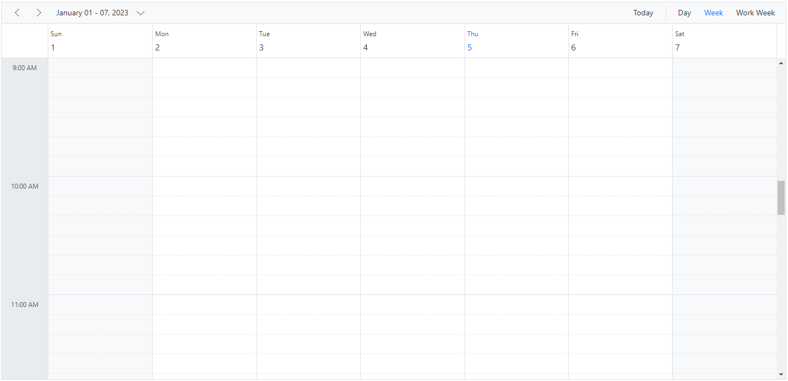
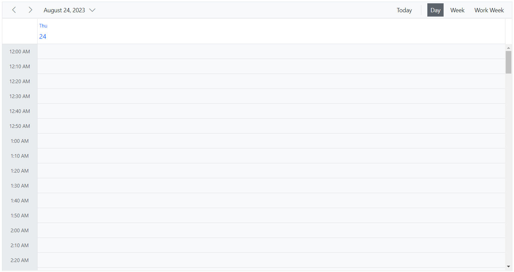
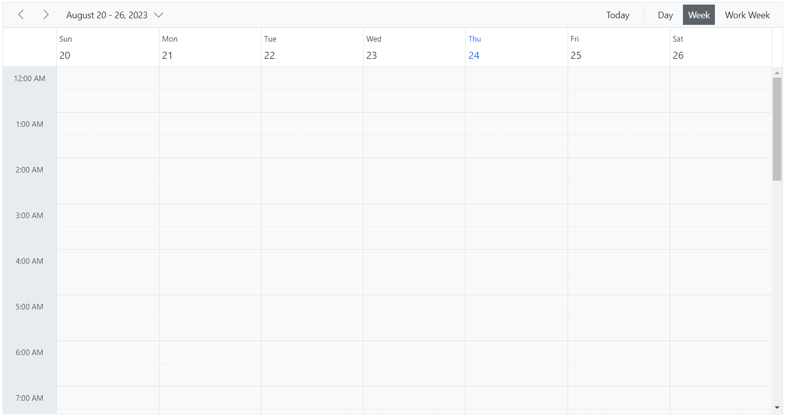
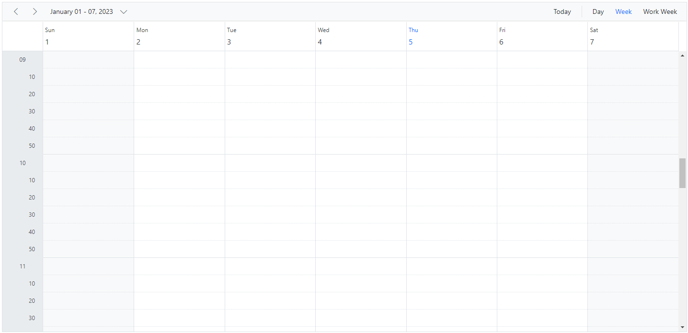
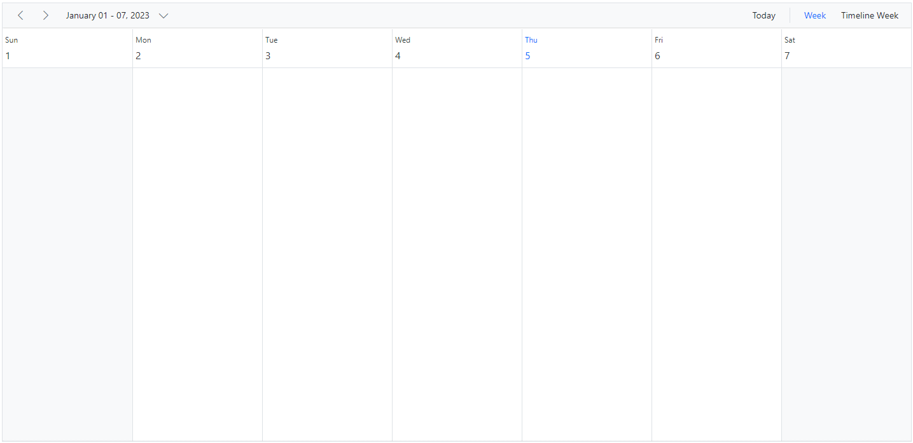
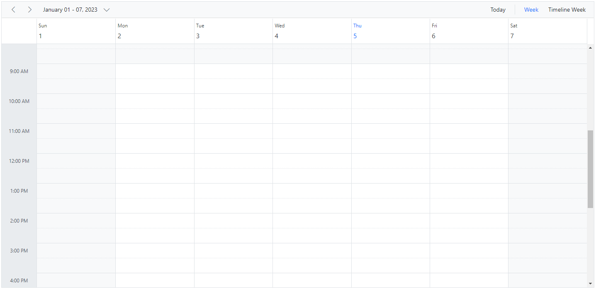

# Timescale Customization in Blazor Scheduler Component

Time slots are the time cells displayed in the Day, Week, and Work Week views of both the calendar (leftmost position) and timeline views (top position). The [`ScheduleTimeScale`](https://help.syncfusion.com/cr/blazor/Syncfusion.Blazor.Schedule.ScheduleTimeScale.html) allows control and setting of the required time slot duration for the work cells displayed on the Scheduler. It includes the following sub-options:

* [`Enable`](https://help.syncfusion.com/cr/blazor/Syncfusion.Blazor.Schedule.ScheduleTimeScale.html#Syncfusion_Blazor_Schedule_ScheduleTimeScale_Enable) - When set to `true`, allows the Scheduler to display the appointments accurately against the exact time duration. If set to `false`, all the appointments of a day will be displayed one below the other with no grid lines displayed. Its default value is `true`.
* [`Interval`](https://help.syncfusion.com/cr/blazor/Syncfusion.Blazor.Schedule.ScheduleTimeScale.html#Syncfusion_Blazor_Schedule_ScheduleTimeScale_Interval) – Defines the time duration on which the time axis to be displayed either in 1 hour or 30 minutes interval and so on. It accepts the values in minutes and defaults to 60.
* [`SlotCount`](https://help.syncfusion.com/cr/blazor/Syncfusion.Blazor.Schedule.ScheduleTimeScale.html#Syncfusion_Blazor_Schedule_ScheduleTimeScale_SlotCount) – Decides the number of slot count to be split for the specified time interval duration. It defaults to 2, thus displaying two slots to represent an hour(each slot depicting 30 minutes duration).

>Note: The upper limit for rendering slots within a single day, utilizing the **Interval** and **SlotCount** properties of the **ScheduleTimeScale**, stands at 1000. This constraint aligns with the maximum **colspan** value permissible for the **table** element, also capped at 1000. This particular restriction is relevant exclusively to the `TimelineDay`, `TimelineWeek` and `TimelineWorkWeek` views.

## Setting different time slot duration

The [`Interval`](https://help.syncfusion.com/cr/blazor/Syncfusion.Blazor.Schedule.ScheduleTimeScale.html#Syncfusion_Blazor_Schedule_ScheduleTimeScale_Interval) and [`SlotCount`](https://help.syncfusion.com/cr/blazor/Syncfusion.Blazor.Schedule.ScheduleTimeScale.html#Syncfusion_Blazor_Schedule_ScheduleTimeScale_SlotCount) properties can be used together on the Scheduler to set different time slot duration which is depicted in the following code example. Here, six time slots together represents an hour.

```cshtml
@using Syncfusion.Blazor.Schedule

<SfSchedule TValue="AppointmentData" Height="650px">
    <ScheduleTimeScale Interval="60" SlotCount="6"></ScheduleTimeScale>
    <ScheduleViews>
        <ScheduleView Option="View.Day"></ScheduleView>
        <ScheduleView Option="View.Week"></ScheduleView>
        <ScheduleView Option="View.WorkWeek"></ScheduleView>
    </ScheduleViews>
</SfSchedule>

@code{
    public class AppointmentData
    {
        public int Id { get; set; }
        public string Subject { get; set; }
        public string Location { get; set; }
        public DateTime StartTime { get; set; }
        public DateTime EndTime { get; set; }
        public string Description { get; set; }
        public bool IsAllDay { get; set; }
        public string RecurrenceRule { get; set; }
        public string RecurrenceException { get; set; }
        public Nullable<int> RecurrenceID { get; set; }
    }
}
```




## Adjusting the Time Slot Duration for Various Views

By using the [Interval](https://help.syncfusion.com/cr/blazor/Syncfusion.Blazor.Schedule.ScheduleViewTimeScale.html#Syncfusion_Blazor_Schedule_ScheduleViewTimeScale_Interval) and [SlotCount](https://help.syncfusion.com/cr/blazor/Syncfusion.Blazor.Schedule.ScheduleViewTimeScale.html#Syncfusion_Blazor_Schedule_ScheduleViewTimeScale_SlotCount) properties, within the [ScheduleViewTimescale](https://help.syncfusion.com/cr/blazor/Syncfusion.Blazor.Schedule.ScheduleViewTimeScale.html) as a child element of [`ScheduleView`](https://help.syncfusion.com/cr/blazor/Syncfusion.Blazor.Schedule.ScheduleViews.html), the duration of time slots for views can be customized. The following code snippet demonstrates this customization. In this example, the `Day` view has six-time slots per hour while the `Week` and `WorkWeek` views have two-time slots per hour.

```cshtml
@using Syncfusion.Blazor.Schedule

<SfSchedule TValue="AppointmentData" Height="650px">
    <ScheduleViews>
        <ScheduleView Option="View.Day">
            <ScheduleViewTimeScale Interval="10" SlotCount="1"></ScheduleViewTimeScale>
        </ScheduleView>
        <ScheduleView Option="View.Week">
            <ScheduleViewTimeScale Interval="60" SlotCount="2"></ScheduleViewTimeScale>
        </ScheduleView>
        <ScheduleView Option="View.WorkWeek">
            <ScheduleViewTimeScale Interval="60" SlotCount="2"></ScheduleViewTimeScale>
        </ScheduleView>
    </ScheduleViews>
</SfSchedule>

@code{
    public class AppointmentData
    {
        public int Id { get; set; }
        public string Subject { get; set; }
        public string Location { get; set; }
        public DateTime StartTime { get; set; }
        public DateTime EndTime { get; set; }
        public string Description { get; set; }
        public bool IsAllDay { get; set; }
        public string RecurrenceRule { get; set; }
        public string RecurrenceException { get; set; }
        public Nullable<int> RecurrenceID { get; set; }
    }
}
```







## Customizing Time Cells using Template

The template option is available to allow customization of time slots which are as follows,

* [`MajorSlotTemplate`](https://help.syncfusion.com/cr/blazor/Syncfusion.Blazor.Schedule.ScheduleTimeScale.html#Syncfusion_Blazor_Schedule_ScheduleTimeScale_MajorSlotTemplate) - This template option is applied to major time slots. It accepts a render fragment that displays a custom design onto the time cells. Time details can be accessed within this template via the `TemplateContext`.
* [`MinorSlotTemplate`](https://help.syncfusion.com/cr/blazor/Syncfusion.Blazor.Schedule.ScheduleTimeScale.html#Syncfusion_Blazor_Schedule_ScheduleTimeScale_MinorSlotTemplate) - This template option is applied to minor time slots. It accepts a render fragment that displays a custom design onto the time cells. Time details can be accessed within this template via the `TemplateContext`.

```cshtml
@using Syncfusion.Blazor.Schedule
@using System.Globalization

<SfSchedule TValue="AppointmentData" Height="650px">
    <ScheduleTimeScale Interval="60" SlotCount="6">
        <MajorSlotTemplate>
            <div>@(majorSlotTemplate((context as TemplateContext).Date))</div>
        </MajorSlotTemplate>
        <MinorSlotTemplate>
            <div style="text-align: right; margin-right: 15px">@(minorSlotTemplate((context as TemplateContext).Date))</div>
        </MinorSlotTemplate>
    </ScheduleTimeScale>
    <ScheduleViews>
        <ScheduleView Option="View.Day"></ScheduleView>
        <ScheduleView Option="View.Week"></ScheduleView>
        <ScheduleView Option="View.WorkWeek"></ScheduleView>
    </ScheduleViews>
</SfSchedule>

@code{
    public static string majorSlotTemplate(DateTime date)
    {
        return date.ToString("hh", CultureInfo.InvariantCulture);
    }
    public static string minorSlotTemplate(DateTime date)
    {
        return date.ToString("mm", CultureInfo.InvariantCulture);
    }
    public class AppointmentData
    {
        public int Id { get; set; }
        public string Subject { get; set; }
        public string Location { get; set; }
        public DateTime StartTime { get; set; }
        public DateTime EndTime { get; set; }
        public string Description { get; set; }
        public bool IsAllDay { get; set; }
        public string RecurrenceRule { get; set; }
        public string RecurrenceException { get; set; }
        public Nullable<int> RecurrenceID { get; set; }
    }
}
```




## Hide the Timescale

The grid lines which indicates the exact time duration can be enabled or disabled on the Scheduler, by setting `true` or `false` to the [`Enable`](https://help.syncfusion.com/cr/blazor/Syncfusion.Blazor.Schedule.ScheduleTimeScale.html#Syncfusion_Blazor_Schedule_ScheduleTimeScale_Enable) option within the [`ScheduleTimeScale`](https://help.syncfusion.com/cr/blazor/Syncfusion.Blazor.Schedule.ScheduleTimeScale.html) property. It's default value is `true`.

```cshtml
@using Syncfusion.Blazor.Schedule

<SfSchedule TValue="AppointmentData" Height="650px">
    <ScheduleTimeScale Enable="false"></ScheduleTimeScale>
    <ScheduleViews>
        <ScheduleView Option="View.Week"></ScheduleView>
        <ScheduleView Option="View.TimelineWeek" MaxEventsPerRow="10"></ScheduleView>
    </ScheduleViews>
</SfSchedule>

@code{
    public class AppointmentData
    {
        public int Id { get; set; }
        public string Subject { get; set; }
        public string Location { get; set; }
        public DateTime StartTime { get; set; }
        public DateTime EndTime { get; set; }
        public string Description { get; set; }
        public bool IsAllDay { get; set; }
        public string RecurrenceRule { get; set; }
        public string RecurrenceException { get; set; }
        public Nullable<int> RecurrenceID { get; set; }
    }
}
```




## Highlighting Current Date and Time

By default, Scheduler indicates current date with a highlighted date header on all views, as well as marks accurately the system's current time on specific views such as Day, Week, Work Week, Timeline Day, Timeline Week and Timeline Work Week views. To stop highlighting the current time indicator on Scheduler views, set `false` to the [`ShowTimeIndicator`](https://help.syncfusion.com/cr/blazor/Syncfusion.Blazor.Schedule.SfSchedule-1.html#Syncfusion_Blazor_Schedule_SfSchedule_1_ShowTimeIndicator) property which defaults to `true`.

```cshtml
@using Syncfusion.Blazor.Schedule

<SfSchedule TValue="AppointmentData" Height="650px" ShowTimeIndicator="false">
    <ScheduleViews>
        <ScheduleView Option="View.Week"></ScheduleView>
        <ScheduleView Option="View.TimelineWeek" MaxEventsPerRow="10"></ScheduleView>
    </ScheduleViews>
</SfSchedule>

@code{
    public class AppointmentData
    {
        public int Id { get; set; }
        public string Subject { get; set; }
        public string Location { get; set; }
        public DateTime StartTime { get; set; }
        public DateTime EndTime { get; set; }
        public string Description { get; set; }
        public bool IsAllDay { get; set; }
        public string RecurrenceRule { get; set; }
        public string RecurrenceException { get; set; }
        public Nullable<int> RecurrenceID { get; set; }
    }
}
```



