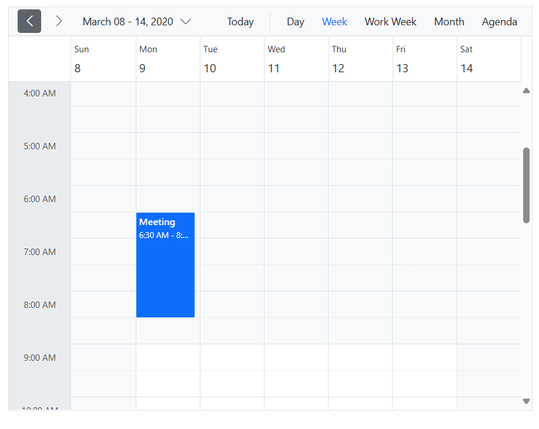

# Timezone in Blazor Scheduler

The Scheduler renders events based on current system time zone of server in server side application and in WASM application the events are rendered based on UTC timezone by default.

* Change the time zone of the Scheduler by setting the [`TimeZone`](https://help.syncfusion.com/cr/blazor/Syncfusion.Blazor.Schedule.SfSchedule-1.html#Syncfusion_Blazor_Schedule_SfSchedule_1_Timezone) property. For more information, refer to the [section](#display-appointments-based-on-scheduler-time-zone).

* Set the time zone for each appointment (event) through the [`StartTimeZone`](https://help.syncfusion.com/cr/blazor/Syncfusion.Blazor.Schedule.FieldStartTimezone.html) and [`EndTimeZone`](https://help.syncfusion.com/cr/blazor/Syncfusion.Blazor.Schedule.FieldEndTimezone.html) properties, which can be defined as separate fields within the event fields collection. For more information, refer to the [section](#create-appointments-in-different-time-zones).

* Set the time zone for both the Scheduler's [`TimeZone`](https://help.syncfusion.com/cr/blazor/Syncfusion.Blazor.Schedule.SfSchedule-1.html#Syncfusion_Blazor_Schedule_SfSchedule_1_Timezone) property and the event's [`StartTimeZone`](https://help.syncfusion.com/cr/blazor/Syncfusion.Blazor.Schedule.FieldStartTimezone.html) and [`EndTimeZone`](https://help.syncfusion.com/cr/blazor/Syncfusion.Blazor.Schedule.FieldEndTimezone.html) properties. For more information, refer to the [section](#display-appointments-based-on-clients-time-zone).


N>* The given value for the Timezone property for both the Scheduler and the appointments should be in the [IANA](https://www.iana.org/time-zones) format(Windows time zone IDs is not compatible).
<br/>* The WASM application has supported the limited [time zones](https://github.com/dotnet/runtime/issues/44840#issuecomment-764991667) in .Net5. But in .Net6, it supported all the [time zones](https://github.com/dotnet/runtime/pull/50650).

## Create Appointments in Different Time Zones

Appointments can be created in different time zones using the [StartTimezone](https://help.syncfusion.com/cr/blazor/Syncfusion.Blazor.Schedule.FieldStartTimezone.html) and [EndTimezone](https://help.syncfusion.com/cr/blazor/Syncfusion.Blazor.Schedule.FieldEndTimezone.html) properties. An appointment’s start time and end time are calculated based on the given time zone information.

In the following code example, the appointments time zone is Europe Time (UTC+03:00), and the application is running in UTC time zone (here the Blazor Server application is hosted in UTC time zone and the Blazor WASM application's default time zone is UTC). In this scenario, the appointment will be displayed at 6 AM.

```csharp
@using Syncfusion.Blazor.Schedule

<SfSchedule TValue="AppointmentData" Width="100%" Height="550px" @bind-SelectedDate="@CurrentDate">
    <ScheduleEventSettings DataSource="@DataSource"></ScheduleEventSettings>
    <ScheduleViews>
        <ScheduleView Option="View.Day"></ScheduleView>
        <ScheduleView Option="View.Week"></ScheduleView>
        <ScheduleView Option="View.WorkWeek"></ScheduleView>
        <ScheduleView Option="View.Month"></ScheduleView>
        <ScheduleView Option="View.Agenda"></ScheduleView>
    </ScheduleViews>
</SfSchedule>

@code{
    DateTime CurrentDate = new DateTime(2020, 3, 10);
    List<AppointmentData> DataSource = new List<AppointmentData>
    {
        new AppointmentData {
            Id = 1,
            Subject = "Meeting",
            StartTime = new DateTime(2020, 3, 9, 9, 0, 0) ,
            EndTime = new DateTime(2020, 3, 9, 11, 0, 0),
            StartTimezone = "Europe/Moscow",
            EndTimezone = "Europe/Moscow"
        }
    };
    public class AppointmentData
    {
        public int Id { get; set; }
        public string Subject { get; set; }
        public string Location { get; set; }
        public DateTime StartTime { get; set; }
        public DateTime EndTime { get; set; }
        public string Description { get; set; }
        public bool IsAllDay { get; set; }
        public string RecurrenceRule { get; set; }
        public string RecurrenceException { get; set; }
        public Nullable<int> RecurrenceID { get; set; }
        public string StartTimezone { get; set; }
        public string EndTimezone { get; set; }
    }
}
```

N>* If the recurring appointment is converted to another time zone, then the whole sequence will be recalculated according to the new time zone information.
<br/>* If an all-day appointment is created, it's start time and end time will be set to 12 A.M. and 12 A.M. by default, so time zone is not applicable for all-day appointments.
<br/>* Scheduler supports daylight saving time.
<br/>* The time zone support is applicable for custom appointments too, so map the corresponding property.
<br/>* Use [TimeZone](https://help.syncfusion.com/cr/blazor/Syncfusion.Blazor.Schedule.SfSchedule-1.html#Syncfusion_Blazor_Schedule_SfSchedule_1_Timezone) for custom appointments by mapping the [StartTimeZone](https://help.syncfusion.com/cr/blazor/Syncfusion.Blazor.Schedule.FieldStartTimezone.html) and [EndTimeZone](https://help.syncfusion.com/cr/blazor/Syncfusion.Blazor.Schedule.FieldEndTimezone.html) custom properties.

## Display Appointments Based on Scheduler Time Zone

Set the specific time zone to schedule using the [Timezone](https://help.syncfusion.com/cr/blazor/Syncfusion.Blazor.Schedule.SfSchedule-1.html#Syncfusion_Blazor_Schedule_SfSchedule_1_Timezone) property of scheduler. On this scenario, the appointments will be displayed in UTC time when the [StartTimezone](https://help.syncfusion.com/cr/blazor/Syncfusion.Blazor.Schedule.FieldStartTimezone.html) and [EndTimezone](https://help.syncfusion.com/cr/blazor/Syncfusion.Blazor.Schedule.FieldEndTimezone.html) properties are set to null. The appointments will be displayed in UTC time based on the given scheduler time zone.

In the following code example, the Scheduler time zone is Europe Time (UTC+03:00), and the application is running in UTC time zone (here the Blazor Server application is hosted in UTC time zone and the Blazor WASM application's default time zone is UTC). In this scenario, the appointment will be displayed at 12 PM.

```csharp
@using Syncfusion.Blazor.Schedule

<SfSchedule TValue="AppointmentData" Width="100%" Height="550px" @bind-SelectedDate="@CurrentDate" Timezone="Europe/Moscow">
    <ScheduleEventSettings DataSource="@DataSource"></ScheduleEventSettings>
    <ScheduleViews>
        <ScheduleView Option="View.Day"></ScheduleView>
        <ScheduleView Option="View.Week"></ScheduleView>
        <ScheduleView Option="View.WorkWeek"></ScheduleView>
        <ScheduleView Option="View.Month"></ScheduleView>
        <ScheduleView Option="View.Agenda"></ScheduleView>
    </ScheduleViews>
</SfSchedule>

@code{
    DateTime CurrentDate = new DateTime(2020, 3, 10);
    List<AppointmentData> DataSource = new List<AppointmentData>
    {
        new AppointmentData { Id = 1, Subject = "Meeting", StartTime = new DateTime(2020, 3, 9, 9, 0, 0) , EndTime = new DateTime(2020, 3, 9, 11, 0, 0) }
    };
    public class AppointmentData
    {
        public int Id { get; set; }
        public string Subject { get; set; }
        public string Location { get; set; }
        public DateTime StartTime { get; set; }
        public DateTime EndTime { get; set; }
        public string Description { get; set; }
        public bool IsAllDay { get; set; }
        public string RecurrenceRule { get; set; }
        public string RecurrenceException { get; set; }
        public Nullable<int> RecurrenceID { get; set; }
        public string StartTimezone { get; set; }
        public string EndTimezone { get; set; }
    }
}
```




## Display Appointments Based on Client’s Time Zone

Display the appointments based on the client’s local time zone in scheduler. It can be achieved by getting browser's timezone and set it's value to the scheduler time zone and appointment’s time zone.

For example, consider a scenario where a user is in North Carolina (America/New_York) and wants to set up a meeting at 10:00 AM North Carolina time. Colleagues in London and Chennai also need to participate. The meeting time will be 3:00 PM (15:00) in London and 8:30 PM in Chennai. When each user views the Scheduler, the appointment displays relative to their local time zones.

```csharp
@using Syncfusion.Blazor.Schedule
@inject IJSRuntime JSRuntime

<SfSchedule TValue="AppointmentData" Width="100%" Height="550px" @bind-SelectedDate="@CurrentDate" Timezone="@TimezoneValue">
    <ScheduleEventSettings DataSource="@DataSource"></ScheduleEventSettings>
    <ScheduleViews>
        <ScheduleView Option="View.Day"></ScheduleView>
        <ScheduleView Option="View.Week"></ScheduleView>
        <ScheduleView Option="View.WorkWeek"></ScheduleView>
        <ScheduleView Option="View.Month"></ScheduleView>
        <ScheduleView Option="View.Agenda"></ScheduleView>
    </ScheduleViews>
</SfSchedule>

@code{
    public DateTime CurrentDate { get; set; } = new DateTime(2021, 1, 10);
    string TimezoneValue;
    protected override async Task OnAfterRenderAsync(bool firstRender)
    {
        if (firstRender)
        {
            TimezoneValue = await JSRuntime.InvokeAsync<string>("eval", "(function(){try { return ''+ Intl.DateTimeFormat().resolvedOptions().timeZone; } catch(e) {} return 'UTC';}())");
            StateHasChanged();
        }
    }
    List<AppointmentData> DataSource = new List<AppointmentData>
    {
        new AppointmentData { Id = 1, Subject = "Meeting", StartTime = new DateTime(2021, 1, 11, 10, 0, 0) , EndTime = new DateTime(2021, 1 , 11, 11, 0, 0),StartTimezone = "America/New_York",
            EndTimezone = "America/New_York" }
    };
    public class AppointmentData
    {
        public int Id { get; set; }
        public string Subject { get; set; }
        public string Location { get; set; }
        public DateTime StartTime { get; set; }
        public DateTime EndTime { get; set; }
        public string Description { get; set; }
        public bool IsAllDay { get; set; }
        public string RecurrenceRule { get; set; }
        public string RecurrenceException { get; set; }
        public Nullable<int> RecurrenceID { get; set; }
        public string StartTimezone { get; set; }
        public string EndTimezone { get; set; }
    }
}
```


## Display Appointments at Same Time Everywhere Regardless of Client’s Time Zone

Appointments can be displayed at the same time everywhere without considering the time zone. This is achieved by not setting the [`TimeZone`](https://help.syncfusion.com/cr/blazor/Syncfusion.Blazor.Schedule.SfSchedule-1.html#Syncfusion_Blazor_Schedule_SfSchedule_1_Timezone) property of the Scheduler and by setting the [`StartTimeZone`](https://help.syncfusion.com/cr/blazor/Syncfusion.Blazor.Schedule.FieldStartTimezone.html) and [`EndTimeZone`](https://help.syncfusion.com/cr/blazor/Syncfusion.Blazor.Schedule.FieldEndTimezone.html) properties to `null`. Appointments will then be displayed based on their specified [`StartTime`](https://help.syncfusion.com/cr/blazor/Syncfusion.Blazor.Schedule.FieldStartTime.html) and [`EndTime`](https://help.syncfusion.com/cr/blazor/Syncfusion.Blazor.Schedule.FieldEndTime.html) values everywhere, irrespective of any time zone.

## Updating StartTime and EndTime after Drag and Drop Appointment Based on Time Zone

After rescheduling an appointment using drag and drop, appointment’s start and end time value will be updated based on scheduler time zone and appointment’s time zone.

For an example, consider the local time zone is India Standard Time, if you drag an appointment from 9 AM and drop this on 1 PM and the scheduler’s [Timezone](https://help.syncfusion.com/cr/blazor/Syncfusion.Blazor.Schedule.SfSchedule-1.html#Syncfusion_Blazor_Schedule_SfSchedule_1_Timezone) is not set and the appointment’s [StartTimezone](https://help.syncfusion.com/cr/blazor/Syncfusion.Blazor.Schedule.FieldStartTimezone.html) and [EndTimezone](https://help.syncfusion.com/cr/blazor/Syncfusion.Blazor.Schedule.FieldEndTimezone.html) has set as AUS Central Standard Time (Australia/Darwin) then appointment’s start time and end time value will be converted from Local time zone to appointment time zone and the appointment’s start time will be saved at 5 PM.

If the Scheduler’s [`TimeZone`](https://help.syncfusion.com/cr/blazor/Syncfusion.Blazor.Schedule.SfSchedule-1.html#Syncfusion_Blazor_Schedule_SfSchedule_1_Timezone) is set as "Australia/Darwin" (AUS Central Standard Time) and the appointment’s [`StartTimeZone`](https://help.syncfusion.com/cr/blazor/Syncfusion.Blazor.Schedule.FieldStartTimezone.html) and [`EndTimeZone`](https://help.syncfusion.com/cr/blazor/Syncfusion.Blazor.Schedule.FieldEndTimezone.html) are set as "America/Mexico_City" (Central Standard Time), then the appointment’s start and end time values will be converted from the Scheduler’s time zone to the appointment’s time zone. The appointment’s start time will be saved at 8:30 PM.

If the Scheduler’s [`TimeZone`](https://help.syncfusion.com/cr/blazor/Syncfusion.Blazor.Schedule.SfSchedule-1.html#Syncfusion_Blazor_Schedule_SfSchedule_1_Timezone) is set as "Australia/Darwin" (AUS Central Standard Time) and the appointment’s time zone is not set, then the appointment’s start and end time values will be converted from the Scheduler's time zone to the UTC time zone. The appointment’s start time will be saved at 9:00 AM.
