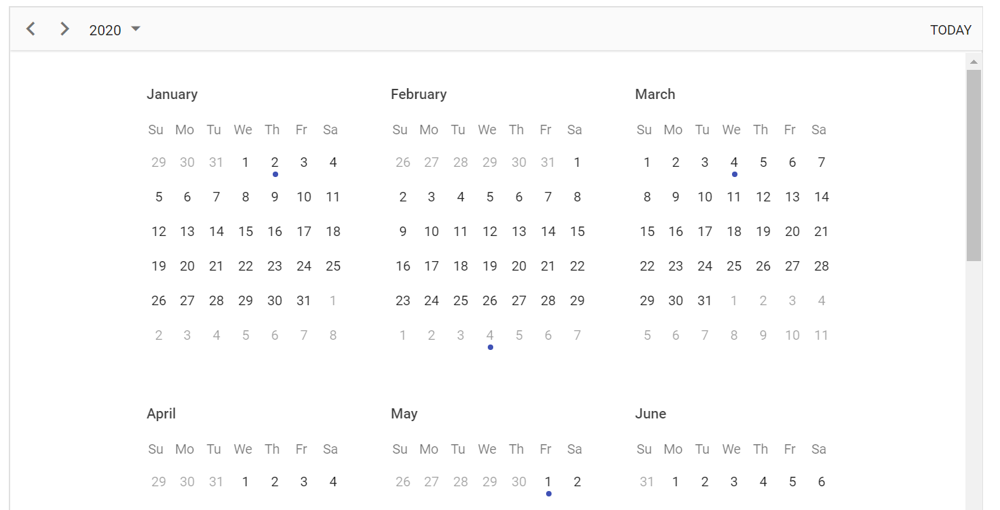

# Views

The Scheduler includes wide variety of view modes with unique configuration options for each view. The available view modes are Day, Week, Work Week, Month, Agenda, Month Agenda, Timeline Day, Timeline Week, Timeline Work Week and Timeline Month, out of which the `Week` view is set as active.

To navigate between different views and dates, the navigation options are available at the Scheduler header bar. The active view option is usually highlighted by default. The date range of the active view will also be displayed at the left corner of the header bar, clicking on which will open a calendar popup for the ease of desired date selection.

> By default, Scheduler displays the calendar views such as day, week, work week, month and agenda.

## Setting specific view on scheduler

As the Scheduler displays `Week` view by default, therefore to change the active view, set `CurrentView` property with the desired view name. The applicable view names that the Scheduler accepts are as follows,

* Day
* Week
* WorkWeek
* Month
* Agenda
* MonthAgenda
* TimelineDay
* TimelineWeek
* TimelineWorkWeek
* TimelineMonth
* TimelineYear
* Year

It is possible to display only the desired views on the Scheduler using the `Views` property.

In the following example, the Scheduler displays 2 views namely, Week and TimelineDay.

```csharp
@using Syncfusion.Blazor.Schedule

<SfSchedule TValue="AppointmentData" Height="550px" @bind-CurrentView="@CurrentView">
    <ScheduleViews>
        <ScheduleView Option="View.Week"></ScheduleView>
        <ScheduleView Option="View.TimelineDay" MaxEventsPerRow="10"></ScheduleView>
    </ScheduleViews>
</SfSchedule>
@code{
    View CurrentView = View.Week;
    public class AppointmentData
    {
        public int Id { get; set; }
        public string Subject { get; set; }
        public string Location { get; set; }
        public DateTime StartTime { get; set; }
        public DateTime EndTime { get; set; }
        public string Description { get; set; }
        public bool IsAllDay { get; set; }
        public string RecurrenceRule { get; set; }
        public string RecurrenceException { get; set; }
        public Nullable<int> RecurrenceID { get; set; }
    }
}
```

To configure Scheduler with different configurations on each view, refer the following code example. Here, the Week view displays the dates in `dd-MM-yyyy` format whereas the Month view hides the weekend days and also displays it in readonly mode.

```csharp
@using Syncfusion.Blazor.Schedule

<SfSchedule TValue="AppointmentData" Height="550px" @bind-CurrentView="@CurrentView">
    <ScheduleViews>
        <ScheduleView Option="View.Week" DateFormat="dd-MMM-yyyy"></ScheduleView>
        <ScheduleView Option="View.Month" MaxEventsPerRow="2" Readonly="true" ShowWeekend="false"></ScheduleView>
    </ScheduleViews>
</SfSchedule>
@code{
    View CurrentView = View.Week;
    public class AppointmentData
    {
        public int Id { get; set; }
        public string Subject { get; set; }
        public string Location { get; set; }
        public DateTime StartTime { get; set; }
        public DateTime EndTime { get; set; }
        public string Description { get; set; }
        public bool IsAllDay { get; set; }
        public string RecurrenceRule { get; set; }
        public string RecurrenceException { get; set; }
        public Nullable<int> RecurrenceID { get; set; }
    }
}
```

## View specific configuration

There are scenarios where each view may need to have different configurations. For such cases, you can define the applicable scheduler properties within the `Views` Property for each view option as depicted in the following examples. The fields available to be used within each view options are as follows.

| Property | Type | Description | Applicable views |
|----------|------|-------------|------------------|
| `Option` | `View` | It accepts the Scheduler view name, based on which we can define its related properties. The view names can be `Day`, `Week` and so on. | All views.|
| `IsSelected` | bool | It acts similar to the `CurrentView` property and defines the active view of the Scheduler.| All views. |
| `DateFormat` | string | By default, Scheduler follows the date format as per the default culture assigned to it. When it is defined under specific view, only those assigned views follows this date format. | All views. |
| `Readonly` | bool | When set to `true`, prevents the CRUD actions on the respective view under where it is defined. | All views. |
| `ResourceHeaderTemplate` | string | The template option which is used to customize the resource header cells on the Scheduler. It gets applied only on the views, wherever it is defined.| All views. |
| `DateHeaderTemplate` | string | The template option which is used to customize the date header cells and is applied only on the views, wherever it is defined. | All views. |
| `EventTemplate` | string | The template option to customize the events background. It will get applied to the events of the view to which it is currently being defined. | All views. |
| `ShowWeekend` | bool | When set to `false`, it hides the weekend days of a week from the views on which it is defined.| All views. |
| `Group` | `GroupModel` | Allows to set different resource grouping options on all available Scheduler view modes. | All views. |
| `CellTemplate` | string | The template option to customize the work cells of the Scheduler and is applied only on the views, on which it is defined. | Applicable on all views except Agenda view. |
| `WorkDays` | int[] | It is used to set the working days on the Scheduler views. | Applicable on all views except Agenda view. |
| `DisplayName` | string | When a particular view is customized to display with different intervals, this property allows the user to set different display name for each of the views. | Applicable on all views except Agenda and Month Agenda. |
| `Interval` | int | It allows to customize the default Scheduler views with different set of days, weeks, work weeks or months on the applicable view type. | Applicable on all views except Agenda and Month Agenda. |
| `StartHour` | string | It is used to specify the start hour, from which the Scheduler should be displayed. It accepts the time string in a short skeleton format and also, hides the time beyond the specified start time. | Applicable on Day, Week, Work Week, Timeline Day, Timeline Week and Timeline Work Week views. |
| `EndHour` | string | It is used to specify the end hour, at which the Scheduler ends. It accepts the time string in a short skeleton format. | Applicable on Day, Week, Work Week, Timeline Day, Timeline Week, and Timeline Work Week views. |
| `TimeScale` | `TimeScaleModel` | Allows to set different timescale configuration on each applicable view modes. | Applicable on Day, Week, Work Week, Timeline Day, Timeline Week, and Timeline Work Week views. |
| `ShowWeekNumber` | bool | When set to `true`, shows the week number on the respective weeks.| Applicable on Day, Week, Work Week, and Month views. |
| `AllowVirtualScrolling` | bool | It is used to enable or disable the virtual scrolling functionality. | Applicable on Agenda and Timeline views. |
| `HeaderRows` | `HeaderRowsModel` | Allows defining the custom header rows on timeline views of the Scheduler to display the year, month, week, date and hour label as an individual row. | Applicable only on all timeline views. |

### Day view

Usually a day view displays a single day with all its related appointments. It is possible to customize the day view to display more number of days by extending the `Views` property with `Interval` option. You can also define any of the above defined properties within the `ScheduleView` tag helper as depicted in the following code example.  

```csharp
@using Syncfusion.Blazor.Schedule

<SfSchedule TValue="AppointmentData" Height="550px">
    <ScheduleViews>
        <ScheduleView Option="View.Day" Interval="3"></ScheduleView>
    </ScheduleViews>
</SfSchedule>

@code{
    public class AppointmentData
    {
        public int Id { get; set; }
        public string Subject { get; set; }
        public string Location { get; set; }
        public DateTime StartTime { get; set; }
        public DateTime EndTime { get; set; }
        public string Description { get; set; }
        public bool IsAllDay { get; set; }
        public string RecurrenceRule { get; set; }
        public string RecurrenceException { get; set; }
        public Nullable<int> RecurrenceID { get; set; }
    }
}
```

> All the above defined properties can be accessed within Day view except `AllowVirtualScrolling` and `HeaderRows`.

### Week view

The Week view displays a count of 7 days (from Sunday to Saturday) with all its related appointments. The first day of the week can be changed using the `FirstDayOfWeek` which accepts the integer (Sunday=0, Monday=1, Tuesday=2 and so on) value. You can navigate to a particular date in day view from the week view by clicking on the appropriate dates on the date header bar.

```csharp
@using Syncfusion.Blazor.Schedule

<SfSchedule TValue="AppointmentData" Height="550px">
    <ScheduleViews>
        <ScheduleView Option="View.Day"></ScheduleView>
        <ScheduleView Option="View.Week" Interval="3" DisplayName="3 Weeks"></ScheduleView>
    </ScheduleViews>
</SfSchedule>

@code{
    public class AppointmentData
    {
        public int Id { get; set; }
        public string Subject { get; set; }
        public string Location { get; set; }
        public DateTime StartTime { get; set; }
        public DateTime EndTime { get; set; }
        public string Description { get; set; }
        public bool IsAllDay { get; set; }
        public string RecurrenceRule { get; set; }
        public string RecurrenceException { get; set; }
        public Nullable<int> RecurrenceID { get; set; }
    }
}
```

> All the above defined properties in the table can be accessed within Week and Work week views except `AllowVirtualScrolling` and `HeaderRows`.

### Work Week view

The Work week view displays only the working days of a week (count of 5 days) and its associated appointments. It is possible to customize the working days on the work week view by using the `WorkDays` property which accepts an array of integer values (such as Sunday=0, Monday=1, Tuesday=2 and so on). By default, it displays from Monday to Friday (5 days). You can also navigate to a particular date in the day view from the work week view by clicking on the appropriate dates in the date header bar.

The following code example depicts how to change the start and end hours only on the `Work Week` view of the Scheduler.

```csharp
@using Syncfusion.Blazor.Schedule

<SfSchedule TValue="AppointmentData" Height="550px">
    <ScheduleViews>
        <ScheduleView Option="View.WorkWeek" StartHour="08:00" EndHour="13:00"></ScheduleView>
    </ScheduleViews>
</SfSchedule>

@code{
    public class AppointmentData
    {
        public int Id { get; set; }
        public string Subject { get; set; }
        public string Location { get; set; }
        public DateTime StartTime { get; set; }
        public DateTime EndTime { get; set; }
        public string Description { get; set; }
        public bool IsAllDay { get; set; }
        public string RecurrenceRule { get; set; }
        public string RecurrenceException { get; set; }
        public Nullable<int> RecurrenceID { get; set; }
    }
}
```

> The Week, Work week and Day views can display the all-day row appointments in a separate all-day row with an expand/collapse option to view it.

### Month view

A Month view displays the entire days of a particular month and all its related appointments. You can navigate to a particular date in the day view by clicking on the appropriate date text on the month cells.

By default, when you try to create an appointment through Month view, it is considered as created for an entire day. You can explicitly change this behavior by unchecking the `All-day` option from editor window, so that it defaults to the start time duration as 9.00 AM and end time as 9.30 AM.

By default, in month view, you can view single appointment on each day cell. If you have more than one appointment in a day, the `+ more` text indicator will be available on that cell, clicking on which will allows you to view the hidden appointments of a day. You can decide how many appointments can render on a day based on your Scheduler and Month cell height using `MaxEventsPerRow` property within `ScheduleView` whereas its default value is 1. The following code example depicts how to change the working days only on the `Month` view of the Scheduler.

```csharp
@using Syncfusion.Blazor.Schedule

<SfSchedule TValue="AppointmentData" Height="550px">
    <ScheduleViews>
        <ScheduleView Option="View.Month" MaxEventsPerRow="2" WorkDays="@WorkingDays"></ScheduleView>
    </ScheduleViews>
</SfSchedule>
@code{
    public int[] WorkingDays { get; set; } = { 1, 3, 5 };
    public class AppointmentData
    {
        public int Id { get; set; }
        public string Subject { get; set; }
        public string Location { get; set; }
        public DateTime StartTime { get; set; }
        public DateTime EndTime { get; set; }
        public string Description { get; set; }
        public bool IsAllDay { get; set; }
        public string RecurrenceRule { get; set; }
        public string RecurrenceException { get; set; }
        public Nullable<int> RecurrenceID { get; set; }
    }
}
```

### Agenda view

The Agenda view lists out the appointments in a grid-like view for the next 7 days by default from the current date. The count of the days can be changed using the API `AgendaDaysCount`. It allows virtual scrolling of dates by enabling the `AllowVirtualScrolling` property. Also, you can enable or disable the display of days on Scheduler that has no appointments by setting true or false to the `HideEmptyAgendaDays` property.

The following code example depicts how to display events of four days in Agenda view.

```csharp
@using Syncfusion.Blazor.Schedule

<SfSchedule TValue="AppointmentData" Height="550px" AgendaDaysCount="4">
    <ScheduleViews>
        <ScheduleView Option="View.Agenda"></ScheduleView>
    </ScheduleViews>
</SfSchedule>
@code{
    public class AppointmentData
    {
        public int Id { get; set; }
        public string Subject { get; set; }
        public string Location { get; set; }
        public DateTime StartTime { get; set; }
        public DateTime EndTime { get; set; }
        public string Description { get; set; }
        public bool IsAllDay { get; set; }
        public string RecurrenceRule { get; set; }
        public string RecurrenceException { get; set; }
        public Nullable<int> RecurrenceID { get; set; }
    }
}
```

### Month Agenda view

A Month-Agenda view shows a month calendar, where clicking on a particular day will display the appointments present on that date below the calendar. The day with appointments are differentiated with a circular dot below the date of the calendar.

The following code example shows how to hide the weekend days on `MonthAgenda` view as well as the working days list is modified on Month Agenda view alone.

```csharp
@using Syncfusion.Blazor.Schedule

<SfSchedule TValue="AppointmentData" Height="550px">
    <ScheduleViews>
        <ScheduleView Option="View.MonthAgenda" ShowWeekend="false" WorkDays="@WorkingDays"></ScheduleView>
    </ScheduleViews>
</SfSchedule>

@code{
    public int[] WorkingDays { get; set; } = { 0, 3, 6 };
    public class AppointmentData
    {
        public int Id { get; set; }
        public string Subject { get; set; }
        public string Location { get; set; }
        public DateTime StartTime { get; set; }
        public DateTime EndTime { get; set; }
        public string Description { get; set; }
        public bool IsAllDay { get; set; }
        public string RecurrenceRule { get; set; }
        public string RecurrenceException { get; set; }
        public Nullable<int> RecurrenceID { get; set; }
    }
}
```

### Timeline views – Day, Week, Work Week

Similar to the vertical day, week and work week views, the respective view shows all its appointments where the time slots are displayed horizontally. By default, the cell height adjusts as per the height set to Scheduler and you can view single appointment on each cell. If you have more than one appointment, the `+ more` text indicator will be available on the bottom of that cell, clicking on which will allows you to view the hidden appointments of a day. You can decide how many appointments can render on a cell based on your Scheduler and work cell height using `MaxEventsPerRow` property within `ScheduleView` whereas its default value is `1`.

```csharp
@using Syncfusion.Blazor.Schedule

<SfSchedule TValue="AppointmentData" Height="550px">
    <ScheduleViews>
        <ScheduleView Option="View.TimelineDay" StartHour="08:00" EndHour="12:00" ShowWeekend="false" MaxEventsPerRow="10"></ScheduleView>
        <ScheduleView Option="View.TimelineWeek" IsSelected="true" MaxEventsPerRow="10"></ScheduleView>
        <ScheduleView Option="View.TimelineWorkWeek" StartHour="13:00" EndHour="20:00" WorkDays="@WorkingDays" MaxEventsPerRow="10"></ScheduleView>
        <ScheduleView Option="View.Agenda"></ScheduleView>
    </ScheduleViews>
</SfSchedule>
@code{
    public int[] WorkingDays { get; set; } = { 1, 3, 6 };
    public class AppointmentData
    {
        public int Id { get; set; }
        public string Subject { get; set; }
        public string Location { get; set; }
        public DateTime StartTime { get; set; }
        public DateTime EndTime { get; set; }
        public string Description { get; set; }
        public bool IsAllDay { get; set; }
        public string RecurrenceRule { get; set; }
        public string RecurrenceException { get; set; }
        public Nullable<int> RecurrenceID { get; set; }
    }
}
```

> Clicking on the dates in the date header bar of Timeline day, Timeline week and Timeline work week will allow you to navigate to the Agenda view.

### Timeline Month view

A Timeline Month view displays the current month days along with its appointments.

```csharp
@using Syncfusion.Blazor.Schedule

<SfSchedule TValue="AppointmentData" Height="550px">
    <ScheduleViews>
        <ScheduleView Option="View.TimelineDay" StartHour="08:00" EndHour="12:00" MaxEventsPerRow="10"></ScheduleView>
        <ScheduleView Option="View.TimelineMonth" IsSelected="true" ShowWeekend="false" MaxEventsPerRow="10"></ScheduleView>
    </ScheduleViews>
</SfSchedule>
@code{
    public class AppointmentData
    {
        public int Id { get; set; }
        public string Subject { get; set; }
        public string Location { get; set; }
        public DateTime StartTime { get; set; }
        public DateTime EndTime { get; set; }
        public string Description { get; set; }
        public bool IsAllDay { get; set; }
        public string RecurrenceRule { get; set; }
        public string RecurrenceException { get; set; }
        public Nullable<int> RecurrenceID { get; set; }
    }
}
```

> Clicking on the dates in the date header bar of Timeline month will allow you to navigate to the Timeline day view.

### Timeline Year view

A Timeline Year view displays the complete year along with its appointments.

By default the timeline year view orientation is set to Horizontal view. In this following code example, the timeline year view is set with vertical orientation.

```csharp
@using Syncfusion.Blazor.Schedule

<SfSchedule TValue="AppointmentData" Width="100%" Height="550px" @bind-SelectedDate="@CurrentDate">
    <ScheduleViews>
        <ScheduleView Option="View.TimelineYear" Orientation="Orientation.Vertical" DisplayName="Horizontal Year"></ScheduleView>
    </ScheduleViews>
    <ScheduleEventSettings DataSource="@DataSource"></ScheduleEventSettings>
</SfSchedule>

@code{
    DateTime CurrentDate = new DateTime(2020, 3, 10);
    List<AppointmentData> DataSource = new List<AppointmentData>
    {
        new AppointmentData { Id = 1, Subject = "Meeting", StartTime = new DateTime(2020, 3, 4, 0, 0, 0) , EndTime = new DateTime(2020, 3, 5, 0, 0, 0) },
        new AppointmentData { Id = 2, Subject = "Conference", StartTime = new DateTime(2020, 5, 1, 9, 30, 0) , EndTime = new DateTime(2020, 5, 1, 12, 0, 0) },
        new AppointmentData { Id = 3, Subject = "Seminar", StartTime = new DateTime(2020, 1, 2, 9, 30, 0) , EndTime = new DateTime(2020, 1, 2, 12, 0, 0) }
    };
    public class AppointmentData
    {
        public int Id { get; set; }
        public string Subject { get; set; }
        public string Location { get; set; }
        public DateTime StartTime { get; set; }
        public DateTime EndTime { get; set; }
        public string Description { get; set; }
        public bool IsAllDay { get; set; }
        public string RecurrenceRule { get; set; }
        public string RecurrenceException { get; set; }
        public Nullable<int> RecurrenceID { get; set; }
    }
}
```

#### Setting the first month of timeline year

By default, months in timeline year view displayed from January to December. User can customize this default behavior with the help of scheduler [`FirstMonthOfYear`](https://help.syncfusion.com/cr/blazor/Syncfusion.Blazor.Schedule.SfSchedule-1.html#Syncfusion_Blazor_Schedule_SfSchedule_1_FirstMonthOfYear) property. This property allows user to set the first month of the timeline year on Scheduler. User can set first month of timeline year by passing integer value to the `FirstMonthOfYear` property, whereby 1 is always denoted as January, 2 as February and so on. This property applicable only in timeline year views.

```csharp
@using Syncfusion.Blazor.Schedule

<SfSchedule TValue="AppointmentData" Height="650px" @bind-SelectedDate="@CurrentDate" FirstMonthOfYear="4">
    <ScheduleViews>
        <ScheduleView Option="View.TimelineYear" Orientation="Orientation.Horizontal" DisplayName="Horizontal Timeline Year" IsSelected="true"></ScheduleView>
        <ScheduleView Option="View.TimelineYear" Orientation="Orientation.Vertical" DisplayName="Vertical Timeline Year"></ScheduleView>
        <ScheduleEventSettings DataSource="@DataSource"></ScheduleEventSettings>
    </ScheduleViews>
</SfSchedule>
@code{
    DateTime CurrentDate = new DateTime(2021, 4, 3);
    List<AppointmentData> DataSource = new List<AppointmentData>
    {
    new AppointmentData { Id = 1, Subject = "Paris", StartTime = new DateTime(2021, 5, 13, 10, 0, 0) , EndTime = new DateTime(2021, 5, 13, 12, 0, 0) },
    new AppointmentData { Id = 2, Subject = "Germany", StartTime = new DateTime(2021, 5, 15, 10, 0, 0) , EndTime = new DateTime(2021, 5, 15, 12, 0, 0) }
    };
    public class AppointmentData
    {
        public int Id { get; set; }
        public string Subject { get; set; }
        public string Location { get; set; }
        public DateTime StartTime { get; set; }
        public DateTime EndTime { get; set; }
        public string Description { get; set; }
        public bool IsAllDay { get; set; }
        public string RecurrenceRule { get; set; }
        public string RecurrenceException { get; set; }
        public Nullable<int> RecurrenceID { get; set; }
    }
}
```

### Year view

The Year view shows a year calendar, where clicking on a particular day will display the appointments present on that date below the calendar. The day with appointments are differentiated with a circular dot below the date of the calendar.

```csharp
@using Syncfusion.Blazor.Schedule

<SfSchedule TValue="AppointmentData" Width="100%" Height="550px" @bind-SelectedDate="@CurrentDate">
    <ScheduleViews>
        <ScheduleView Option="View.Year"></ScheduleView>
    </ScheduleViews>
    <ScheduleEventSettings DataSource="@DataSource"></ScheduleEventSettings>
</SfSchedule>

@code{
    DateTime CurrentDate = new DateTime(2020, 3, 10);
    List<AppointmentData> DataSource = new List<AppointmentData>
    {
        new AppointmentData { Id = 1, Subject = "Meeting", StartTime = new DateTime(2020, 3, 4, 0, 0, 0) , EndTime = new DateTime(2020, 3, 5, 0, 0, 0) },
        new AppointmentData { Id = 2, Subject = "Conference", StartTime = new DateTime(2020, 5, 1, 9, 30, 0) , EndTime = new DateTime(2020, 5, 1, 12, 0, 0) },
        new AppointmentData { Id = 3, Subject = "Seminar", StartTime = new DateTime(2020, 1, 2, 9, 30, 0) , EndTime = new DateTime(2020, 1, 2, 12, 0, 0) }
    };
    public class AppointmentData
    {
        public int Id { get; set; }
        public string Subject { get; set; }
        public string Location { get; set; }
        public DateTime StartTime { get; set; }
        public DateTime EndTime { get; set; }
        public string Description { get; set; }
        public bool IsAllDay { get; set; }
        public string RecurrenceRule { get; set; }
        public string RecurrenceException { get; set; }
        public Nullable<int> RecurrenceID { get; set; }
    }
}
```

The output of the code example is shown below.



## Extending view intervals

It is possible to customize the display of default number of days on different Scheduler view modes. For example, a day view can be extended to display 4 days by setting the `Interval` option as 4 for the `Day` option within the `ScheduleView` as depicted in the following code example. In the same way, you can also display 3 weeks by setting interval 3 for the `Week` option.

You can provide the alternative display name for such customized views on the Scheduler header bar, by setting the appropriate `DisplayName` property.

```csharp
@using Syncfusion.Blazor.Schedule

<SfSchedule TValue="AppointmentData" Height="550px">
    <ScheduleViews>
        <ScheduleView Option="View.Day" Interval="4" DisplayName="4 Days"></ScheduleView>
        <ScheduleView Option="View.Week" IsSelected="true" Interval="3" DisplayName="3 Weeks"></ScheduleView>
    </ScheduleViews>
</SfSchedule>

@code{
    public class AppointmentData
    {
        public int Id { get; set; }
        public string Subject { get; set; }
        public string Location { get; set; }
        public DateTime StartTime { get; set; }
        public DateTime EndTime { get; set; }
        public string Description { get; set; }
        public bool IsAllDay { get; set; }
        public string RecurrenceRule { get; set; }
        public string RecurrenceException { get; set; }
        public Nullable<int> RecurrenceID { get; set; }
    }
}
```

> The view intervals can be extended on all the Scheduler view modes except Agenda and Month-Agenda views.
