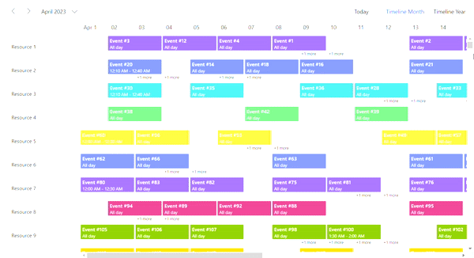

# Virtual Scrolling in Blazor Scheduler Component

To optimize performance in the Scheduler when loading numerous resources and events, virtual scrolling support has been implemented in timeline views. This feature allows for dynamically loading a large set of resources and events instantly as a user scrolls. Enable this functionality in the timeline view of the Scheduler by setting the [`AllowVirtualScrolling`](https://help.syncfusion.com/cr/blazor/Syncfusion.Blazor.Schedule.ScheduleView.html#Syncfusion_Blazor_Schedule_ScheduleView_AllowVirtualScrolling) property within the view specific settings. The virtual loading of events is possible in Agenda view, by setting [`AllowVirtualScrolling`](https://help.syncfusion.com/cr/blazor/Syncfusion.Blazor.Schedule.ScheduleView.html#Syncfusion_Blazor_Schedule_ScheduleView_AllowVirtualScrolling) property to `true` within the agenda view specific settings.

To get started quickly with virtual scrolling in the Scheduler, refer to this video:



```cshtml
@using Syncfusion.Blazor.Schedule

<SfSchedule TValue="EventData" Width="100%" Height="650px" @bind-SelectedDate="@CurrentDate">
    <ScheduleGroup EnableCompactView="false" Resources="@GroupData"></ScheduleGroup>
    <ScheduleResources>
        <ScheduleResource TItem="ResourceData" TValue="int" DataSource="@ResourceDatasource" Field="ResourceId" Title="Resource" Name="Resources" TextField="Text" IdField="Id" ColorField="Color" AllowMultiple="true"></ScheduleResource>
    </ScheduleResources>
    <ScheduleEventSettings DataSource="@AppointmentData"></ScheduleEventSettings>
    <ScheduleViews>
        <ScheduleView Option="View.TimelineMonth" AllowVirtualScrolling="true" IsSelected="true"></ScheduleView>
        <ScheduleView Option="View.TimelineYear" Orientation="Syncfusion.Blazor.Schedule.Orientation.Vertical" AllowVirtualScrolling="true"></ScheduleView>
    </ScheduleViews>
</SfSchedule>

@code{
    DateTime CurrentDate = new DateTime(2023, 4, 1);
    static EventData data = new EventData();
    public static List<ResourceData> ResourceDatasource = GenerateResourceData();
    public static List<EventData> AppointmentData = GenerateStaticEvents();
    public string[] GroupData { get; set; } = { "Resources" };
    static public List<ResourceData> GenerateResourceData()
    {
        List<ResourceData> resources = new List<ResourceData>(300);
        var colors = new string[] { "#ff8787", "#9775fa", "#748ffc", "#3bc9db", "#69db7c",
            "#fdd835", "#748ffc", "#9775fa", "#df5286", "#7fa900",
            "#fec200", "#5978ee", "#00bdae", "#ea80fc"};
        for (int a = 1; a <= 300; a++)
        {
            int index = a % colors.Length;
            index = index == 0 ? (colors.Length / a) : index;
            resources.Add(new ResourceData
            {
                Id = a,
                Text = "Resource " + a,
                Color = colors[index]
            });
        }
        return resources;
    }

    public static List<EventData> GenerateStaticEvents()
    {
        DateTime date = new DateTime(2023, 4, 1);
        List<EventData> data = new List<EventData>(3600);
        var id = 1;
        for (var i = 0; i < 300; i++)
        {
            Random random = new Random();
            List<int> listNumbers = new List<int>();
            int[] randomCollection = new int[24];
            int number;
            int max = 30;
            for (int a = 0; a < 12; a++)
            {
                do
                {
                    number = random.Next(max);
                } while (listNumbers.Contains(number));
                listNumbers.Add(number);
                var startDate = date.AddDays(number);
                startDate = startDate.AddMilliseconds((((number % 10) * 10) * (1000 * 60)));
                var endDate = startDate.AddMilliseconds(((1440 + 30) * (1000 * 60)));
                data.Add(new EventData
                {
                    Id = id,
                    Subject = "Event #" + id,
                    StartTime = startDate,
                    EndTime = endDate,
                    IsAllDay = (id % 10 == 0) ? false : true,
                    ResourceId = i + 1
                });
                id++;
            }
        }
        return data;
    }
    public class EventData
    {
        public int Id { get; set; }
        public string Subject { get; set; }
        public DateTime StartTime { get; set; }
        public DateTime EndTime { get; set; }
        public bool IsAllDay { get; set; }
        public int ResourceId { get; set; }
    }

    public class ResourceData
    {
        public int Id { get; set; }
        public string Text { get; set; }
        public string Color { get; set; }
    }
}
```




## Virtual Scrolling with Templates

In Blazor Scheduler, templates can be applied when [`AllowVirtualScrolling`](https://help.syncfusion.com/cr/blazor/Syncfusion.Blazor.Schedule.ScheduleView.html#Syncfusion_Blazor_Schedule_ScheduleView_AllowVirtualScrolling) property is enabled. In the following code, templates are applied to resources and appointments.

```cshtml
@using Syncfusion.Blazor.Schedule

<SfSchedule TValue="EventData" Width="100%" Height="650px" @bind-SelectedDate="@CurrentDate">
    <ScheduleTemplates>
        <ResourceHeaderTemplate>
            <div class='template-wrap'>
                <div class="resource-details">
                    <div class="resource-name">@(((context as TemplateContext).ResourceData as ResourceData).Text)</div>
                    <div class="resource-designation">@(((context as TemplateContext).ResourceData as ResourceData).Designation)</div>
                </div>
            </div>
        </ResourceHeaderTemplate>
    </ScheduleTemplates>
    <ScheduleGroup EnableCompactView="false" Resources="@GroupData"></ScheduleGroup>
    <ScheduleResources>
        <ScheduleResource TValue="int[]" TItem="ResourceData" DataSource="@ResourceDatasource" Field="ResourceId" Title="Resource" Name="Resources" TextField="Text" IdField="Id" ColorField="Color" AllowMultiple="true"></ScheduleResource>
    </ScheduleResources>
    <ScheduleEventSettings DataSource="@AppointmentData">
        <Template>
            <div>Subject: @((context as EventData).Subject)</div>
            <div>StartTime: @((context as EventData).StartTime.ToUniversalTime())</div>
            <div>EndTime:  @((context as EventData).EndTime.ToUniversalTime())</div>
        </Template>
    </ScheduleEventSettings>
    <ScheduleViews>
        <ScheduleView Option="View.TimelineMonth" AllowVirtualScrolling="true" IsSelected="true"></ScheduleView>
        <ScheduleView Option="View.TimelineYear" Orientation="Syncfusion.Blazor.Schedule.Orientation.Vertical" AllowVirtualScrolling="true"></ScheduleView>
    </ScheduleViews>
</SfSchedule>

@code{
    DateTime CurrentDate = new DateTime(2023, 4, 1);
    static EventData data = new EventData();
    public static List<ResourceData> ResourceDatasource = GenerateResourceData();
    public static List<EventData> AppointmentData = GenerateStaticEvents();
    public string[] GroupData { get; set; } = { "Resources" };
    static public List<ResourceData> GenerateResourceData()
    {
        List<ResourceData> resources = new List<ResourceData>(300);
        var colors = new string[] { "#ff8787", "#9775fa", "#748ffc", "#3bc9db", "#69db7c",
            "#fdd835", "#748ffc", "#9775fa", "#df5286", "#7fa900",
            "#fec200", "#5978ee", "#00bdae", "#ea80fc"};
        var designation = new string[] { "Developer", "Lead", "Product Manager", "QA", "Newbie"};
        for (int a = 1; a <= 300; a++)
        {
            int index = a % colors.Length;
            int designationIndex = a % designation.Length;
            index = index == 0 ? (colors.Length / a) : index;
            designationIndex = designationIndex == 0 ? (designation.Length / a) : designationIndex;
            resources.Add(new ResourceData
            {
                Id = a,
                Text = "Resource " + a,
                Color = colors[index],
                Designation = designation[designationIndex]
            });
        }
        return resources;
    }
    public static List<EventData> GenerateStaticEvents()
    {
        DateTime date = new DateTime(2023, 4, 1);
        List<EventData> data = new List<EventData>(3600);
        var id = 1;
        for (var i = 0; i < 300; i++)
        {
            Random random = new Random();
            List<int> listNumbers = new List<int>();
            int[] randomCollection = new int[24];
            int number;
            int max = 30;
            for (int a = 0; a < 12; a++)
            {
                do
                {
                    number = random.Next(max);
                } while (listNumbers.Contains(number));
                listNumbers.Add(number);
                var startDate = date.AddDays(number);
                startDate = startDate.AddMilliseconds((((number % 10) * 10) * (1000 * 60)));
                var endDate = startDate.AddMilliseconds(((1440 + 30) * (1000 * 60)));
                data.Add(new EventData
                {
                    Id = id,
                    Subject = "Event #" + id,
                    StartTime = startDate,
                    EndTime = endDate,
                    IsAllDay = (id % 10 == 0) ? false : true,
                    ResourceId = i + 1
                });
                id++;
            }
        }
        return data;
    }
    public class EventData
    {
        public int Id { get; set; }
        public string Subject { get; set; }
        public DateTime StartTime { get; set; }
        public DateTime EndTime { get; set; }
        public bool IsAllDay { get; set; }
        public int ResourceId { get; set; }
        public ResourceData ResourceData { get; set; }
    }

    public class ResourceData
    {
        public int Id { get; set; }
        public string Text { get; set; }
        public string Color { get; set; }
        public string Designation { get; set; }
    }
}
```



N>  For now, the virtual loading of resources and events is not supported in `Month Agenda`, `Year` and `TimelineYear` (Horizontal Orientation) views.
By default Virtual scrolling displays only 30 resources. You can increase or decrease the number of resources by using [VirtualResourceCount](https://help.syncfusion.com/cr/blazor/Syncfusion.Blazor.Schedule.ScheduleView.html#Syncfusion_Blazor_Schedule_ScheduleView_VirtualResourceCount) property.

## Enabling Lazy Loading for Appointments

The lazy loading feature efficiently loads resource appointments into the Scheduler using an on-demand approach. This feature enables seamless loading of large volumes of appointment data without performance degradation.

By default, the Scheduler fetches all the relevant appointments from the server with in the current date range. However, enabling this feature will trigger query requests to the server for appointment retrieval whenever new resources are rendered due to scroll actions. These queries contain the resource IDs of currently displayed resources along with current date range, which can be passed as a comma-separated string. In the server controller, these resource IDs are parsed to filter the necessary appointments to render in the scheduler. 

When this feature is enabled, the Scheduler becomes capable of fetching events from remote services only for the current viewport to optimize data retrieval. The remaining appointment data is fetched from the server on-demand based on the currently rendered viewport resources as one scrolls through the Scheduler content.

To enable this feature, set the [`EnableLazyLoading`](https://help.syncfusion.com/cr/blazor/Syncfusion.Blazor.Schedule.ScheduleView.html#Syncfusion_Blazor_Schedule_ScheduleView_Enablelazyloading) property to `true` within the view-specific settings.

```cshtml
@using Syncfusion.Blazor
@using Syncfusion.Blazor.Data
@using Syncfusion.Blazor.Schedule

<SfSchedule TValue="AppointmentData" Width="100%" Height="650px" @bind-SelectedDate="@currentDate" Readonly="true">
    <ScheduleGroup EnableCompactView="false" Resources="@groupData"></ScheduleGroup>
    <ScheduleResources>
        <ScheduleResource TItem="ResourceData" TValue="int" DataSource="@resourceDatasource" Field="ResourceId" Title="Resource" Name="Resources" TextField="Text" IdField="Id" ColorField="Color"></ScheduleResource>
    </ScheduleResources>
    <ScheduleEventSettings TValue="AppointmentData">
        <SfDataManager Url="https://blazor.syncfusion.com/services/production/api/VirtualEventData" Adaptor="Adaptors.WebApiAdaptor" CrossDomain="true"></SfDataManager>
    </ScheduleEventSettings>
    <ScheduleViews>
        <ScheduleView Option="View.TimelineMonth" EnableLazyLoading="true" IsSelected="true"></ScheduleView>
    </ScheduleViews>
</SfSchedule>

@code{
    List<ResourceData> resourceDatasource = new List<ResourceData>();
    DateTime currentDate = new DateTime(2023, 4, 1);
    string[] groupData { get; set; } = { "Resources" };
    protected override void OnInitialized()
    {
        base.OnInitialized();
        resourceDatasource = GenerateResourceData();
    }
    private List<ResourceData> GenerateResourceData()
    {
        List<ResourceData> resources = new List<ResourceData>(1000);
        var colors = new string[] { "#ff8787", "#9775fa", "#748ffc", "#3bc9db", "#69db7c",
            "#fdd835", "#748ffc", "#9775fa", "#df5286", "#7fa900",
            "#fec200", "#5978ee", "#00bdae", "#ea80fc"};
        for (int a = 1; a <= 1000; a++)
        {
            int index = a % colors.Length;
            index = index == 0 ? (colors.Length / a) : index;
            resources.Add(new ResourceData
            {
                Id = a,
                Text = "Resource " + a,
                Color = colors[index]
            });
        }
        return resources;
    }
    public class AppointmentData
    {
        public int Id { get; set; }
        public string Subject { get; set; }
        public DateTime StartTime { get; set; }
        public DateTime EndTime { get; set; }
        public string Location { get; set; }
        public string Description { get; set; }
        public bool? IsAllDay { get; set; }
        public int? RecurrenceID { get; set; }
        public string RecurrenceRule { get; set; }
        public string RecurrenceException { get; set; }
        public int ResourceId { get; set; }
    }
    public class ResourceData
    {
        public int Id { get; set; }
        public string Text { get; set; }
        public string Color { get; set; }
    }
}
```

Here's the server-side controller code that retrieves appointment data based on the resource IDs provided as query parameters:

```c#
using Microsoft.AspNetCore.Mvc;
using System.Collections.Generic;
using System;
using Microsoft.EntityFrameworkCore;
using System.Linq;
using System.ComponentModel.DataAnnotations;
using Microsoft.AspNetCore.OData.Query;

namespace LazyLoadingServices.Controllers
{
    public class VirtualEventDataController : Controller
    {
        private readonly EventsContext dbContext;

        [HttpGet]
        [EnableQuery]
        [Route("api/VirtualEventData")]
        public IActionResult GetData([FromQuery] Params param)
        {
            IQueryable<EventData> query = dbContext.Events;
            // Filter the appointment data based on the ResourceId query params.
            if (!string.IsNullOrEmpty(param.ResourceId))
            {
                string[] resourceId = param.ResourceId.Split(',');
                query = query.Where(data => resourceId.Contains(data.ResourceId.ToString()));
            }
            return Ok(query.ToList());
        }
    }
    public class Params
    {
        public DateTime? StartDate { get; set; }
        public DateTime? EndDate { get; set; }
        public string ResourceId { get; set; }
    }
}
```

**Note:** 
* The property will be effective, when large number of resources and appointments bound to the Scheduler.
* This property is applicable only when [resource grouping](https://help.syncfusion.com/cr/blazor/Syncfusion.Blazor.Schedule.ScheduleGroup.html#Syncfusion_Blazor_Schedule_ScheduleGroup_Resources) is enabled in Scheduler.