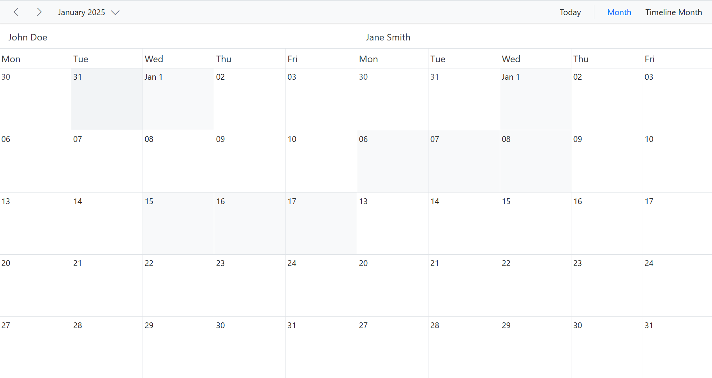

# Working Days and Hours in Blazor Scheduler Component

The Scheduler can be customized on various aspects as well as it inherits almost all the calendar-specific features such as options,

- To set custom time range display on Scheduler
- To set different working hours
- To set different working days
- To set different first day of week
- To show/hide weekend days
- To show the week number

To get start quickly about customize the working days and hours in our Scheduler, you can check on this video:



## Set working days

By default, Scheduler considers the week days from Monday to Friday as `WorkDays` and therefore defaults to [1,2,3,4,5] - where 1 represents Monday, 2 represents Tuesday and so on. The days which are not defined in this working days collection are considered as non-working days. Therefore, when the weekend days are set to hide from Scheduler, all those non-working days too get hidden from the layout.

The Work week and Timeline Work week views displays exactly the defined working days on Scheduler layout, whereas other views displays all the days and simply differentiates the non-working days on UI with inactive cell color.

N> The working or business hours depiction on Scheduler are usually valid only on these specified working days.

The following example code depicts how to set the Scheduler to display Monday, Wednesday and Friday as working days of a week.

```cshtml
@using Syncfusion.Blazor.Schedule

<SfSchedule TValue="AppointmentData" Height="650px" ShowWeekend="false" WorkDays="@WorkingDays">
    <ScheduleViews>
        <ScheduleView Option="View.Week"></ScheduleView>
        <ScheduleView Option="View.WorkWeek"></ScheduleView>
        <ScheduleView Option="View.TimelineWeek" MaxEventsPerRow="10"></ScheduleView>
        <ScheduleView Option="View.Month" MaxEventsPerRow="2"></ScheduleView>
    </ScheduleViews>
</SfSchedule>

@code{
    public int[] WorkingDays { get; set; } = { 1, 3, 5 };
    public class AppointmentData
    {
        public int Id { get; set; }
        public string Subject { get; set; }
        public string Location { get; set; }
        public DateTime StartTime { get; set; }
        public DateTime EndTime { get; set; }
        public string Description { get; set; }
        public bool IsAllDay { get; set; }
        public string RecurrenceRule { get; set; }
        public string RecurrenceException { get; set; }
        public Nullable<int> RecurrenceID { get; set; }
    }
}
```


## Dynamically setting work days

The `SetWorkDaysAsync` and `ResetWorkDaysAsync` methods can be used to dynamically set and reset work days in the Scheduler. The `SetWorkDaysAsync` method accepts a list of dates to be set as working days, whereas `ResetWorkDaysAsync` resets specified work days when dates are passed and resets all the days in the current view to non-working days when called without passing any dates.

Before setting up custom working days, you need to reset the default work days using the `ResetWorkDaysAsync` method. Note that both methods do not accept dates with an unspecified kind.

In this example, we retrieve the current view dates during initial rendering, date and view navigations and reset all days to non-working days using `ResetWorkDaysAsync`. Then we remove common holiday dates from the current view dates. Then we loop through each resource and for each resource we exclude resource specific leave dates from the working dates and set their available days as working days using `SetWorkDaysAsync` method.

```cshtml
@using Syncfusion.Blazor.Schedule

<SfSchedule @ref="ScheduleRef" TValue="AppointmentData" ShowWeekend="false" Height="650px" @bind-SelectedDate="@CurrentDate">
    <ScheduleGroup Resources="@Resources"></ScheduleGroup>
    <ScheduleResources>
        <ScheduleResource TItem="ResourceData" TValue="int"
        DataSource="@Employees" Field="EmployeeID" Title="Employee"
        Name="Employees" TextField="Text" IdField="Id" ColorField="Color"></ScheduleResource>
    </ScheduleResources>
    <ScheduleEvents TValue="AppointmentData" Created="OnCreated" ActionCompleted="OnActionCompleted"></ScheduleEvents>
    <ScheduleViews>
        <ScheduleView Option="View.Month"></ScheduleView>
        <ScheduleView Option="View.TimelineMonth"></ScheduleView>
    </ScheduleViews>
</SfSchedule>

@code {
    public SfSchedule<AppointmentData> ScheduleRef;
    DateTime CurrentDate = new DateTime(2025, 1, 31);
    public string[] Resources { get; set; } = { "Employees" };
    public List<ResourceData> Employees { get; set; } = new List<ResourceData> {
        new ResourceData{ Text = "John Doe", Id= 1, Color = "#df5286" },
        new ResourceData{ Text = "Jane Smith", Id= 2, Color = "#7fa900" }
    };
    private List<DateTime> Holidays { get; set; } = new List<DateTime>
    {
            new DateTime(2025, 1, 1),
            new DateTime(2025, 1, 26),
            new DateTime(2025, 4, 18),
            new DateTime(2025, 5, 1),
            new DateTime(2025, 8, 15),
            new DateTime(2025, 11, 12),
            new DateTime(2025, 12, 25)
    };
    private Dictionary<int, List<DateTime>> EmployeeLeaves { get; set; } = new Dictionary<int, List<DateTime>>
    {
        { 1, new List<DateTime> {
            new DateTime(2025, 1, 15),
            new DateTime(2025, 1, 16),
            new DateTime(2025, 1, 17)
        }},
        { 2, new List<DateTime> {
            new DateTime(2025, 1, 6),
            new DateTime(2025, 1, 7),
            new DateTime(2025, 1, 8)
        }}
    };
    private async Task OnCreated()
    {
        await SetWorkDays();
    }
    private async void OnActionCompleted(ActionEventArgs<AppointmentData> args)
    {
        if (args.ActionType == ActionType.ViewNavigate || args.ActionType == ActionType.DateNavigate)
        {
            await SetWorkDays();
        }
    }
    private async Task SetWorkDays()
    {
        await ScheduleRef.ResetWorkDaysAsync();

        List<DateTime> currentViewDates = ScheduleRef.GetCurrentViewDates();
        List<DateTime> workDates = currentViewDates.Except(Holidays).ToList();

        foreach (var employee in Employees)
        {
            if (EmployeeLeaves.TryGetValue(employee.Id, out var leaveDates))
            {
                List<DateTime> resourceWorkDays = workDates
                    .Except(leaveDates)
                    .Select(d => DateTime.SpecifyKind(d, DateTimeKind.Utc))
                    .ToList();
                int employeeIndex = ScheduleRef.GetGroupIndex(employee.Id, Resources[Resources.Length - 1]);
                await ScheduleRef.SetWorkDaysAsync(resourceWorkDays, employeeIndex);
            }
        }
    }
    public class AppointmentData
    {
        public int Id { get; set; }
        public string? Subject { get; set; }
        public string? Location { get; set; }
        public DateTime StartTime { get; set; }
        public DateTime EndTime { get; set; }
        public string? Description { get; set; }
        public bool IsAllDay { get; set; }
        public string? RecurrenceRule { get; set; }
        public string? RecurrenceException { get; set; }
        public Nullable<int> RecurrenceID { get; set; }
        public int EmployeeID { get; set; }
    }
    public class ResourceData
    {
        public int Id { get; set; }
        public string? Text { get; set; }
        public string? Color { get; set; }
    }
}
```


## Hiding weekend days

The [`ShowWeekend`](https://help.syncfusion.com/cr/blazor/Syncfusion.Blazor.Schedule.SfSchedule-1.html#Syncfusion_Blazor_Schedule_SfSchedule_1_ShowWeekend) property is used to either show or hide the weekend days of a week and it is not applicable on Work week view (as non-working days are usually not displayed on work week view). By default, it is set to `true`. The days which are not a part of the working days collection of a Scheduler are usually considered as non-working or weekend days.

Here, the working days are defined as [1, 3, 4, 5] on Scheduler and therefore the remaining days (0, 2, 6 – Sunday, Tuesday and Saturday) are considered as non-working or weekend days and will be hidden from all the views when [`ShowWeekend`](https://help.syncfusion.com/cr/blazor/Syncfusion.Blazor.Schedule.SfSchedule-1.html#Syncfusion_Blazor_Schedule_SfSchedule_1_ShowWeekend) property is set to `false`.

```cshtml
@using Syncfusion.Blazor.Schedule

<SfSchedule TValue="AppointmentData" Height="650px" ShowWeekend=false WorkDays="@WorkingDays">
    <ScheduleViews>
        <ScheduleView Option="View.Week"></ScheduleView>
        <ScheduleView Option="View.WorkWeek"></ScheduleView>
        <ScheduleView Option="View.TimelineWeek" MaxEventsPerRow="10"></ScheduleView>
        <ScheduleView Option="View.Month" MaxEventsPerRow="2"></ScheduleView>
    </ScheduleViews>
</SfSchedule>

@code{
    public int[] WorkingDays { get; set; } = { 1, 3, 5 };
    public class AppointmentData
    {
        public int Id { get; set; }
        public string Subject { get; set; }
        public string Location { get; set; }
        public DateTime StartTime { get; set; }
        public DateTime EndTime { get; set; }
        public string Description { get; set; }
        public bool IsAllDay { get; set; }
        public string RecurrenceRule { get; set; }
        public string RecurrenceException { get; set; }
        public Nullable<int> RecurrenceID { get; set; }
    }
}
```


## Show week numbers

It is possible to show the week number count of a week in the header bar of the Scheduler by setting true to the [`ShowWeekNumber`](https://help.syncfusion.com/cr/blazor/Syncfusion.Blazor.Schedule.SfSchedule-1.html#Syncfusion_Blazor_Schedule_SfSchedule_1_ShowWeekNumber) property. By default, its default value is `false`. In Month view, the week numbers are displayed as a first column.

N> The [`ShowWeekNumber`](https://help.syncfusion.com/cr/blazor/Syncfusion.Blazor.Schedule.SfSchedule-1.html#Syncfusion_Blazor_Schedule_SfSchedule_1_ShowWeekNumber) property is not applicable on Timeline views, as it has the equivalent [HeaderRows](./header-rows#display-week-numbers-in-timeline-views) property to handle such requirement with additional customization.

```cshtml
@using Syncfusion.Blazor.Schedule

<SfSchedule TValue="AppointmentData" Height="650px" ShowWeekNumber=true>
    <ScheduleViews>
        <ScheduleView Option="View.Day"></ScheduleView>
        <ScheduleView Option="View.Week"></ScheduleView>
        <ScheduleView Option="View.Month" MaxEventsPerRow="2"></ScheduleView>
    </ScheduleViews>
</SfSchedule>
@code{
    public class AppointmentData
    {
        public int Id { get; set; }
        public string Subject { get; set; }
        public string Location { get; set; }
        public DateTime StartTime { get; set; }
        public DateTime EndTime { get; set; }
        public string Description { get; set; }
        public bool IsAllDay { get; set; }
        public string RecurrenceRule { get; set; }
        public string RecurrenceException { get; set; }
        public Nullable<int> RecurrenceID { get; set; }
    }
}
```


### Different options in showing week numbers

By default, week numbers are shown in the Scheduler based on the first day of the year. However, the week numbers can be determined based on the following criteria by setting the `WeekRule` property with `CalendarWeekRule` enumeration.

`FirstDay` – The first week of the year is calculated based on the first day of the year.

`FirstFourDayWeek` – The first week of the year begins from the first week with four or more days.

`FirstFullWeek` – The first week of the year begins when meeting the first day of the week (firstDayOfWeek) and the first day of the year.

For more details refer to [this link](https://learn.microsoft.com/en-us/dotnet/api/system.globalization.calendarweekrule?view=net-8.0#remarks)

```cshtml
@using Syncfusion.Blazor.Schedule

<SfSchedule TValue="AppointmentData" Height="650px" @bind-SelectedDate="@CurrentDate" ShowWeekNumber=true WeekRule="System.Globalization.CalendarWeekRule.FirstFourDayWeek">
    <ScheduleViews>
        <ScheduleView Option="View.Day"></ScheduleView>
        <ScheduleView Option="View.Week"></ScheduleView>
        <ScheduleView Option="View.Month" MaxEventsPerRow="2"></ScheduleView>
    </ScheduleViews>
</SfSchedule>
@code{
    DateTime CurrentDate = new DateTime(2023, 2, 28);
    public class AppointmentData
    {
        public int Id { get; set; }
        public string Subject { get; set; }
        public string Location { get; set; }
        public DateTime StartTime { get; set; }
        public DateTime EndTime { get; set; }
        public string Description { get; set; }
        public bool IsAllDay { get; set; }
        public string RecurrenceRule { get; set; }
        public string RecurrenceException { get; set; }
        public Nullable<int> RecurrenceID { get; set; }
    }
}
```

## Set working hours

Working hours indicates the work hour limit within the Scheduler, which is visually highlighted with an active color on work cells. The working hours can be set on Scheduler using the [`ScheduleWorkhours`](https://help.syncfusion.com/cr/blazor/Syncfusion.Blazor.Schedule.ScheduleWorkHours.html) which includes the following sub-options,

- [`Highlight`](https://help.syncfusion.com/cr/blazor/Syncfusion.Blazor.Schedule.ScheduleWorkHours.html#Syncfusion_Blazor_Schedule_ScheduleWorkHours_Highlight) – enables/disables the highlighting of work hours.
- [`Start`](https://help.syncfusion.com/cr/blazor/Syncfusion.Blazor.Schedule.ScheduleWorkHours.html#Syncfusion_Blazor_Schedule_ScheduleWorkHours_Start) - sets the start time of the working/business hour of a day.
- [`End`](https://help.syncfusion.com/cr/blazor/Syncfusion.Blazor.Schedule.ScheduleWorkHours.html#Syncfusion_Blazor_Schedule_ScheduleWorkHours_End) - sets the end time limit of the working/business hour of a day.

```cshtml
@using Syncfusion.Blazor.Schedule

<SfSchedule TValue="AppointmentData" Height="650px">
    <ScheduleWorkHours Highlight="true" Start="11:00" End="20:00"></ScheduleWorkHours>
    <ScheduleViews>
        <ScheduleView Option="View.Week"></ScheduleView>
        <ScheduleView Option="View.TimelineWeek" MaxEventsPerRow="10"></ScheduleView>
    </ScheduleViews>
</SfSchedule>
@code{
    public class AppointmentData
    {
        public int Id { get; set; }
        public string Subject { get; set; }
        public string Location { get; set; }
        public DateTime StartTime { get; set; }
        public DateTime EndTime { get; set; }
        public string Description { get; set; }
        public bool IsAllDay { get; set; }
        public string RecurrenceRule { get; set; }
        public string RecurrenceException { get; set; }
        public Nullable<int> RecurrenceID { get; set; }
    }
}
```


## Scheduler displaying custom hours

It is possible to display the event Scheduler layout with specific time durations by hiding the unwanted hours. To do so, set the start and end hour for the Scheduler using the [`StartHour`](https://help.syncfusion.com/cr/blazor/Syncfusion.Blazor.Schedule.SfSchedule-1.html#Syncfusion_Blazor_Schedule_SfSchedule_1_StartHour) and [`EndHour`](https://help.syncfusion.com/cr/blazor/Syncfusion.Blazor.Schedule.SfSchedule-1.html#Syncfusion_Blazor_Schedule_SfSchedule_1_EndHour) properties respectively.

The following code example displays the Scheduler starting from the time range 7.00 AM to 6.00 PM and the remaining hours are hidden on the UI.

```cshtml
@using Syncfusion.Blazor.Schedule

<SfSchedule TValue="AppointmentData" Height="650px" StartHour="07:00" EndHour="18:00">
    <ScheduleViews>
        <ScheduleView Option="View.Week"></ScheduleView>
        <ScheduleView Option="View.TimelineWeek" MaxEventsPerRow="10"></ScheduleView>
    </ScheduleViews>
</SfSchedule>
@code{
    public class AppointmentData
    {
        public int Id { get; set; }
        public string Subject { get; set; }
        public string Location { get; set; }
        public DateTime StartTime { get; set; }
        public DateTime EndTime { get; set; }
        public string Description { get; set; }
        public bool IsAllDay { get; set; }
        public string RecurrenceRule { get; set; }
        public string RecurrenceException { get; set; }
        public Nullable<int> RecurrenceID { get; set; }
    }
}
```


## Setting start day of the week

By default, Scheduler defaults to `Sunday` as its first day of a week. To change the Scheduler's start day of a week with different day, set the [`FirstDayOfWeek`](https://help.syncfusion.com/cr/blazor/Syncfusion.Blazor.Schedule.SfSchedule-1.html#Syncfusion_Blazor_Schedule_SfSchedule_1_FirstDayOfWeek) property with the values ranging from 0 to 6.

N> Here, Sunday is always denoted as 0, Monday as 1 and so on.

```cshtml
@using Syncfusion.Blazor.Schedule

<SfSchedule TValue="AppointmentData" Height="650px" FirstDayOfWeek=3>
    <ScheduleViews>
        <ScheduleView Option="View.Week"></ScheduleView>
        <ScheduleView Option="View.Month" MaxEventsPerRow="2"></ScheduleView>
        <ScheduleView Option="View.TimelineWeek" MaxEventsPerRow="10"></ScheduleView>
    </ScheduleViews>
</SfSchedule>
@code{
    public class AppointmentData
    {
        public int Id { get; set; }
        public string Subject { get; set; }
        public string Location { get; set; }
        public DateTime StartTime { get; set; }
        public DateTime EndTime { get; set; }
        public string Description { get; set; }
        public bool IsAllDay { get; set; }
        public string RecurrenceRule { get; set; }
        public string RecurrenceException { get; set; }
        public Nullable<int> RecurrenceID { get; set; }
    }
}
```


## Scroll to specific time and date

You can manually scroll to a specific time on Scheduler by making use of the [`ScrollToAsync`](https://help.syncfusion.com/cr/blazor/Syncfusion.Blazor.Schedule.SfSchedule-1.html#Syncfusion_Blazor_Schedule_SfSchedule_1_ScrollToAsync_System_String_System_Nullable_System_DateTime__) method as depicted in the following code example.

```cshtml
@using Syncfusion.Blazor.Schedule
@using Syncfusion.Blazor.Calendars

<div>
    <span>Scroll To</span>
    <SfTimePicker TValue="DateTime?" Width="100px" Format="HH:mm" @bind-Value="TimeValue">
        <TimePickerEvents TValue="DateTime?" ValueChange="OnValueChange"></TimePickerEvents>
    </SfTimePicker>

</div>
<SfSchedule TValue="AppointmentData" @ref="ScheduleRef" Width="100%" Height="550px" @bind-SelectedDate="@CurrentDate">
    <ScheduleViews>
        <ScheduleView Option="View.Day"></ScheduleView>
        <ScheduleView Option="View.Week"></ScheduleView>
        <ScheduleView Option="View.WorkWeek"></ScheduleView>
    </ScheduleViews>
    <ScheduleEventSettings DataSource="@DataSource"></ScheduleEventSettings>
</SfSchedule>

@code{
    DateTime CurrentDate { get; set; } = new DateTime(2020, 1, 31);
    SfSchedule<AppointmentData> ScheduleRef;
    public DateTime? TimeValue { get; set; } = new DateTime(DateTime.Today.Year, DateTime.Today.Month, DateTime.Today.Day, 9, 0, 0);
    public async Task OnValueChange(ChangeEventArgs<DateTime?> args)
    {
        await ScheduleRef.ScrollToAsync(args.Text);
    }

    List<AppointmentData> DataSource = new List<AppointmentData>
{
    new AppointmentData { Id = 1, Subject = "Meeting", StartTime = new DateTime(2020, 1, 31, 9, 30, 0) , EndTime = new DateTime(2020, 1, 31, 11, 0, 0) }
};
    public class AppointmentData
    {
        public int Id { get; set; }
        public string Subject { get; set; }
        public string Location { get; set; }
        public DateTime StartTime { get; set; }
        public DateTime EndTime { get; set; }
        public string Description { get; set; }
        public bool IsAllDay { get; set; }
        public string RecurrenceRule { get; set; }
        public string RecurrenceException { get; set; }
        public Nullable<int> RecurrenceID { get; set; }
    }
}
```

## See also

- [To display the current time indicator](./timescale#highlighting-current-date-and-time)
- [To set different working hours for each resources](./resources#set-different-work-hours)
- [To set different working days for each resources](./resources#set-different-work-days)
