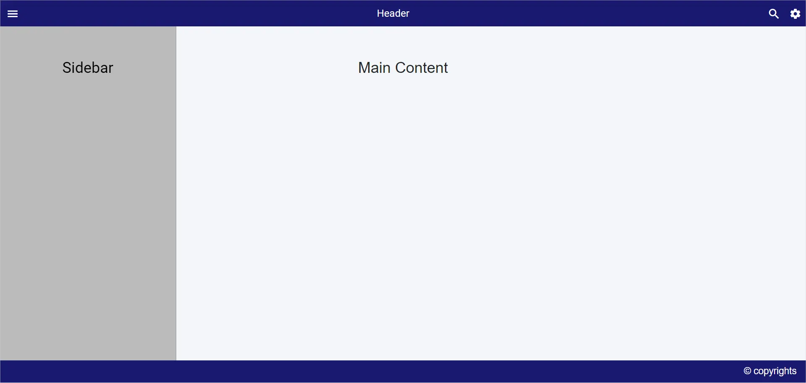

<!-- markdownlint-disable MD009 -->

# Sidebar for specific content in Blazor Sidebar Component

By default, [Blazor Sidebar](https://www.syncfusion.com/blazor-components/blazor-sidebar) initializes context to the body element. Using the [`Target`](https://help.syncfusion.com/cr/blazor/Syncfusion.Blazor.Navigations.SfSidebar.html#Syncfusion_Blazor_Navigations_SfSidebar_Target) property, set context element to initialize Sidebar inside any HTML element apart from the body element.

In the following sample, click the toggle button to expand or collapse the Sidebar.

```cshtml

@using Syncfusion.Blazor.Navigations

<SfSidebar @ref="sidebarObj" Width="280px" Type=SidebarType.Push @bind-IsOpen="SidebarToggle" Target="@Target">
    <ChildContent>
        <div style="text-align: center;" class="text-content">Sidebar</div>
    </ChildContent>
</SfSidebar>

<div id="head">
    <SfToolbar CssClass="CustomToolbar">
        <ToolbarItems>
            <ToolbarItem PrefixIcon="e-icons e-menu" TooltipText="Menu" OnClick="Toggle"></ToolbarItem>
            <ToolbarItem Align="@ItemAlign.Center">
                <Template>
                    <div class="e-folder">
                        <div class="e-folder-name" style="margin-top: 7px;">Header</div>
                    </div>
                </Template>
            </ToolbarItem>
            <ToolbarItem PrefixIcon="e-icons e-search" TooltipText="Search" Align="@ItemAlign.Right">
            </ToolbarItem>
            <ToolbarItem PrefixIcon="e-icons e-settings" TooltipText="Popup" Align="@ItemAlign.Right">
            </ToolbarItem>
        </ToolbarItems>
    </SfToolbar>
</div>

<div class="maincontent text-content" style="text-align: center;">
    Main Content
</div>

<div class="footer" style="height:35px; width:100%;text-align:center;line-height: 35px;font-size:15px;">
    <span style="float:right; margin-right:15px;">&copy; copyrights</span>
</div>

@code {
    SfSidebar sidebarObj;
    public string Target = ".maincontent";
    public bool SidebarToggle = false;
    public void Toggle()
    {
        SidebarToggle = !SidebarToggle;
    }
}

<style>
    .e-sidebar {
        background-color: #bbbbbb;
        color: black;
    }

    .text-content {
        font-size: 1.5rem;
        padding: 3rem;
    }

    .maincontent {
        height: 400px;
        background-color: rgb(244, 246, 249);
    }

    .CustomToolbar, .footer, .e-toolbar .e-toolbar-item .e-tbar-btn .e-icons,
    .e-toolbar .e-toolbar-items, .e-toolbar .e-toolbar-item .e-tbar-btn.e-btn {
        background-color: midnightblue;
        color: white;
        font-size: 16px;
    }
</style>

```


