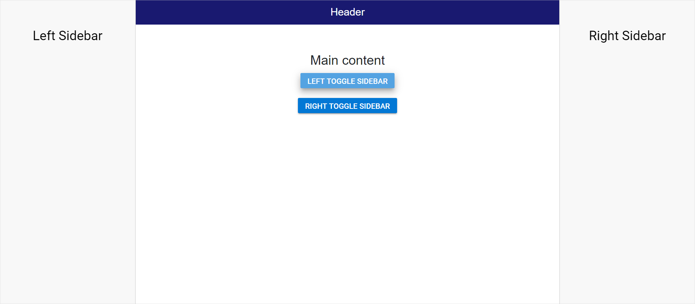

<!-- markdownlint-disable MD009 -->

# Multiple Sidebar in Blazor Sidebar Component

Multiple Sidebars can be initialized on a web page sharing the same main content. Sidebars can be positioned on either the right or left side of the main content using the [`Position`](https://help.syncfusion.com/cr/blazor/Syncfusion.Blazor.Navigations.SfSidebar.html#Syncfusion_Blazor_Navigations_SfSidebar_Position) property.

N> The HTML element with class name `e-main-content` will be considered as the main content and both the Sidebars will behave as side content to this main content area of a web page.

In the following sample, more than one Sidebar is rendered based on `Position` property.

```cshtml

@using Syncfusion.Blazor.Navigations
@using Syncfusion.Blazor.Buttons

<div id="header" style="height:45px;text-align: center;color:white;background-color:midnightblue;font-size:1.2rem;line-height:45px;">
    Header
</div>

<SfSidebar @ref="leftSidebarInstance" Type=SidebarType.Push Width="250px" @bind-IsOpen="LeftToggle">
    <ChildContent>
        <div style="text-align: center;" class="text-content"> Left Sidebar</div>
    </ChildContent>
</SfSidebar>
<SfSidebar @ref="rightSidebarInstance" Width="250px" Position=SidebarPosition.Right @bind-IsOpen="RightToggle">
    <ChildContent>
        <div style="text-align: center;" class="text-content"> Right Sidebar</div>
    </ChildContent>
</SfSidebar>

<div style="text-align:center" class="text-content e-main-content">
    <div>Main content</div>
    <div>
        <SfButton @onclick="ToggleLeftSidebar" IsToggle="true" CssClass="e-btn e-info">Left Toggle Sidebar</SfButton>
    </div>
    <div style="margin-top:10px">
        <SfButton @onclick="ToggleRightSidebar" IsToggle="true" CssClass="e-btn e-info">Right Toggle Sidebar</SfButton>
    </div>
</div>

@code {
    SfSidebar leftSidebarInstance;
    SfSidebar rightSidebarInstance;
    public bool LeftToggle = false;
    public bool RightToggle = false;
    public void ToggleLeftSidebar()
    {
        LeftToggle = !LeftToggle;
    }
    public void ToggleRightSidebar()
    {
        RightToggle = !RightToggle;
    }
}

<style>
    .e-sidebar {
        background-color: #f8f8f8;
        color: black;
    }

    .text-content {
        font-size: 1.5rem;
        padding: 3rem;
    }
</style>

```

