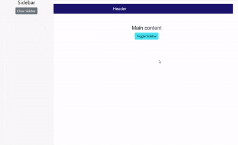

<!-- markdownlint-disable MD009 -->

# Open and close the Sidebar in Blazor Sidebar Component

Opening and closing the Sidebar can be achieved with [`IsOpen`](https://help.syncfusion.com/cr/blazor/Syncfusion.Blazor.Navigations.SfSidebar.html#Syncfusion_Blazor_Navigations_SfSidebar_IsOpen) property.

In the following sample, `IsOpen` property has been used to show or hide the Sidebar on button click.

```cshtml

@using Syncfusion.Blazor.Navigations
@using Syncfusion.Blazor.Buttons

<div id="header" style="height:45px;text-align: center;color:white;background-color:midnightblue;font-size:1.2rem;line-height:45px;">
    Header
</div>

<SfSidebar @ref="sidebarObj" Width="250px" @bind-IsOpen="SidebarToggle">
    <ChildContent>
        <div style="text-align: center;" class="text-content">
            <span>Sidebar</span>
            <span>
                <SfButton @onclick="Close" CssClass="e-btn close-btn">Close Sidebar</SfButton>
            </span>
        </div>
    </ChildContent>
</SfSidebar>

<div class="text-content" style="text-align: center;">
    <div>Main content</div>
    <div>
        <SfButton @onclick="Toggle" IsToggle="true" CssClass="e-btn e-info">Toggle Sidebar</SfButton>
    </div>
</div>

@code{
    SfSidebar sidebarObj;
    public bool SidebarToggle = false;
    public void Close()
    {
        SidebarToggle = false;
    }
    public void Toggle()
    {
        SidebarToggle = !SidebarToggle;
    }
}

<style>
    .e-sidebar {
        background-color: #f8f8f8;
        color: black;
    }

    .text-content {
        font-size: 1.5rem;
        padding: 3rem;
    }
</style>

```

