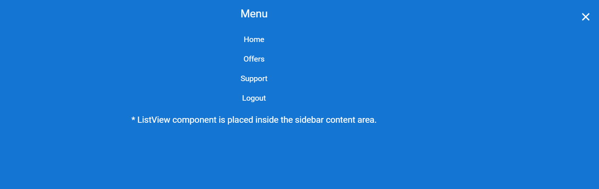

<!-- markdownlint-disable MD009 -->

# Initialize the Blazor Sidebar with ListView

Any HTML element can be placed in the Sidebar content area. The Sidebar supports all types of HTML structures like `TreeView`, `ListView`, etc.

In the following example, the Sidebar is rendered with ListView component in its content area.

```cshtml

@using Syncfusion.Blazor.Navigations
@using Syncfusion.Blazor.Lists
@using Syncfusion.Blazor.Buttons

<SfSidebar @ref="sidebarObj" ID="sidebar" Type="@Type" Width="100%" @bind-IsOpen="SidebarToggle">
    <ChildContent>
        <div class="title1"> Menu </div>
        <div class="closebtn">
            <SfButton ID="close" @onclick="@Close" CssClass="e-btn close-btn">
                <ChildContent>
                    <span id="innerclose" class="e-icons close-icon"></span>
                </ChildContent>
            </SfButton>
        </div>
        <div id="listcontainer">
            <!-- Listview element declaration -->
            <SfListView DataSource="@Data" ID="list">
                <ListViewFieldSettings TValue="ListViewData" Id="Id" Text="Text"></ListViewFieldSettings>
            </SfListView>
        </div>
        <div class="sub-title">
            ListView component is placed inside the Sidebar content area.
        </div>
    </ChildContent>
</SfSidebar>
<!-- main content declaration -->
<div>
    <div class="title2">Main content</div>
    <div class="sub-title"> Click the button to open/close the Sidebar.</div>
    <div style="padding:20px" class="center-align">
        <SfButton ID="toggle" @onclick="@Toggle" IsToggle="true" CssClass="e-btn e-info">Toggle Sidebar</SfButton>
    </div>
</div>

@code{
    SfSidebar sidebarObj;
    public SidebarType Type = SidebarType.Over;
    
    List<ListViewData> Data = new List<ListViewData>()
    {
        new ListViewData{  Text = "Home", Id = "list-01"},
        new ListViewData{ Text = "Offers", Id = "list-02"},
        new ListViewData{ Text = "Support", Id = "list-03"},
        new ListViewData{ Text = "Logout", Id = "list-04"}
    };

    class ListViewData
    {
        public string Id { get; set; }
        public string Text { get; set; }
    }
    public bool SidebarToggle = false;
    public void Close()
    {
        SidebarToggle = false;
    }
    public void Toggle()
    {
        SidebarToggle = !SidebarToggle;
    }
}

<style>
    /* Listview element styles */
    #listcontainer {
        width: 100%;
    }

    #list {
        margin: 0 auto;
        width: 30%;
    }

    .e-listview .e-list-item {
        text-align: center;
        font-size: 14px;
        padding: 0;
    }
    /* Button element styles */
    .e-btn.close-btn :hover { /* csslint allow: adjoining-classes*/
        box-shadow: none;
        background: transparent;
    }

    .close-btn, .e-listview .e-list-item, #sidebar {
        background-color: rgb(20, 118, 210);
        color: #ffffff;
    }

    .close-icon::before {
        content: '\e7e7';
    }

    .close-btn {
        box-shadow: none;
        border: none;
    }

    .close-btn:hover {
        color: #fafafa;
    }

    .e-icons.close-icon { /* csslint allow: adjoining-classes*/
        line-height: 2.2;
    }

    .closebtn {
        top: 15px;
        line-height: 36px;
        height: 42px;
        color: black;
        position: absolute;
        right: 10px;
    }
    /* Sample level styles */
    .title1 {
        text-align: center;
        font-size: 20px;
        padding: 15px;
    }

    .title2 {
        text-align: center;
        font-size: 20px;
        padding: 15px;
    }

    .sub-title {
        text-align: center;
        font-size: 16px;
        padding: 10px;
    }

    .center-align {
        text-align: center;
        padding: 20px;
    }
</style>


```


