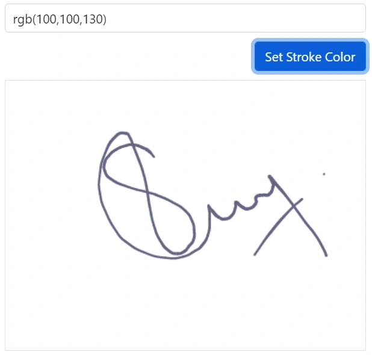
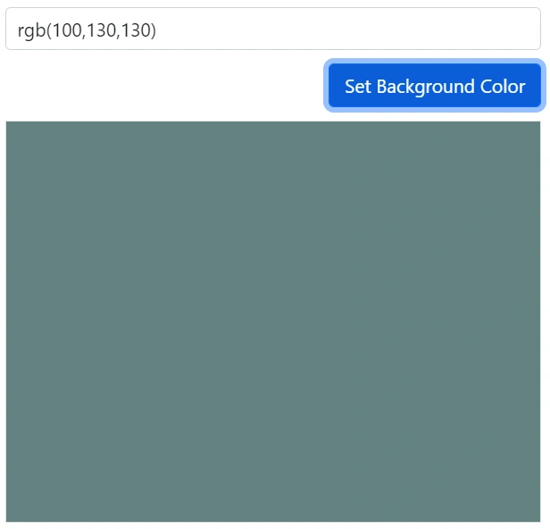
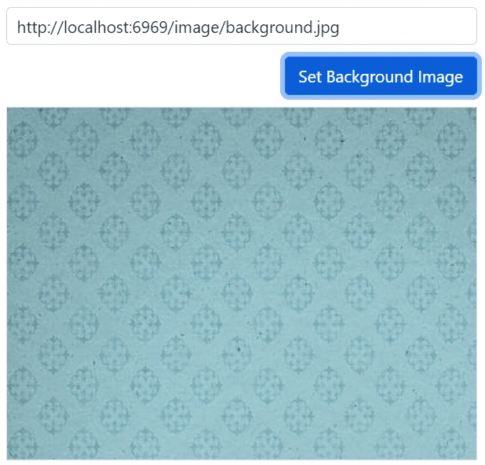

# Customization of Signature component

The [Blazor Signature](https://www.syncfusion.com/blazor-components/blazor-signature) component draws a stroke/path to connect one or more points while drawing on the canvas. This path is drawn using the `moveTo()` and `lineTo()` methods. You can customize the stroke by modifying its color and width. The background of the signature is also customizable by using its color and image. Customization allows you to match the Signature component to your application's branding and visual style.

## Stroke Width

The stroke width depends on the [`MaxStrokeWidth`](https://help.syncfusion.com/cr/blazor/Syncfusion.Blazor.Inputs.SfSignature.html#Syncfusion_Blazor_Inputs_SfSignature_MaxStrokeWidth), [`MinStrokeWidth`](https://help.syncfusion.com/cr/blazor/Syncfusion.Blazor.Inputs.SfSignature.html#Syncfusion_Blazor_Inputs_SfSignature_MinStrokeWidth) and [`Velocity`](https://help.syncfusion.com/cr/blazor/Syncfusion.Blazor.Inputs.SfSignature.html#Syncfusion_Blazor_Inputs_SfSignature_Velocity) values. The default values of these properties are `MaxStrokeWidth` is **2**, `MinStrokeWidth` is **0.5**, and `Velocity` is **0.7**. The variable stroke width is calculated based on the values of `MaxStrokeWidth` and `MinStrokeWidth` for a smoother signature, and the velocity value is used for a realistic signature.

In the following example, minimum stroke width is set as 0.5, maximum stroke width is set as 3 and velocity is set as 0.7.

```cshtml
@using Syncfusion.Blazor.Inputs

<SfSignature MaxStrokeWidth="3" MinStrokeWidth="0.5" Velocity="0.7"></SfSignature>
```


## Stroke Color

Specify the [`StrokeColor`](https://help.syncfusion.com/cr/blazor/Syncfusion.Blazor.Inputs.SfSignature.html#Syncfusion_Blazor_Inputs_SfSignature_StrokeColor) property to set the color of a stroke that accepts hex code, RGB, and named color text. The default value of this property is "#000000".

```cshtml
@using Syncfusion.Blazor.Inputs
@using Syncfusion.Blazor.Buttons

<div>
    <div class="e-sign-heading">
        <span>
            <SfTextBox CssClass="e-outline" @ref="text" Placeholder='Enter the stroke color'></SfTextBox>
        </span>
        <span class="e-btn-options">
            <SfButton CssClass="e-primary" @onclick="OnSet">Set Stroke Color</SfButton>
        </span>
    </div>
    <div class='e-sign-content'>
        <SfSignature StrokeColor="@strokeColor" style="width: 400px; height: 300px;"></SfSignature>
    </div>
</div>

@code{
    private SfTextBox text;
    private string strokeColor;
    private void OnSet()
    {
        strokeColor = text.Value;
    }
}

<style>
    .e-sign-content,
    .e-sign-heading {
        width: 400px;
    }

    #signdescription {
        font-size: 14px;
        padding-bottom: 10px;
    }

    .e-btn-options {
        float: right;
        margin: 10px 0px 10px;
    }
</style>
```



## Background Color

Specify the [`BackgroundColor`](https://help.syncfusion.com/cr/blazor/Syncfusion.Blazor.Inputs.SfSignature.html#Syncfusion_Blazor_Inputs_SfSignature_BackgroundColor) property to set a background color of a signature that accepts hex code, RGB, and named color text. The default value of this property is `null`.

```cshtml
@using Syncfusion.Blazor.Inputs
@using Syncfusion.Blazor.Buttons

<div>
    <div class="e-sign-heading">
        <span>
            <SfTextBox CssClass="e-outline" @ref="text" Placeholder='Enter the background color'></SfTextBox>
        </span>
        <span class="e-btn-options">
            <SfButton CssClass="e-primary" @onclick="OnSet">Set Background Color</SfButton>
        </span>
    </div>
    <div class='e-sign-content'>
        <SfSignature BackgroundColor="@backgroundColor" style="width: 400px; height: 300px;"></SfSignature>
    </div>
</div>

@code{
    private SfTextBox text;
    private string backgroundColor;
    private void OnSet()
    {
        backgroundColor = text.Value;
    }
}

<style>
    .e-sign-content,
    .e-sign-heading {
        width: 400px;
    }

    #signdescription {
        font-size: 14px;
        padding-bottom: 10px;
    }

    .e-btn-options {
        float: right;
        margin: 10px 0px 10px;
    }
</style>
```



## Background Image

Specify the [`BackgroundImage`](https://help.syncfusion.com/cr/blazor/Syncfusion.Blazor.Inputs.SfSignature.html#Syncfusion_Blazor_Inputs_SfSignature_BackgroundImage) property to set the background image of a signature. The background image can be set by either hosting the image in our local IIS or using an online image.

```cshtml
@using Syncfusion.Blazor.Inputs
@using Syncfusion.Blazor.Buttons
<div>
    <div class="e-sign-heading">
        <span>
            <SfTextBox CssClass="e-outline" @ref="text" Placeholder='Enter the Image URL'></SfTextBox>
        </span>
        <span class="e-btn-options">
            <SfButton CssClass="e-primary" @onclick="OnSet">Set Background Image</SfButton>
        </span>
    </div>
    <div class='e-sign-content'>
        <SfSignature BackgroundImage="@backgroundImage" style="width: 400px; height: 300px;"></SfSignature>
    </div>
</div>

@code{
    private SfTextBox text;
    private string backgroundImage;
    private void OnSet()
    {
        backgroundImage = text.Value;
    }
}

<style>
    .e-sign-content,
    .e-sign-heading {
        width: 400px;
    }

    #signdescription {
        font-size: 14px;
        padding-bottom: 10px;
    }

    .e-btn-options {
        float: right;
        margin: 10px 0px 10px;
    }
</style>
```

N> To view the hosted images, you need to enable Directory Browsing option in IIS which creates web.config file inside the hosted folder. Adding below code snippet in the web.config file resolves the CORS issue.

```xml
<?xml version="1.0" encoding="UTF-8"?>
<configuration>
    <system.webServer>
        <directoryBrowse enabled="true" />
		<httpProtocol>
		  <customHeaders>
			<clear />
			<add name="Access-Control-Allow-Origin" value="*" />         
		  </customHeaders>
		</httpProtocol>
    </system.webServer>
</configuration>
```



## See Also

* [Save With Background](./open-save#save-with-background)