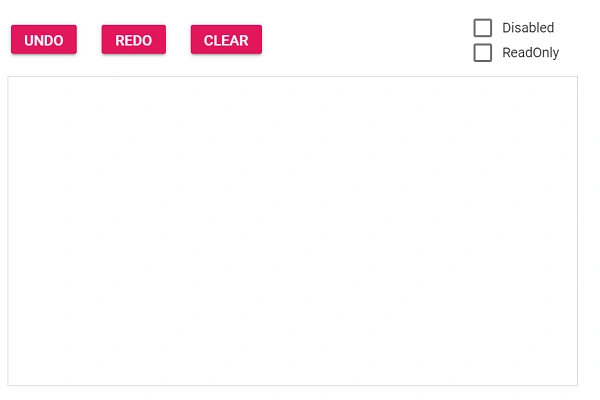

# User Interaction in Blazor Signature

The [Blazor Signature](https://www.syncfusion.com/blazor-components/blazor-signature) component supports various interactions such as Undo, Redo, Clear, Disabled, and ReadOnly. Every change that occurs in the signature is captured as a snap and saved to a collection to enable the above user interactions. These interactions are split into two groups: **Runtime Methods** (Undo, Redo, Clear) and **State Properties** (Disabled, ReadOnly).

## Runtime Methods

### Undo

It reverts the last action of the signature using the [`UndoAsync`](https://help.syncfusion.com/cr/blazor/Syncfusion.Blazor.Inputs.SfSignature.html#Syncfusion_Blazor_Inputs_SfSignature_UndoAsync) method. It removes the latest snap from the collection and loads a previous snap to the signature. The [`CanUndoAsync`](https://help.syncfusion.com/cr/blazor/Syncfusion.Blazor.Inputs.SfSignature.html#Syncfusion_Blazor_Inputs_SfSignature_CanUndoAsync) method is used to check whether undo can be performed or not.

### Redo

It reverts the last undo action of the signature using the [`RedoAsync`](https://help.syncfusion.com/cr/blazor/Syncfusion.Blazor.Inputs.SfSignature.html#Syncfusion_Blazor_Inputs_SfSignature_RedoAsync) method. The [`CanRedoAsync`](https://help.syncfusion.com/cr/blazor/Syncfusion.Blazor.Inputs.SfSignature.html#Syncfusion_Blazor_Inputs_SfSignature_CanRedoAsync) method is used to check whether redo can be performed or not.

### Clear

It clears the signature and makes the canvas empty using the [`ClearAsync`](https://help.syncfusion.com/cr/blazor/Syncfusion.Blazor.Inputs.SfSignature.html#Syncfusion_Blazor_Inputs_SfSignature_ClearAsync) method. The [`IsEmptyAsync`](https://help.syncfusion.com/cr/blazor/Syncfusion.Blazor.Inputs.SfSignature.html#Syncfusion_Blazor_Inputs_SfSignature_IsEmptyAsync) method is used to check whether the signature is empty or not.

## State Properties

### Disabled

It disables the signature component using the [`Disabled`](https://help.syncfusion.com/cr/blazor/Syncfusion.Blazor.Inputs.SfSignature.html#Syncfusion_Blazor_Inputs_SfSignature_Disabled) property. The default value is `false`.

### ReadOnly

It prevents the signature from being edited using the [`IsReadOnly`](https://help.syncfusion.com/cr/blazor/Syncfusion.Blazor.Inputs.SfSignature.html#Syncfusion_Blazor_Inputs_SfSignature_IsReadOnly) property. The default value is `false`.

## Toggling User Interactions

The following example demonstrates how to wire up the user interactions available in the Signature component. The example uses the [`Changed`](https://help.syncfusion.com/cr/blazor/Syncfusion.Blazor.Inputs.SfSignature.html#Syncfusion_Blazor_Inputs_SfSignature_Changed) event along with the `CanUndoAsync`, `CanRedoAsync`, and `IsEmptyAsync` methods to enable or disable the action buttons, and uses checkboxes to toggle the `Disabled` and `IsReadOnly` state properties of the component.

```cshtml
@using Syncfusion.Blazor.Inputs
@using Syncfusion.Blazor.Buttons

<SfButton CssClass="e-primary" Disabled="@undoDisabled" @onclick="OnUndo">UNDO</SfButton>
<SfButton CssClass="e-primary" Disabled="@redoDisabled" @onclick="OnRedo">REDO</SfButton>
<SfButton CssClass="e-primary" Disabled="@clearDisabled" @onclick="OnClear">CLEAR</SfButton>

<SfCheckBox Label="Disable" ValueChange="OnDisable" TChecked="bool"></SfCheckBox>
<SfCheckBox Label="Readonly" ValueChange="OnReadOnly" TChecked="bool"></SfCheckBox>

<SfSignature @ref="signature" Disabled="@disabled" IsReadOnly="@isReadOnly" Changed="SignChanged"></SfSignature>

@code{
    private SfSignature signature;
    private bool disabled = false;
    private bool isReadOnly = false;
    private bool undoDisabled = true;
    private bool redoDisabled = true;
    private bool clearDisabled = true;
    private async Task OnUndo()
    {
        if (!signature.Disabled && !signature.IsReadOnly)
        {
            await signature.UndoAsync();
        }
    }
    private async Task OnRedo()
    {
        if (!signature.Disabled && !signature.IsReadOnly)
        {
            await signature.RedoAsync();
        }
    }
    private async Task OnClear()
    {
        if (!signature.Disabled && !signature.IsReadOnly)
        {
            await signature.ClearAsync();
        }
    }
    private void OnDisable(Syncfusion.Blazor.Buttons.ChangeEventArgs<bool> args)
    {
        disabled = args.Checked;
    }
    private void OnReadOnly(Syncfusion.Blazor.Buttons.ChangeEventArgs<bool> args)
    {
        isReadOnly = args.Checked;
    }
    private async Task SignChanged()
    {
        bool canUndo = await signature.CanUndoAsync();
        bool canRedo = await signature.CanRedoAsync();
        bool isEmpty = await signature.IsEmptyAsync();
        undoDisabled = !canUndo;
        redoDisabled = !canRedo;
        clearDisabled = isEmpty;
    }
}
```

