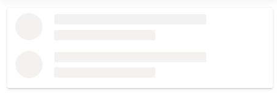

# Shimmer Effect in Blazor Skeleton Component

Use the [Effect](https://help.syncfusion.com/cr/blazor/Syncfusion.Blazor.Notifications.SfSkeleton.html#Syncfusion_Blazor_Notifications_SfSkeleton_Effect) property to change the animation effect of the Skeleton component. The Skeleton supports `Wave`, `Pulse`, and `Fade` effects. By default, the `Effect` is set to `Wave`.




@using Syncfusion.Blazor.Notifications

<SfSkeleton Shape=SkeletonType.Circle Width="60px" Effect=ShimmerEffect.Pulse></SfSkeleton>




The following example demonstrates a list with the Pulse effect applied to Skeleton placeholders.




@using Syncfusion.Blazor.Notifications

<ul id="skeleton-list" class="e-card">
    <li>
        

            <SfSkeleton Shape=SkeletonType.Circle Width="40px" Effect=ShimmerEffect.Pulse></SfSkeleton>
        

        

            <SfSkeleton Width="60%" Height='15px' Effect=ShimmerEffect.Pulse></SfSkeleton> 
            <SfSkeleton Width="40%" Height='15px' Effect=ShimmerEffect.Pulse></SfSkeleton>
        

    </li>
    <li>
        

            <SfSkeleton Shape=SkeletonType.Circle Width="40px" Effect=ShimmerEffect.Pulse></SfSkeleton>
        

        

            <SfSkeleton Width="60%" Height='15px' Effect=ShimmerEffect.Pulse></SfSkeleton> 
            <SfSkeleton Width="40%" Height='15px' Effect=ShimmerEffect.Pulse></SfSkeleton>
        

    </li>
</ul>




