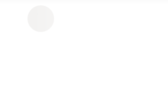
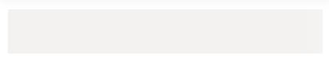
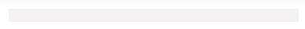

# Shapes in Blazor Skeleton Component

The Skeleton component supports multiple built-in shapes for designing loading placeholders. Use the [Shape](https://help.syncfusion.com/cr/blazor/Syncfusion.Blazor.Notifications.SfSkeleton.html#Syncfusion_Blazor_Notifications_SfSkeleton_Shape) property to preview and compose any layout. Width and height can be configured per shape to match the intended content.

The Skeleton component supports the following content shapes:

## Circle skeleton shape




@using Syncfusion.Blazor.Notifications

<SfSkeleton Shape=SkeletonType.Circle Width="48px"></SfSkeleton>




## Square skeleton shape




@using Syncfusion.Blazor.Notifications

<SfSkeleton Shape=SkeletonType.Square Width="48px"></SfSkeleton>




## Rectangle skeleton shape




@using Syncfusion.Blazor.Notifications

<SfSkeleton Shape=SkeletonType.Rectangle Height="50px"></SfSkeleton>




## Text skeleton shape




@using Syncfusion.Blazor.Notifications

<SfSkeleton Shape=SkeletonType.Text Height="15px"></SfSkeleton>




The following example demonstrates a card-style layout composed using the above Skeleton shapes.




@using Syncfusion.Blazor.Notifications

    

        <SfSkeleton Shape=SkeletonType.Circle Width= "60px"></SfSkeleton>
    

    

        <SfSkeleton Width="30%" Height='15px'></SfSkeleton> 
        <SfSkeleton Width="15%" Height='15px'></SfSkeleton>
    

    

        <SfSkeleton Shape=SkeletonType.Rectangle Width="100%" Height='150px'></SfSkeleton>
    

    

        <SfSkeleton Shape=SkeletonType.Rectangle Width="20%" Height='32px'></SfSkeleton>
        <SfSkeleton Shape=SkeletonType.Rectangle Width="20%" Height='32px'></SfSkeleton>
    




