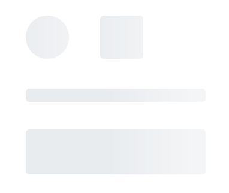

# Shapes in Blazor Skeleton Component

The Skeleton component supports various built-in shape variants to design the layout of the page. You can use the [Shape](https://help.syncfusion.com/cr/blazor/Syncfusion.Blazor.Notifications.SfSkeleton.html#Syncfusion_Blazor_Notifications_SfSkeleton_Shape) property to display the skeleton in various shapes, such as circle, square, rectangle, and text and create a preview of any layout.

The Skeleton component supports the following content shapes:




    <SfSkeleton Shape=SkeletonType.Circle Width="48px" CssClass="custom-css"></SfSkeleton>
    <SfSkeleton Shape="SkeletonType.Square" Width="48px"></SfSkeleton>
      
    <SfSkeleton Shape="SkeletonType.Text" Height="15px"></SfSkeleton>
      
    <SfSkeleton Shape="SkeletonType.Rectangle" Height="50px" Width="100%" ></SfSkeleton>




Below example demonstrates the use case example of a Skeleton component.




@using Syncfusion.Blazor.Notifications

    

        <SfSkeleton Shape=SkeletonType.Circle Width= "60px"></SfSkeleton>
    

    

        <SfSkeleton Width="30%" Height='15px'></SfSkeleton> 
        <SfSkeleton Width="15%" Height='15px'></SfSkeleton>
    

    

        <SfSkeleton Shape=SkeletonType.Rectangle Width="100%" Height='150px'></SfSkeleton>
    

    

        <SfSkeleton Shape=SkeletonType.Rectangle Width="20%" Height='32px'></SfSkeleton>
        <SfSkeleton Shape=SkeletonType.Rectangle Width="20%" Height='32px'></SfSkeleton>
    




