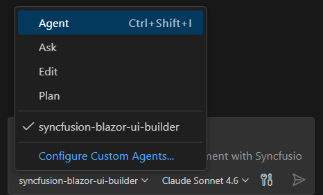

# Syncfusion® Blazor UI Builder Skill for AI Assistants

**Syncfusion® Blazor UI Builder** is an AI-powered skill and companion agent that accelerates Blazor application development by transforming natural-language UI requirements into production-ready components using Syncfusion® Blazor UI libraries. 

Integrated with your AI-powered IDE, it leverages deep knowledge of **Syncfusion® components** to deliver accurate and ready-to-use code.
By combining intelligent code generation with best practices, accessibility standards, and design-system consistency, Blazor UI Builder helps you rapidly build scalable dashboards and user interfaces without leaving your development workflow.

## Prerequisites

Before installing Blazor UI Builder, ensure the following:

| Requirement | Description |
|-------------|-------------|
| **Blazor Project** | Active Blazor WebAssembly or Blazor Server project (.NET 8+) |
| **Microsoft .NET SDK 8.0 or later** | .NET CLI tools installed |
| **Node.js version 18 or later** | npm package manager installed |
| **Agent Package Manager (APM)** | Agent Package Manager installed. [Installation Guidelines](https://microsoft.github.io/apm/quickstart/#1-install-apm) |
| **Syncfusion License** | [Commercial](https://www.syncfusion.com/sales/unlimitedlicense), [Free Community](https://www.syncfusion.com/products/communitylicense), or [Free Trial](https://www.syncfusion.com/account/manage-trials/start-trials) |
| **Supported AI Agent / IDE** | A supported AI agent or IDE that integrates with Skills (VS Code, Cursor, Syncfusion® Code Studio, etc.) 

## Key Benefits

### **AI-Driven UI Generation**
- Converts prompts into complete Blazor components-not just snippets
- Automatically selects appropriate Syncfusion® components and features
- Produces structured, maintainable code

### **Component Usage & API Accuracy**
- Uses correct Syncfusion® component APIs
- Injects required feature modules (paging, sorting, filtering, etc.)
- Avoids unsupported or deprecated patterns

### **Patterns & Best Practices**
- Recommended component composition and Blazor lifecycle integration
- Event handling aligned with Blazor standards
- Secure and scalable coding patterns

### **Accessibility & Responsiveness**
- WCAG 2.1 AA–aligned output
- Semantic HTML with ARIA support
- Mobile-first responsive layouts

### **Design-System Integration**
- Supports Tailwind, Bootstrap, Material, or custom themes
- Ensures consistent Syncfusion® styling and theme usage

## Installation

Before installing Blazor UI Builder, ensure that APM (Agent Package Manager) is installed and available in your environment.

### Verify APM Installation

Run the following command to confirm APM is installed:

```bash
apm --version
```

### Install the Syncfusion® Blazor UI Builder package using APM

Use the APM CLI to install the Blazor UI Builder skill for your preferred environment:




apm install syncfusion/blazor-ui-builder -t copilot

 



apm install syncfusion/blazor-ui-builder -t cursor





apm install syncfusion/blazor-ui-builder -t codex





apm install syncfusion/blazor-ui-builder -t claude




After installation, the following artifacts are added to your project for the GitHub Copilot target:

- `.agent/skills/` – contains the skill files
- `.github/agents/` – contains the agent configuration

Refer to the [documentation](https://microsoft.github.io/apm/reference/cli/targets/#detection-signals) for details about supported deployment targets.

> For Syncfusion® Code Studio, use the Copilot command above to install the Blazor UI Builder.

## How the Syncfusion® Blazor UI Builder Skill Works

1. **Intent Analysis** - Parse the user's prompt to identify component types and high-level layout intent.
2. **Project Detection** - Automatically detects project framework, package manager, and existing themes.
3. **Component Mapping** - Map intent to Syncfusion® components and required feature modules.
4. **Theming & Design System**  
   Load required theming guidelines and confirm key design choices:
   - CSS framework (Tailwind, Bootstrap, Material, or Greenfield(custom theme)). If no themes detected in the existing project, Greenfield and Syncfusion Tailwind3 theme are shown as the default option-proceed with this or change the theme as preferred.
   - Syncfusion theme (Tailwind3, Bootstrap5, Material3, fluent2)
   - Light and Dark Mode
   - Core design basics (colors, spacing, typography, responsiveness, accessibility)
5. **Code Generation** - Produce C# Blazor components, parameter interfaces, and CSS/styling scaffolding.
6. **Dependency Management** - Recommend or install required Syncfusion® packages and peer dependencies.
7. **Validation** - Run accessibility and basic security checks, request confirmation for changes.
8. **Code Insertion** - Create files or patch existing files following project structure and conventions.

Key enforcement points:

- Adds correct theme and CSS imports for chosen Syncfusion® themes
- Injects only the feature modules required by generated components
- Generates semantic HTML with ARIA attributes and keyboard support
- Avoids unsupported or deprecated API usages for Syncfusion® components

> The assistant handles most stages automatically and may request confirmation where required.

## Generate UIs using the Agentic UI Builder

After installing Blazor UI Builder with APM, the relevant agent and skill files are added to your project under:

- `.agent/skills/` (skill files)
- `.github/agents/` (Blazor UI builder agent configuration)

To start using the skill:

1. Open your supported IDE.
2. In the chat panel, select the `syncfusion-blazor-ui-builder` agent from the **Agent dropdown**.
  
3. Start prompting the agent with a clear description of your UI requirements.

Examples Prompts:



Create a login page with the Tailwind 3 theme using a centered card layout containing email and password input fields with validation. Include a "Remember Me" checkbox, a forgot password link, and a primary login button. Add a secondary "Create Account" button below. Ensure the layout is responsive and works on mobile, tablet, and desktop.


Create a CMS Admin Dashboard UI featuring a collapsible sidebar with navigation items for Dashboard, Content, Users, Analytics, and Settings; a top header (AppBar) showing the title “CMS Admin Dashboard” on the left and a user name with profile icon on the right; and a main content area that includes three compact summary cards in a single row displaying Total Content, Total Users, and Active Sessions (each card showing a label, relevant icon, prominent count value, and percentage change from last month), followed by a “Content Management” section with a filterable and data grid containing columns for Title, Author, Status, Date, and Actions (with edit and delete buttons), and finally two charts displayed side by side-a bar chart titled “Content Over Time” and a donut chart titled “Content by Category”-using realistic sample data for both the grid (10–12 rows) and the charts.



4. Generated code follows best practices with accessible, semantic HTML, responsive mobile-first layouts, strong C# typing, and built-in security measures such as input validation and avoidance of embedded secrets.

## Best Practices

Follow these guidelines to get the most out of UI Builder and ensure high-quality production-ready result:

- **Stay consistent** - Maintain consistent file organization, naming conventions, and coding standards throughout your project.
- **Use advanced AI models** - For best results, use **Claude Sonnet 4.6 or higher** capability models to produce better code quality and more accurate implementations.
- **Review all content and assets before production** - Replace any placeholder images or icons (e.g., from emoji sets) with your brand assets. Also validate the logic, security, and compatibility with your existing code before deployment.

## Troubleshooting

- **APM installation failure**: Refer to this [documentation](https://microsoft.github.io/apm/getting-started/installation/#troubleshooting)

- **Skills not loading**: Ensure the **.agent/** and **.github/agents/** folders exist in your project and that the skill was installed successfully using APM. Verify that the correct agent is selected from the Agent dropdown in your IDE.

- **Component not rendering**: Retry generation using the specific component skill to resolve the issue, and ensure required Syncfusion® packages and themes are properly configured.

- **Syncfusion license banner appears**: Use the licensing skill to correctly register and validate your Syncfusion® license key in the application.


## FAQ

**Which agents/IDEs are supported?**
Any Skills-compatible agent that reads local skill files (Code Studio, VS Code, Cursor, etc.).

**Are skills loaded automatically?**  
Yes. Supported agents automatically load relevant skills based on your query.

**Can I customize the generated styles?**
Yes - the skill supports choosing Tailwind, Bootstrap, Material, or a custom theme; generated components include clear integration points for style adjustments.

**Does it modify files automatically?**
The skill proposes changes and requires confirmation for insertion; automatic dependency installation may be offered depending on agent permissions.

## See also

- [Syncfusion Blazor Skills](component-skills)
- [Agent Skills Standards](https://agentskills.io/home)
- [Agent Package Manager](https://microsoft.github.io/apm/getting-started/quick-start/)

