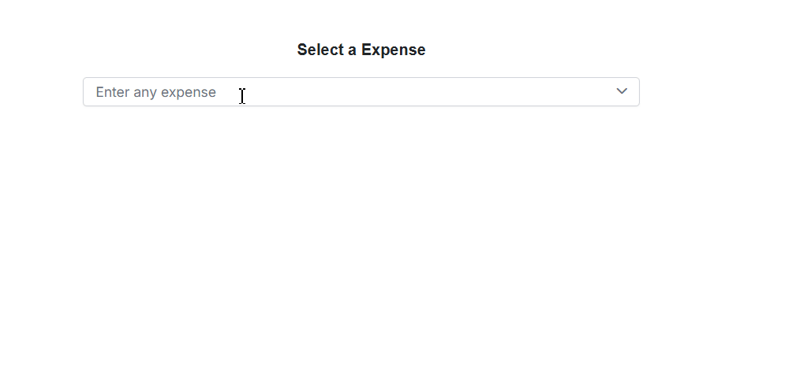

---
layout: post
title: Semantic Search with Blazor ComboBox and AI models | Syncfusion
description: Learn how to use the Syncfusion Blazor ComboBox with OpenAI, Azure OpenAI, or Ollama for semantic search. Explore to more details.
platform: Blazor
control: AI Integration
documentation: ug
keywords: Blazor ComboBox, AI embeddings, Syncfusion Blazor AI
--- 

# Semantic Search with Blazor ComboBox and AI models

This guide demonstrates how to use the [Syncfusion.Blazor.AI](https://www.nuget.org/packages/Syncfusion.Blazor.AI) package to advanced capabilities of the Syncfusion Blazor ComboBox component, specifically focusing on the Semantic Search feature.

## Prerequisites

* [System requirements for Blazor components](https://blazor.syncfusion.com/documentation/system-requirements)

Ensure the following NuGet packages are installed based on the selected AI service.

### For OpenAI
- Microsoft.Extensions.AI
- Microsoft.Extensions.AI.OpenAI

### For Azure OpenAI
- Microsoft.Extensions.AI
- Microsoft.Extensions.AI.OpenAI
- Azure.AI.OpenAI

### For Ollama
- Microsoft.Extensions.AI
- OllamaSharp




Install-Package Syncfusion.Blazor.DropDowns -Version {{ site.releaseversion }}
Install-Package Syncfusion.Blazor.Themes -Version {{ site.releaseversion }}
Install-Package Syncfusion.Blazor.AI -Version {{ site.releaseversion }}
Install-Package SmartComponents.LocalEmbeddings
Install-Package Microsoft.Extensions.AI
Install-Package Microsoft.Extensions.AI.OpenAI  # For OpenAI or Azure OpenAI
Install-Package Azure.AI.OpenAI  # For Azure OpenAI
Install-Package OllamaSharp  # For Ollama




## Add stylesheet and script resources

Include the theme stylesheet and script from NuGet via [Static Web Assets](https://blazor.syncfusion.com/documentation/appearance/themes#static-web-assets) in the `<head>` of the main page:

- For **.NET 8 or .NET 9 or .NET 10** Blazor Server App, add to **~/Components/App.razor**.

```html
<head>
    ....
    <link href="_content/Syncfusion.Blazor.Themes/tailwind.css" rel="stylesheet" />
</head>

<body>
    ....
    <script src="_content/Syncfusion.Blazor.Core/scripts/syncfusion-blazor.min.js" type="text/javascript"></script>
</body>
```

N> Check out the [Blazor Themes](https://blazor.syncfusion.com/documentation/appearance/themes) topic to discover various methods ([Static Web Assets](https://blazor.syncfusion.com/documentation/appearance/themes#static-web-assets), [CDN](https://blazor.syncfusion.com/documentation/appearance/themes#cdn-reference), and [CRG](https://blazor.syncfusion.com/documentation/common/custom-resource-generator)) for referencing themes in Blazor application. Also, check out the [Adding Script Reference](https://blazor.syncfusion.com/documentation/common/adding-script-references) topic to learn different approaches for adding script references in Blazor application.

## Configure AI service

Choose one of the following AI services (OpenAI, Azure OpenAI, or Ollama) based on requirements:

- **OpenAI**: Cloud-based, general-purpose AI models with minimal setup.
- **Azure OpenAI**: Enterprise-grade deployment with enhanced security and scalability.
- **Ollama**: Self-hosted, privacy-focused AI models.

Follow the instructions for the selected service to register the AI model in the application.

### OpenAI

Generate an API key from OpenAI and set `openAIApiKey`. Specify the desired model (for example, `gpt-3.5-turbo`, `gpt-4`) in `openAIModel`.

- Install the required NuGet packages:




Install-Package Microsoft.Extensions.AI
Install-Package Microsoft.Extensions.AI.OpenAI




- Add the following to the **~/Program.cs** file in the Blazor Web App:




using Syncfusion.Blazor.AI;
using Microsoft.Extensions.AI;
using OpenAI;

var builder = WebApplication.CreateBuilder(args);

string openAIApiKey = "API-KEY";
string openAIModel = "OPENAI_MODEL";
OpenAIClient openAIClient = new OpenAIClient(openAIApiKey);
IChatClient openAIChatClient = openAIClient.GetChatClient(openAIModel).AsIChatClient();
builder.Services.AddChatClient(openAIChatClient);
builder.Services.AddSingleton<IChatInferenceService, SyncfusionAIService>();
builder.Services.AddSingleton<LocalEmbedder>();

var app = builder.Build();




### Azure OpenAI

Deploy an Azure OpenAI Service resource and model as described in [Microsoft’s documentation](https://learn.microsoft.com/en-us/azure/ai-services/openai/how-to/create-resource). Obtain values for `azureOpenAIKey`, `azureOpenAIEndpoint`, and `azureOpenAIModel`.

- Install the required NuGet packages:




Install-Package Microsoft.Extensions.AI
Install-Package Microsoft.Extensions.AI.OpenAI
Install-Package Azure.AI.OpenAI




- Add the following to the **~/Program.cs** file in the Blazor Web App:




using Syncfusion.Blazor.AI;
using Azure.AI.OpenAI;
using Microsoft.Extensions.AI;
using System.ClientModel;

var builder = WebApplication.CreateBuilder(args);

string azureOpenAIKey = "AZURE_OPENAI_KEY";
string azureOpenAIEndpoint = "AZURE_OPENAI_ENDPOINT";
string azureOpenAIModel = "AZURE_OPENAI_MODEL";
AzureOpenAIClient azureOpenAIClient = new AzureOpenAIClient(
     new Uri(azureOpenAIEndpoint),
     new ApiKeyCredential(azureOpenAIKey)
);
IChatClient azureOpenAIChatClient = azureOpenAIClient.GetChatClient(azureOpenAIModel).AsIChatClient();
builder.Services.AddChatClient(azureOpenAIChatClient);
builder.Services.AddSingleton<IChatInferenceService, SyncfusionAIService>();
builder.Services.AddSingleton<LocalEmbedder>();

var app = builder.Build();




### Ollama

To use Ollama for self-hosted AI models:

1. **Download and install Ollama**: Visit [Ollama's official website](https://ollama.com) and install the application for the operating system.
2. **Install a model**: Choose a model from the [Ollama Library](https://ollama.com/library) (for example, `llama2:13b`, `mistral:7b`).
3. **Configure the application**: Provide the `Endpoint` URL (for example, `http://localhost:11434`) and `ModelName` (for example, `llama2:13b`).

- Install the required NuGet packages:




Install-Package Microsoft.Extensions.AI
Install-Package OllamaSharp




- Add the following to the **~/Program.cs** file in the Blazor Web App:




using Syncfusion.Blazor.AI;
using Microsoft.Extensions.AI;
using OllamaSharp;

var builder = WebApplication.CreateBuilder(args);

string ModelName = "MODEL_NAME";
IChatClient chatClient = new OllamaApiClient("http://localhost:11434", ModelName);
builder.Services.AddChatClient(chatClient);
builder.Services.AddSingleton<IChatInferenceService, SyncfusionAIService>();
builder.Services.AddSingleton<LocalEmbedder>();

var app = builder.Build();




- **Verify connectivity**: Ensure the Ollama server is running and accessible at the specified endpoint (for example, `http://localhost:11434`) before starting the application.

## Register Syncfusion Blazor service

Register the Syncfusion<sup style="font-size:70%">&reg;</sup> Blazor Service in the **~/Program.cs** file of the Blazor Web App.

If the **Interactive Render Mode** is set to `Server`, register the Syncfusion<sup style="font-size:70%">&reg;</sup> Blazor service in the **~/Program.cs** file.

If the **Interactive Render Mode** is set to `WebAssembly` or `Auto`, register the Syncfusion<sup style="font-size:70%">&reg;</sup> Blazor service in the **~/Program.cs** files of the main server project and associated .Client project.




using Syncfusion.Blazor;

var builder = WebApplication.CreateBuilder(args);

builder.Services.AddRazorComponents()
    .AddInteractiveServerComponents()
    .AddInteractiveWebAssemblyComponents();
builder.Services.AddSyncfusionBlazor();

var app = builder.Build();




using Syncfusion.Blazor;

var builder = WebAssemblyHostBuilder.CreateDefault(args);
builder.Services.AddSyncfusionBlazor();

await builder.Build().RunAsync();




## Razor component

### AI-powered ComboBox Semantic Searching with Embeddings

Add the Syncfusion<sup style="font-size:70%">&reg;</sup> Blazor ComboBox component in the **~Pages/Home.razor** file.

The **Semantic Search** feature allows users to search for items based on the meaning and context of their queries, rather than relying solely on exact keyword matches. Powered by local embeddings, this feature enhances search accuracy by understanding the user's intent, delivering more relevant and intuitive results.

This functionality is particularly useful in applications where quickly finding the right item is critical, making the Syncfusion Blazor ComboBox a powerful tool for building smarter and more responsive search interfaces.

**Features**:

* Contextual Search: Users can search using natural language, with the system interpreting the intent behind their query.
* Enhanced Accuracy: More relevant results are provided by understanding the meaning of user input, not just the keywords.
* Ideal for Large Datasets: Especially beneficial for applications with complex or extensive datasets.




@page "/"
@using SmartComponents.LocalEmbeddings
@rendermode InteractiveServer

@inject LocalEmbedder embedder

<div class="control-container" style="margin: 50px; text-align: center;">
    <p style="font-weight: 600">Select a Expense</p>
    <SfComboBox @ref="comboboxObj" Width="50%" TValue="string" TItem="ExpenseCategory" PopupHeight="230px" AllowFiltering="true" Placeholder="Enter any expense" @bind-Value="@ComboBoxValue" DataSource="@cbxDataSource">
        <ComboBoxEvents TValue="string" TItem="ExpenseCategory" Filtering="OnSearchTermChanged" />
        <ComboBoxFieldSettings Text="Name" Value="ID" />
    </SfComboBox>
</div>

@code {
    public double similarityValue = 0.65;
    private string SearchTerm = "";
    public string ComboBoxValue = "";

    SfComboBox<string, ExpenseCategory> comboboxObj;
    private List<ExpenseCategory> expenseCategories;
    private List<ExpenseCategory> cbxDataSource;
    public Dictionary<string, EmbeddingF32> ProductEmbeddings { get; set; } = new Dictionary<string, EmbeddingF32>();

    public static List<ExpenseCategory> GetAllRecords()
    {
        return new List<ExpenseCategory>()
        {
            new ExpenseCategory() { ID = "Category1", Name = "Groceries" },
            new ExpenseCategory() { ID = "Category2", Name = "Utilities" },
            new ExpenseCategory() { ID = "Category3", Name = "Rent" },
            new ExpenseCategory() { ID = "Category4", Name = "Education" },
            new ExpenseCategory() { ID = "Category5", Name = "Car Payment" },
            new ExpenseCategory() { ID = "Category6", Name = "Car Insurance" },
            new ExpenseCategory() { ID = "Category7", Name = "Health Insurance" },
            new ExpenseCategory() { ID = "Category8", Name = "Life Insurance" },
            new ExpenseCategory() { ID = "Category9", Name = "Home Insurance" },
            new ExpenseCategory() { ID = "Category10", Name = "Gas" },
            new ExpenseCategory() { ID = "Category11", Name = "Public Transportation" },
            new ExpenseCategory() { ID = "Category12", Name = "Dining Out" },
            new ExpenseCategory() { ID = "Category13", Name = "Entertainment" },
            new ExpenseCategory() { ID = "Category14", Name = "Travel" },
            new ExpenseCategory() { ID = "Category15", Name = "Clothing" },
            new ExpenseCategory() { ID = "Category16", Name = "Electronics" },
            new ExpenseCategory() { ID = "Category17", Name = "Pet Care" },
            new ExpenseCategory() { ID = "Category18", Name = "Other" }
        };
    }

    protected override void OnInitialized()
    {
        expenseCategories = GetAllRecords();
        cbxDataSource = expenseCategories;
        foreach (var expense in expenseCategories)
        {
            ProductEmbeddings.Add(expense.ID, embedder.Embed(expense.Name));
        }
    }


    private void OnSearchTermChanged(FilteringEventArgs args)
    {
        args.PreventDefaultAction = true;
        SearchTerm = args.Text;
        if (String.IsNullOrEmpty(SearchTerm))
        {
            comboboxObj.FilterAsync(cbxDataSource);
            return;
        }
        var queryVector = embedder.Embed(SearchTerm);
        List<ExpenseCategory> filteredRecords = expenseCategories
            .Where(expense => LocalEmbedder.Similarity(ProductEmbeddings[expense.ID], queryVector) > similarityValue)
            .ToList();
        comboboxObj.FilterAsync(filteredRecords);
    }

    public class ExpenseCategory
    {
        public string ID { get; set; }
        public string Name { get; set; }
    }
}






## Error Handling and Troubleshooting

If the AI service fails to return a valid response, the ComboBox shows a toast in the upper-right corner: "Server is busy right now, Please try again". Common issues include:

- **Invalid API Key or Endpoint**: Verify that the `openAIApiKey`, `azureOpenAIKey`, or Ollama `Endpoint` is correct and the service is accessible.
- **Model Unavailable**: Ensure the specified `openAIModel`, `azureOpenAIModel`, or `ModelName` is deployed and supported.
- **Network Issues**: Check connectivity to the AI service endpoint, especially for self-hosted Ollama instances.
- **Large Datasets**: Processing large datasets may cause timeouts. Consider batching data or optimizing the prompt for efficiency.

## Performance Considerations

When handling large datasets, ensure the Ollama server has sufficient resources (CPU/GPU) to process requests efficiently. For datasets exceeding 10,000 records, consider splitting the data into smaller batches to avoid performance bottlenecks. Test the application with your specific dataset to determine optimal performance.

## Live Demo

Explore the AI-powered Smart ComboBox in action by visiting the live demo:

👉 [Try the Live Demo](https://blazor.syncfusion.com/demos/combobox/embeddings?theme=fluent2)

N> A complete working example is available in the [Syncfusion Blazor AI Samples GitHub repository](https://github.com/syncfusion/smart-ai-samples).

## How it Works

The **Semantic Search** feature helps users find items by interpreting the meaning and context of their search queries. Unlike traditional search methods, which rely on exact keyword matches, this feature understands the intent behind the query. As a result, users receive more accurate and relevant results.

This feature significantly improves the user experience, particularly when navigating large or complex datasets, by making search interactions more intuitive and effective.