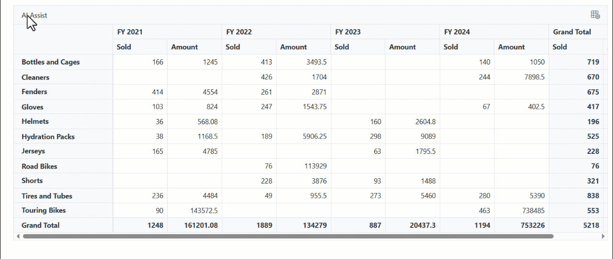
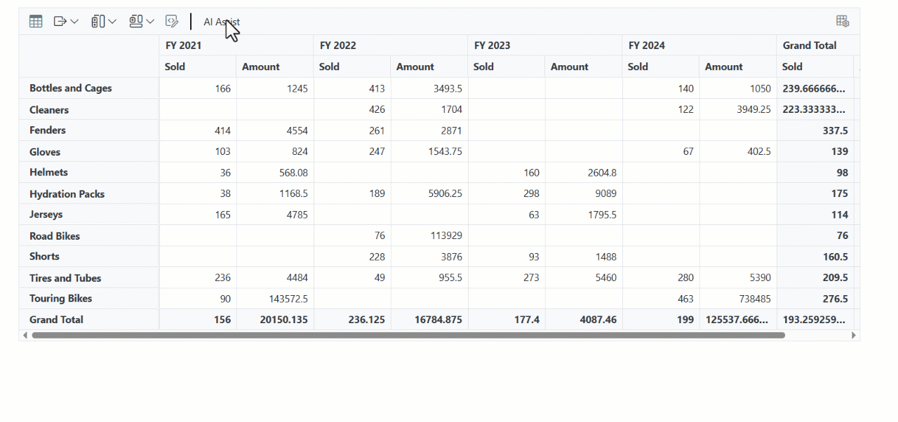

# Creating an AI-Powered Smart Blazor Pivot Table

The Syncfusion Blazor Pivot Table can be enhanced with AI-driven features by using the [**Syncfusion.Blazor.AI**](https://www.nuget.org/packages/Syncfusion.Blazor.AI) NuGet package. This guide helps you add AI features to your Pivot Table, including Smart Data Aggregation, Predictive Modeling, and Adaptive Filtering. You can use different AI services such as OpenAI, Azure OpenAI, or Ollama. With these features, you can interact with the Pivot Table in a smarter way to understand your data better.

In this guide
- Prerequisites
- Add Stylesheet and Script Resources
- Configure your AI service (OpenAI, Azure OpenAI, Ollama)
- Register the Syncfusion Blazor service
- Razor component: AI-driven features for your Pivot Table
- How the sample works
- Error Handling and Troubleshooting
- Performance Considerations
- Sample Code

## Prerequisites

Install the NuGet packages that match your chosen AI service:

### For OpenAI
- **Microsoft.Extensions.AI**
- **Microsoft.Extensions.AI.OpenAI**

### For Azure OpenAI
- **Microsoft.Extensions.AI**
- **Microsoft.Extensions.AI.OpenAI**
- **Azure.AI.OpenAI** 

### For Ollama
- **Microsoft.Extensions.AI**
- **OllamaSharp**




Install-Package Syncfusion.Blazor.PivotTable -Version {{ site.releaseversion }}
Install-Package Syncfusion.Blazor.Themes -Version {{ site.releaseversion }}
Install-Package Syncfusion.Blazor.AI -Version {{ site.releaseversion }}
Install-Package Microsoft.Extensions.AI
Install-Package Microsoft.Extensions.AI.OpenAI  # For OpenAI or Azure OpenAI
Install-Package Azure.AI.OpenAI  # For Azure OpenAI
Install-Package OllamaSharp  # For Ollama




## Add Stylesheet and Script Resources

Include the theme stylesheet and script via [Static Web Assets](https://blazor.syncfusion.com/documentation/appearance/themes#static-web-assets) in the `<head>` of your main page:

- For **.NET 6** Blazor Server apps, add to **~/Pages/_Layout.cshtml**.
- For **.NET 8 or .NET 9** Blazor Server apps, add to **~/Components/App.razor**.

```html
<head>
    <link href="_content/Syncfusion.Blazor.Themes/tailwind.css" rel="stylesheet" />
</head>
<body>
    <script src="_content/Syncfusion.Blazor.Core/scripts/syncfusion-blazor.min.js" type="text/javascript"></script>
</body>
```

N> Explore the [Blazor Themes](https://blazor.syncfusion.com/documentation/appearance/themes) topic for methods to reference themes ([Static Web Assets](https://blazor.syncfusion.com/documentation/appearance/themes#static-web-assets), [CDN](https://blazor.syncfusion.com/documentation/appearance/themes#cdn-reference), or [CRG](https://blazor.syncfusion.com/documentation/common/custom-resource-generator)). Refer to the [Adding Script Reference](https://blazor.syncfusion.com/documentation/common/adding-script-references) topic for different approaches to adding script references in your Blazor application.

## Configure your AI service

Choose one of the following AI services (OpenAI, Azure OpenAI, or Ollama) based on your requirements:
- **OpenAI**: Best for cloud-based, general-purpose AI models with minimal setup.
- **Azure OpenAI**: Ideal for enterprise-grade deployments with enhanced security and scalability.
- **Ollama**: Suitable for self-hosted, privacy-focused AI models.

Follow the instructions for your selected service to register the AI model in your application.

### OpenAI

Generate an API key from OpenAI and set `openAIApiKey`. Specify the desired model (e.g., `gpt-3.5-turbo`, `gpt-4`) in `openAIModel`.

- Install the required NuGet packages:




Install-Package Microsoft.Extensions.AI
Install-Package Microsoft.Extensions.AI.OpenAI




- Add the following to the **~/Program.cs** file in your Blazor WebApp:




using Syncfusion.Blazor.AI;
using Microsoft.Extensions.AI;
using OpenAI;

var builder = WebApplication.CreateBuilder(args);

string openAIApiKey = "API-KEY";
string openAIModel = "OPENAI_MODEL";
OpenAIClient openAIClient = new OpenAIClient(openAIApiKey);
IChatClient openAIChatClient = openAIClient.GetChatClient(openAIModel).AsIChatClient();
builder.Services.AddChatClient(openAIChatClient);
builder.Services.AddSingleton<IChatInferenceService, SyncfusionAIService>();

var app = builder.Build();




### Azure OpenAI

Deploy an Azure OpenAI Service resource and model as described in [Microsoft's documentation](https://learn.microsoft.com/en-us/azure/ai-services/openai/how-to/create-resource). Obtain values for `azureOpenAIKey`, `azureOpenAIEndpoint`, and `azureOpenAIModel`.

- Install the required NuGet packages:




Install-Package Microsoft.Extensions.AI
Install-Package Microsoft.Extensions.AI.OpenAI
Install-Package Azure.AI.OpenAI




- Add the following to the **~/Program.cs** file in your Blazor WebApp:




using Syncfusion.Blazor.AI;
using Azure.AI.OpenAI;
using Microsoft.Extensions.AI;
using System.ClientModel;

var builder = WebApplication.CreateBuilder(args);

string azureOpenAIKey = "AZURE_OPENAI_KEY";
string azureOpenAIEndpoint = "AZURE_OPENAI_ENDPOINT";
string azureOpenAIModel = "AZURE_OPENAI_MODEL";
AzureOpenAIClient azureOpenAIClient = new AzureOpenAIClient(
     new Uri(azureOpenAIEndpoint),
     new ApiKeyCredential(azureOpenAIKey)
);
IChatClient azureOpenAIChatClient = azureOpenAIClient.GetChatClient(azureOpenAIModel).AsIChatClient();
builder.Services.AddChatClient(azureOpenAIChatClient);
builder.Services.AddSingleton<IChatInferenceService, SyncfusionAIService>();

var app = builder.Build();




### Ollama

To use self-hosted AI models with Ollama:

1. **Download and install Ollama**: Visit [Ollama's official website](https://ollama.com) and install the application for your operating system.
2. **Install a model**: Choose a model from the [Ollama Library](https://ollama.com/library) (e.g., `llama2:13b`, `mistral:7b`).
3. **Configure the application**: Provide the `Endpoint` URL (e.g., `http://localhost:11434`) and `ModelName` (e.g., `llama2:13b`).

- Install the required NuGet packages:




Install-Package Microsoft.Extensions.AI
Install-Package OllamaSharp




- Add the following to the **~/Program.cs** file in your Blazor WebApp:




using Syncfusion.Blazor.AI;
using Microsoft.Extensions.AI;
using OllamaSharp;

var builder = WebApplication.CreateBuilder(args);

string ModelName = "MODEL_NAME";
IChatClient chatClient = new OllamaApiClient("http://localhost:11434", ModelName);
builder.Services.AddChatClient(chatClient);
builder.Services.AddSingleton<IChatInferenceService, SyncfusionAIService>();

var app = builder.Build();




- **Verify connectivity**: Ensure the Ollama server is running and accessible at the specified endpoint (e.g., `http://localhost:11434`) before starting the application.

## Register the Syncfusion Blazor service

Add the Syncfusion Blazor service to your **~/Program.cs** file. The configuration depends on your app's **Interactive Render Mode**:

- **Server Mode**: Register the service in the single **~/Program.cs** file.
- **WebAssembly or Auto Mode**: Register the service in both the server-side **~/Program.cs** and client-side **~/Program.cs** files.




using Syncfusion.Blazor;

var builder = WebApplication.CreateBuilder(args);

builder.Services.AddRazorComponents()
    .AddInteractiveServerComponents()
    .AddInteractiveWebAssemblyComponents();
builder.Services.AddSyncfusionBlazor();

var app = builder.Build();




using Syncfusion.Blazor;

var builder = WebAssemblyHostBuilder.CreateDefault(args);
builder.Services.AddSyncfusionBlazor();

await builder.Build().RunAsync();




## Razor component

### AI-driven features for your Pivot Table

This section shows you how to create a Syncfusion Blazor Pivot Table with AI-driven features. The AI features help you explore your data in new ways:

- **Predictive Modeling**: The AI uses your past data to predict what might happen in the future. You select a year, and the AI shows you what values might look like in that year.
- **Smart Data Aggregation**: The AI analyzes your data based on what you ask it to do. It automatically adjusts how the data is summarized and calculated to show you the most useful insights.
- **Adaptive Filtering**: You can apply and modify filters dynamically through the AI Assist dialog UI, allowing the Pivot Table to instantly update and display refined data views.

The following example shows how to set up these features in your Blazor application:

[`SmartPivot.razor`]

```csharp
@using Syncfusion.Blazor.PivotView
@using Syncfusion.Blazor.DropDowns
@using Syncfusion.Blazor.Inputs

@inject AzureAIService ChatGptService
@using Syncfusion.Blazor.Navigations
@using Syncfusion.Blazor.Popups
@using Syncfusion.Blazor.Spinner
@using Syncfusion.Blazor.Buttons
@using Syncfusion.Blazor.Notifications

<title>Syncfusion - Smart Pivot Table</title>

<h4 style="text-align:center;">Smart Pivot Table</h4>

<div>
    <Description>
        <p>
            The <b>Pivot</b>, enhanced with AI, offers features such as <b>Smart Data Aggregation</b>, <b>Predictive Modeling</b>, and <b>Adaptive Filtering</b>. Click the <mark><b>AI Assist</b></mark> option to explore these AI-powered capabilities.
            Know more <a target="_blank" href="https://github.com/syncfusion/smart-ai-samples/blob/master/blazor/SyncfusionAISamples/Components/Pages/PivotTable/Readme.md">here</a>.
        </p>
    </Description>
    <div class="pivot-toast">
    <SfToast ID="toast_default" @ref="ToastObj" Title="Server Busy" Content="@ToastContent" Timeout="5000" Icon="e-meeting">
    <ToastPosition X="@ToastPosition"></ToastPosition>
    </SfToast>
    </div>  

    <SfDialog Target="#PivotView" @ref="Dialog" CssClass="AI-dialog" MinHeight="200px" Height="500px" ShowCloseIcon="true" @bind-Visible="@Visibility">
        <DialogTemplates>
            <Header> <span class="e-icons e-ai-chat e-btn-icon e-icon-left"></span> AI Assistant </Header>
            <Content>
                <p>Pick a Suggested Query:</p>
                <div class="chip-container">
                    <SfChip ID="chip-choice" Selection="SelectionType.Single" SelectedChips=@ChoiceSelected aria-label="Choice Chips" SelectedChipsChanged="SelectedChipsChanged">
                        <ChipItems>
                            <ChipItem Text="Predictive Analytics & Modeling" CssClass="e-outline" ></ChipItem>
                            <ChipItem Text="Intelligent Report Aggregation" CssClass="e-outline"></ChipItem>
                            <ChipItem Text="Adaptive Filter Suggestions" CssClass="e-outline"></ChipItem>
                        </ChipItems>
                    </SfChip>
                </div>
                <br>
                <p>Prompt:</p>
                <div class="inline">
                @if (ChoiceSelected[0] == "Predictive Analytics & Modeling")
                {
                        <span id="contentText" class="dropdown-size">
                            Provide future data points up to the year
                            <SfDropDownList TValue="string" TItem="Data" CssClass="inlinecss" Placeholder="Select a Year" DataSource="@InlineYears" @bind-Value="@TextValue" Width="45px" PopupHeight="200px" PopupWidth="140px">
                                <DropDownListFieldSettings Value="Name"></DropDownListFieldSettings>
                            </SfDropDownList>
                            along with the existing data.
                        </span>
                }
                @if (ChoiceSelected[0] == "Adaptive Filter Suggestions")
                {
                        <span id="contentText" class="dropdown-size">
                            Filter the products field based on 
                            <SfTextBox @bind-Value="@filterText" Placeholder="Enter filter category" CssClass="product-class"></SfTextBox>
                        </span>
                }
                @if (ChoiceSelected[0] == "Intelligent Report Aggregation")
                {
                        <span id="contentText">
                            Suggest the best way to aggregate and view provided fields
                            <SfMultiSelect TValue="string[]" TItem="PivotFields" @bind-Value="@SelectedGroup" PopupWidth="180px" AllowFiltering="true" Placeholder="Select Fields" Mode="@VisualMode.CheckBox" DataSource="@Country" ShowDropDownIcon="true" EnableSelectionOrder="false" FilterBarPlaceholder="Search Fields">
                                <MultiSelectFieldSettings Text="Name" Value="Code"></MultiSelectFieldSettings>
                            </SfMultiSelect>
                             in
                             <span style="margin-left: 20px">
                            <SfDropDownList TValue="string" TItem="AggregateData" CssClass="inlinecss" Placeholder="Select aggregation type" DataSource="@AggregationTypes" @bind-Value="@AggregationValue" Width="70px" PopupHeight="200px" PopupWidth="140px">
                                <DropDownListFieldSettings Value="Name"></DropDownListFieldSettings>
                            </SfDropDownList>
                            </span>
                        </span>
                }
                </div>
            </Content>
        </DialogTemplates>
        <DialogButtons>
            <DialogButton IsPrimary="true" Content="Submit" OnClick="@OnBtnClick" />
        </DialogButtons>
    </SfDialog>

  <div style="width: 100%; position: relative">
    <SfPivotView ID="PivotView" @ref="pivotRef" TValue="PivotProductDetails" Width="100%" Height="500" ShowFieldList="true" ShowToolbar="true" AllowConditionalFormatting="true" AllowPdfExport="true" AllowExcelExport="true" Toolbar="@toolbar">
        <PivotViewTemplates>
            <CellTemplate>
                @{
                    var data = (context as AxisSet);
                    if (data != null)
                    {
                        if ((data.Axis == "value" || (data.Axis == "value" && data.ColumnHeaders.ToString() == "Grand Total")) && !(data.RowHeaders as string).Contains('.') && (predictivePoints.Contains(data.ColumnHeaders.ToString()) || predictivePoints.Contains(data.RowHeaders.ToString()))
                            && ChoiceSelected[0] == "Predictive Analytics & Modeling")
                        {
                            pivotRef.PivotValues[data.RowIndex][data.ColIndex].CssClass = "e-custom-class";
                            @data.FormattedText
                        }
                        else
                        {
                            @data.FormattedText
                        }
                    }
                }
            </CellTemplate>
        </PivotViewTemplates>
        <PivotViewDataSourceSettings DataSource="@data" AllowLabelFilter="true" AllowMemberFilter="true">
            <PivotViewColumns>
                <PivotViewColumn Name="Year"></PivotViewColumn>
            </PivotViewColumns>
            <PivotViewRows>
                <PivotViewRow Name="Products"></PivotViewRow>
            </PivotViewRows>
            <PivotViewValues>
                <PivotViewValue Name="Sold" Type="SummaryTypes.Count"></PivotViewValue>
                <PivotViewValue Name="Amount"></PivotViewValue>
            </PivotViewValues>
        </PivotViewDataSourceSettings>
        <PivotViewEvents TValue="PivotProductDetails" ToolbarRendered="ToolbarRender"></PivotViewEvents>
        <SfSpinner @ref="@spinnerObj"></SfSpinner>
    </SfPivotView>
  </div>
</div>

<style>
    .e-custom-class {
        background-color: yellow !important;
    }
    
    .AI-dialog {
        max-height: 350px !important;
        max-width: 500px !important;
    }
    .inlinecss.e-ddl .e-input-group-icon.e-ddl-icon {
        display: none;
    }
    .inlinecss.e-ddl .e-control.e-dropdownlist.e-input {
        font-size: 16px;
        font-weight: 500;
        margin: -7px 0px 0px 0px;
        padding: 0px;
    }
    #contentText .e-input-group.e-control-wrapper.e-ddl::before,
    #contentText .e-input-group.e-control-wrapper.e-ddl::after {
        content: none;
    }
    #contentText .e-input-group.e-control-wrapper.e-ddl,
    #contentText .e-input-group.e-control-wrapper.e-ddl:hover,
    #contentText .e-input-group.e-ddl.e-input-focus,
    #contentText .e-input-group.e-ddl.e-input-focus::before,
    #contentText .e-input-group.e-ddl.e-input-focus::after {
        border-width: 0px;
        border: none;
        border-bottom: 1px dashed black;
        box-shadow: none;
    }
    #contentText .e-multi-select-wrapper {
        padding: 0px !important;
    }

    #contentText .e-multiselect.e-input-group {
        max-width: 200px !important;
        margin-right: 20px;
    }

    #contentText .product-class.e-control-wrapper {
        border-width: 0px;
        border: none;
        border-bottom: 1px dashed black;
        box-shadow: none;
        max-width: 150px;
        font-weight: 500;
        font-size: 15px;
    }

    .e-toolbar-item.e-separator {
        border: 1px solid #000000 !important
    }
</style>
```

[`SmartPivot.razor.cs`]
```csharp
using Microsoft.AspNetCore.Components;
using Newtonsoft.Json;
using PivotTableAI.Components.Data;
using Syncfusion.Blazor.Navigations;
using Syncfusion.Blazor.Notifications;
using Syncfusion.Blazor.PivotView;
using Syncfusion.Blazor.Popups;
using Syncfusion.Blazor.Spinner;
using SyncfusionAISamples.Models;
using System;

namespace SyncfusionAISamples.Components.Pages.PivotTable
{
    public partial class SmartPivot
    {
        public string[] ChoiceSelected = { "Predictive Analytics & Modeling" };
        private List<string> predictivePoints = new List<string>()
    {
        "FY 2025", "FY 2026", "FY 2027", "FY 2028", "FY 2029"
    };
        private void SelectedChipsChanged(string[] args)
        {
            if (args.Length > 0)
            {
                ChoiceSelected = args;
            }

        }

        public string TextValue { get; set; } = "2025";
        public class Data
        {
            public string Name { get; set; }
            public string ID { get; set; }
        }
        List<Data> InlineYears = new List<Data>
    {
        new Data() { Name = "2025", ID = "1" },
        new Data() { Name = "2026", ID = "2" },
        new Data() { Name = "2027", ID = "3" },
        new Data() { Name = "2028", ID = "4" },
        new Data() { Name = "2029", ID = "5" },
    };

        public string filterText = "Bikes";

        public string[] SelectedGroup { get; set; } = new string[] { "Year", "Product_Categories", "Sold" };
        public class PivotFields
        {
            public string Name { get; set; }
            public string Code { get; set; }
        }
        List<PivotFields> Country = new List<PivotFields>
    {
        new PivotFields() { Name = "Country", Code = "Country" },
        new PivotFields() { Name = "Product_Categories", Code = "Product_Categories" },
        new PivotFields() { Name = "Products", Code = "Products" },
        new PivotFields() { Name = "Year", Code = "Year" },
        new PivotFields() { Name = "Sold", Code = "Sold" },
        new PivotFields() { Name = "Amount", Code = "Amount" }
    };

        public string AggregationValue = "Sum";
        public class AggregateData
        {
            public string Name { get; set; }
            public string ID { get; set; }
        }
        List<AggregateData> AggregationTypes = new List<AggregateData>
    {
        new AggregateData() { Name = "Sum", ID = "Sum" },
        new AggregateData() { Name = "Count", ID = "Count" },
        new AggregateData() { Name = "Product", ID = "Product" },
        new AggregateData() { Name = "Average", ID = "Average" },
        new AggregateData() { Name = "Min", ID = "Min" },
    };

        SfToast ToastObj;
        private string ToastPosition = "Right";
        private string ToastContent = "Server is busy right now, Please try again";
        private SfSpinner spinnerObj;
        private string Description = string.Empty;
        private SfDialog Dialog { get; set; }
        private bool Visibility { get; set; } = false;
        private SfPivotView<PivotProductDetails> pivotRef;
        public List<PivotProductDetails> data { get; set; }
        public List<PivotProductDetails> cloneDataSource { get; set; }
        PivotViewDataSourceSettings<PivotProductDetails> CloneDataSourceSettings { get; set; }

        public class PivotReport
        {
            public List<PivotProductDetails> DataSource { get; set; }
            public List<PivotViewColumn> Columns { get; set; }
            public List<PivotViewRow> Rows { get; set; }
            public List<PivotViewValue> Values { get; set; }
            public List<MemberFilter> MemberFilters { get; set; }
            public List<LabelFilter> LabelFilters { get; set; }
        }

        public class MemberFilter
        {
            public string Name { get; set; }
            public string[] Items { get; set; }
            public Syncfusion.Blazor.PivotView.FilterType Type { get; set; }
        }

        public class LabelFilter
        {
            public string Name { get; set; }
            public string Value1 { get; set; }
            public string Value2 { get; set; }
            public Operators Condition { get; set; }
            public Syncfusion.Blazor.PivotView.FilterType Type { get; set; }
        }

        public List<Syncfusion.Blazor.PivotView.ToolbarItems> toolbar = new List<Syncfusion.Blazor.PivotView.ToolbarItems> {
        Syncfusion.Blazor.PivotView.ToolbarItems.Grid,
        Syncfusion.Blazor.PivotView.ToolbarItems.Export,
        Syncfusion.Blazor.PivotView.ToolbarItems.SubTotal,
        Syncfusion.Blazor.PivotView.ToolbarItems.GrandTotal,
        Syncfusion.Blazor.PivotView.ToolbarItems.ConditionalFormatting,
        Syncfusion.Blazor.PivotView.ToolbarItems.FieldList
    };

        protected override void OnInitialized()
        {
            this.cloneDataSource = PivotProductDetails.GetProductData().ToList();
            this.data = new List<PivotProductDetails>(cloneDataSource);
        }

        public void ToolbarRender(ToolbarArgs args)
        {
            args.CustomToolbar.Add(new ItemModel
            {
                Align = ItemAlign.Left,
                Type = ItemType.Separator
            });
            args.CustomToolbar.Add(new ItemModel
            {
                Text = "AI Assistant",
                TooltipText = "AI Assistant",
                PrefixIcon = "e-icons e-ai-chat e-btn-icon e-icon-left",
                Click = EventCallback.Factory.Create<ClickEventArgs>(this, OpenDialog),
            });
        }

        public async void OpenDialog(ClickEventArgs args)
        {
            await Dialog.ShowAsync();
        }

        private async Task OnBtnClick()
        {
            await Dialog.HideAsync();
            if (ChoiceSelected[0] == "Predictive Analytics & Modeling")
            {
                Description = $"Provide future data points up to the year {TextValue} along with the existing data from the provided data source";
            }
            else if (ChoiceSelected[0] == "Adaptive Filter Suggestions")
            {
                Description = $"Filter the Products field based on {filterText} and return the filtersettings with corresponding items from the Products field and return data source as null.";
            }
            else if (ChoiceSelected[0] == "Intelligent Report Aggregation")
            {
                string selectedFields = string.Empty;
                if (SelectedGroup?.Length > 0)
                {
                    selectedFields = string.Join(",", SelectedGroup.Select(item => item));
                }
                Description = $"Suggest the best way to aggregate and view provided fields({selectedFields}). Use only these fields ({selectedFields}) to frame the rows, columns, and values, ensuring all the provided fields are included in the report. **Ensure that the Type property in the Values section reflects the correct aggregation type as an enum (specifically {AggregationValue}), and this is not returned as a numeric value and return data source as null.";
            }
            if (!string.IsNullOrEmpty(Description))
            {
                await spinnerObj.ShowAsync();
                bool isFilterQuery = Description.IndexOf("filter", StringComparison.OrdinalIgnoreCase) > -1;
                Dictionary<string, object> filters = UpdateFilters();
                PivotReport pivot = new PivotReport()
                {
                    DataSource = data,
                    Columns = pivotRef.DataSourceSettings.Columns,
                    Rows = pivotRef.DataSourceSettings.Rows,
                    Values = pivotRef.DataSourceSettings.Values,
                    MemberFilters = filters["memberFilters"] as List<MemberFilter>,
                    LabelFilters = filters["labelFilters"] as List<LabelFilter>
                };
                var pivotReportJson = GetSerializedPivotReport(pivot);
                string prompt = ValidateAndGeneratePrompt(pivotReportJson, Description, isFilterQuery);
                var result = string.Empty;
                result = await ChatGptService.GetCompletionAsync(prompt);
                if (result != null)
                {
                    try
                    {
#pragma warning disable BL0005
                        PivotReport deserializeResult = new PivotReport();
                        result = result.Replace("```json", "").Replace("```", "").Trim();
                        deserializeResult = DeserializeResult(result);
                        this.data = deserializeResult.DataSource ?? data;
                        pivotRef.DataSourceSettings.Rows = deserializeResult.Rows;
                        pivotRef.DataSourceSettings.Columns = deserializeResult.Columns;
                        pivotRef.DataSourceSettings.Values = deserializeResult.Values;
                        List<PivotViewFilterSetting> filterSettings = UpdateFilterSettings(deserializeResult.MemberFilters, deserializeResult.LabelFilters);
                        pivotRef.DataSourceSettings.FilterSettings = filterSettings.Count > 0 ? filterSettings : pivotRef.DataSourceSettings.FilterSettings;
#pragma warning restore BL0005
                    }
                    catch (Exception ex)
                    {
                        await this.ToastObj.ShowAsync();
                    }
                }
                await spinnerObj.HideAsync();
            }
            else
            {
                this.data = cloneDataSource;
            }
        }

        private List<PivotViewFilterSetting> UpdateFilterSettings(List<MemberFilter> members, List<LabelFilter> labels)
        {
            List<PivotViewFilterSetting> filterSettings = new List<PivotViewFilterSetting>();
            if (members?.Count > 0)
            {
                foreach (MemberFilter item in members)
                {
                    if (!string.IsNullOrEmpty(item.Name))
                    {
                        filterSettings.Add(new PivotViewFilterSetting()
                        {
                            Name = item.Name,
                            Items = item.Items,
                            Type = (item.Type == Syncfusion.Blazor.PivotView.FilterType.Include || item.Type == Syncfusion.Blazor.PivotView.FilterType.Exclude) ? item.Type : Syncfusion.Blazor.PivotView.FilterType.Include
                        });
                    }
                }
            }
            if (labels?.Count > 0)
            {
                foreach (LabelFilter item in labels)
                {
                    if (!string.IsNullOrEmpty(item.Name))
                    {
                        filterSettings.Add(new PivotViewFilterSetting()
                        {
                            Name = item.Name,
                            Value1 = item.Value1,
                            Value2 = item.Value2,
                            Condition = item.Condition,
                            Type = item.Type == Syncfusion.Blazor.PivotView.FilterType.Label ? item.Type : Syncfusion.Blazor.PivotView.FilterType.Label
                        });
                    }
                }
            }
            return filterSettings;
        }

        private Dictionary<string, object> UpdateFilters()
        {
            List<MemberFilter> memberFilters = new List<MemberFilter>();
            List<LabelFilter> labelFilters = new List<LabelFilter>();
            List<PivotViewFilterSetting> filterSettings = pivotRef.DataSourceSettings.FilterSettings;
            if (filterSettings?.Count > 0)
            {
                foreach (PivotViewFilterSetting item in filterSettings)
                {
                    if (item.Type == Syncfusion.Blazor.PivotView.FilterType.Include || item.Type == Syncfusion.Blazor.PivotView.FilterType.Exclude)
                    {
                        memberFilters.Add(new MemberFilter()
                        {
                            Name = item.Name,
                            Type = item.Type,
                            Items = item.Items
                        });
                    }
                    else if (item.Type == Syncfusion.Blazor.PivotView.FilterType.Label)
                    {
                        labelFilters.Add(new LabelFilter()
                        {
                            Name = item.Name,
                            Value1 = item.Value1,
                            Value2 = item.Value2,
                            Condition = item.Condition,
                            Type = item.Type
                        });
                    }
                }
            }
            if (memberFilters?.Count <= 0)
            {
                memberFilters.Add(new MemberFilter()
                {
                    Name = null,
                    Type = Syncfusion.Blazor.PivotView.FilterType.Include,
                    Items = Array.Empty<string>()
                });
            }
            if (labelFilters?.Count <= 0)
            {
                labelFilters.Add(new LabelFilter()
                {
                    Name = null,
                    Value1 = null,
                    Value2 = null,
                    Condition = Operators.Equals,
                    Type = Syncfusion.Blazor.PivotView.FilterType.Label
                });
            }
            Dictionary<string, object> dictionary = new Dictionary<string, object>()
        {
            {"memberFilters", memberFilters},
            {"labelFilters", labelFilters}
        };
            return dictionary;
        }

        private string GetSerializedPivotReport(PivotReport report)
        {
            return JsonConvert.SerializeObject(report);
        }

        private PivotReport DeserializeResult(string result)
        {
            return JsonConvert.DeserializeObject<PivotReport>(result);
        }

        private static string ValidateAndGeneratePrompt(string report, string userInput, bool isFilterQuery)
        {
            var filterTypes = Enum.GetValues(typeof(Syncfusion.Blazor.PivotView.FilterType)).Cast<Syncfusion.Blazor.PivotView.FilterType>();
            var filter = string.Join(", ", filterTypes.Select(ft => ft.ToString()));

            var summaryTypes = Enum.GetValues(typeof(SummaryTypes)).Cast<SummaryTypes>();
            var summary = string.Join(", ", summaryTypes.Select(st => st.ToString()));

            var operatorTypes = Enum.GetValues(typeof(Operators)).Cast<Operators>();
            var operators = string.Join(", ", operatorTypes.Select(op => op.ToString()));

            string filterQuery = $"The MemberFilters property has a Type property that is an enum with values corresponding to {filter}" +
            $"and the LabelFilters property has a Condition property that is an enum with values corresponding to {operators}." +
            $"Filters should not be applied to fields bound in Values and the same field should not be added to both label filters and member filters.";

            string pivotQuery = $"The Values property has a Type property, which is an enum with values corresponding to {summary}.";

            return $"Given the following datasource and settings(such as rows, columns, values and filters) are bounded in the pivot table\n\n{report}." +
            $"\n\n Return the newly prepared datasource and settings based on following user query: {userInput + (isFilterQuery ? " important: Ensure that the datasource remains unchanged and only update the filter settings." : string.Empty)}" +
            $"\n\nGenerate an output in JSON format only and Should not include any additional information or content in response" +
            $"\n\n Note: {pivotQuery}" +
            $"\n\n{filterQuery}";
        }
    }
}
```

### How the sample works

In this example, we added a custom button called **AI Assistant** to the Pivot Table toolbar. Here's how to use the AI-driven features:

#### Step 1: Click the AI Assistant button

A dialog box opens with three options to choose from: **Predictive Modeling**, **Intelligent Report Aggregation**, and **Adaptive Filtering**.

#### Step 2: Select a feature

Pick one of the AI features below and follow the detailed steps for each feature.

##### Predictive Modeling

Choose a future year to predict values for that time period. After you click Submit, the Pivot Table shows predicted data along with your existing data. The predicted values are highlighted in yellow so you can easily see them.



##### Intelligent Report Aggregation

Choose one or more fields from your data and pick an aggregation type (such as Sum or Count). After you click Submit, the AI arranges your data using only the fields you selected and applies the aggregation type you chose. The original data does not change.



##### Adaptive Filtering

Type a product field member name (such as "Road Bikes" or "Mountain Bikes") in the input box. After you click Submit, the AI filters the products field to show only the items that match what you entered. The original data remains unchanged.


#### Step 3: Wait for processing

While the AI processes your request, a loading indicator appears. If there is an error, a message appears asking you to try again.

#### Step 4: View the results

The Pivot Table automatically updates to show the results based on your AI request.

## Error Handling and Troubleshooting

If the AI service fails to return a valid response, the Pivot Table shows a toast in the upper-right corner: "Server is busy right now, Please try again". Common issues include:

- **Invalid API Key or Endpoint**: Verify that the `openAIApiKey`, `azureOpenAIKey`, or Ollama `Endpoint` is correct and the service is accessible.
- **Model Unavailable**: Ensure the specified `openAIModel`, `azureOpenAIModel`, or `ModelName` is deployed and supported.
- **Network Issues**: Check connectivity to the AI service endpoint, especially for self-hosted Ollama instances.
- **Large Datasets**: Processing large datasets may cause timeouts. Consider batching data or optimizing the prompt for efficiency.

## Performance Considerations

When handling large datasets, ensure the Ollama server has sufficient resources (CPU/GPU) to process requests efficiently. For datasets exceeding 10,000 records, consider splitting the data into smaller batches to avoid performance bottlenecks. Test the application with your specific dataset to determine optimal performance.

## Sample Code

A complete working example is available in the [Syncfusion Blazor AI Samples GitHub repository](https://github.com/syncfusion/smart-ai-samples).