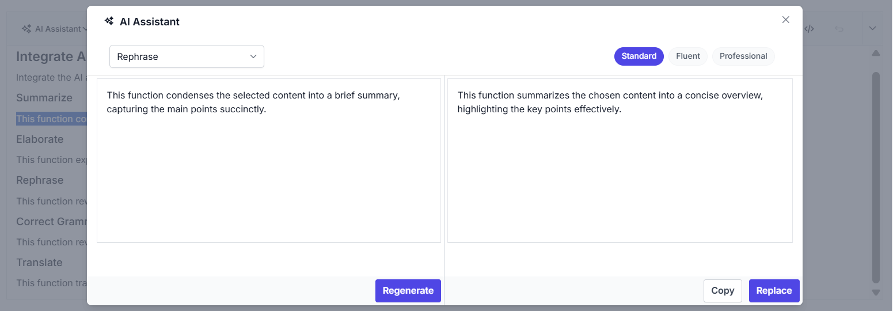

# AI-Powered Content Assistance in Blazor Rich Text Editor

This guide demonstrates how to use the [**Syncfusion.Blazor.AI**](https://www.nuget.org/packages/Syncfusion.Blazor.AI) package to enhance content creation in the Syncfusion Blazor Rich Text Editor. The AI integration enables intelligent features such as grammar correction, summarization, elaboration, translation, and rephrasing. These capabilities are powered by AI models hosted via services like OpenAI, Azure OpenAI, or Ollama.

## Prerequisites

Ensure the following NuGet packages are installed based on your chosen AI service:

### For OpenAI
- **Microsoft.Extensions.AI**
- **Microsoft.Extensions.AI.OpenAI**

### For Azure OpenAI
- **Microsoft.Extensions.AI**
- **Microsoft.Extensions.AI.OpenAI**
- **Azure.AI.OpenAI**

### For Ollama
- **Microsoft.Extensions.AI**
- **OllamaSharp**




Install-Package Syncfusion.Blazor.RichTextEditor -Version {{ site.releaseversion }}
Install-Package Syncfusion.Blazor.Themes -Version {{ site.releaseversion }}
Install-Package Syncfusion.Blazor.AI -Version {{ site.releaseversion }}
Install-Package Microsoft.Extensions.AI
Install-Package Microsoft.Extensions.AI.OpenAI  # For OpenAI or Azure OpenAI
Install-Package Azure.AI.OpenAI  # For Azure OpenAI
Install-Package OllamaSharp  # For Ollama




## Add Stylesheet and Script Resources

Include the theme stylesheet and script from NuGet via [Static Web Assets](https://blazor.syncfusion.com/documentation/appearance/themes#static-web-assets) in the `<head>` of your main page:

- For **.NET 6** Blazor Server apps, add to **~/Pages/_Layout.cshtml**.
- For **.NET 8 or .NET 9** Blazor Server apps, add to **~/Components/App.razor**.

```html
<head>
    <link href="_content/Syncfusion.Blazor.Themes/tailwind.css" rel="stylesheet" />
</head>
<body>
    <script src="_content/Syncfusion.Blazor.Core/scripts/syncfusion-blazor.min.js" type="text/javascript"></script>
</body>
```

N> Explore the [Blazor Themes](https://blazor.syncfusion.com/documentation/appearance/themes) topic for methods to reference themes ([Static Web Assets](https://blazor.syncfusion.com/documentation/appearance/themes#static-web-assets), [CDN](https://blazor.syncfusion.com/documentation/appearance/themes#cdn-reference), or [CRG](https://blazor.syncfusion.com/documentation/common/custom-resource-generator)). Refer to the [Adding Script Reference](https://blazor.syncfusion.com/documentation/common/adding-script-references) topic for different approaches to adding script references in your Blazor application.

## Configure AI Service

Choose one of the following AI services (OpenAI, Azure OpenAI, or Ollama) based on your requirements:
- **OpenAI**: Best for cloud-based, general-purpose AI models with minimal setup.
- **Azure OpenAI**: Ideal for enterprise-grade deployments with enhanced security and scalability.
- **Ollama**: Suitable for self-hosted, privacy-focused AI models.

Follow the instructions for your selected service to register the AI model in your application.

### OpenAI

Generate an API key from OpenAI and set `openAIApiKey`. Specify the desired model (e.g., `gpt-3.5-turbo`, `gpt-4`) in `openAIModel`.

- Install the required NuGet packages:




Install-Package Microsoft.Extensions.AI
Install-Package Microsoft.Extensions.AI.OpenAI




- Add the following to the **~/Program.cs** file in your Blazor WebApp:




using Syncfusion.Blazor.AI;
using Microsoft.Extensions.AI;
using OpenAI;

var builder = WebApplication.CreateBuilder(args);

string openAIApiKey = "API-KEY";
string openAIModel = "OPENAI_MODEL";
OpenAIClient openAIClient = new OpenAIClient(openAIApiKey);
IChatClient openAIChatClient = openAIClient.GetChatClient(openAIModel).AsIChatClient();
builder.Services.AddChatClient(openAIChatClient);
builder.Services.AddSingleton<IChatInferenceService, SyncfusionAIService>();

var app = builder.Build();




### Azure OpenAI

Deploy an Azure OpenAI Service resource and model as described in [Microsoft's documentation](https://learn.microsoft.com/en-us/azure/ai-services/openai/how-to/create-resource). Obtain values for `azureOpenAIKey`, `azureOpenAIEndpoint`, and `azureOpenAIModel`.

- Install the required NuGet packages:




Install-Package Microsoft.Extensions.AI
Install-Package Microsoft.Extensions.AI.OpenAI
Install-Package Azure.AI.OpenAI




- Add the following to the **~/Program.cs** file in your Blazor WebApp:




using Syncfusion.Blazor.AI;
using Azure.AI.OpenAI;
using Microsoft.Extensions.AI;
using System.ClientModel;

var builder = WebApplication.CreateBuilder(args);

string azureOpenAIKey = "AZURE_OPENAI_KEY";
string azureOpenAIEndpoint = "AZURE_OPENAI_ENDPOINT";
string azureOpenAIModel = "AZURE_OPENAI_MODEL";
AzureOpenAIClient azureOpenAIClient = new AzureOpenAIClient(
     new Uri(azureOpenAIEndpoint),
     new ApiKeyCredential(azureOpenAIKey)
);
IChatClient azureOpenAIChatClient = azureOpenAIClient.GetChatClient(azureOpenAIModel).AsIChatClient();
builder.Services.AddChatClient(azureOpenAIChatClient);
builder.Services.AddSingleton<IChatInferenceService, SyncfusionAIService>();

var app = builder.Build();




### Ollama

To use Ollama for self-hosted AI models:

1. **Download and install Ollama**: Visit [Ollama's official website](https://ollama.com) and install the application for your operating system.
2. **Install a model**: Choose a model from the [Ollama Library](https://ollama.com/library) (e.g., `llama2:13b`, `mistral:7b`).
3. **Configure the application**: Provide the `Endpoint` URL (e.g., `http://localhost:11434`) and `ModelName` (e.g., `llama2:13b`).

- Install the required NuGet packages:




Install-Package Microsoft.Extensions.AI
Install-Package OllamaSharp




- Add the following to the **~/Program.cs** file in your Blazor WebApp:




using Syncfusion.Blazor.AI;
using Microsoft.Extensions.AI;
using OllamaSharp;

var builder = WebApplication.CreateBuilder(args);

string ModelName = "MODEL_NAME";
IChatClient chatClient = new OllamaApiClient("http://localhost:11434", ModelName);
builder.Services.AddChatClient(chatClient);
builder.Services.AddSingleton<IChatInferenceService, SyncfusionAIService>();

var app = builder.Build();




- **Verify connectivity**: Ensure the Ollama server is running and accessible at the specified endpoint (e.g., `http://localhost:11434`) before starting the application.

## Register Syncfusion Blazor Service

Add the Syncfusion Blazor service to your **~/Program.cs** file. The configuration depends on your app's **Interactive Render Mode**:

- **Server Mode**: Register the service in the single **~/Program.cs** file.
- **WebAssembly or Auto Mode**: Register the service in both the server-side **~/Program.cs** and client-side **~/Program.cs** files.




using Syncfusion.Blazor;

var builder = WebApplication.CreateBuilder(args);

builder.Services.AddRazorComponents()
    .AddInteractiveServerComponents()
    .AddInteractiveWebAssemblyComponents();
builder.Services.AddSyncfusionBlazor();

var app = builder.Build();




using Syncfusion.Blazor;

var builder = WebAssemblyHostBuilder.CreateDefault(args);
builder.Services.AddSyncfusionBlazor();

await builder.Build().RunAsync();




## AI-powered Rich Text Editor in Blazor

This guide explains how to integrate a full-featured AI writing assistant into the Blazor Rich Text Editor using Azure OpenAI (via Semantic Kernel). The implementation supports **Rephrase**, **Correct Grammar**, **Summarize**, **Elaborate**, and **Translate** with live preview, dynamic tone and language controls, skeleton loading, and safe content replacement with undo support.

### How the Custom Toolbar is Rendered

The toolbar uses [RichTextEditorCustomToolbarItems](https://help.syncfusion.com/cr/blazor/Syncfusion.Blazor.RichTextEditor.RichTextEditorCustomToolbarItems.html) to inject a custom item named AI.

Inside the template, an `SfDropDownButton` is rendered with:

- **Icon**: AI icon (e-icons e-ai-chat)
- **Dropdown Items**: Rephrase, Grammar, Summarize, Elaborate, Translate
- **Event Binding**: ItemSelected="AIQuerySelectedMenu" triggers the AI workflow when an option is selected.

An additional `SfButton` for **Rephrase** is provided for quick access.




<RichTextEditorCustomToolbarItems>
    <!-- AI Assistant Dropdown -->
    <RichTextEditorCustomToolbarItem Name="AIAssistant">
        <Template>
            <SfDropDownButton CssClass="menubutton e-tbar-btn e-tbar-btn-text" IconCss="e-icons e-ai-chat e-btn-icon e-icon-left" Content="AI Assistant" Disabled="@enabelAIAssitantButton">
                <!-- Event triggered when an AI option is selected -->
                <DropDownButtonEvents ItemSelected="AIQuerySelectedMenu" />
                <!-- Dropdown menu items for AI actions -->
                <DropDownMenuItems>
                    <DropDownMenuItem Text="Rephrase"></DropDownMenuItem>
                    <DropDownMenuItem Text="Correct Grammar"></DropDownMenuItem>
                    <DropDownMenuItem Text="Summarize"></DropDownMenuItem>
                    <DropDownMenuItem Text="Elaborate"></DropDownMenuItem>
                    <DropDownMenuItem Text="Translate"></DropDownMenuItem>
                </DropDownMenuItems>
            </SfDropDownButton>
        </Template>
    </RichTextEditorCustomToolbarItem>
    <!-- Optional: Direct Rephrase Button -->
    <RichTextEditorCustomToolbarItem Name="Rephrase">
        <Template>
            <SfButton CssClass="@ButtonClass" @onclick="Rephrase" Disabled="@enabelAIAssitantButton">
                <div class="e-tbar-btn-text">Rephrase</div>
            </SfButton>
        </Template>
    </RichTextEditorCustomToolbarItem>
</RichTextEditorCustomToolbarItems>




###  AI Assistant Dialog – Layout and Dynamic Controls

The AI Assistant dialog provides a responsive, user-friendly interface for interacting with AI-generated content. It is designed as a modal dialog that overlays the editor and ensures proper z-index stacking for seamless integration.

#### Dialog Structure

The dialog is divided into two main rows:

**Row 1:** Action Selection and Dynamic Controls

- **Action Dropdown:** Allows users to switch between AI actions (Rephrase, Grammar, Summarize, Elaborate, Translate).
- **Dynamic Controls:**
    - **Tone Chips** (Standard, Fluent, Professional) appear when the selected action is Rephrase.
    - **Language Dropdown** (15+ languages) appears when the selected action is Translate.

**Row 2:** Original Text vs AI Result

- **Left Panel:** Displays the original selected text in a read-only Rich Text Editor.
- **Right Panel:** Shows AI-generated content in another Rich Text Editor.
- **Loading State:** While AI processes the request, a progressive skeleton loader animates from 100% to 10% width for visual feedback.
- **Fallback State:** If no result is returned, a “No results found” message with a warning icon is displayed.

**Footer Actions**

- **Regenerate:** Requests a new AI output for the same prompt.
- **Copy:** Copies the AI-generated content to the clipboard.
- **Replace:** Inserts the AI-generated content back into the original editor with undo support.




<SfDialog @bind-Visible="@dialogVisible" AllowPrerender="true" CssClass="e-rte-elements custom-dialog" ZIndex="1000" ShowCloseIcon="true" IsModal="true" Width="80%" Height="100%" Target="#rteSection">
    <DialogTemplates>
        <!-- Header Template -->
        <Header> 
            <span class="e-icons e-ai-chat e-btn-icon e-icon-left"></span> AI Assistant 
        </Header>
        <!-- Content Template -->
        <Content>
            <!-- Row 1: Action Dropdown and Options -->       
            <div class="custom-row-0">
                <div class="col-12 col-md-3 d-flex justify-content-start align-items-center">
                    <div class="w-100">
                        <!-- Dropdown for selecting AI action -->
                        <SfDropDownList CssClass="e-round-corner" TItem="SubQuery" TValue="string" DataSource="@QueryList" @bind-Value="@dropVal" Enabled="@(!enabelRegenerateContentButton)">
                            <DropDownListEvents TItem="SubQuery" TValue="string" />
                            <DropDownListFieldSettings Text="Text" Value="ID" />
                            <DropDownListEvents TValue="string" TItem="SubQuery" ValueChange="AIQuerySelectedDropdownList"></DropDownListEvents>
                        </SfDropDownList>
                    </div>
                </div>
                <!-- Dynamic controls for tone or language -->
                <div class="col-12 col-md-9 mt-9 mt-md-0 d-flex justify-content-end align-items-center">
                    @if (this.enableRephraseChips)
                    {
                        <!-- Chips for tone selection when Rephrase is chosen -->
                        <SfChip CssClass="e-custom" Selection="SelectionType.Single" @bind-SelectedChips="@chipValue">
                            <ChipItems>
                                <ChipItem Text="Standard" CssClass="e-custom"></ChipItem>
                                <ChipItem Text="Fluent" CssClass="e-custom"></ChipItem>
                                <ChipItem Text="Professional" CssClass="e-custom"></ChipItem>
                            </ChipItems>
                            <ChipEvents SelectionChanged="SelectedChipsChanged"></ChipEvents>
                        </SfChip>
                    }
                    else if (this.enableLanguageList)
                    {
                        <div class="col-3 col-md-3 mt-3 mt-md-0 d-flex cuscol justify-content-end align-items-center">
                            <span>Target Language</span>
                        </div>
                        <div class="col-3 col-md-3 mt-3 mt-md-0 d-flex justify-content-end align-items-center">
                          <!-- Dropdown for language selection when Translate is chosen -->
                            <SfDropDownList CssClass="e-round-corner" TItem="Languages" TValue="string" DataSource="@LanguageList" @bind-Value="@translatelanguage">
                                <DropDownListFieldSettings Text="Text" Value="ID" />
                                <DropDownListEvents TValue="string" TItem="Languages" ValueChange="AITranslateDropdownList"></DropDownListEvents>
                            </SfDropDownList>
                        </div>
                    }
                </div>
            </div>
            <!-- Row 2: Original Text vs AI Result -->
            <div class="custom-row-1">
                <div class="col-12 col-md-6 d-flex cuscol-1 justify-content-start">
                    <div class="w-100">
                        <!-- Left panel: Original text -->
                        <SfRichTextEditor Width="100%" Height="286px" @ref="leftRteChildObj" @bind-Value="promptQuery">
                            <RichTextEditorToolbarSettings Enable="false"></RichTextEditorToolbarSettings>
                        </SfRichTextEditor>
                    </div>
                </div>
                <!-- Right panel: AI-generated content or loader -->
                @if (!isContentGenerating)
                {
                    @if (noResultsFound)
                    {
                        <!-- No results message -->
                        <div class="col-12 col-md-6 mt-6 mt-md-0 d-flex cuscol-2 cuscol-noresult justify-content-center">
                            <div class="w-100">
                                <div class="no-results-found">
                                    <span class="e-icons e-warning"></span>
                                    <div>No results found</div>
                                </div>
                            </div>
                        </div>
                    }
                    else {
                        <div class="col-12 col-md-6 mt-6 mt-md-0 d-flex cuscol-2 justify-content-start">
                            <div class="w-100">
                              <!-- Display AI-generated content -->
                                <SfRichTextEditor Width="100%" Height="286px" @ref="rightRteChildObj" @bind-Value="AIResult">
                                    <RichTextEditorToolbarSettings Enable="false"></RichTextEditorToolbarSettings>
                                </SfRichTextEditor>
                            </div>
                        </div>
                    }
                } else {
                    <div class="col-12 col-md-6 mt-6 mt-md-0 d-flex cuscol-2 justify-content-start">
                        <div class="w-100">
                            <div class="content-preparing">
                            <!-- Skeleton loader while AI response is being generated -->
                                <SfSkeleton CssClass="skeleton-rectangle" Shape=SkeletonType.Rectangle Width="100%" Height="20px"></SfSkeleton><br />
                                <SfSkeleton CssClass="skeleton-rectangle" Shape=SkeletonType.Rectangle Width="90%" Height="20px"></SfSkeleton><br />
                                <SfSkeleton CssClass="skeleton-rectangle" Shape=SkeletonType.Rectangle Width="70%" Height="20px"></SfSkeleton><br />
                                <SfSkeleton CssClass="skeleton-rectangle" Shape=SkeletonType.Rectangle Width="50%" Height="20px"></SfSkeleton><br />
                                <SfSkeleton CssClass="skeleton-rectangle" Shape=SkeletonType.Rectangle Width="30%" Height="20px"></SfSkeleton><br />
                                <SfSkeleton CssClass="skeleton-rectangle" Shape=SkeletonType.Rectangle Width="10%" Height="20px"></SfSkeleton>
                            </div>
                        </div>
                    </div>
                }
            </div>
        </Content>
        <!-- Footer Template -->
        <FooterTemplate>
            <div class="custom-row-2">
                <div class="col-12 col-md-6 d-flex cuscol-0 justify-content-end align-items-center">
                    <div class="w-100">
                        <!-- Regenerate button -->
                        <SfButton Disabled="@enabelRegenerateContentButton" IsPrimary="true" @onclick="RegenerateContent">Regenerate</SfButton>
                    </div>
                </div>
                <div class="col-12 col-md-6 mt-6 mt-md-0 cuscol-01 d-flex justify-content-end align-items-center">
                    @if (!string.IsNullOrEmpty(sentiment)) {
                        <button class="e-btn e-control e-info sentiment" id="info_Toast" disabled>@sentiment</button>
                    }
                    <!-- Copy and Replace buttons -->
                    <SfButton Disabled="@enabelContentButton" @onclick="CopyContent">Copy</SfButton>
                    <SfButton Disabled="@enabelContentButton" IsPrimary="true" @onclick="ReplaceContent">Replace</SfButton>
                </div>
            </div>
        </FooterTemplate>
    </DialogTemplates>
    <DialogEvents Closed="CloseDialog" OnOverlayModalClick="CloseDialog"/>
</SfDialog>




### Opening the AI Dialog and Preserving Selection

The `DialogueOpen()` method opens the AI dialog when an action is selected and prepares the editor for processing. It first uses `GetSelectedHtmlAsync()` to capture the highlighted content with its formatting. If no text is selected, a toast message alerts the user to select content before proceeding. 

When valid text is found, the method makes the dialog visible, stores the selected HTML for AI processing, and calls `SaveSelectionAsync()` to preserve the cursor position so the AI output can replace only the selected text later. It then refreshes the dialog’s editor and updates AI suggestions based on the chosen action.


```csharp
private async Task Rephrase()
{
    // Directly open dialog for Rephrase action
    await DialogueOpen("Rephrase");
}
private async Task AIQuerySelectedMenu(MenuEventArgs args)
{
    // Open dialog based on selected dropdown item
    await DialogueOpen(args.Item.Text);
}
private async Task DialogueOpen(string selectedQuery)
{
    // Get the selected text from the RichTextEditor
    var selectionText = await rteObj.GetSelectedHtmlAsync();
    
    if (!string.IsNullOrEmpty(selectionText))
    {
        // Make the dialog visible
        dialogVisible = true;

        // Identify the selected query and map it to its ID

        dropVal = QueryList.FirstOrDefault(q => q.Text.Equals(selectedQuery, StringComparison.OrdinalIgnoreCase))?.ID;
        
        // Store the selected text for AI processing
        promptQuery = selectionText;
        
        // Save the current selection so AI output can be inserted later
        await this.rteObj.SaveSelectionAsync();

        // Refresh the left-side RichTextEditor in the dialog to show original text
        await this.leftRteChildObj.RefreshUIAsync();
        
        // Update AI suggestions based on the selected query
        await UpdateAISuggestionsData(selectedQuery);
    }
    else
    {
        // Show a toast notification if no text is selected
        await this.ToastObj.ShowAsync(new ToastModel { ContentTemplate = @GetTemplate(true), ShowCloseButton = true, Timeout = 0 });
    }
}

```

### Building and Sending the AI 

The AI prompt is built in two parts: **user intent** and **system instruction**. 

1. **User Intent (subQuery)** - Defines what the AI should do, such as summarizing, rephrasing with a specific tone, or translating into a target language. This makes the prompt context-aware and action-specific. 

2. **System Instruction (HTML preservation)** - Enforces formatting rules, for example: “Retain existing HTML structure. Modify content only.” This ensures that the AI preserves elements like bold text, lists, and links while updating the content. 

Both parts are combined and sent to `semanticKernelAI.GetCompletionAsync()` via Semantic Kernel, resulting in an AI-generated output that is accurate and safe to insert back into the editor.

```csharp

private async Task UpdateAISuggestionsData(string selectedQuery)
{
    enableRephraseChips = false;
    enableLanguageList = false;
    isSentimentCheck = false;
    switch (selectedQuery)
    {
        case "Summarize":
            subQuery = "Briefly summarize the following text in a short and concise manner.";
            break;
        case "Elaborate":
            subQuery = "Elaborate/Expand on the following text, providing more detail and context.";
            break;
        case "Rephrase":
            enableRephraseChips = true;
            enableLanguageList = false;
            subQuery = $"Rephrase the following text in a {chipValue[0]} [tone/style], ensuring clarity and maintaining the original meaning.";
            break;
        case "Correct Grammar":
            subQuery = "Correct any grammatical errors in the following text, ensuring it is clear and well-structured.";
            break;
        case "Translate":
            enableLanguageList = true;
            enableRephraseChips = false;
            subQuery = $"Translate the following text into {translatelanguage}, preserving the original meaning and tone.";
            break;
    }
    UpdateAISuggestionsData();
}

private async Task UpdateAISuggestionsData()
{
    try
    {
        if (!string.IsNullOrEmpty(promptQuery))
        {
            enabelRegenerateContentButton = isContentGenerating = enabelContentButton = true;
            string systemPrompt = subQuery.Contains("emoji followed by the sentiment in the format") ? "You are a helpful assistant. Please respond in string format." : "NOTE:Please retain the existing HTML structure and modify the content only. Ensure that the response adheres to the specified formatting.";
            apiResultData = await semanticKernelAI.GetCompletionAsync(promptQuery, false, false, (subQuery + systemPrompt));
            if (apiResultData != null)
            {
                isContentGenerating = false;
                sentiment = isSentimentCheck ? apiResultData.Replace("\"", "").Replace("'", "") : "";
                AIResult = isSentimentCheck ? promptQuery : apiResultData;
                noResultsFound = string.IsNullOrEmpty(AIResult) || string.IsNullOrEmpty(promptQuery);
                enabelRegenerateContentButton = enabelContentButton = noResultsFound;
                await InvokeAsync(StateHasChanged);
            }
            else
            {
                isContentGenerating = false;
                await InvokeAsync(StateHasChanged);
            }
        }
    }
    catch
    {
        await this.ToastObj.ShowAsync(new ToastModel { ContentTemplate = @GetTemplate(), ShowCloseButton = true, Timeout = 0 });
    }
}

```

### Replacing AI Result Back into the Editor (with Undo Support)

Once the AI-generated content is ready, it needs to be inserted exactly where the user originally selected text, without disturbing the rest of the document. This is achieved using the [ExecuteCommandAsync](https://help.syncfusion.com/cr/blazor/Syncfusion.Blazor.RichTextEditor.SfRichTextEditor.html#Syncfusion_Blazor_RichTextEditor_SfRichTextEditor_ExecuteCommandAsync_Syncfusion_Blazor_RichTextEditor_CommandName_System_String_Syncfusion_Blazor_RichTextEditor_ExecuteCommandOption_) method with the `InsertHTML` command. The `Undo` option is enabled to allow users to revert changes if needed.

Additionally, users can copy the AI-generated content to the clipboard for use elsewhere. This is handled via a `JavaScript interop` function that copies plain text extracted from the AI result.




<FooterTemplate>
    <SfButton Disabled="@enabelContentButton" @onclick="CopyContent">Copy</SfButton>
    <SfButton Disabled="@enabelContentButton" IsPrimary="true" @onclick="ReplaceContent">Replace</SfButton>
</FooterTemplate>




```csharp

private async Task ReplaceContent()
{
    ExecuteCommandOption executeCommandOption = new ExecuteCommandOption();
    executeCommandOption.Undo = true;
    await this.rteObj.RestoreSelectionAsync(); // Return to original selection
    await this.rteObj.ExecuteCommandAsync(CommandName.InsertHTML, this.apiResultData, executeCommandOption);
    await CloseDialog();
}
private async Task CopyContent()
{
    await JSRuntime.InvokeVoidAsync("copyToClipboard", Markdig.Markdown.ToPlainText(AIResult, pipeline));
}

```

<script>
    function copyToClipboard(text) {
        const tempElement = document.createElement('div');
        tempElement.innerHTML = text;
        document.body.appendChild(tempElement);

        // Select the content of the temporary element
        const range = document.createRange();
        range.selectNodeContents(tempElement);
        const selection = window.getSelection();
        selection.removeAllRanges();
        selection.addRange(range);

        // Execute the copy command
        try {
            const successful = document.execCommand('copy');
            if (successful) {
                console.log('HTML copied to clipboard!');
            } else {
                console.log('Failed to copy HTML.');
            }
        } catch (err) {
            console.error('Error copying HTML to clipboard: ', err);
        }

        // Clean up by removing the temporary element
        document.body.removeChild(tempElement);
        selection.removeAllRanges();
    }
</script>

## Workflow Summary

Select text → Choose AI action → Dialog opens → AI processes → Updated content displayed → User copies or replaces content.

## Sample Code

A complete working example is available in the [Syncfusion Blazor AI Samples GitHub repository](https://github.com/syncfusion/smart-ai-samples).



## Error Handling and Troubleshooting

If the AI service fails to return a valid response, the Rich Text Editor will display an error message ("Oops! Please try again!"). Common issues include:

- **Invalid API Key or Endpoint**: Verify that the `openAIApiKey`, `azureOpenAIKey`, or Ollama `Endpoint` is correct and the service is accessible.
- **Model Unavailable**: Ensure the specified `openAIModel`, `azureOpenAIModel`, or `ModelName` is deployed and supported.
- **Network Issues**: Check connectivity to the AI service endpoint, especially for self-hosted Ollama instances.
- **Large Prompts**: Processing large text inputs may cause timeouts. Consider reducing the prompt size or optimizing the request for efficiency.
