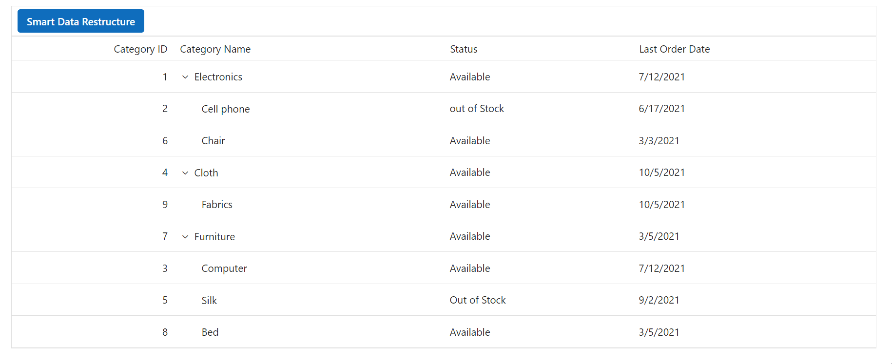

# Data Restructuring with Blazor TreeGrid and Ollama

This guide demonstrates how to use the [**Syncfusion.Blazor.AI**](https://www.nuget.org/packages/Syncfusion.Blazor.AI) package to automatically organize hierarchical data in a Syncfusion Blazor TreeGrid component. The [**Syncfusion.Blazor.AI**](https://www.nuget.org/packages/Syncfusion.Blazor.AI) package enables integration with AI models to process and structure data, while Ollama provides self-hosted or cloud-based AI capabilities for analyzing relationships in datasets. In this example, the application assigns appropriate `ParentId` values based on `CategoryName` relationships, dynamically updating the TreeGrid to reflect the corrected hierarchical structure.

## Prerequisites

Ensure the following NuGet packages are installed based on your chosen AI service:

### For OpenAI
- **Microsoft.Extensions.AI**
- **Microsoft.Extensions.AI.OpenAI**

### For Azure OpenAI
- **Microsoft.Extensions.AI**
- **Microsoft.Extensions.AI.OpenAI**
- **Azure.AI.OpenAI** 

### For Ollama
- **Microsoft.Extensions.AI**
- **OllamaSharp**




Install-Package Syncfusion.Blazor.TreeGrid -Version {{ site.releaseversion }}
Install-Package Syncfusion.Blazor.Themes -Version {{ site.releaseversion }}
Install-Package Syncfusion.Blazor.AI -Version {{ site.releaseversion }}
Install-Package Microsoft.Extensions.AI
Install-Package Microsoft.Extensions.AI.OpenAI  # For OpenAI or Azure OpenAI
Install-Package Azure.AI.OpenAI  # For Azure OpenAI
Install-Package OllamaSharp  # For Ollama




## Add Stylesheet and Script Resources

Include the theme stylesheet and script from NuGet via [Static Web Assets](https://blazor.syncfusion.com/documentation/appearance/themes#static-web-assets) in the `<head>` of your main page:

- For **.NET 6** Blazor Server apps, add to **~/Pages/_Layout.cshtml**.
- For **.NET 8 or .NET 9** Blazor Server apps, add to **~/Components/App.razor**.

```html
<head>
    <link href="_content/Syncfusion.Blazor.Themes/tailwind.css" rel="stylesheet" />
</head>
<body>
    <script src="_content/Syncfusion.Blazor.Core/scripts/syncfusion-blazor.min.js" type="text/javascript"></script>
</body>
```

N> Explore the [Blazor Themes](https://blazor.syncfusion.com/documentation/appearance/themes) topic for methods to reference themes ([Static Web Assets](https://blazor.syncfusion.com/documentation/appearance/themes#static-web-assets), [CDN](https://blazor.syncfusion.com/documentation/appearance/themes#cdn-reference), or [CRG](https://blazor.syncfusion.com/documentation/common/custom-resource-generator)). Refer to the [Adding Script Reference](https://blazor.syncfusion.com/documentation/common/adding-script-references) topic for different approaches to adding script references in your Blazor application.

## Configure AI Service

Choose one of the following AI services (OpenAI, Azure OpenAI, or Ollama) based on your requirements:
- **OpenAI**: Best for cloud-based, general-purpose AI models with minimal setup.
- **Azure OpenAI**: Ideal for enterprise-grade deployments with enhanced security and scalability.
- **Ollama**: Suitable for self-hosted, privacy-focused AI models.

Follow the instructions for your selected service to register the AI model in your application.

### OpenAI

Generate an API key from OpenAI and set `openAIApiKey`. Specify the desired model (e.g., `gpt-3.5-turbo`, `gpt-4`) in `openAIModel`.

- Install the required NuGet packages:




Install-Package Microsoft.Extensions.AI
Install-Package Microsoft.Extensions.AI.OpenAI




- Add the following to the **~/Program.cs** file in your Blazor WebApp:




using Syncfusion.Blazor.AI;
using Microsoft.Extensions.AI;
using OpenAI;

var builder = WebApplication.CreateBuilder(args);

string openAIApiKey = "API-KEY";
string openAIModel = "OPENAI_MODEL";
OpenAIClient openAIClient = new OpenAIClient(openAIApiKey);
IChatClient openAIChatClient = openAIClient.GetChatClient(openAIModel).AsIChatClient();
builder.Services.AddChatClient(openAIChatClient);
builder.Services.AddSingleton<IChatInferenceService, SyncfusionAIService>();

var app = builder.Build();




### Azure OpenAI

Deploy an Azure OpenAI Service resource and model as described in [Microsoft's documentation](https://learn.microsoft.com/en-us/azure/ai-services/openai/how-to/create-resource). Obtain values for `azureOpenAIKey`, `azureOpenAIEndpoint`, and `azureOpenAIModel`.

- Install the required NuGet packages:




Install-Package Microsoft.Extensions.AI
Install-Package Microsoft.Extensions.AI.OpenAI
Install-Package Azure.AI.OpenAI




- Add the following to the **~/Program.cs** file in your Blazor WebApp:




using Syncfusion.Blazor.AI;
using Azure.AI.OpenAI;
using Microsoft.Extensions.AI;
using System.ClientModel;

var builder = WebApplication.CreateBuilder(args);

string azureOpenAIKey = "AZURE_OPENAI_KEY";
string azureOpenAIEndpoint = "AZURE_OPENAI_ENDPOINT";
string azureOpenAIModel = "AZURE_OPENAI_MODEL";
AzureOpenAIClient azureOpenAIClient = new AzureOpenAIClient(
     new Uri(azureOpenAIEndpoint),
     new ApiKeyCredential(azureOpenAIKey)
);
IChatClient azureOpenAIChatClient = azureOpenAIClient.GetChatClient(azureOpenAIModel).AsIChatClient();
builder.Services.AddChatClient(azureOpenAIChatClient);
builder.Services.AddSingleton<IChatInferenceService, SyncfusionAIService>();

var app = builder.Build();




### Ollama

To use Ollama for self-hosted AI models:

1. **Download and install Ollama**: Visit [Ollama's official website](https://ollama.com) and install the application for your operating system.
2. **Install a model**: Choose a model from the [Ollama Library](https://ollama.com/library) (e.g., `llama2:13b`, `mistral:7b`).
3. **Configure the application**: Provide the `Endpoint` URL (e.g., `http://localhost:11434`) and `ModelName` (e.g., `llama2:13b`).

- Install the required NuGet packages:




Install-Package Microsoft.Extensions.AI
Install-Package OllamaSharp




- Add the following to the **~/Program.cs** file in your Blazor WebApp:




using Syncfusion.Blazor.AI;
using Microsoft.Extensions.AI;
using OllamaSharp;

var builder = WebApplication.CreateBuilder(args);

string ModelName = "MODEL_NAME";
IChatClient chatClient = new OllamaApiClient("http://localhost:11434", ModelName);
builder.Services.AddChatClient(chatClient);
builder.Services.AddSingleton<IChatInferenceService, SyncfusionAIService>();

var app = builder.Build();




- **Verify connectivity**: Ensure the Ollama server is running and accessible at the specified endpoint (e.g., `http://localhost:11434`) before starting the application.

## Register Syncfusion Blazor Service

Add the Syncfusion Blazor service to your **~/Program.cs** file. The configuration depends on your app's **Interactive Render Mode**:

- **Server Mode**: Register the service in the single **~/Program.cs** file.
- **WebAssembly or Auto Mode**: Register the service in both the server-side **~/Program.cs** and client-side **~/Program.cs** files.




using Syncfusion.Blazor;

var builder = WebApplication.CreateBuilder(args);

builder.Services.AddRazorComponents()
    .AddInteractiveServerComponents()
    .AddInteractiveWebAssemblyComponents();
builder.Services.AddSyncfusionBlazor();

var app = builder.Build();




using Syncfusion.Blazor;

var builder = WebAssemblyHostBuilder.CreateDefault(args);
builder.Services.AddSyncfusionBlazor();

await builder.Build().RunAsync();




## Razor Component (`Home.razor`)

This section implements the Syncfusion Blazor TreeGrid with AI-driven data restructuring using the AI model to assign `ParentId` values based on `CategoryName` relationships.

```csharp
@page "/"

@inject IChatInferenceService AIService
@using Syncfusion.Blazor.TreeGrid
@using Syncfusion.Blazor.Navigations
@using Syncfusion.Blazor.Buttons
@using Syncfusion.Blazor.AI
@using System.Text.Json;

<div style="padding-bottom: 10px;">
    <span>@message</span>
</div>
<div style="width: 100%; position: relative">
    <SfTreeGrid @ref="TreeGrid" DataSource="@TreeGridData" IdMapping="CategoryId" ParentIdMapping="ParentId" TreeColumnIndex="1">
        <TreeGridEditSettings AllowEditing="true" />
        <TreeGridColumns>
            <TreeGridColumn Field="CategoryId" HeaderText="Category ID" IsPrimaryKey="true" Width="60" TextAlign="Syncfusion.Blazor.Grids.TextAlign.Right"></TreeGridColumn>
            <TreeGridColumn Field="CategoryName" HeaderText="Category Name" Width="100"></TreeGridColumn>
            <TreeGridColumn Field="Status" HeaderText="Status" Width="70"></TreeGridColumn>
            <TreeGridColumn Field="OrderDate" HeaderText="Last Order Date" Format="d" Width="90"></TreeGridColumn>
        </TreeGridColumns>
        <SfToolbar ID="TreeGrid_AISample_Toolbar">
            <ToolbarItems>
                <ToolbarItem>
                    <Template>
                        <SfButton IsPrimary ID="openAI" @onclick="OpenAIHandler">Smart Data Restructure</SfButton>
                    </Template>
                </ToolbarItem>
            </ToolbarItems>
        </SfToolbar>
    </SfTreeGrid>
</div>
```

`Home.razor.cs`
```csharp
using Microsoft.Extensions.AI;
using Syncfusion.Blazor.AI;
using Syncfusion.Blazor.TreeGrid;
using System.Text.Json;

namespace AISamples.Components.Pages
{
    public partial class Home
    {
        public SfTreeGrid<TreeData.BusinessObject> TreeGrid;
        private string AIPrompt = string.Empty;
        private string message = string.Empty;
        public List<TreeData.BusinessObject> TreeGridData { get; set; }
        protected override void OnInitialized()
        {
            this.TreeGridData = TreeData.GetAdaptiveStructureData().ToList();
        }

        private async Task OpenAIHandler()
        {
            await TreeGrid.ShowSpinnerAsync();
            List<TreeData.BusinessObject> sortedCollection = new List<TreeData.BusinessObject>();
            var AIPrompt = GeneratePrompt(TreeGridData);
            ChatParameters chatParameters = new ChatParameters
            {
                Messages = new List<ChatMessage>
                {
                    new ChatMessage(ChatRole.User, AIPrompt)
                }
            };
            var result = await AIService.GenerateResponseAsync(chatParameters);
            result = result.Replace("```json", "").Replace("```", "").Trim();

            string response = JsonDocument.Parse(result).RootElement.GetProperty("TreeGridData").ToString();
            if (response is not null)
            {
                sortedCollection = JsonSerializer.Deserialize<List<TreeData.BusinessObject>>(response);
            }
            if (sortedCollection is not null && sortedCollection.Count > 0)
            {
                TreeGridData = sortedCollection.Cast<TreeData.BusinessObject>().ToList();
            }
            else
            {
                message = "Oops.! Please try Again !";
            }
            await TreeGrid.HideSpinnerAsync();
            await Task.CompletedTask;
        }

        private string GeneratePrompt(List<TreeData.BusinessObject> TreeGridData)
        {
            Dictionary<string, IEnumerable<object>> treeData = new Dictionary<string, IEnumerable<object>>();
            treeData.Add("TreeGridData", TreeGridData);
            var jsonData = JsonSerializer.Serialize(treeData);
            return @"I want you to act as a TreeGrid Data Organizer.
            Your task is to organize a dataset based on a hierarchical structure using 'CategoryId' and 'ParentId'.
            Each item in the dataset has a 'CategoryName' representing categories, and some categories have a null 'ParentId', indicating they are top-level categories. 
            Your role will be to examine the entire dataset to identify related items based on their 'CategoryName' values and nest them under the appropriate top-level categories by updating their 'ParentId' to match the 'CategoryId' of the corresponding top-level category.
            For example, if a category like 'Furniture' exists, you should examine the dataset for items such as 'Chair' and 'Table' and update their 'ParentId' to the 'CategoryId' of 'Furniture'.
            The output should be the newly prepared TreeGridData with correctly assigned 'ParentId' values. Please ensure that all subcategories are correctly nested under their respective top-level categories.
            Return the newly prepared TreeGridData alone and don't share any other information with the response: Here is the dataset " + jsonData + "/n Note: Return response must be in json string and with no other explanation. ";
        }
        public class TreeData
        {
            public class BusinessObject
            {
                public int CategoryId { get; set; }
                public string CategoryName { get; set; }
                public string Status { get; set; }
                public DateTime OrderDate { get; set; }
                public int? ParentId { get; set; }
            }

            public static List<BusinessObject> GetAdaptiveStructureData()
            {
                List<BusinessObject> BusinessObjectCollection = new List<BusinessObject>();
                BusinessObjectCollection.Add(new BusinessObject() { CategoryId = 1, CategoryName = "Electronics", Status = "Available", OrderDate = new DateTime(2021, 7, 12), ParentId = null });
                BusinessObjectCollection.Add(new BusinessObject() { CategoryId = 2, CategoryName = "Cell phone", Status = "out of Stock", OrderDate = new DateTime(2021, 6, 17), ParentId = 1 });
                BusinessObjectCollection.Add(new BusinessObject() { CategoryId = 3, CategoryName = "Computer", Status = "Available", OrderDate = new DateTime(2021, 7, 12), ParentId = 7 });
                BusinessObjectCollection.Add(new BusinessObject() { CategoryId = 4, CategoryName = "Cloth", Status = "Available", OrderDate = new DateTime(2021, 10, 5), ParentId = null });
                BusinessObjectCollection.Add(new BusinessObject() { CategoryId = 5, CategoryName = "Silk", Status = "Out of Stock", OrderDate = new DateTime(2021, 9, 2), ParentId = 7 });
                BusinessObjectCollection.Add(new BusinessObject() { CategoryId = 6, CategoryName = "Chair", Status = "Available", OrderDate = new DateTime(2021, 3, 3), ParentId = 1 });
                BusinessObjectCollection.Add(new BusinessObject() { CategoryId = 7, CategoryName = "Furniture", Status = "Available", OrderDate = new DateTime(2021, 3, 5), ParentId = null });
                BusinessObjectCollection.Add(new BusinessObject() { CategoryId = 8, CategoryName = "Bed", Status = "Available", OrderDate = new DateTime(2021, 3, 5), ParentId = 7 });
                BusinessObjectCollection.Add(new BusinessObject() { CategoryId = 9, CategoryName = "Fabrics", Status = "Available", OrderDate = new DateTime(2021, 10, 5), ParentId = 4 });
                return BusinessObjectCollection;
            }
        }
    }
}
```

## Error Handling and Troubleshooting

If the AI service fails to return a valid response, the TreeGrid will display an error message ("Oops! Please try again!"). Common issues include:

- **Invalid API Key or Endpoint**: Verify that the `openAIApiKey`, `azureOpenAIKey`, or Ollama `Endpoint` is correct and the service is accessible.
- **Model Unavailable**: Ensure the specified `openAIModel`, `azureOpenAIModel`, or `ModelName` is deployed and supported.
- **Network Issues**: Check connectivity to the AI service endpoint, especially for self-hosted Ollama instances.
- **Large Datasets**: Processing large datasets may cause timeouts. Consider batching data or optimizing the prompt for efficiency.

For further assistance, refer to the [Syncfusion Blazor Documentation](https://blazor.syncfusion.com/documentation) or the [Ollama Documentation](https://ollama.com/docs).

## Performance Considerations

When handling large datasets, ensure the Ollama server has sufficient resources (CPU/GPU) to process requests efficiently. For datasets exceeding 10,000 records, consider splitting the data into smaller batches to avoid performance bottlenecks. Test the application with your specific dataset to determine optimal performance.

## Sample Code

A complete working example is available in the [Syncfusion Blazor Samples GitHub repository](https://github.com/syncfusion/blazor-samples).

