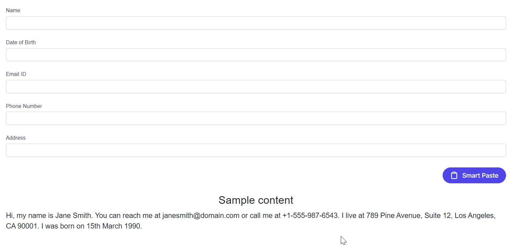

# Annotations in Blazor Smart Paste Button Component

The Syncfusion Blazor Smart Paste Button component leverages AI to intelligently parse clipboard content and populate form fields, enhancing user productivity. By default, the component analyzes form fields (e.g., `<input>`, `<select>`, `<textarea>`) using associated `<label>`, `name`, `id`, or adjacent text to generate descriptions for the AI model (OpenAI or Azure OpenAI). These descriptions guide the AI in mapping clipboard data to the correct fields. For greater control, you can override this behavior by using the `data-smartpaste-description` attribute to provide custom instructions for specific fields, ensuring precise data parsing (e.g., enforcing a date format).

## Annotating Form Fields

Use the `data-smartpaste-description` attribute to provide custom instructions for specific form fields, overriding the default AI-generated descriptions. This is particularly useful for fields requiring specific formats, such as dates or custom data types. The example below demonstrates annotating a Date of Birth field to enforce a `DD-MM-YYYY` format within a `SfDataForm`, which maps form fields to clipboard data processed by the AI.

```razor
@using Syncfusion.Blazor.DataForm
@using Syncfusion.Blazor.SmartComponents
@using Syncfusion.Blazor.Inputs
@using System.ComponentModel.DataAnnotations

<SfDataForm ID="MyForm" Model="@EventRegistrationModel">
    <FormValidator>
        <DataAnnotationsValidator></DataAnnotationsValidator>
    </FormValidator>
    <FormItems>
        <FormItem Field="@nameof(EventRegistration.Name)" ID="firstname"></FormItem>
        <FormItem Field="@nameof(EventRegistration.DateOfBirth)">
            <Template>
                <label class="e-form-label">Date of Birth</label>
                <SfTextBox HtmlAttributes="@DateOfBirth" ID="dateofbirth" />
            </Template>
        </FormItem>
        <FormItem Field="@nameof(EventRegistration.Email)" ID="email"></FormItem>
        <FormItem Field="@nameof(EventRegistration.Phone)" ID="phonenumber"></FormItem>
        <FormItem Field="@nameof(EventRegistration.Address)" ID="address"></FormItem>
    </FormItems>
    <FormButtons>
        <SfSmartPasteButton IsPrimary="true" Content="Smart Paste" IconCss="e-icons e-paste"></SfSmartPasteButton>
    </FormButtons>
</SfDataForm>

<br>
<h4 style="text-align:center;">Sample Content</h4>
<div>
    Hi, my name is Jane Smith. You can reach me at example@domain.com or call me at +1-555-987-6543. I live at 789 Pine Avenue, Suite 12, Los Angeles, CA 90001. I was born on 15th March 1990.
</div>

@code {
    private EventRegistration EventRegistrationModel = new();

    private Dictionary<string, object> DateOfBirth = new()
    {
        { "data-smartpaste-description", "Date must follow the format: DD-MM-YYYY" }
    };

    public class EventRegistration
    {
        [Required(ErrorMessage = "Please enter your name.")]
        [Display(Name = "Name")]
        public string Name { get; set; }

        [Required(ErrorMessage = "Please enter your email address.")]
        [Display(Name = "Email ID")]
        public string Email { get; set; }

        [Required(ErrorMessage = "Please enter your mobile number.")]
        [Display(Name = "Phone Number")]
        public string Phone { get; set; }

        [Required(ErrorMessage = "Please enter your address.")]
        [Display(Name = "Address")]
        public string Address { get; set; }

        [Required(ErrorMessage = "Please enter your date of birth.")]
        [Display(Name = "Date Of Birth")]
        public string DateOfBirth { get; set; }
    }
}
```

N> In this example, the [Syncfusion<sup style="font-size:70%">&reg;</sup> Blazor DataForm](https://blazor.syncfusion.com/documentation/data-form/getting-started-with-web-app) component is used to manage form input fields. To get started, ensure you have the [Syncfusion.Blazor.DataForm](https://www.nuget.org/packages/Syncfusion.Blazor.DataForm) package installed.

## Run and Test the Application

1. Configure the Blazor Web App with the Smart Paste Button and AI services as described in the [Getting Started Guide](https://blazor.syncfusion.com/documentation/smart-paste/getting-started-webapp).
2. Add the code above to **~/Pages/Home.razor**.
3. Run the application using <kbd>Ctrl</kbd>+<kbd>F5</kbd> (Windows) or <kbd>⌘</kbd>+<kbd>F5</kbd> (macOS).
4. Copy the sample content provided in the Razor file.
5. Click the **Smart Paste** button to verify that the form fields, including the Date of Birth, are populated correctly (e.g., `15-03-1990` for the Date of Birth).



N> [View Sample in GitHub](https://github.com/syncfusion/smart-ai-samples).

## Troubleshooting

If the annotation feature does not work as expected, try the following:
- **Fields Not Populating Correctly**: Verify that the `data-smartpaste-description` attribute is correctly applied in the `HtmlAttributes` dictionary and matches the field’s requirements.
- **AI Parsing Errors**: Ensure the AI service (OpenAI or Azure OpenAI) is configured correctly in **Program.cs** with valid credentials and model/deployment names.
- **Form Rendering Issues**: Confirm that `Syncfusion.Blazor.DataForm` and `Syncfusion.Blazor.Inputs` packages are installed, and the Syncfusion Blazor service is registered in **Program.cs**.
- **Dependency Issues**: Run `dotnet restore` to ensure all NuGet packages (`Syncfusion.Blazor.SmartComponents`, `Syncfusion.Blazor.Themes`, `Syncfusion.Blazor.DataForm`, `Syncfusion.Blazor.Inputs`) are installed.

## See Also

- [Getting Started with Syncfusion Blazor Smart Paste Button in Blazor Web App](https://blazor.syncfusion.com/documentation/smart-paste/getting-started-webapp)
- [Syncfusion Blazor DataForm Documentation](https://blazor.syncfusion.com/documentation/data-form/getting-started-with-web-app)