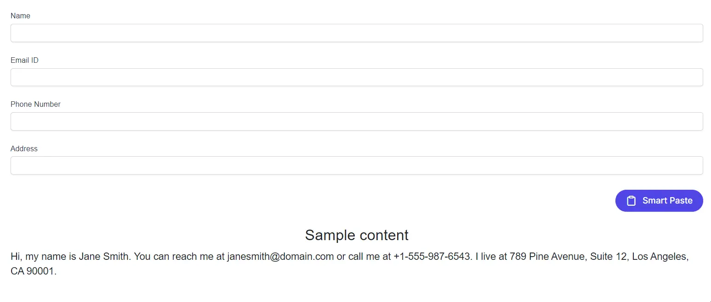

# Getting Started with Smart Paste Button in Blazor Web App

This section explains how to integrate the [Blazor Smart Paste Button](https://www.syncfusion.com/blazor-components/blazor-smartpaste-button) component in a Blazor Web App using [Visual Studio](https://visualstudio.microsoft.com/vs/), [Visual Studio Code](https://code.visualstudio.com/), and the [.NET CLI](https://learn.microsoft.com/en-us/dotnet/core/tools/). The Smart Paste Button leverages AI to intelligently populate form fields from copied text, streamlining user input workflows.

To get started quickly with the Blazor Smart Paste Button component, watch this video:



## Create a new Blazor Web App





Create a **Blazor Web App** using Visual Studio via [Microsoft Templates](https://learn.microsoft.com/en-us/aspnet/core/blazor/tooling?view=aspnetcore-10.0&pivots=vs) or the [Blazor Extension](https://blazor.syncfusion.com/documentation/visual-studio-integration/template-studio). For detailed instructions, refer to the [Blazor Web App Getting Started](https://blazor.syncfusion.com/documentation/getting-started/blazor-web-app) documentation.





Run the following command to create a new Blazor Web App.




dotnet new blazor -o BlazorWebApp --interactivity Auto




Alternatively, create a **Blazor Web App** using Visual Studio Code via [Microsoft Templates](https://learn.microsoft.com/en-us/aspnet/core/blazor/tooling?view=aspnetcore-10.0&pivots=vsc), the [Blazor Extension](https://blazor.syncfusion.com/documentation/visual-studio-code-integration/create-project), or the [C# Dev Kit](https://marketplace.visualstudio.com/items?itemName=ms-dotnettools.csdevkit) extension.





Run the following command to create a new Blazor Web App.




dotnet new blazor -o BlazorWebApp --interactivity Auto








N> Configure the appropriate [Interactive render mode](https://learn.microsoft.com/en-us/aspnet/core/blazor/components/render-modes?view=aspnetcore-10.0#render-modes) and [Interactivity location](https://learn.microsoft.com/en-us/aspnet/core/blazor/tooling?view=aspnetcore-10.0&pivots=vs) while creating a Blazor Web App. For detailed information, refer to the [interactive render mode documentation](https://blazor.syncfusion.com/documentation/common/interactive-render-mode).

## Install the required Blazor packages

Install the [Syncfusion.Blazor.SmartComponents](https://www.nuget.org/packages?q=Syncfusion.Blazor.SmartComponents) and [Syncfusion.Blazor.Themes](https://www.nuget.org/packages/Syncfusion.Blazor.Themes/) NuGet packages.All Syncfusion Blazor packages are available on [nuget.org](https://www.nuget.org/packages?q=syncfusion.blazor). See the [NuGet packages](https://blazor.syncfusion.com/documentation/nuget-packages) topic for details. If using the `WebAssembly` or `Auto` render modes in the Blazor Web App, install these packages in the `.Client` project.





1. Go to *Tools → NuGet Package Manager → Manage NuGet Packages for Solution*.
2. Search the required NuGet packages (`Syncfusion.Blazor.SmartComponents` and `Syncfusion.Blazor.Themes`) and install them.

Alternatively, you can install the same packages using the Package Manager Console with the following commands.




Install-Package Syncfusion.Blazor.SmartComponents -Version {{ site.releaseversion }}
Install-Package Syncfusion.Blazor.Themes -Version {{ site.releaseversion }}








Open the terminal and run the following commands.




dotnet add package Syncfusion.Blazor.SmartComponents -v {{ site.releaseversion }}
dotnet add package Syncfusion.Blazor.Themes -v {{ site.releaseversion }}








Open the command prompt and run the following commands.




dotnet add package Syncfusion.Blazor.SmartComponents -v {{ site.releaseversion }}
dotnet add package Syncfusion.Blazor.Themes -v {{ site.releaseversion }}








## Add import namespaces

After the packages are installed, open the **~/_Imports.razor** file in the client project and import the `Syncfusion.Blazor` and `Syncfusion.Blazor.SmartComponents` namespaces.




@using Syncfusion.Blazor
@using Syncfusion.Blazor.SmartComponents




## Register the Blazor service

Open the **Program.cs** file in Blazor Web App and register the Blazor service. If the **Interactive Render Mode** is set to `WebAssembly` or `Auto`, register the Blazor service in **Program.cs** files of both the server and client projects in your Blazor Web App.




....
using Syncfusion.Blazor;
....
builder.Services.AddSyncfusionBlazor();
....




## Configure AI Service

The Smart Paste Button requires an AI service (OpenAI, Azure OpenAI, or Ollama) to analyze and map copied text to form fields. Follow the instructions below to configure an AI model in your application.

### OpenAI Configuration

Install the following NuGet packages to your project:

* [Microsoft.Extensions.AI](https://www.nuget.org/packages/Microsoft.Extensions.AI)
* [Microsoft.Extensions.AI.OpenAI](https://www.nuget.org/packages/Microsoft.Extensions.AI.OpenAI)

You can install these packages using different methods as shown below:





1. Go to *Tools → NuGet Package Manager → Manage NuGet Packages for Solution*.
2. Search the required NuGet packages (`Microsoft.Extensions.AI` and `Microsoft.Extensions.AI.OpenAI`) and install them.

Alternatively, you can install the same packages using the Package Manager Console with the following commands.




Install-Package Microsoft.Extensions.AI
Install-Package Microsoft.Extensions.AI.OpenAI








Open the terminal and run the following commands.




dotnet add package Microsoft.Extensions.AI
dotnet add package Microsoft.Extensions.AI.OpenAI








Open the command prompt and run the following commands.




dotnet add package Microsoft.Extensions.AI
dotnet add package Microsoft.Extensions.AI.OpenAI








For OpenAI, obtain an API key from [OpenAI](https://help.openai.com/en/articles/4936850-where-do-i-find-my-openai-api-key) and specify the desired model (e.g., `gpt-3.5-turbo`, `gpt-4`). Store the API key securely in a configuration file or environment variable.

Add the following to the **~/Program.cs** file:




using Microsoft.AspNetCore.Components;
using Microsoft.AspNetCore.Components.Web;
using Syncfusion.Blazor;
using Syncfusion.Blazor.SmartComponents;
using Syncfusion.Blazor.AI;
using Microsoft.Extensions.AI;
using OpenAI;

var builder = WebApplication.CreateBuilder(args);
....

builder.Services.AddSyncfusionBlazor();

string openAIApiKey = "API-KEY";
string openAIModel = "OPENAI_MODEL";
OpenAIClient openAIClient = new OpenAIClient(openAIApiKey);
IChatClient openAIChatClient = openAIClient.GetChatClient(openAIModel).AsIChatClient();
builder.Services.AddChatClient(openAIChatClient);

builder.Services.AddSyncfusionSmartComponents()
    .InjectOpenAIInference();

var app = builder.Build();
....




### Azure OpenAI Configuration

Install the following NuGet packages to your project:

* [Microsoft.Extensions.AI](https://www.nuget.org/packages/Microsoft.Extensions.AI)
* [Microsoft.Extensions.AI.OpenAI](https://www.nuget.org/packages/Microsoft.Extensions.AI.OpenAI)
* [Azure.AI.OpenAI](https://www.nuget.org/packages/Azure.AI.OpenAI)

You can install these packages using different methods as shown below:





1. Go to *Tools → NuGet Package Manager → Manage NuGet Packages for Solution*.
2. Search the required NuGet packages (`Microsoft.Extensions.AI`, `Microsoft.Extensions.AI.OpenAI` and `Azure.AI.OpenAI`) and install them.

Alternatively, you can install the same packages using the Package Manager Console with the following commands.




Install-Package Microsoft.Extensions.AI
Install-Package Microsoft.Extensions.AI.OpenAI
Install-Package Azure.AI.OpenAI








Open the terminal and run the following commands.




dotnet add package Microsoft.Extensions.AI
dotnet add package Microsoft.Extensions.AI.OpenAI
dotnet add package Azure.AI.OpenAI








Open the command prompt and run the following commands.




dotnet add package Microsoft.Extensions.AI
dotnet add package Microsoft.Extensions.AI.OpenAI
dotnet add package Azure.AI.OpenAI








For Azure OpenAI, deploy a resource and model as described in [Azure OpenAI documentation](https://learn.microsoft.com/en-us/azure/ai-services/openai/how-to/create-resource). Obtain the API key, endpoint, and model name from your Azure portal.

Add the following to the **~/Program.cs** file:




using Microsoft.AspNetCore.Components;
using Microsoft.AspNetCore.Components.Web;
using Syncfusion.Blazor;
using Syncfusion.Blazor.SmartComponents;
using Syncfusion.Blazor.AI;
using Microsoft.Extensions.AI;
using Azure.AI.OpenAI;
using System.ClientModel;

var builder = WebApplication.CreateBuilder(args);
....

builder.Services.AddSyncfusionBlazor();

string azureOpenAIKey = "AZURE_OPENAI_KEY";
string azureOpenAIEndpoint = "AZURE_OPENAI_ENDPOINT";
string azureOpenAIModel = "AZURE_OPENAI_MODEL";
AzureOpenAIClient azureOpenAIClient = new AzureOpenAIClient(
     new Uri(azureOpenAIEndpoint),
     new ApiKeyCredential(azureOpenAIKey)
);
IChatClient azureOpenAIChatClient = azureOpenAIClient.GetChatClient(azureOpenAIModel).AsIChatClient();
builder.Services.AddChatClient(azureOpenAIChatClient);

builder.Services.AddSyncfusionSmartComponents()
    .InjectOpenAIInference();

var app = builder.Build();
....




N> For versions 28.2.33 to 30.2.6, the Azure.AI.OpenAI package is not included in the SmartComponents dependency. Install the [Azure.AI.OpenAI](https://www.nuget.org/packages/Azure.AI.OpenAI) package separately. Refer to [Syncfusion version history](https://blazor.syncfusion.com/documentation/release-notes) for the latest dependency information.

### Ollama Configuration

To use Ollama for self-hosted models:

1. Download and install Ollama from [Ollama's official website](https://ollama.com).
2. Install a model from the [Ollama Library](https://ollama.com/library) (e.g., `llama2:13b`, `mistral:7b`).
3. Configure the endpoint URL (e.g., `http://localhost:11434`) and model name.

* Install the following NuGet packages to your project:





1. Go to *Tools → NuGet Package Manager → Manage NuGet Packages for Solution*.
2. Search the required NuGet packages (`Microsoft.Extensions.AI` and `OllamaSharp`) and install them.

Alternatively, you can install the same packages using the Package Manager Console with the following commands.




Install-Package Microsoft.Extensions.AI
Install-Package OllamaSharp








Open the terminal and run the following commands.




dotnet add package Microsoft.Extensions.AI
dotnet add package OllamaSharp








Open the command prompt and run the following commands.




dotnet add package Microsoft.Extensions.AI
dotnet add package OllamaSharp








Add the following to the **~/Program.cs** file:




using Microsoft.AspNetCore.Components;
using Microsoft.AspNetCore.Components.Web;
using Syncfusion.Blazor;
using Syncfusion.Blazor.SmartComponents;
using Syncfusion.Blazor.AI;
using Microsoft.Extensions.AI;
using OllamaSharp;

var builder = WebApplication.CreateBuilder(args);
....

builder.Services.AddSyncfusionBlazor();

string ModelName = "MODEL_NAME";
IChatClient chatClient = new OllamaApiClient("http://localhost:11434", ModelName);
builder.Services.AddChatClient(chatClient);

builder.Services.AddSyncfusionSmartComponents()
    .InjectOpenAIInference();

var app = builder.Build();
....




## Add stylesheet and script resources

The theme stylesheet and script can be accessed from NuGet through [Static Web Assets](https://blazor.syncfusion.com/documentation/appearance/themes#static-web-assets). Include the [stylesheet](https://blazor.syncfusion.com/documentation/appearance/themes) and [script references](https://blazor.syncfusion.com/documentation/common/adding-script-references) in the **App.razor** file.




...
<link href="_content/Syncfusion.Blazor.Themes/fluent2.css" rel="stylesheet" />
...




> **Note**: Explore the [Blazor Themes](https://blazor.syncfusion.com/documentation/appearance/themes) topic for various methods ([Static Web Assets](https://blazor.syncfusion.com/documentation/appearance/themes#static-web-assets), [CDN](https://blazor.syncfusion.com/documentation/appearance/themes#cdn-reference), and [CRG](https://blazor.syncfusion.com/documentation/common/custom-resource-generator)) to reference themes in your Blazor application. Refer to the [Adding Script Reference](https://blazor.syncfusion.com/documentation/common/adding-script-references) topic for different approaches to adding script references.

## Add Blazor Smart Paste Button Component

Open a Razor file located in the **~/Pages/*.razor** (for example, **Index.razor**) and add the [Blazor Smart Paste Button](https://www.syncfusion.com/blazor-components/blazor-smartpaste-button) component inside the razor file. This example uses the [Syncfusion® Blazor DataForm](https://blazor.syncfusion.com/documentation/data-form/getting-started-with-web-app) component to manage form input fields. Install the [Syncfusion.Blazor.DataForm](https://www.nuget.org/packages/Syncfusion.Blazor.DataForm) package.

N> If the interactivity location is set to `Per page/component` in the Web App, define a render mode at the top of the razor file. (For example, `InteractiveServer`, `InteractiveWebAssembly` or `InteractiveAuto`). If the **Interactivity** is set to `Global` with `Auto` or `WebAssembly`, the render mode is automatically configured in the `App.razor` file by default.




@rendermode InteractiveAuto

@using Syncfusion.Blazor.DataForm
@using System.ComponentModel.DataAnnotations
@using Syncfusion.Blazor.SmartComponents

<SfDataForm ID="MyForm"
            Model="@EventRegistrationModel">
    <FormValidator>
        <DataAnnotationsValidator></DataAnnotationsValidator>
    </FormValidator>
    <FormItems>
        <FormItem Field="@nameof(EventRegistration.Name)" ID="firstname"></FormItem>
        <FormItem Field="@nameof(EventRegistration.Email)" ID="email"></FormItem>
        <FormItem Field="@nameof(EventRegistration.Phone)" ID="phonenumber"></FormItem>
        <FormItem Field="@nameof(EventRegistration.Address)" ID="address"></FormItem>
    </FormItems>
    <FormButtons>
        <SfSmartPasteButton IsPrimary="true" Content="Smart Paste" IconCss="e-icons e-paste">
        </SfSmartPasteButton>
    </FormButtons>
</SfDataForm>

 
<h4 style="text-align:center;">Sample content</h4>

    Hi, my name is Jane Smith. You can reach me at example@domain.com or call me at +1-555-987-6543. I live at 789 Pine Avenue, Suite 12, Los Angeles, CA 90001.

@code {
    private EventRegistration EventRegistrationModel = new EventRegistration();

    public class EventRegistration
    {
        [Required(ErrorMessage = "Please enter your name.")]
        [Display(Name = "Name")]
        public string Name { get; set; }

        [Required(ErrorMessage = "Please enter your email address.")]
        [Display(Name = "Email ID")]
        public string Email { get; set; }

        [Required(ErrorMessage = "Please enter your mobile number.")]
        [Display(Name = "Phone Number")]
        public string Phone { get; set; }

        [Required(ErrorMessage = "Please enter your address.")]
        [Display(Name = "Address")]
        public string Address { get; set; }
    }
}




**Run the application**





Press <kbd>Ctrl</kbd>+<kbd>F5</kbd> (Windows) or <kbd>⌘</kbd>+<kbd>F5</kbd> (macOS) to launch the application. The Blazor Smart Paste Button component will render in your default web browser.





Open the terminal and navigate to the main project folder (for example, `BlazorWebApp`) and run the following command.




cd BlazorWebApp
dotnet run








Open the command prompt and navigate to the main project folder (for example, `BlazorWebApp`) and run the following command.




cd BlazorWebApp
dotnet run








Copy the `Sample Content` and click the `Smart Paste` button to see the form fields automatically populated.

N> [View Sample in GitHub](https://github.com/syncfusion/smart-ai-samples).

## Performance Considerations

For optimal performance with the Smart Paste Button:
- Use lightweight AI models (e.g., `gpt-3.5-turbo` or `mistral:7b`) for faster processing.
- Limit form complexity to reduce AI parsing time, especially for large datasets.
- Cache AI model responses where possible to minimize repeated API calls.

## Troubleshooting Common Issues

- **AI Service Configuration Errors**: Verify the API key, endpoint, and model name in `Program.cs`. Check for typos or incorrect values.
- **Network Failures**: Ensure a stable internet connection for OpenAI or Azure OpenAI. For Ollama, confirm the local server is running at the specified endpoint (e.g., `http://localhost:11434`).
- **Form Not Populating**: Confirm that the copied text matches the form field structure and that the AI model is correctly configured.