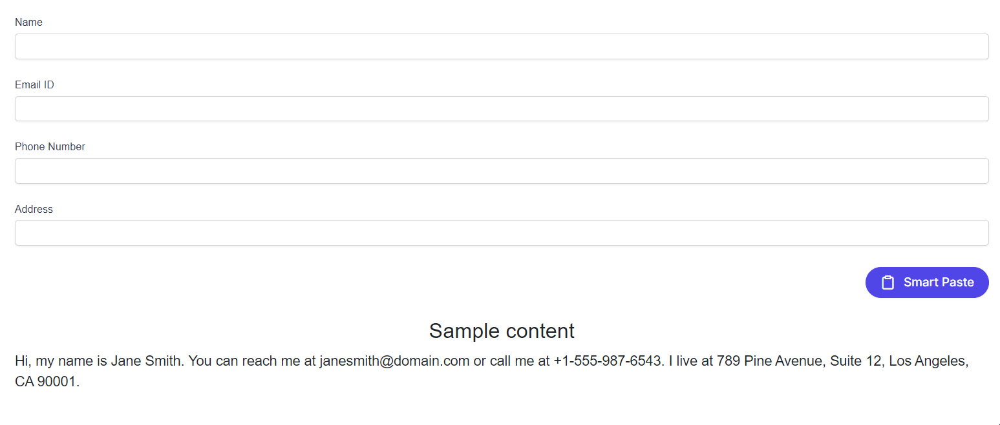

# Groq AI Integration with Blazor Smart Paste Button

The Syncfusion Blazor SmartPaste Button component enables AI-powered, context-aware content pasting into forms, typically using OpenAI or Azure OpenAI. This guide explains how to integrate the Groq AI service with the Smart Paste Button using the `IChatInferenceService` interface, enabling custom AI-driven responses in a Blazor Web App.

## Setting Up Groq

1. **Create a Groq Account**  
   Visit [Groq Cloud Console](https://console.groq.com), sign up or sign in, and complete the verification process.
2. **Obtain an API Key**  
   Navigate to [API Keys](https://console.groq.com/keys) in the Groq Console and click "Create API Key."
3. **Review Model Specifications**  
   Refer to [Groq Models Documentation](https://console.groq.com/docs/models) for details on available models (e.g., `llama3-8b-8192`).

## Create a Groq AI Service

Create a service class to manage interactions with the Groq API, including authentication and response processing for the Smart Paste Button.

1. Create a `Services` folder in your project.
2. Add a new file named `GroqService.cs` in the `Services` folder.
3. Implement the service as shown below, storing the API key securely in a configuration file or environment variable (e.g., `appsettings.json` or environment variables).

```csharp
using System.Net;
using System.Text;
using System.Text.Json;
using Microsoft.Extensions.AI;

public class GroqService
{
    private readonly string _apiKey;
    private readonly string _modelName = "llama3-8b-8192"; // Example model
    private readonly string _endpoint = "https://api.groq.com/openai/v1/chat/completions";
    private static readonly HttpClient HttpClient = new(new SocketsHttpHandler
    {
        PooledConnectionLifetime = TimeSpan.FromMinutes(30),
        EnableMultipleHttp2Connections = true
    })
    {
        DefaultRequestVersion = HttpVersion.Version20 // Fallback to HTTP/2 for broader compatibility
    };
    private static readonly JsonSerializerOptions JsonOptions = new()
    {
        PropertyNamingPolicy = JsonNamingPolicy.CamelCase
    };

    public GroqService(IConfiguration configuration)
    {
        _apiKey = configuration["Groq:ApiKey"] ?? throw new ArgumentNullException("Groq API key is missing.");
        if (!HttpClient.DefaultRequestHeaders.Contains("Authorization"))
        {
            HttpClient.DefaultRequestHeaders.Clear();
            HttpClient.DefaultRequestHeaders.Add("Authorization", $"Bearer {_apiKey}");
        }
    }

    public async Task<string> CompleteAsync(IList<ChatMessage> chatMessages)
    {
        var requestPayload = new GroqChatParameters
        {
            Model = _modelName,
            Messages = chatMessages.Select(m => new Message
            {
                Role = m.Role == ChatRole.User ? "user" : "assistant",
                Content = m.Text
            }).ToList(),
            Stop = new List<string> { "END_INSERTION", "NEED_INFO", "END_RESPONSE" } // Configurable stop sequences
        };

        var content = new StringContent(JsonSerializer.Serialize(requestPayload, JsonOptions), Encoding.UTF8, "application/json");

        try
        {
            var response = await HttpClient.PostAsync(_endpoint, content);
            response.EnsureSuccessStatusCode();
            var responseString = await response.Content.ReadAsStringAsync();
            var responseObject = JsonSerializer.Deserialize<GroqResponseObject>(responseString, JsonOptions);
            return responseObject?.Choices?.FirstOrDefault()?.Message?.Content ?? "No response from model.";
        }
        catch (Exception ex) when (ex is HttpRequestException || ex is JsonException)
        {
            throw new InvalidOperationException("Failed to communicate with Groq API.", ex);
        }
    }
}
```

N> Store the Groq API key in `appsettings.json` (e.g., `{ "Groq": { "ApiKey": "your-api-key" } }`) or as an environment variable to ensure security.

## Define Request and Response Models

Define C# classes to match the Groq API’s request and response format.

1. Create a new file named `GroqModels.cs` in the `Services` folder.
2. Add the following model classes:

```csharp
public class Choice
{
    public Message Message { get; set; }
}

public class Message
{
    public string Role { get; set; }
    public string Content { get; set; }
}

public class GroqChatParameters
{
    public string Model { get; set; }
    public List<Message> Messages { get; set; }
    public List<string> Stop { get; set; }
}

public class GroqResponseObject
{
    public string Model { get; set; }
    public List<Choice> Choices { get; set; }
}
```

## Create a Custom AI Service

Implement the `IChatInferenceService` interface to connect the Smart Paste Button to the Groq service.

1. Create a new file named `GroqInferenceService.cs` in the `Services` folder.
2. Add the following implementation:

```csharp
using Syncfusion.Blazor.AI;
using System.Threading.Tasks;

public class GroqInferenceService : IChatInferenceService
{
    private readonly GroqService _groqService;

    public GroqInferenceService(GroqService groqService)
    {
        _groqService = groqService;
    }

    public async Task<string> GenerateResponseAsync(ChatParameters options)
    {
        return await _groqService.CompleteAsync(options.Messages);
    }
}
```

## Configure the Blazor App

Register the Groq service and `IChatInferenceService` implementation in the dependency injection container.

Update the **~/Program.cs** file as follows:

```csharp
using Microsoft.AspNetCore.Components;
using Microsoft.AspNetCore.Components.Web;
using Syncfusion.Blazor;
using Syncfusion.Blazor.AI;

var builder = WebApplication.CreateBuilder(args);

builder.Services.AddRazorPages();
builder.Services.AddServerSideBlazor();
builder.Services.AddSyncfusionBlazor();
builder.Services.AddSyncfusionSmartComponents();
builder.Services.AddSingleton<GroqService>();
builder.Services.AddSingleton<IChatInferenceService, GroqInferenceService>();

var app = builder.Build();
// ...
```

## Add the Smart Paste Button

Add the Smart Paste Button to a form in the **~/Pages/Home.razor** file to test the Groq AI integration.

```razor
@using Syncfusion.Blazor.DataForm
@using Syncfusion.Blazor.SmartComponents
@using System.ComponentModel.DataAnnotations

<SfDataForm ID="MyForm" Model="@EventRegistrationModel">
    <FormValidator>
        <DataAnnotationsValidator></DataAnnotationsValidator>
    </FormValidator>
    <FormItems>
        <FormItem Field="@nameof(EventRegistration.Name)" ID="firstname"></FormItem>
        <FormItem Field="@nameof(EventRegistration.Email)" ID="email"></FormItem>
        <FormItem Field="@nameof(EventRegistration.Phone)" ID="phonenumber"></FormItem>
        <FormItem Field="@nameof(EventRegistration.Address)" ID="address"></FormItem>
    </FormItems>
    <FormButtons>
        <SfSmartPasteButton IsPrimary="true" Content="Smart Paste" IconCss="e-icons e-paste"></SfSmartPasteButton>
    </FormButtons>
</SfDataForm>

<br>
<h4 style="text-align:center;">Sample Content</h4>
<div>
    Hi, my name is Jane Smith. You can reach me at example@domain.com or call me at +1-555-987-6543. I live at 789 Pine Avenue, Suite 12, Los Angeles, CA 90001.
</div>

@code {
    private EventRegistration EventRegistrationModel = new();

    public class EventRegistration
    {
        [Required(ErrorMessage = "Please enter your name.")]
        [Display(Name = "Name")]
        public string Name { get; set; }

        [Required(ErrorMessage = "Please enter your email address.")]
        [Display(Name = "Email ID")]
        public string Email { get; set; }

        [Required(ErrorMessage = "Please enter your mobile number.")]
        [Display(Name = "Phone Number")]
        public string Phone { get; set; }

        [Required(ErrorMessage = "Please enter your address.")]
        [Display(Name = "Address")]
        public string Address { get; set; }
    }
}
```

N> Ensure the [Syncfusion Blazor DataForm](https://blazor.syncfusion.com/documentation/data-form/getting-started-with-web-app) package is installed for form integration.

## Testing the Integration

1. Configure the Blazor Web App with the Groq AI service and Smart Paste Button as described above.
2. Add the code to **~/Pages/Home.razor**, **Program.cs**, and the `Services` folder.
3. Run the application using <kbd>Ctrl</kbd>+<kbd>F5</kbd> (Windows) or <kbd>⌘</kbd>+<kbd>F5</kbd> (macOS).
4. Copy the sample content provided in the Razor file.
5. Click the **Smart Paste** button to verify that the form fields are populated correctly using the Groq AI service.



N> [View Sample in GitHub](https://github.com/syncfusion/smart-ai-samples).

## Troubleshooting

If the Groq AI integration does not work, try the following:
- **No Suggestions Displayed**: Verify that the Groq API key and model name are correct in the configuration. Check the `GroqService` implementation for errors.
- **HTTP Request Failures**: Ensure a stable internet connection and that the Groq API endpoint (`https://api.groq.com/openai/v1/chat/completions`) is accessible. Test with HTTP/2 instead of HTTP/3 if compatibility issues arise.
- **Service Registration Errors**: Confirm that `GroqService` and `GroqInferenceService` are registered in **Program.cs**.

## See Also

- [Getting Started with Syncfusion Blazor Smart Paste Button in Blazor Web App](https://blazor.syncfusion.com/documentation/smart-paste/getting-started-webapp)
- [Customizing Smart Paste Button Suggestions](https://blazor.syncfusion.com/documentation/smart-paste/customization)