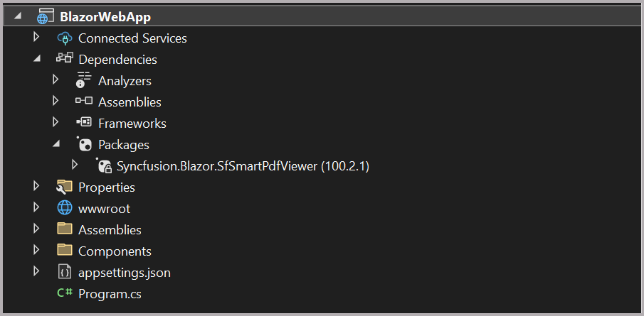

# Getting Started with Smart PdfViewer

This section briefly explains about how to include **Blazor Smart PdfViewer** component in your Blazor Web App using [Visual Studio](https://visualstudio.microsoft.com/vs/) and Visual Studio code.

## Prerequisites

* [System requirements for Blazor components](https://blazor.syncfusion.com/documNow, register the Syncfusion<sup style="font-size:70%">&reg;</sup> Blazor Service in the **~/Program.cs** file of your Blazor Web App.

entation/system-requirements)
* [Azure OpenAI Account](https://learn.microsoft.com/en-us/azure/ai-services/openai/how-to/create-resource)

## Create a new Blazor Web App in Visual Studio

You can create a **Blazor Web App** using Visual Studio 2022 via [Microsoft Templates](https://learn.microsoft.com/en-us/aspnet/core/blazor/tooling?view=aspnetcore-8.0) or the [Syncfusion<sup style="font-size:70%">&reg;</sup> Blazor Extension](https://blazor.syncfusion.com/documentation/visual-studio-integration/template-studio).

## Install Syncfusion<sup style="font-size:70%">&reg;</sup> Blazor SfSmartPdfViewer NuGet in the App

To add **Blazor Smart PdfViewer** component in the app, open the NuGet package manager in Visual Studio (*Tools → NuGet Package Manager → Manage NuGet Packages for Solution*), search and install [Syncfusion.Blazor.SfSmartPdfViewer](https://www.nuget.org/packages?q=Syncfusion.Blazor.SfSmartPdfViewer).

You need to configure the corresponding [Interactive render mode](https://learn.microsoft.com/en-us/aspnet/core/blazor/components/render-modes?view=aspnetcore-8.0#render-modes) and [Interactivity location](https://learn.microsoft.com/en-us/aspnet/core/blazor/tooling?view=aspnetcore-8.0&pivots=vsc) while creating a Blazor Web Application.



## Register Syncfusion<sup style="font-size:70%">&reg;</sup> Blazor Service

| Interactive Render Mode | Description |
| -- | -- |
| Auto | Open **~/_Imports.razor** file from the client project.|
| Server | Open **~/_import.razor** file, which is located in the `Components` folder.|

* In the **~/_Imports.razor** file, add the following namespaces:




@using Syncfusion.Blazor;
@using Syncfusion.Blazor.SfPdfViewer;




* Register the Syncfusion<sup style="font-size:70%">&reg;</sup> Blazor Service in the program.cs file of your Blazor Web App.

If the **Interactive Render Mode** is set to `Auto`, you need to register the Syncfusion<sup style="font-size:70%">&reg;</sup> Blazor service in both **~/Program.cs** files of your Blazor Web App.

If the **Interactive Render Mode** is set to `Server`, your project will contain a single **~/Program.cs** file. So, you should register the Syncfusion<sup style="font-size:70%">&reg;</sup> Blazor Service only in that **~/Program.cs** file.




using BlazorWebAppServer.Components;
using Syncfusion.Blazor;

var builder = WebApplication.CreateBuilder(args);

builder.Services.AddRazorComponents() 
        .AddInteractiveServerComponents();

builder.Services.AddSignalR(o => { o.MaximumReceiveMessageSize = 102400000; });

builder.Services.AddMemoryCache();
//Add Syncfusion Blazor service to the container.
builder.Services.AddSyncfusionBlazor();

var app = builder.Build();

if (!app.Environment.IsDevelopment())
{
    app.UseExceptionHandler("/Error", createScopeForErrors: true);
    app.UseHsts();
}

app.UseHttpsRedirection();
app.UseStaticFiles();
app.UseAntiforgery();

app.MapRazorComponents<App>()
    .AddInteractiveServerRenderMode();

app.Run();





using BlazorWebAppAuto.Client.Pages;
using BlazorWebAppAuto.Components;
using Syncfusion.Blazor;

var builder = WebApplication.CreateBuilder(args);
builder.Services.AddRazorComponents()
.AddInteractiveServerComponents() .AddInteractiveWebAssemblyComponents();

builder.Services.AddSignalR(o => { o.MaximumReceiveMessageSize = 102400000; });

builder.Services.AddMemoryCache();
//Add Syncfusion Blazor service to the container
builder.Services.AddSyncfusionBlazor();

var app = builder.Build();
if (app.Environment.IsDevelopment())
{
app.UseWebAssemblyDebugging();
}
else
{ app.UseExceptionHandler("/Error", createScopeForErrors: true);
    app.UseHsts();
}
app.UseHttpsRedirection();
app.UseStaticFiles();
app.UseAntiforgery();

app.MapRazorComponents<App>()
.AddInteractiveServerRenderMode() .AddInteractiveWebAssemblyRenderMode()
    .AddAdditionalAssemblies(typeof(Counter).Assembly);





## Configure AI Service

To configure the AI service, add the following settings to the **~/Program.cs** file in your Blazor Web app.




using Syncfusion.Blazor;
using Syncfusion.Blazor.AI;
var builder = WebApplication.CreateBuilder(args);

....

builder.Services.AddSyncfusionBlazor();

// For OpenAI configuration
builder.Services.AddSingleton(new AIServiceCredentials
{
    ApiKey = "api-key",
    DeploymentName = "deployment-name",
    Endpoint = "end point url"
});

builder.Services.AddSingleton<IChatInferenceService,SyncfusionAIService>();
var app = builder.Build();

...



Here,

* **apiKey**: "Azure OpenAI API Key";
* **deploymentName**: "Azure OpenAI deployment name";
* **endpoint**: "Azure OpenAI deployment end point URL";

For **Azure OpenAI**, first [deploy an Azure OpenAI Service resource and model](https://learn.microsoft.com/en-us/azure/ai-services/openai/how-to/create-resource), then values for `apiKey`, `deploymentName` and `endpoint` will all be provided to you.

## Adding stylesheet and script

Add the following stylesheet and script to the head section of the **~/Components/App.razor** file.

```html
<head>
    <!-- Syncfusion Blazor PDF Viewer control's theme style sheet -->
    <link href="_content/Syncfusion.Blazor.Themes/bootstrap5.css" rel="stylesheet" />
    <!-- Syncfusion Blazor PDF Viewer control's scripts -->
    <script src="_content/Syncfusion.Blazor.SfPdfViewer/scripts/syncfusion-blazor-sfpdfviewer.min.js" type="text/javascript"></script>
</head>
```

## Adding Blazor SfSmartPdfViewer component
Add the Syncfusion<sup style="font-size:70%">&reg;</sup> PDF Viewer (Next Gen) component in the **~Pages/.razor** file. If an interactivity location as `Per page/component` in the web app, define a render mode at the top of the **~Pages/.razor** component, as follows:

| Interactivity location | RenderMode | Code |
| --- | --- | --- |
| Per page/component | Auto | @rendermode InteractiveServer |
|  | Server | @rendermode InteractiveServer |
|  | None | --- |

N> If an **Interactivity Location** is set to `Global` and the **Render Mode** is set to `Auto` or `Server`, the render mode is configured in the `App.razor` file by default.




@* Your App render mode define here *@
@rendermode InteractiveServer




N> If an interactivity location as Global no need to mention render mode. Set the interactivity mode for whole sample.

Add the Syncfusion<sup style="font-size:70%">&reg;</sup> **Blazor Smart PdfViewer** component in the **~Pages/Home.razor** file.




<div>
    <Syncfusion.Blazor.SmartPdfViewer.SfSmartPdfViewer id="pdf-viewer" Height="100%" Width="100%" DocumentPath="wwwroot/Fsharp_Succinctly.pdf">

    </Syncfusion.Blazor.SmartPdfViewer.SfSmartPdfViewer>
</div>
<style>
    #pdf-viewer_SmartPdfViewer .e-pv-smart-assistanceview .ai-assist-banner {
        display: none;
    }
</style>




N> If you don’t provide the [DocumentPath](https://help.syncfusion.com/cr/blazor/Syncfusion.Blazor.SfPdfViewer.PdfViewerBase.html#Syncfusion_Blazor_SfPdfViewer_PdfViewerBase_DocumentPath) property value, the PDF Viewer component will be rendered without loading the PDF document. Users can then use the **open** option from the toolbar to browse and open the PDF as required.

