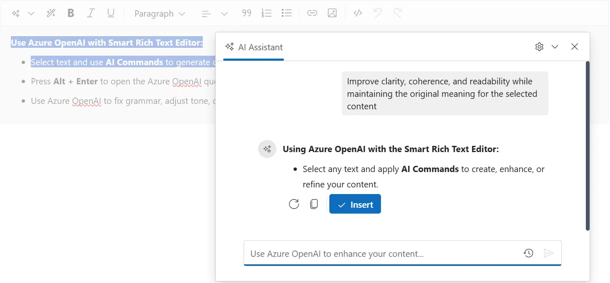

# Azure OpenAI Configuration

The Syncfusion<sup style="font-size:70%">&reg;</sup> Blazor Smart Rich Text Editor supports Azure OpenAI for enterprise-grade AI capabilities with enhanced security and compliance features.

## Prerequisites

* Active Azure subscription
* Azure OpenAI Service resource deployed
* Deployed model (e.g., gpt-4, gpt-35-turbo)
* Azure credentials with necessary permissions

## Deploy Azure OpenAI Service

### Step 1: Create Azure OpenAI Resource

1. Sign in to [Azure Portal](https://portal.azure.com/)
2. Click **Create a resource**
3. Search for **Azure OpenAI**
4. Click **Create**
5. Fill in the resource details:
   - **Subscription**: Select your subscription
   - **Resource group**: Create or select existing
   - **Region**: Choose appropriate region
   - **Name**: Give your resource a unique name
   - **Pricing tier**: Select S0 or higher

### Step 2: Deploy a Model

1. Go to **Azure AI Studio** (https://oai.azure.com/)
2. Select your Azure OpenAI resource
3. Navigate to **Deployments**
4. Click **Create new deployment**
5. Configure:
   - **Deployment name**: e.g., `gpt-35-turbo-deployment`
   - **Model name**: Select model (e.g., `gpt-35-turbo`, `gpt-4`)
   - **Model version**: Choose version
   - **Deployment type**: Standard

### Step 3: Obtain Credentials

From your Azure OpenAI resource in Azure Portal, copy:
- **Endpoint**: `https://<resource-name>.openai.azure.com/`
- **Key**: Found under **Keys and Endpoint**
- **Deployment name**: Created in Step 2

## Setup the Smart Rich Text Editor Component

Follow the [Getting Started](https://blazor.syncfusion.com/documentation/smart-rich-text-editor/getting-started-webapp) guide to configure and render the Smart Rich Text Editor component in the application and that prerequisites are met.

## Install NuGet packages

Install the following NuGet packages to your project:

* [Microsoft.Extensions.AI](https://www.nuget.org/packages/Microsoft.Extensions.AI)
* [Microsoft.Extensions.AI.OpenAI](https://www.nuget.org/packages/Microsoft.Extensions.AI.OpenAI)
* [Azure.AI.OpenAI](https://www.nuget.org/packages/Azure.AI.OpenAI)

You can install these packages using different methods as shown below:





1. In Visual Studio Navigate to:

   **Tools → NuGet Package Manager → Manage NuGet Packages for Solution**
2. Search for the required packages.
3. Select the package and click **Install**.





1. In Visual Studio Navigate to:

   **Tools → NuGet Package Manager → Package Manager Console**
2. Run the following commands:




Install-Package Microsoft.Extensions.AI
Install-Package Microsoft.Extensions.AI.OpenAI
Install-Package Azure.AI.OpenAI








1. Open your project.
2. Open the terminal:
   - In Visual Studio Code: use the integrated terminal (<kbd>Ctrl</kbd> + <kbd>`</kbd>)
   - Or use any system terminal for CLI
3. Run the following commands:




dotnet add package Microsoft.Extensions.AI
dotnet add package Microsoft.Extensions.AI.OpenAI
dotnet add package Azure.AI.OpenAI








## Configuration

### Step 1: Setup in Program.cs

Add the following configuration to your **Program.cs** file:

```csharp
using Syncfusion.Blazor;
using Syncfusion.Blazor.AI;
using Azure.AI.OpenAI;
using Microsoft.Extensions.AI;
using System.ClientModel;

var builder = WebApplication.CreateBuilder(args);

// Add services to the container
builder.Services.AddRazorPages();
builder.Services.AddServerSideBlazor();

// Register Syncfusion Blazor Service
builder.Services.AddSyncfusionBlazor();

// Configure Azure OpenAI - load from configuration
string azureOpenAIKey = builder.Configuration["AzureOpenAI:Key"] 
    ?? throw new InvalidOperationException("AzureOpenAI:Key not configured");
string azureOpenAIEndpoint = builder.Configuration["AzureOpenAI:Endpoint"] 
    ?? throw new InvalidOperationException("AzureOpenAI:Endpoint not configured");
string azureOpenAIDeployment = builder.Configuration["AzureOpenAI:DeploymentName"] 
    ?? throw new InvalidOperationException("AzureOpenAI:DeploymentName not configured");

AzureOpenAIClient azureOpenAIClient = new AzureOpenAIClient(
    new Uri(azureOpenAIEndpoint),
    new ApiKeyCredential(azureOpenAIKey)
);
IChatClient azureOpenAIChatClient = azureOpenAIClient
    .GetChatClient(azureOpenAIDeployment)
    .AsIChatClient();

builder.Services.AddSingleton<IChatClient>(azureOpenAIChatClient);
// Register Smart Rich Text Editor Components with Azure OpenAI
builder.Services.AddSingleton<IChatInferenceService, SyncfusionAIService>();

var app = builder.Build();

// ... rest of your application setup
```

### Step 2: Configure Azure OpenAI Credentials in appsettings.json

```json
{
  "AzureOpenAI": {
    "Key": "your-azure-openai-api-key",
    "Endpoint": "https://<your-resource-name>.openai.azure.com/",
    "DeploymentName": "your-deployment-name"
  }
}
```
N> Store sensitive keys in user secrets or environment variables, not in appsettings.json.

### Step 3: Use Azure OpenAI with Smart Rich Text Editor Component




@using Syncfusion.Blazor.SmartRichTextEditor

<SfSmartRichTextEditor>
    <AssistViewSettings Placeholder="Use Azure OpenAI to enhance your content..." />
    <div>
        <strong>Use Azure OpenAI with Smart Rich Text Editor:</strong>
        <ul>
            <li>Select text and use <b>AI Commands</b> to generate or refine content</li>
            <li>Press <b>Alt + Enter</b> to open the Azure OpenAI query dialog</li>
            <li>Use Azure OpenAI to fix grammar, adjust tone, or rephrase text</li>
        </ul>
    </div>
</SfSmartRichTextEditor>






## Troubleshooting

### Common Issues

**Error: ResourceNotFound (404)**
- Verify endpoint URL is correct
- Check resource name matches your Azure resource
- Ensure resource exists in specified region

**Error: InvalidAuthenticationTokenTenant (401)**
- Verify API key is correct
- Check key hasn't expired
- Ensure using the correct region's key

**Error: Model not found (404)**
- Verify deployment name matches your Azure deployment
- Check deployment is active and ready
- Ensure model is properly deployed

**Timeout Issues**
- Check Azure OpenAI resource capacity
- Verify network connectivity
- Consider timeout configuration

## See also

* [Getting Started with Smart Rich Text Editor](https://blazor.syncfusion.com/documentation/smart-rich-text-editor/getting-started-webapp)
* [OpenAI Configuration](https://blazor.syncfusion.com/documentation/smart-rich-text-editor/openai-service)
* [Ollama Configuration](https://blazor.syncfusion.com/documentation/smart-rich-text-editor/ollama)
* [Azure OpenAI Documentation](https://learn.microsoft.com/en-us/azure/ai-services/openai/)