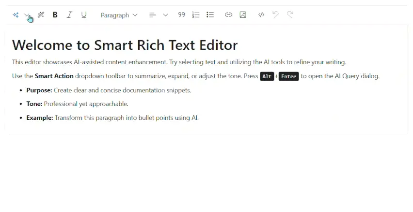

# Custom AI Service Integration with Blazor Smart Rich Text Editor

The Blazor Smart Rich Text Editor component leverages AI to provide context-aware content generation and editing, typically using OpenAI or Azure OpenAI services. Developers can integrate custom AI services using the `IChatInferenceService` interface, which standardizes communication between the Smart Rich Text Editor and third-party AI providers. This section explains how to implement and register a custom AI service for the Smart Rich Text Editor.

## IChatInferenceService Interface

The `IChatInferenceService` interface defines a contract for integrating custom AI services with Blazor Smart Rich Text Editor. It enables the Smart Rich Text Editor to request and receive AI-generated responses.

```csharp
using Syncfusion.Blazor.AI;

public interface IChatInferenceService
{
    Task<string> GenerateResponseAsync(ChatParameters options);
}
```

- **Purpose**: Standardizes communication for AI-generated responses.
- **Parameters**: The `ChatParameters` type includes properties like user input and context.
- **Benefits**: Enables seamless switching between AI providers without modifying component code.

## Simple Implementation of a Custom AI Service

Below is a sample implementation of a mock AI service named `MockAIService`. This service demonstrates how to implement the `IChatInferenceService` interface by returning sample responses. You can replace the logic with your own AI integration.

1. Create a new class file named `MockAIService.cs` in your project.
2. Add the following code:




using Syncfusion.Blazor.AI;

public class MockAIService : IChatInferenceService
{
    public Task<string> GenerateResponseAsync(ChatParameters options)
    {
        // Add custom logic to call your AI backend
        // Sample custom response
        return Task.FromResult("This is a custom AI response.");
    }
}




## Registering the Custom AI Service

Register the custom AI service in the **~/Program.cs** file of your Blazor Web App:




using Microsoft.AspNetCore.Components;
using Microsoft.AspNetCore.Components.Web;
using Syncfusion.Blazor;
using Syncfusion.Blazor.AI;

var builder = WebApplication.CreateBuilder(args);

builder.Services.AddRazorPages();
builder.Services.AddServerSideBlazor();
builder.Services.AddSyncfusionBlazor();
builder.Services.AddSingleton<IChatInferenceService, MockAIService>();

var app = builder.Build();




## Testing the Custom AI Integration

1. Implement and register the custom AI service as shown above.
2. Follow the [Getting Started](https://blazor.syncfusion.com/documentation/smart-rich-text-editor/getting-started-webapp) guide to configure and render the Smart Rich Text Editor component in the application and that prerequisites are met.
3. Run the application press <kbd>Ctrl</kbd>+<kbd>F5</kbd> in Visual Studio, run `dotnet run` from the CLI or integrated terminal in VS Code, or use the Run command in your preferred IDE to render the Blazor Smart Rich Text Editor component in the default web browser.
4. Use the AI AssistView or AI Commands in the Smart Rich Text Editor to verify that the custom AI service generates appropriate responses.



## Implemented AI Services

Here are examples of AI services integrated using the `IChatInferenceService` interface:

| Service | Documentation |
|---------|---------------|
| OpenAI | [OpenAI Integration](https://blazor.syncfusion.com/documentation/smart-rich-text-editor/openai-service) |
| Azure OpenAI | [Azure OpenAI Integration](https://blazor.syncfusion.com/documentation/smart-rich-text-editor/azure-openai-service) |
| Ollama | [Ollama Integration](https://blazor.syncfusion.com/documentation/smart-rich-text-editor/ollama) |

## Troubleshooting

If the custom AI service does not work as expected, try the following:
- **No Response Displayed**: Ensure the `IChatInferenceService` implementation is registered in **Program.cs** and returns valid responses. Check for errors in the `GenerateResponseAsync` method.
- **Dependency Issues**: Verify that all required NuGet packages (e.g., `Syncfusion.Blazor.SmartRichTextEditor`) are installed. Run `dotnet restore` to resolve dependencies.
- **Incorrect Responses**: Debug the custom AI service implementation to ensure it processes `ChatParameters` correctly and returns expected responses.

## See also

* [Getting Started with Blazor Smart Rich Text Editor](https://blazor.syncfusion.com/documentation/smart-rich-text-editor/getting-started-webapp)
* [OpenAI Configuration](https://blazor.syncfusion.com/documentation/smart-rich-text-editor/openai-service)
* [Azure OpenAI Configuration](https://blazor.syncfusion.com/documentation/smart-rich-text-editor/azure-openai-service)
* [Ollama Configuration](https://blazor.syncfusion.com/documentation/smart-rich-text-editor/ollama)
