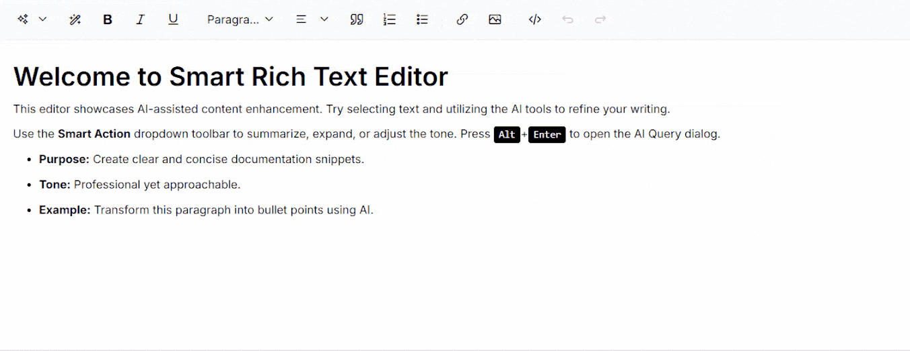

# Getting Started with Smart Rich Text Editor in Blazor Web App

This section briefly explains about how to include [Blazor Smart Rich Text Editor](https://www.syncfusion.com/blazor-components/blazor-smart-rich-text-editor) component in your Blazor Web App using Visual Studio.

## Prerequisites

* [System requirements for Blazor components](https://blazor.syncfusion.com/documentation/system-requirements)
* OpenAI or Azure OpenAI Account
* Visual Studio 2022 or later

N> Syncfusion<sup style="font-size:70%">&reg;</sup> Blazor Smart Components are compatible with `OpenAI` and `Azure OpenAI`, and fully support Server Interactivity mode apps.

## Create a new Blazor Web App in Visual Studio

You can create a **Blazor Web App** using Visual Studio via [Microsoft Templates](https://learn.microsoft.com/en-us/aspnet/core/blazor/tooling?view=aspnetcore-10.0) or the [Syncfusion<sup style="font-size:70%">&reg;</sup> Blazor Extension](https://blazor.syncfusion.com/documentation/visual-studio-integration/template-studio).

**Important:** When creating the Blazor Web App, ensure you select **Server Interactivity** option.

## Install Syncfusion<sup style="font-size:70%">&reg;</sup> Blazor Smart Rich Text Editor and Themes NuGet

To add **Blazor Smart Rich Text Editor** component in the app, open the NuGet package manager in Visual Studio (*Tools → NuGet Package Manager → Manage NuGet Packages for Solution*), search and install [Syncfusion.Blazor.SmartRichTextEditor](https://www.nuget.org/packages?q=Syncfusion.Blazor.SmartRichTextEditor) and [Syncfusion.Blazor.Themes](https://www.nuget.org/packages/Syncfusion.Blazor.Themes/). Alternatively, you can utilize the following package manager command to achieve the same.




Install-Package Syncfusion.Blazor.SmartRichTextEditor -Version {{ site.releaseversion }}
Install-Package Syncfusion.Blazor.Themes -Version {{ site.releaseversion }}




N> Syncfusion<sup style="font-size:70%">&reg;</sup> Blazor components are available in [nuget.org](https://www.nuget.org/packages?q=syncfusion.blazor). Refer to [NuGet packages](https://blazor.syncfusion.com/documentation/nuget-packages) topic for available NuGet packages list with component details.

## Register Syncfusion<sup style="font-size:70%">&reg;</sup> Blazor Service

Open **~/_Imports.razor** file in the Components folder and import the `Syncfusion.Blazor` and `Syncfusion.Blazor.SmartRichTextEditor` namespace.




@using Syncfusion.Blazor
@using Syncfusion.Blazor.SmartRichTextEditor




Now, register the Syncfusion<sup style="font-size:70%">&reg;</sup> Blazor Service in the **~/Program.cs** file of your Blazor Web App.




using Microsoft.AspNetCore.Components;
using Microsoft.AspNetCore.Components.Web;
using Syncfusion.Blazor;

var builder = WebApplication.CreateBuilder(args);

// Add services to the container.
builder.Services.AddRazorPages();
builder.Services.AddServerSideBlazor();
builder.Services.AddSyncfusionBlazor();

var app = builder.Build();
....





## Configure AI Service

Follow the instructions below to register an AI model in your application.

### OpenAI

For **OpenAI**, create an API key and place it at `openAIApiKey`. The value for `openAIModel` is the model you wish to use (e.g., `gpt-3.5-turbo`, `gpt-4`, etc.).

* Install the following NuGet packages to your project:





Install-Package Microsoft.Extensions.AI
Install-Package Microsoft.Extensions.AI.OpenAI





* To configure the AI service, add the following settings to the **~/Program.cs** file in your Blazor Web app.




using Syncfusion.Blazor;
using Syncfusion.Blazor.SmartRichTextEditor;
using Syncfusion.Blazor.AI;
using Microsoft.Extensions.AI;
using OpenAI;

var builder = WebApplication.CreateBuilder(args);

// Add services to the container.
builder.Services.AddRazorComponents()
    .AddInteractiveServerComponents();

builder.Services.AddSyncfusionBlazor();

string openAIApiKey = "API-KEY";
string openAIModel = "OPENAI_MODEL";
OpenAIClient openAIClient = new OpenAIClient(openAIApiKey);
IChatClient openAIChatClient = openAIClient.GetChatClient(openAIModel).AsIChatClient();
builder.Services.AddChatClient(openAIChatClient);

builder.Services.AddSingleton<IChatInferenceService, SyncfusionAIService>();

var app = builder.Build();

// ... rest of configuration




### Azure OpenAI

For **Azure OpenAI**, first [deploy an Azure OpenAI Service resource and model](https://learn.microsoft.com/en-us/azure/ai-services/openai/how-to/create-resource), then values for `azureOpenAIKey`, `azureOpenAIEndpoint` and `azureOpenAIModel` will all be provided to you.

* Install the following NuGet packages to your project:





Install-Package Microsoft.Extensions.AI
Install-Package Microsoft.Extensions.AI.OpenAI
Install-Package Azure.AI.OpenAI





* To configure the AI service, add the following settings to the **~/Program.cs** file in your Blazor Web app.




using Syncfusion.Blazor;
using Syncfusion.Blazor.SmartRichTextEditor;
using Syncfusion.Blazor.AI;
using Azure.AI.OpenAI;
using Microsoft.Extensions.AI;
using System.ClientModel;

var builder = WebApplication.CreateBuilder(args);

// Add services to the container.
builder.Services.AddRazorComponents()
    .AddInteractiveServerComponents();

builder.Services.AddSyncfusionBlazor();

string azureOpenAIKey = "AZURE_OPENAI_KEY";
string azureOpenAIEndpoint = "AZURE_OPENAI_ENDPOINT";
string azureOpenAIModel = "AZURE_OPENAI_MODEL";
AzureOpenAIClient azureOpenAIClient = new AzureOpenAIClient(
     new Uri(azureOpenAIEndpoint),
     new ApiKeyCredential(azureOpenAIKey)
);
IChatClient azureOpenAIChatClient = azureOpenAIClient.GetChatClient(azureOpenAIModel).AsIChatClient();
builder.Services.AddChatClient(azureOpenAIChatClient);

builder.Services.AddSingleton<IChatInferenceService, SyncfusionAIService>();

var app = builder.Build();

// ... rest of configuration




### Ollama

To use Ollama for running self-hosted models:

1. **Download and install Ollama**  
   Visit [Ollama's official website](https://ollama.com) and install the application appropriate for your operating system.

2. **Install the desired model from the Ollama library**  
   You can browse and install models from the [Ollama Library](https://ollama.com/library) (e.g., `llama2:13b`, `mistral:7b`, etc.).

3. **Configure your application**

   - Provide the `Endpoint` URL where the model is hosted (e.g., `http://localhost:11434`).
   - Set `ModelName` to the specific model you installed (e.g., `llama2:13b`).

* Install the following NuGet packages to your project:





Install-Package Microsoft.Extensions.AI
Install-Package OllamaSharp





* Add the following settings to the **~/Program.cs** file in your Blazor Server app.




using Syncfusion.Blazor.SmartRichTextEditor;
using Syncfusion.Blazor.AI;
using Microsoft.Extensions.AI;
using OllamaSharp;
var builder = WebApplication.CreateBuilder(args);

....

builder.Services.AddSyncfusionBlazor();

string ModelName = "MODEL_NAME";
IChatClient chatClient = new OllamaApiClient("http://localhost:11434", ModelName);
builder.Services.AddChatClient(chatClient);

builder.Services.AddSingleton<IChatInferenceService, SyncfusionAIService>();

var app = builder.Build();
....




## Add stylesheet and script resources

The theme stylesheet and script can be accessed from NuGet through [Static Web Assets](https://blazor.syncfusion.com/documentation/appearance/themes#static-web-assets). Reference the stylesheet and script in the `<head>` of the main page:

* For **Blazor Web App**, include it in the **~/Components/App.razor** file.

```html
<head>
     ....
    <link href="_content/Syncfusion.Blazor.Themes/tailwind.css" rel="stylesheet" />
</head>

<body>
     ....
    <script src="_content/Syncfusion.Blazor.Core/scripts/syncfusion-blazor.min.js" type="text/javascript"></script>
</body>
```

N> Check out the [Blazor Themes](https://blazor.syncfusion.com/documentation/appearance/themes) topic to discover various methods ([Static Web Assets](https://blazor.syncfusion.com/documentation/appearance/themes#static-web-assets), [CDN](https://blazor.syncfusion.com/documentation/appearance/themes#cdn-reference), and [CRG](https://blazor.syncfusion.com/documentation/common/custom-resource-generator)) for referencing themes in your Blazor application. Also, check out the [Adding Script Reference](https://blazor.syncfusion.com/documentation/common/adding-script-references) topic to learn different approaches for adding script references in your Blazor application.

## Add Syncfusion<sup style="font-size:70%">&reg;</sup> Blazor Smart Rich Text Editor component

Add the Syncfusion<sup style="font-size:70%">&reg;</sup> **Blazor Smart Rich Text Editor** component in the **~/Components/Pages/Home.razor** or any other page file.




@rendermode InteractiveServer
@using Syncfusion.Blazor.SmartRichTextEditor

<SfSmartRichTextEditor>
    <h2>Welcome to Smart Rich Text Editor</h2>
    <p>This editor showcases AI-assisted content enhancement. Try selecting text and utilizing the AI tools to refine your writing.</p>
    <p>Use the <strong>Smart Action</strong> dropdown toolbar to summarize, expand, or adjust the tone. Press <kbd>Alt</kbd>+<kbd>Enter</kbd> to open the AI Query dialog.</p>
    <ul>
       <li><strong>Purpose:</strong> Create clear and concise documentation snippets.</li>
       <li><strong>Tone:</strong> Professional yet approachable.</li>
       <li><strong>Example:</strong> Transform this paragraph into bullet points using AI.</li>
    </ul>
    <AssistViewSettings Placeholder="Start typing or use AI assistance to enhance your content..." />
</SfSmartRichTextEditor>




N> Notice the `@rendermode InteractiveServer` directive on the page. This is required for Blazor Web App to enable server-side interactivity.

* Press <kbd>Ctrl</kbd>+<kbd>F5</kbd> (Windows) or <kbd>⌘</kbd>+<kbd>F5</kbd> (macOS) to launch the application. This will render the Syncfusion<sup style="font-size:70%">&reg;</sup> Blazor Smart RichTextEditor component in your default web browser.

* Start typing content and use the AI tools in the toolbar to enhance your editing experience.

* Use <kbd>Alt</kbd>+<kbd>Enter</kbd> to open the AI Query dialog for content improvement.



N> [View Sample in GitHub](https://github.com/syncfusion/smart-ai-samples).

## See also

* [Getting Started with Smart Rich Text Editor in Server App](getting-started.md)
* [Rich Text Editor Documentation](https://blazor.syncfusion.com/documentation/rich-text-editor/overview)
* [AI Features and Customization](ai-features.md)
* [Blazor Web App Documentation](https://learn.microsoft.com/en-us/aspnet/core/blazor/hybrid)