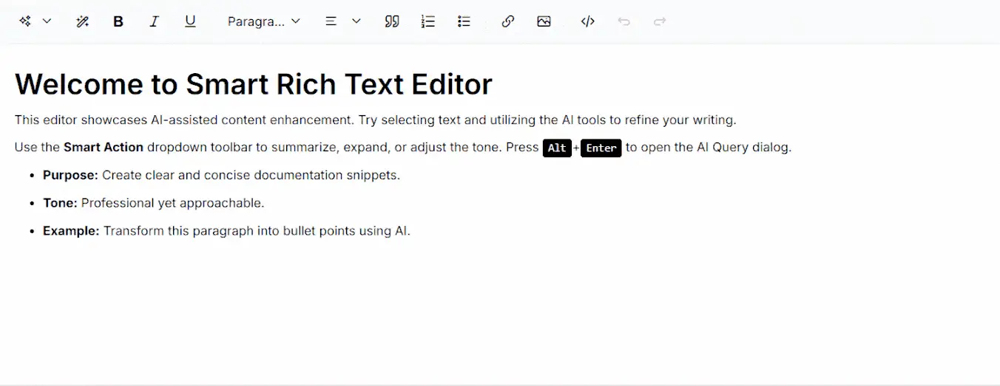

# Getting Started with Blazor Smart Rich Text Editor in Blazor Web App

This section explains how to add the [Blazor Smart Rich Text Editor](https://www.syncfusion.com/blazor-components/blazor-smart-rich-text-editor) component in your Blazor Web App using [Visual Studio](https://visualstudio.microsoft.com/vs/), [Visual Studio Code](https://code.visualstudio.com/), and the [.NET CLI](https://learn.microsoft.com/en-us/dotnet/core/tools/).

## Create a new Blazor Web App





Create a **Blazor Web App** using Visual Studio via [Microsoft Templates](https://learn.microsoft.com/en-us/aspnet/core/blazor/tooling?view=aspnetcore-10.0&pivots=vs) or the [Blazor Extension](https://blazor.syncfusion.com/documentation/visual-studio-integration/template-studio). For detailed instructions, refer to the [Blazor Web App Getting Started](https://blazor.syncfusion.com/documentation/getting-started/blazor-web-app) documentation.





Run the following command to create a new Blazor Web App.




dotnet new blazor -o BlazorWebApp --interactivity Auto




Alternatively, create a **Blazor Web App** using Visual Studio Code via [Microsoft Templates](https://learn.microsoft.com/en-us/aspnet/core/blazor/tooling?view=aspnetcore-10.0&pivots=vsc), the [Blazor Extension](https://blazor.syncfusion.com/documentation/visual-studio-code-integration/create-project), or the [C# Dev Kit](https://marketplace.visualstudio.com/items?itemName=ms-dotnettools.csdevkit) extension.





Run the following command to create a new Blazor Web App.




dotnet new blazor -o BlazorWebApp --interactivity Auto








N> Configure the appropriate [Interactive render mode](https://learn.microsoft.com/en-us/aspnet/core/blazor/components/render-modes?view=aspnetcore-10.0#render-modes) and [Interactivity location](https://learn.microsoft.com/en-us/aspnet/core/blazor/tooling?view=aspnetcore-10.0&pivots=vs) while creating a Blazor Web App. For detailed information, refer to the [interactive render mode documentation](https://blazor.syncfusion.com/documentation/common/interactive-render-mode).

## Install the required Blazor packages

Install the [Syncfusion.Blazor.SmartRichTextEditor](https://www.nuget.org/packages?q=Syncfusion.Blazor.SmartRichTextEditor) and [Syncfusion.Blazor.Themes](https://www.nuget.org/packages/Syncfusion.Blazor.Themes/) NuGet packages.All Syncfusion Blazor packages are available on [nuget.org](https://www.nuget.org/packages?q=syncfusion.blazor). See the [NuGet packages](https://blazor.syncfusion.com/documentation/nuget-packages) topic for details. If using the `WebAssembly` or `Auto` render modes in the Blazor Web App, install these packages in the `.Client` project.





1. Go to *Tools → NuGet Package Manager → Manage NuGet Packages for Solution*.
2. Search the required NuGet packages (`Syncfusion.Blazor.SmartRichTextEditor` and `Syncfusion.Blazor.Themes`) and install them.

Alternatively, you can install the same packages using the Package Manager Console with the following commands.




Install-Package Syncfusion.Blazor.SmartRichTextEditor -Version {{ site.releaseversion }}
Install-Package Syncfusion.Blazor.Themes -Version {{ site.releaseversion }}








Open the terminal and run the following commands.




dotnet add package Syncfusion.Blazor.SmartRichTextEditor -v {{ site.releaseversion }}
dotnet add package Syncfusion.Blazor.Themes -v {{ site.releaseversion }}








Open the command prompt and run the following commands.




dotnet add package Syncfusion.Blazor.SmartRichTextEditor -v {{ site.releaseversion }}
dotnet add package Syncfusion.Blazor.Themes -v {{ site.releaseversion }}








## Add import namespaces

After the packages are installed, open the **~/_Imports.razor** file in the client project and import the `Syncfusion.Blazor` and `Syncfusion.Blazor.SmartRichTextEditor` namespaces.




@using Syncfusion.Blazor
@using Syncfusion.Blazor.SmartRichTextEditor




## Register the Blazor service

Open the **Program.cs** file in Blazor Web App and register the Blazor service. If the **Interactive Render Mode** is set to `WebAssembly` or `Auto`, register the Blazor service in **Program.cs** files of both the server and client projects in your Blazor Web App.




....
using Syncfusion.Blazor;
....
builder.Services.AddSyncfusionBlazor();
....




## Configure AI Service

Follow the instructions below to register an AI model in your application.

### OpenAI

Install the following NuGet packages to your project:

* [Microsoft.Extensions.AI](https://www.nuget.org/packages/Microsoft.Extensions.AI)
* [Microsoft.Extensions.AI.OpenAI](https://www.nuget.org/packages/Microsoft.Extensions.AI.OpenAI)

You can install these packages using different methods as shown below:





1. Go to *Tools → NuGet Package Manager → Manage NuGet Packages for Solution*.
2. Search the required NuGet packages (`Microsoft.Extensions.AI` and `Microsoft.Extensions.AI.OpenAI`) and install them.

Alternatively, you can install the same packages using the Package Manager Console with the following commands.




Install-Package Microsoft.Extensions.AI
Install-Package Microsoft.Extensions.AI.OpenAI








Open the terminal and run the following commands.




dotnet add package Microsoft.Extensions.AI
dotnet add package Microsoft.Extensions.AI.OpenAI








Open the command prompt and run the following commands.




dotnet add package Microsoft.Extensions.AI
dotnet add package Microsoft.Extensions.AI.OpenAI








* For **OpenAI**, obtain an API key from [OpenAI](https://help.openai.com/en/articles/4936850-where-do-i-find-my-openai-api-key) and specify the desired model (e.g., `gpt-3.5-turbo`, `gpt-4`). Store the API key securely in a configuration file.

* To configure the AI service, add the following settings to the **~/Program.cs** file in your Blazor Web app.




using Syncfusion.Blazor;
using Syncfusion.Blazor.AI;
using Microsoft.Extensions.AI;
using OpenAI;

var builder = WebApplication.CreateBuilder(args);

// Add services to the container.
builder.Services.AddRazorComponents()
    .AddInteractiveServerComponents();

builder.Services.AddSyncfusionBlazor();

string openAIApiKey = "API-KEY";
string openAIModel = "OPENAI_MODEL";
OpenAIClient openAIClient = new OpenAIClient(openAIApiKey);
IChatClient openAIChatClient = openAIClient.GetChatClient(openAIModel).AsIChatClient();
builder.Services.AddChatClient(openAIChatClient);

builder.Services.AddSingleton<IChatInferenceService, SyncfusionAIService>();

var app = builder.Build();

// ... rest of configuration




### Azure OpenAI

Install the following NuGet packages to your project:

* [Microsoft.Extensions.AI](https://www.nuget.org/packages/Microsoft.Extensions.AI)
* [Microsoft.Extensions.AI.OpenAI](https://www.nuget.org/packages/Microsoft.Extensions.AI.OpenAI)
* [Azure.AI.OpenAI](https://www.nuget.org/packages/Azure.AI.OpenAI)

You can install these packages using different methods as shown below:





1. Go to *Tools → NuGet Package Manager → Manage NuGet Packages for Solution*.
2. Search the required NuGet packages (`Microsoft.Extensions.AI`, `Microsoft.Extensions.AI.OpenAI` and `Azure.AI.OpenAI`) and install them.

Alternatively, you can install the same packages using the Package Manager Console with the following commands.




Install-Package Microsoft.Extensions.AI
Install-Package Microsoft.Extensions.AI.OpenAI
Install-Package Azure.AI.OpenAI








Open the terminal and run the following commands.




dotnet add package Microsoft.Extensions.AI
dotnet add package Microsoft.Extensions.AI.OpenAI
dotnet add package Azure.AI.OpenAI








Open the command prompt and run the following commands.




dotnet add package Microsoft.Extensions.AI
dotnet add package Microsoft.Extensions.AI.OpenAI
dotnet add package Azure.AI.OpenAI








* For **Azure OpenAI**, first [deploy an Azure OpenAI Service resource and model](https://learn.microsoft.com/en-us/azure/ai-services/openai/how-to/create-resource), then values for `azureOpenAIKey`, `azureOpenAIEndpoint` and `azureOpenAIModel` will all be provided to you.

* To configure the AI service, add the following settings to the **~/Program.cs** file in your Blazor Web app.




using Syncfusion.Blazor;
using Syncfusion.Blazor.AI;
using Azure.AI.OpenAI;
using Microsoft.Extensions.AI;
using System.ClientModel;

var builder = WebApplication.CreateBuilder(args);

// Add services to the container.
builder.Services.AddRazorComponents()
    .AddInteractiveServerComponents();

builder.Services.AddSyncfusionBlazor();

string azureOpenAIKey = "AZURE_OPENAI_KEY";
string azureOpenAIEndpoint = "AZURE_OPENAI_ENDPOINT";
string azureOpenAIModel = "AZURE_OPENAI_MODEL";
AzureOpenAIClient azureOpenAIClient = new AzureOpenAIClient(
     new Uri(azureOpenAIEndpoint),
     new ApiKeyCredential(azureOpenAIKey)
);
IChatClient azureOpenAIChatClient = azureOpenAIClient.GetChatClient(azureOpenAIModel).AsIChatClient();
builder.Services.AddChatClient(azureOpenAIChatClient);

builder.Services.AddSingleton<IChatInferenceService, SyncfusionAIService>();

var app = builder.Build();

// ... rest of configuration




N> To configure other AI services, refer to the following sections [Ollama AI Service](https://blazor.syncfusion.com/documentation/smart-rich-text-editor/ollama) and [Custom AI Service](https://blazor.syncfusion.com/documentation/smart-rich-text-editor/custom-inference-backend).

## Add stylesheet and script resources

The theme stylesheet and script can be accessed from NuGet through [Static Web Assets](https://blazor.syncfusion.com/documentation/appearance/themes#static-web-assets). Include the [stylesheet](https://blazor.syncfusion.com/documentation/appearance/themes) and [script references](https://blazor.syncfusion.com/documentation/common/adding-script-references) in the **App.razor** file.




...
<link href="_content/Syncfusion.Blazor.Themes/fluent2.css" rel="stylesheet" />
...




N> Check out the [Blazor Themes](https://blazor.syncfusion.com/documentation/appearance/themes) topic to discover various methods ([Static Web Assets](https://blazor.syncfusion.com/documentation/appearance/themes#static-web-assets), [CDN](https://blazor.syncfusion.com/documentation/appearance/themes#cdn-reference), and [CRG](https://blazor.syncfusion.com/documentation/common/custom-resource-generator)) for referencing themes in your Blazor application. Also, check out the [Adding Script Reference](https://blazor.syncfusion.com/documentation/common/adding-script-references) topic to learn different approaches for adding script references in your Blazor application.

## Add Blazor Smart Rich Text Editor component

Open a Razor file located in the **~/Pages/*.razor** (for example, **Home.razor**) and add the [Blazor Smart Rich Text Editor](https://www.syncfusion.com/blazor-components/blazor-smart-rich-text-editor) component inside the razor file.

N> If the interactivity location is set to `Per page/component` in the Web App, define a render mode at the top of the razor file. (For example, `InteractiveServer`, `InteractiveWebAssembly` or `InteractiveAuto`). If the **Interactivity** is set to `Global` with `Auto` or `WebAssembly`, the render mode is automatically configured in the `App.razor` file by default.




@rendermode InteractiveAuto

@using Syncfusion.Blazor.SmartRichTextEditor

<SfSmartRichTextEditor>
    <h2>Welcome to Smart Rich Text Editor</h2>
    
This editor showcases AI-assisted content enhancement. Try selecting text and utilizing the AI tools to refine your writing.

    
Use the <strong>Smart Action</strong> dropdown toolbar to summarize, expand, or adjust the tone. Press <kbd>Alt</kbd>+<kbd>Enter</kbd> to open the AI Query dialog.

    <ul>
       <li><strong>Purpose:</strong> Create clear and concise documentation snippets.</li>
       <li><strong>Tone:</strong> Professional yet approachable.</li>
       <li><strong>Example:</strong> Transform this paragraph into bullet points using AI.</li>
    </ul>
    <AssistViewSettings Placeholder="Start typing or use AI assistance to enhance your content..." />
</SfSmartRichTextEditor>




**Run the application**





Press <kbd>Ctrl</kbd>+<kbd>F5</kbd> (Windows) or <kbd>⌘</kbd>+<kbd>F5</kbd> (macOS) to launch the application. The Blazor Smart Rich Text Editor component will render in your default web browser.





Open the terminal and navigate to the main project folder (for example, `BlazorWebApp`) and run the following command.




cd BlazorWebApp
dotnet run








Open the command prompt and navigate to the main project folder (for example, `BlazorWebApp`) and run the following command.




cd BlazorWebApp
dotnet run








* Start typing content and use the AI tools in the toolbar to enhance your editing experience.

* Use <kbd>Alt</kbd>+<kbd>Enter</kbd> to open the AI Query dialog for content improvement.

N> When using the .NET CLI or Visual Studio Code, ensure that you run the application from the **server (host) project directory**, not from the `.Client` project. The client project does not run independently and is hosted by the server application.

N> [View Sample in GitHub](https://github.com/syncfusion/smart-ai-samples).

## See also

* [Getting Started with Smart Rich Text Editor in Server App](https://blazor.syncfusion.com/documentation/smart-rich-text-editor/getting-started)
* [Rich Text Editor Documentation](https://blazor.syncfusion.com/documentation/rich-text-editor)
* [Blazor Web App Documentation](https://learn.microsoft.com/en-us/aspnet/core/blazor/hybrid)