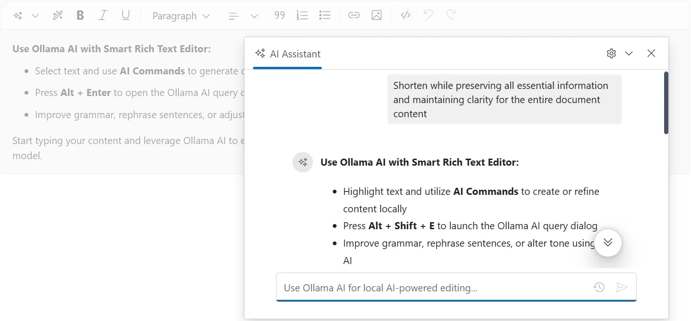

# Ollama Configuration

The Blazor Smart Rich Text Editor supports Ollama for running open-source models locally. This is ideal for privacy-conscious applications and development environments.

## What is Ollama?

Ollama is a lightweight, open-source framework for running large language models locally on your machine. It provides:

- **Privacy**: All processing happens locally
- **No API costs**: No cloud service fees
- **Offline capability**: Works without internet connection
- **Model variety**: Access to many open-source models
- **Easy setup**: Simple installation and management

## Prerequisites

* Windows 10/11, macOS, or Linux
* At least 8GB RAM (16GB+ recommended)
* GPU support optional but recommended for performance
* Docker (optional, for containerized deployment)

## Installation

### Step 1: Download and Install Ollama

Visit [Ollama's Official Website](https://ollama.com) and download the installer for your operating system.





1. Visit [Windows](https://ollama.com/download)
2. Click `Download for Windows` to get the `.exe installer`. 
3. Run `OllamaSetup.exe` and follow the wizard to install.





1. Visit [macOS](https://ollama.com/download/mac)
2. Click `Download for macOS` to get `.dmg file`
3. Install it by following the wizard.





1. Visit [Linux](https://ollama.com/download/linux)
2. Run the below command to install Ollama in your system

   ```bash
   curl https://ollama.ai/install.sh | sh
   ```





### Step 2: Verify Installation

Open a terminal/command prompt and verify:

```bash
ollama --version
```

### Step 3: Start Ollama Service





Ollama starts automatically. Access at `http://localhost:11434`





Start the Ollama service:

```bash
ollama serve
```





## Installing Models

### Available Models

Browse available models at [Ollama Library](https://ollama.com/library)

Popular models for text generation:

- **Mistral**: `mistral` - Fast, efficient
- **Llama 2**: `llama2` - General purpose
- **Neural Chat**: `neural-chat` - Conversational
- **Orca Mini**: `orca-mini` - Lightweight
- **Dolphin**: `dolphin-mixtral` - Advanced

### Install a Model

```bash
ollama pull mistral
```

This downloads and prepares the model (may take several minutes).

### List Installed Models

```bash
ollama list
```

### Run a Model Directly

Test the model:

```bash
ollama run mistral
```

Type your prompt and press Enter. Type `/bye` to exit.

## Configuration in Blazor

> **Note**: OllamaSharp is a community package for local model integration. Ensure compliance with your organization's policy on third-party NuGet packages before using in production.

## Setup the Smart Rich Text Editor Component

Follow the [Getting Started](https://blazor.syncfusion.com/documentation/smart-rich-text-editor/getting-started-webapp) guide to configure and render the Smart Rich Text Editor component in the application and that prerequisites are met.

## Install NuGet packages

Install the following NuGet packages to your project:

* [Microsoft.Extensions.AI](https://www.nuget.org/packages/Microsoft.Extensions.AI)
* [OllamaSharp](https://www.nuget.org/packages/OllamaSharp)

You can install these packages using different methods as shown below:





1. In Visual Studio Navigate to:

   **Tools → NuGet Package Manager → Manage NuGet Packages for Solution**
2. Search for the required packages.
3. Select the package and click **Install**.





1. In Visual Studio Navigate to:

   **Tools → NuGet Package Manager → Package Manager Console**
2. Run the following commands:




Install-Package Microsoft.Extensions.AI
Install-Package OllamaSharp








1. Open your project.
2. Open the terminal:
   - In Visual Studio Code: use the integrated terminal (<kbd>Ctrl</kbd> + <kbd>`</kbd>)
   - Or use any system terminal for CLI
3. Run the following commands:




dotnet add package Microsoft.Extensions.AI
dotnet add package OllamaSharp








### Setup in Program.cs




using Syncfusion.Blazor;
using Syncfusion.Blazor.AI;
using Microsoft.Extensions.AI;
using OllamaSharp;

var builder = WebApplication.CreateBuilder(args);

// Add services
builder.Services.AddRazorPages();
builder.Services.AddServerSideBlazor();
builder.Services.AddSyncfusionBlazor();

// Configure Ollama
string ollamaEndpoint = "http://localhost:11434";
string modelName = "mistral"; // or any other installed model

// Create Ollama client
IOllamaApiClient ollamaClient = new OllamaApiClient(ollamaEndpoint, modelName);

// Convert to IChatClient
IChatClient chatClient = (IChatClient)ollamaClient;

builder.Services.AddChatClient(chatClient);

// Register Smart Rich Text Editor Components with Azure OpenAI
builder.Services.AddSingleton<IChatInferenceService, SyncfusionAIService>();

var app = builder.Build();

// ... rest of setup




### Use Ollama AI with Smart Rich Text Editor Component




@using Syncfusion.Blazor.SmartRichTextEditor

<SfSmartRichTextEditor>
    <AssistViewSettings Placeholder="Use Ollama AI for local AI-powered editing..." />
    <div>
        <strong>Use Ollama AI with Smart Rich Text Editor:</strong>
        <ul>
            <li>Select text and use <b>AI Commands</b> to generate or refine content locally</li>
            <li>Press <b>Alt + Enter</b> to open the Ollama AI query dialog</li>
            <li>Improve grammar, rephrase sentences, or adjust tone using local AI</li>
        </ul>
        <p>
            Start typing your content and leverage Ollama AI to enhance writing quality, generate ideas, and optimize text directly within the editor using a local model.
        </p>
    </div>
</SfSmartRichTextEditor>






N> Running Ollama locally may lead to slower response times due to system resource usage.

## Troubleshooting

### Connection Issues

**Error: Unable to connect to Ollama**

1. Verify Ollama is running:
   ```bash
   curl http://localhost:11434/api/tags
   ```

2. Check endpoint configuration in Program.cs

3. If running on different machine, update endpoint URL

### Model Issues

**Model not found**
```bash
# List available models
ollama list

# Pull the model
ollama pull mistral
```

**Out of memory errors**
- Use smaller models (`orca-mini`, `mistral`)
- Close other applications
- Restart Ollama service

## See also

* [Getting Started with Smart Rich Text Editor](https://blazor.syncfusion.com/documentation/smart-rich-text-editor/getting-started-webapp)
* [OpenAI Configuration](https://blazor.syncfusion.com/documentation/smart-rich-text-editor/openai-service)
* [Azure OpenAI Configuration](https://blazor.syncfusion.com/documentation/smart-rich-text-editor/azure-openai-service)
* [Ollama Official Documentation](https://ollama.ai/docs)