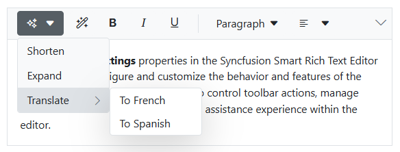
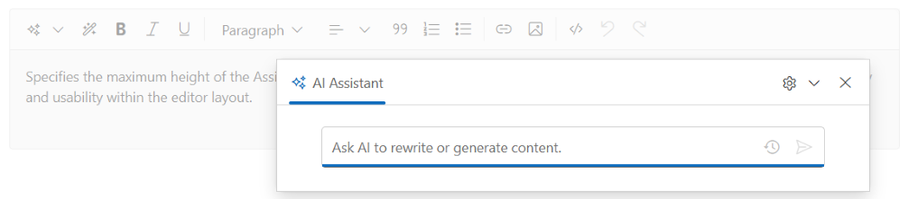
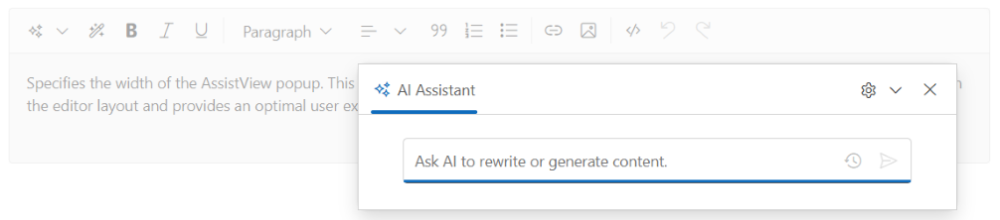
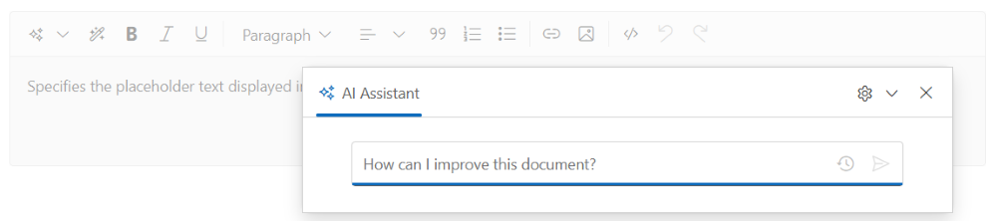
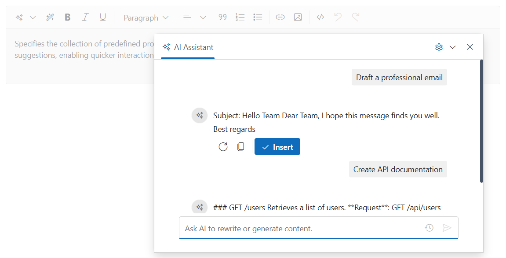
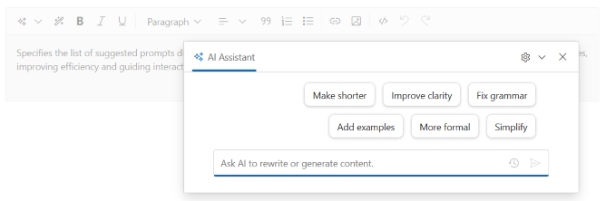
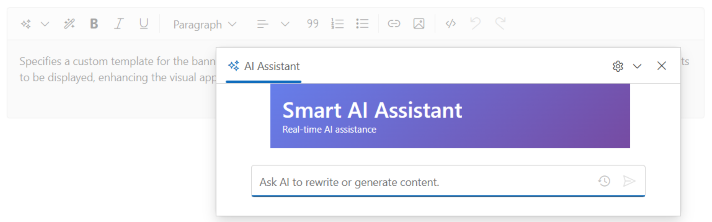
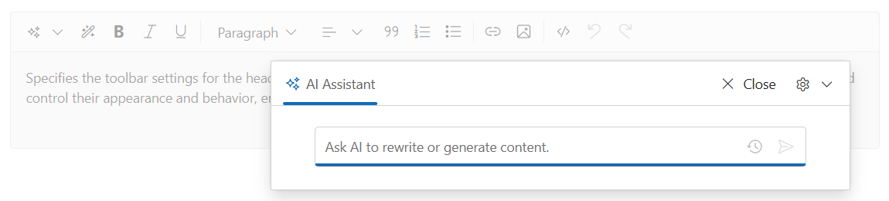
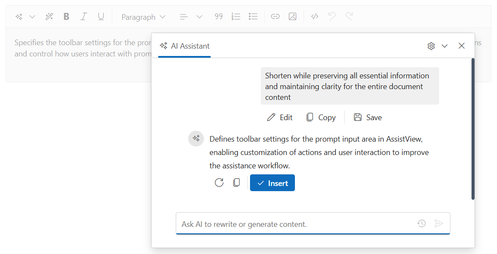
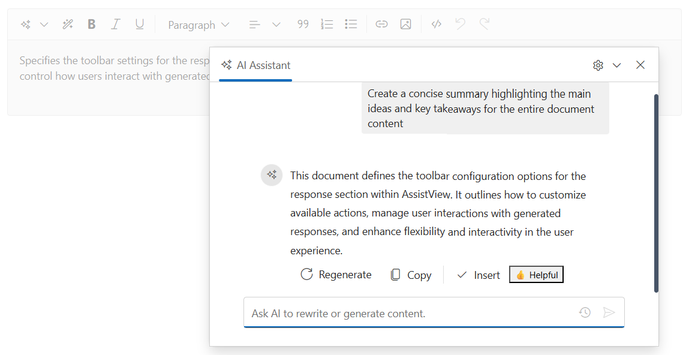

# AssistViewSettings Properties

## Commands
**Type:** `List<AICommands>`

Predefined AI actions displayed in the Smart Action dropdown.
Use the `Commands` property to configure each `AICommands` entry, including its display text, prompt template, and any nested options. By default, the AI Assistant prompt includes contextual information from the editor, such as the selected text or the entire document content.




@using Syncfusion.Blazor.SmartRichTextEditor

<SfSmartRichTextEditor>
    
The <strong>AssistViewSettings</strong> properties in the Syncfusion Smart Rich Text Editor enable you to configure and customize the behavior and features of the AssistView. These settings allow you to control toolbar actions, manage user interactions, and tailor the overall assistance experience within the editor.

    <AssistViewSettings Commands="@MyCommands" />
</SfSmartRichTextEditor>

@code {
    private List<AICommands> MyCommands = new()
    {
        new AICommands { Text = "Shorten", Prompt = "Make this shorter" },
        new AICommands { Text = "Expand", Prompt = "Add more details" },
        new AICommands
        {
            Text = "Translate",
            Prompt = "Translate the text",
            Items = new List<AICommands>
            {
                new AICommands { Text = "To French", Prompt = "Translate to French" },
                new AICommands { Text = "To Spanish", Prompt = "Translate to Spanish" }
            }
        }
    };
}




---

## PopupMaxHeight
**Type:** `string` | **Default:** `"400"`

Sets the maximum height of the AI Assistant popup. Accepts CSS height values or numbers (treated as pixels).




@using Syncfusion.Blazor.SmartRichTextEditor

<SfSmartRichTextEditor>
    
Specifies the maximum height of the AssistView popup. This property helps control the vertical size of the popup to ensure optimal display and usability within the editor layout.

    <AssistViewSettings PopupMaxHeight="80vh" />
</SfSmartRichTextEditor>




---

## PopupWidth
**Type:** `string` | **Default:** `"600"`

Sets the width of the AI Assistant popup. Accepts CSS width values or numbers (treated as pixels).




@using Syncfusion.Blazor.SmartRichTextEditor

<SfSmartRichTextEditor>
    
Specifies the width of the AssistView popup. This property allows you to control the horizontal size of the popup to ensure it fits well within the editor layout and provides an optimal user experience.

    <AssistViewSettings PopupWidth="550px" />
</SfSmartRichTextEditor>




---

## Placeholder
**Type:** `string` | **Default:** `"Ask AI to rewrite or generate content."`

Specifies the placeholder text shown in the AI Assistant prompt textarea.




@using Syncfusion.Blazor.SmartRichTextEditor

<SfSmartRichTextEditor>
    
Specifies the placeholder text displayed in the AssistView input area when no content is entered.

    <AssistViewSettings Placeholder="How can I improve this document?" />
</SfSmartRichTextEditor>




---

## Prompts
**Type:** `List<AssistViewPrompt>`

Defines a collection of predefined prompts and their corresponding responses. These prompt/response templates can be loaded into the AI Assistant to provide starter prompts or predefined workflows.




@using Syncfusion.Blazor.SmartRichTextEditor
@using Syncfusion.Blazor.InteractiveChat

<SfSmartRichTextEditor>
    
Specifies the collection of predefined prompts available in the AssistView. These prompts help guide users by providing ready-to-use suggestions, enabling quicker interactions and improving the overall assistance experience within the editor.

    <AssistViewSettings Prompts="@TemplatePrompts" />
</SfSmartRichTextEditor>

@code {
    private const string ApiDocResponse = @"### GET /users
Retrieves a list of users.

**Request**: GET /api/users

**Response Example**:
``json
{
  ""users"": []
}
``";

    private List<AssistViewPrompt> TemplatePrompts = new()
    {
        new AssistViewPrompt
        {
            Prompt = "Draft a professional email",
            Response = @"Subject: Hello Team Dear Team, I hope this message finds you well. Best regards"
        },
        new AssistViewPrompt
        {
            Prompt = "Create API documentation",
            Response = ApiDocResponse
        }
    };
}




---

## Suggestions
**Type:** `List<string>`

Defines suggestion prompts displayed in the AI Assistant popup.




@using Syncfusion.Blazor.SmartRichTextEditor

<SfSmartRichTextEditor>
    
Specifies the list of suggested prompts displayed in the AssistView. These suggestions help users quickly choose common actions or queries, improving efficiency and guiding interactions within the editor.

    <AssistViewSettings Suggestions="@QuickSuggestions" />
</SfSmartRichTextEditor>

@code {
    private List<string> QuickSuggestions = new()
    {
        "Make shorter",
        "Improve clarity",
        "Fix grammar",
        "Add examples",
        "More formal",
        "Simplify"
    };
}




---

## MaxPromptHistory
**Type:** `int` | **Default:** `20`

Defines the maximum number of conversation entries retained in the editor's history. When this limit is exceeded, the oldest entries are automatically removed.




@using Syncfusion.Blazor.SmartRichTextEditor

<SfSmartRichTextEditor>
    <!-- Store only 5 recent conversations -->
    <AssistViewSettings MaxPromptHistory="5" />
</SfSmartRichTextEditor>




---

## BannerTemplate

Specifies the template for the banner in the AI Assistant popup, useful for branding, status, or short instructions.




@using Syncfusion.Blazor.SmartRichTextEditor

<SfSmartRichTextEditor>
    
Specifies a custom template for the banner section in the AssistView. This property allows you to define personalized content or UI elements to be displayed, enhancing the visual appearance and user experience.
   
    <AssistViewSettings>
        <BannerTemplate>
            

                <h3 style="margin: 0;">Smart AI Assistant</h3>
                Real-time AI assistance
            

        </BannerTemplate>
    </AssistViewSettings>
</SfSmartRichTextEditor>




---

## HeaderToolbarSettings
**Type:** `RenderFragment?`

Configures the toolbar in the header section of the AI Assistant interface.




@using Syncfusion.Blazor.SmartRichTextEditor
@using Syncfusion.Blazor.InteractiveChat
@using Syncfusion.Blazor.Navigations

<SfSmartRichTextEditor>
    
Specifies the toolbar settings for the header section of the AssistView. This property allows you to configure the available toolbar items and control their appearance and behavior, enabling customized interactions within the AssistView.
    
    <AssistViewSettings>
        <HeaderToolbarSettings>
            <AssistViewToolbarItem Type="ItemType.Spacer" />
            <AssistViewToolbarItem Text="Close" IconCss="e-icons e-close" />
            <AssistViewToolbarItem Text="AI Commands" />
        </HeaderToolbarSettings>
    </AssistViewSettings>
</SfSmartRichTextEditor>




---

## PromptToolbarSettings
**Type:** `RenderFragment?`

Configures the toolbar below of the prompt input area section.




@using Syncfusion.Blazor.SmartRichTextEditor
@using Syncfusion.Blazor.InteractiveChat
@using Syncfusion.Blazor.Navigations

<SfSmartRichTextEditor>
    
Specifies the toolbar settings for the prompt input area in the AssistView. This property allows you to customize the available toolbar actions and control how users interact with prompts, enhancing the overall assistance workflow.

    <AssistViewSettings>
        <PromptToolbarSettings>
            <PromptToolbarItem Text="Edit" IconCss="e-icons e-assist-edit" Tooltip="Edit prompt" />
            <PromptToolbarItem Text="Copy" IconCss="e-icons e-assist-copy" Tooltip="Copy to clipboard" />
            <PromptToolbarItem Type="ItemType.Separator" />
            <PromptToolbarItem Text="Save" IconCss="e-icons e-save" />
        </PromptToolbarSettings>
    </AssistViewSettings>
</SfSmartRichTextEditor>




---

## ResponseToolbarSettings
**Type:** `RenderFragment?`

Configures the toolbar in the AI response viewer section.




@using Syncfusion.Blazor.SmartRichTextEditor
@using Syncfusion.Blazor.InteractiveChat
@using Syncfusion.Blazor.Navigations

<SfSmartRichTextEditor>
    
Specifies the toolbar settings for the response section in the AssistView. This property allows you to configure the available actions and control how users interact with generated responses, enabling a more flexible and interactive experience.

    <AssistViewSettings>
        <ResponseToolbarSettings>
            <ResponseToolbarItem Text="Regenerate" IconCss="e-icons e-refresh" />
            <ResponseToolbarItem Text="Copy" IconCss="e-icons e-copy" />
            <ResponseToolbarItem Type="ItemType.Separator" />
            <ResponseToolbarItem Text="Insert" IconCss="e-icons e-check" />
            <ResponseToolbarItem>
                <Template>
                    <button onclick="alert('Feedback saved')">👍 Helpful</button>
                </Template>
            </ResponseToolbarItem>
        </ResponseToolbarSettings>
    </AssistViewSettings>
</SfSmartRichTextEditor>




---

## See also

* [Methods](https://blazor.syncfusion.com/documentation/smart-rich-text-editor/method)
* [Appearance](https://blazor.syncfusion.com/documentation/smart-rich-text-editor/appearance)
* [Events](https://blazor.syncfusion.com/documentation/smart-rich-text-editor/events)