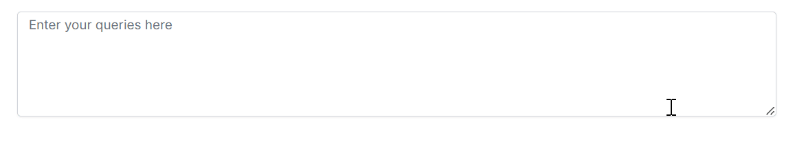

# Custom AI Service Integration with Blazor Smart TextArea

The Syncfusion Blazor Smart TextArea component leverages AI to provide context-aware autocompletion, typically using OpenAI or Azure OpenAI services. Developers can integrate custom AI services using the `IChatInferenceService` interface, which standardizes communication between the Smart TextArea and third-party AI providers. This section explains how to implement and register a custom AI service for the Smart TextArea.

## IChatInferenceService Interface

The `IChatInferenceService` interface defines a contract for integrating custom AI services with Syncfusion Smart Components. It enables the Smart TextArea to request and receive AI-generated responses.

```csharp
using Syncfusion.Blazor.AI;

public interface IChatInferenceService
{
    Task<string> GenerateResponseAsync(ChatParameters options);
}
```

- **Purpose**: Standardizes communication for AI-generated responses.
- **Parameters**: The `ChatParameters` type includes properties like user input and context (e.g., `UserRole`, `UserPhrases`).
- **Benefits**: Enables seamless switching between AI providers without modifying component code.

## Registering the Custom AI Service

Register the custom AI service in the **~/Program.cs** file of your Blazor Web App or Server App:

```csharp
using Microsoft.AspNetCore.Components;
using Microsoft.AspNetCore.Components.Web;
using Syncfusion.Blazor;
using Syncfusion.Blazor.AI;
using Syncfusion.Blazor.SmartComponents;

var builder = WebApplication.CreateBuilder(args);

builder.Services.AddRazorPages();
builder.Services.AddServerSideBlazor();
builder.Services.AddSyncfusionBlazor();
builder.Services.AddSyncfusionSmartComponents();
builder.Services.AddSingleton<IChatInferenceService, MockAIService>();

var app = builder.Build();
// ...
```

## Testing the Custom AI Integration

1. Implement and register the custom AI service as shown above.
2. Add the Smart TextArea component to your application.
3. Run the application using <kbd>Ctrl</kbd>+<kbd>F5</kbd> (Windows) or <kbd>⌘</kbd>+<kbd>F5</kbd> (macOS).
4. Type phrases like "thank" or "investigate" in the Smart TextArea to verify that the custom AI service generates appropriate responses.
5. Ensure suggestions appear as configured (e.g., inline or pop-up, based on the `ShowSuggestionOnPopup` setting).



## Implemented AI Services

Here are examples of AI services integrated using the `IChatInferenceService` interface:

| Service | Documentation |
|---------|---------------|
| Claude | [Claude Integration](claude-service) |
| DeepSeek | [DeepSeek Integration](deepseek-service) |
| Groq | [Groq Integration](groq-service) |
| Gemini | [Gemini Integration](gemini-service) |

## Troubleshooting

If the custom AI service does not work as expected, try the following:
- **No Suggestions Displayed**: Ensure the `IChatInferenceService` implementation is registered in **Program.cs** and returns valid responses. Check for errors in the `GenerateResponseAsync` method.
- **Dependency Issues**: Verify that all required NuGet packages (e.g., `Syncfusion.Blazor.SmartComponents`) are installed. Run `dotnet restore` to resolve dependencies.
- **Incorrect Responses**: Debug the custom AI service implementation to ensure it processes `ChatParameters` correctly and returns expected responses.

## See Also

- [Getting Started with Syncfusion Blazor Smart TextArea in Blazor Web App](https://blazor.syncfusion.com/documentation/smart-textarea/getting-started-webapp)
- [Getting Started with Syncfusion Blazor Smart TextArea in Blazor Server App](https://blazor.syncfusion.com/documentation/smart-textarea/getting-started)
- [Customizing Smart TextArea Suggestions](https://blazor.syncfusion.com/documentation/smart-textarea/customization)
