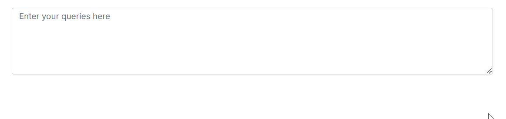
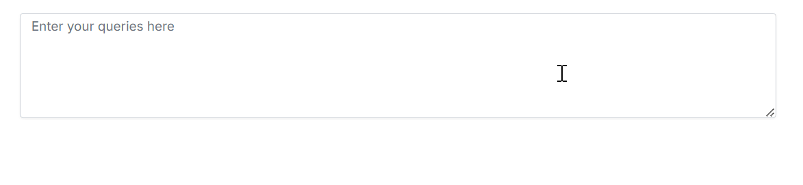

# Customizing Appearance of Suggestions 

The `ShowSuggestionOnPopup` attribute in Syncfusion<sup style="font-size:70%">&reg;</sup> Blazor Smart TextArea allows you to control how text suggestions are displayed to the users.

* If `ShowSuggestionOnPopup` is `true`, suggestions displayed in the pop-up window

```cshtml
@using Syncfusion.Blazor.SmartComponents

<SfSmartTextArea UserRole="@userRole" Placeholder="Enter your queries here" @bind-Value="prompt" Width="75%" RowCount="5" ShowSuggestionOnPopup="true">
</SfSmartTextArea>

@code {
    private string? prompt;
    public string userRole = "Maintainer of an open-source project replying to GitHub issues";
}
```



* If `ShowSuggestionOnPopup` is `false`, suggestions displayed inline.

```cshtml
@using Syncfusion.Blazor.SmartComponents

<SfSmartTextArea UserRole="@userRole" Placeholder="Enter your queries here" @bind-Value="prompt" Width="75%" RowCount="5" ShowSuggestionOnPopup="false">
</SfSmartTextArea>

@code {
    private string? prompt;
    public string userRole = "Maintainer of an open-source project replying to GitHub issues";
}
```



By default `ShowSuggestionOnPopup` is `false`.

## See also

* [Getting Started with Syncfusion<sup style="font-size:70%">&reg;</sup> Blazor Smart TextArea in Blazor Web App](https://blazor.syncfusion.com/documentation/)
* [Getting Started with Syncfusion<sup style="font-size:70%">&reg;</sup> Blazor Smart TextArea with in Blazor Server App](https://blazor.syncfusion.com/documentation/)
