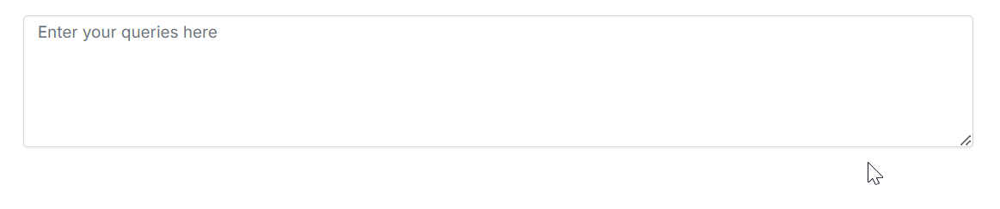

# Getting Started with Blazor Smart TextArea

The Syncfusion Blazor Smart TextArea component provides AI-powered autocompletion for context-aware text input, suitable for applications like issue trackers or customer support systems. This section explains how to integrate the component into a Blazor Web App using Visual Studio or Visual Studio Code.

To get started quickly, watch this video tutorial:







## Prerequisites

- .NET SDK 8.0 or later
- Visual Studio 2022 (version 17.0 or later)
- OpenAI or Azure OpenAI account
- [System requirements for Blazor components](https://blazor.syncfusion.com/documentation/system-requirements)

N> Syncfusion Blazor Smart Components support both OpenAI and Azure OpenAI and are compatible with Blazor Server Interactivity mode.

## Create a New Blazor Web App in Visual Studio

Create a **Blazor Web App** using Visual Studio 2022 with [Microsoft Templates](https://learn.microsoft.com/en-us/aspnet/core/blazor/tooling?view=aspnetcore-8.0) or the [Syncfusion Blazor Extension](https://blazor.syncfusion.com/documentation/visual-studio-integration/template-studio). Configure the app with the Server interactive render mode.

## Install Syncfusion Blazor SmartComponents and Themes NuGet Packages

To add the **Blazor Smart TextArea** component, open the NuGet package manager in Visual Studio (*Tools → NuGet Package Manager → Manage NuGet Packages for Solution*), search for, and install the following packages:
- [Syncfusion.Blazor.SmartComponents](https://www.nuget.org/packages?q=Syncfusion.Blazor.SmartComponents)
- [Syncfusion.Blazor.Themes](https://www.nuget.org/packages/Syncfusion.Blazor.Themes/)

Alternatively, use the Package Manager Console:




Install-Package Syncfusion.Blazor.SmartComponents -Version {{ site.releaseversion }}
Install-Package Syncfusion.Blazor.Themes -Version {{ site.releaseversion }}




N> Syncfusion Blazor components are available on [nuget.org](https://www.nuget.org/packages?q=syncfusion.blazor). Refer to [NuGet packages](https://blazor.syncfusion.com/documentation/nuget-packages) for a complete list of available packages and component details.





## Prerequisites

- .NET SDK 8.0 or later
- Visual Studio Code (version 1.60 or later)
- OpenAI or Azure OpenAI account
- [System requirements for Blazor components](https://blazor.syncfusion.com/documentation/system-requirements)

N> Syncfusion Blazor Smart Components support both OpenAI and Azure OpenAI and are compatible with Blazor Server Interactivity mode.

## Create a New Blazor Web App in Visual Studio Code

Create a **Blazor Web App** using Visual Studio Code with [Microsoft Templates](https://learn.microsoft.com/en-us/aspnet/core/blazor/tooling?view=aspnetcore-8.0&pivots=vsc) or the [Syncfusion Blazor Extension](https://blazor.syncfusion.com/documentation/visual-studio-code-integration/create-project). Configure the app with the Server interactive render mode using the following commands:




dotnet new blazor -o BlazorWebApp -int Server
cd BlazorWebApp
dotnet restore




N> For details on creating a Blazor Web App with various interactive render modes, refer to [Blazor Web App Render Modes](https://blazor.syncfusion.com/documentation/getting-started/blazor-web-app?tabcontent=visual-studio-code#render-interactive-modes).

## Install Syncfusion Blazor SmartComponents and Themes NuGet Packages

1. Open the integrated terminal in Visual Studio Code (<kbd>Ctrl</kbd>+<kbd>`</kbd>).
2. Ensure you are in the project root directory where the `.csproj` file is located.
3. Run the following commands to install the required NuGet packages for the Server render mode:




dotnet add package Syncfusion.Blazor.SmartComponents -v {{ site.releaseversion }}
dotnet add package Syncfusion.Blazor.Themes -v {{ site.releaseversion }}
dotnet restore




N> Syncfusion Blazor components are available on [nuget.org](https://www.nuget.org/packages?q=syncfusion.blazor). Refer to [NuGet packages](https://blazor.syncfusion.com/documentation/nuget-packages) for a complete list of available packages and component details.





## Register Syncfusion Blazor Service

For Server interactive render mode, open the **~/Components/_Imports.razor** file and add the following namespaces:




@using Syncfusion.Blazor
@using Syncfusion.Blazor.SmartComponents




Register the Syncfusion Blazor service in the **~/Program.cs** file:




using Microsoft.AspNetCore.Components;
using Microsoft.AspNetCore.Components.Web;
using Syncfusion.Blazor;

var builder = WebApplication.CreateBuilder(args);

// Add services to the container.
builder.Services.AddRazorPages();
builder.Services.AddServerSideBlazor();
builder.Services.AddSyncfusionBlazor();

var app = builder.Build();
....




## Configure AI Service

To enable AI-powered autocompletion in the Smart TextArea, configure an AI model (OpenAI, Azure OpenAI, or Ollama) in your application. Install the required NuGet packages and update the **~/Program.cs** file as described below.

### Install AI Service NuGet Packages

Install the following NuGet packages based on your chosen AI provider:




Install-Package Microsoft.Extensions.AI
Install-Package Microsoft.Extensions.AI.OpenAI
@* For Azure OpenAI only *@
Install-Package Azure.AI.OpenAI
@* For Ollama only *@
Install-Package OllamaSharp




### OpenAI Configuration

For OpenAI, obtain an API key from [OpenAI](https://help.openai.com/en/articles/4936850-where-do-i-find-my-openai-api-key) and specify the desired model (e.g., `gpt-3.5-turbo`, `gpt-4`). Store the API key securely in a configuration file or environment variable.

Add the following to the **~/Program.cs** file:




using Microsoft.AspNetCore.Components;
using Microsoft.AspNetCore.Components.Web;
using Syncfusion.Blazor;
using Syncfusion.Blazor.SmartComponents;
using Syncfusion.Blazor.AI;
using Microsoft.Extensions.AI;
using OpenAI;

var builder = WebApplication.CreateBuilder(args);

builder.Services.AddRazorPages();
builder.Services.AddServerSideBlazor();
builder.Services.AddSyncfusionBlazor();

string openAIApiKey = "API-KEY";
string openAIModel = "OPENAI_MODEL";
OpenAIClient openAIClient = new OpenAIClient(openAIApiKey);
IChatClient openAIChatClient = openAIClient.GetChatClient(openAIModel).AsIChatClient();
builder.Services.AddChatClient(openAIChatClient);

builder.Services.AddSyncfusionSmartComponents()
    .InjectOpenAIInference();

var app = builder.Build();
....




### Azure OpenAI Configuration

For Azure OpenAI, deploy a resource and model as described in [Azure OpenAI documentation](https://learn.microsoft.com/en-us/azure/ai-services/openai/how-to/create-resource). Obtain the API key, endpoint, and model name from your Azure portal.

Add the following to the **~/Program.cs** file:




using Microsoft.AspNetCore.Components;
using Microsoft.AspNetCore.Components.Web;
using Syncfusion.Blazor;
using Syncfusion.Blazor.SmartComponents;
using Syncfusion.Blazor.AI;
using Microsoft.Extensions.AI;
using Azure.AI.OpenAI;
using System.ClientModel;

var builder = WebApplication.CreateBuilder(args);

builder.Services.AddRazorPages();
builder.Services.AddServerSideBlazor();
builder.Services.AddSyncfusionBlazor();

string azureOpenAIKey = "AZURE_OPENAI_KEY";
string azureOpenAIEndpoint = "AZURE_OPENAI_ENDPOINT";
string azureOpenAIModel = "AZURE_OPENAI_MODEL";
AzureOpenAIClient azureOpenAIClient = new AzureOpenAIClient(
     new Uri(azureOpenAIEndpoint),
     new ApiKeyCredential(azureOpenAIKey)
);
IChatClient azureOpenAIChatClient = azureOpenAIClient.GetChatClient(azureOpenAIModel).AsIChatClient();
builder.Services.AddChatClient(azureOpenAIChatClient);

builder.Services.AddSyncfusionSmartComponents()
    .InjectOpenAIInference();

var app = builder.Build();
....




N> For versions 28.2.33 to 30.2.6, the Azure.AI.OpenAI package is not included in the SmartComponents dependency. Install the [Azure.AI.OpenAI](https://www.nuget.org/packages/Azure.AI.OpenAI) package separately. Refer to [Syncfusion version history](https://blazor.syncfusion.com/documentation/release-notes) for the latest dependency information.

### Ollama Configuration

To use Ollama for self-hosted models:

1. Download and install Ollama from [Ollama's official website](https://ollama.com).
2. Install a model from the [Ollama Library](https://ollama.com/library) (e.g., `llama2:13b`, `mistral:7b`).
3. Configure the endpoint URL (e.g., `http://localhost:11434`) and model name.

Add the following to the **~/Program.cs** file:




using Microsoft.AspNetCore.Components;
using Microsoft.AspNetCore.Components.Web;
using Syncfusion.Blazor;
using Syncfusion.Blazor.SmartComponents;
using Syncfusion.Blazor.AI;
using Microsoft.Extensions.AI;
using OllamaSharp;

var builder = WebApplication.CreateBuilder(args);

builder.Services.AddRazorPages();
builder.Services.AddServerSideBlazor();
builder.Services.AddSyncfusionBlazor();

string ModelName = "MODEL_NAME";
IChatClient chatClient = new OllamaApiClient("http://localhost:11434", ModelName);
builder.Services.AddChatClient(chatClient);

builder.Services.AddSyncfusionSmartComponents()
    .InjectOpenAIInference();

var app = builder.Build();
....




## Add Stylesheet and Script Resources

Reference the theme stylesheet and script via [Static Web Assets](https://blazor.syncfusion.com/documentation/appearance/themes#static-web-assets). Add the following to the **~/Components/App.razor** file:

```html
<head>
    ....
    <link href="_content/Syncfusion.Blazor.Themes/tailwind.css" rel="stylesheet" />
</head>

<body>
    ....
    <script src="_content/Syncfusion.Blazor.Core/scripts/syncfusion-blazor.min.js" type="text/javascript"></script>
</body>
```

N> Explore [Blazor Themes](https://blazor.syncfusion.com/documentation/appearance/themes) for details on referencing themes via [Static Web Assets](https://blazor.syncfusion.com/documentation/appearance/themes#static-web-assets), [CDN](https://blazor.syncfusion.com/documentation/appearance/themes#cdn-reference), or [CRG](https://blazor.syncfusion.com/documentation/common/custom-resource-generator). Refer to [Adding Script Reference](https://blazor.syncfusion.com/documentation/common/adding-script-references) for additional methods to include script references.

## Add Smart TextArea Component

The **UserRole** attribute (required) defines the context for AI autocompletion based on the user's role. The **UserPhrases** attribute (optional) provides predefined expressions aligned with the application's tone and common phrases.

Add the Syncfusion Blazor Smart TextArea component to the **~/Pages/Home.razor** file. The following example demonstrates autocompletion for GitHub issue responses:




@using Syncfusion.Blazor.SmartComponents

<SfSmartTextArea UserRole="@userRole" UserPhrases="@userPhrases" Placeholder="Enter your queries here" @bind-Value="prompt" Width="75%" RowCount="5">
</SfSmartTextArea>

@code {
    private string? prompt;
    // Defines the context for AI autocompletion
    public string userRole = "Maintainer of an open-source project replying to GitHub issues";
    // Predefined phrases for AI to suggest during typing
    public string[] userPhrases = [
        "Thank you for contacting us.",
        "To investigate, we will need a reproducible example as a public Git repository.",
        "Could you please post a screenshot of NEED_INFO?",
        "This sounds like a usage question. This issue tracker is intended for bugs and feature proposals. Unfortunately, we don't have the capacity to answer general usage questions and would recommend StackOverflow for a faster response.",
        "We do not accept ZIP files as reproducible examples.",
        "Bug report: File not found error occurred in NEED_INFO"
    ];
}




## Run and Test the Application

1. Press <kbd>Ctrl</kbd>+<kbd>F5</kbd> (Windows) or <kbd>⌘</kbd>+<kbd>F5</kbd> (macOS) to launch the application.
2. Type "To investigate" in the GitHub example or "Thank you" in the customer support example to test instant sentence autocompletion.
3. Verify that other phrases from the `userPhrases` array are suggested as you type related text.



N> [View Sample in GitHub](https://github.com/syncfusion/smart-ai-samples).

## Troubleshooting

If you encounter issues, try the following:
- **NuGet Installation Errors**: Ensure a stable internet connection and set the NuGet package source to `https://www.nuget.org`. Run `dotnet restore` again.
- **AI Service Configuration Errors**: Verify the API key, endpoint, and model name in **Program.cs**. Check for typos or incorrect values.
- **Component Not Rendering**: Confirm that the Syncfusion Blazor service is registered in **Program.cs** and the stylesheet/script references are correctly added in **App.razor**.
