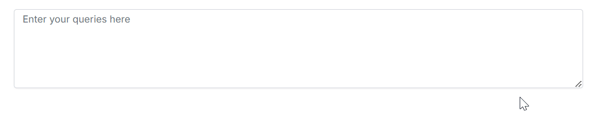

# Getting Started with Smart TextArea Component

This section briefly explains about how to include [Blazor Smart TextArea](https://www.syncfusion.com/blazor-components/blazor-smart-textarea) component in your Blazor Server App using Visual Studio.





## Prerequisites

* [System requirements for Blazor components](https://blazor.syncfusion.com/documentation/system-requirements)
* OpenAI or Azure OpenAI Account

N> Syncfusion<sup style="font-size:70%">&reg;</sup> Blazor Smart Components are compatible with both `OpenAI` and `Azure OpenAI`, and fully support Server Interactivity mode apps.

## Create a new Blazor App in Visual Studio

You can create a **Blazor Server App** using Visual Studio via [Microsoft Templates](https://learn.microsoft.com/en-us/aspnet/core/blazor/tooling?view=aspnetcore-7.0) or the [Syncfusion<sup style="font-size:70%">&reg;</sup> Blazor Extension](https://blazor.syncfusion.com/documentation/visual-studio-integration/template-studio).

## Install Syncfusion<sup style="font-size:70%">&reg;</sup> Blazor SmartComponents and Themes NuGet in the App

To add **Blazor Smart TextArea** component in the app, open the NuGet package manager in Visual Studio (*Tools → NuGet Package Manager → Manage NuGet Packages for Solution*), search and install [Syncfusion.Blazor.SmartComponents](https://www.nuget.org/packages?q=Syncfusion.Blazor.SmartComponents) and [Syncfusion.Blazor.Themes](https://www.nuget.org/packages/Syncfusion.Blazor.Themes/). Alternatively, you can utilize the following package manager command to achieve the same.




Install-Package Syncfusion.Blazor.SmartComponents -Version {{ site.releaseversion }}
Install-Package Syncfusion.Blazor.Themes -Version {{ site.releaseversion }}




N> Syncfusion<sup style="font-size:70%">&reg;</sup> Blazor components are available in [nuget.org](https://www.nuget.org/packages?q=syncfusion.blazor). Refer to [NuGet packages](https://blazor.syncfusion.com/documentation/nuget-packages) topic for available NuGet packages list with component details.





## Prerequisites

* [System requirements for Blazor components](https://blazor.syncfusion.com/documentation/system-requirements)
* OpenAI or Azure OpenAI Account

N> Syncfusion<sup style="font-size:70%">&reg;</sup> Blazor Smart Components are compatible with both `OpenAI` and `Azure OpenAI`, and fully support Server Interactivity mode apps.

## Create a new Blazor App in Visual Studio Code

You can create a **Blazor Server App** using Visual Studio Code via [Microsoft Templates](https://learn.microsoft.com/en-us/aspnet/core/blazor/tooling?view=aspnetcore-7.0&pivots=vsc) or the [Syncfusion<sup style="font-size:70%">&reg;</sup> Blazor Extension](https://blazor.syncfusion.com/documentation/visual-studio-code-integration/create-project).

Alternatively, you can create a Server application using the following command in the terminal(<kbd>Ctrl</kbd>+<kbd>`</kbd>).





dotnet new blazorserver -o BlazorApp
cd BlazorApp





## Install Syncfusion<sup style="font-size:70%">&reg;</sup> Blazor SmartComponents and Themes NuGet in the App

* Press <kbd>Ctrl</kbd>+<kbd>`</kbd> to open the integrated terminal in Visual Studio Code.
* Ensure you’re in the project root directory where your `.csproj` file is located.
* Run the following command to install a [Syncfusion.Blazor.SmartComponents](https://www.nuget.org/packages?q=Syncfusion.Blazor.SmartComponents) and [Syncfusion.Blazor.Themes](https://www.nuget.org/packages/Syncfusion.Blazor.Themes/) NuGet package and ensure all dependencies are installed.





dotnet add package Syncfusion.Blazor.SmartComponents -v {{ site.releaseversion }}
dotnet add package Syncfusion.Blazor.Themes -v {{ site.releaseversion }}
dotnet restore





N> Syncfusion<sup style="font-size:70%">&reg;</sup> Blazor components are available in [nuget.org](https://www.nuget.org/packages?q=syncfusion.blazor). Refer to [NuGet packages](https://blazor.syncfusion.com/documentation/nuget-packages) topic for available NuGet packages list with component details.





## Register Syncfusion<sup style="font-size:70%">&reg;</sup> Blazor Service

Open **~/_Imports.razor** file and import the `Syncfusion.Blazor` and `Syncfusion.Blazor.SmartComponents` namespace.




@using Syncfusion.Blazor
@using Syncfusion.Blazor.SmartComponents




Now, register the Syncfusion<sup style="font-size:70%">&reg;</sup> Blazor Service in the **~/Program.cs** file of your Blazor Server App.




using Microsoft.AspNetCore.Components;
using Microsoft.AspNetCore.Components.Web;
using Syncfusion.Blazor;

var builder = WebApplication.CreateBuilder(args);

// Add services to the container.
builder.Services.AddRazorPages();
builder.Services.AddServerSideBlazor();
builder.Services.AddSyncfusionBlazor();

var app = builder.Build();
....




## Configure AI Service

Follow the instructions below to register an AI model in your application.

### OpenAI

For **OpenAI**, create an API key and place it at `openAiApiKey`. The value for `openAiModel` is the model you wish to use (e.g., `gpt-3.5-turbo`, `gpt-4`, etc.).

* Install the following NuGet packages to your project:





Install-Package Microsoft.Extensions.AI
Install-Package Microsoft.Extensions.AI.OpenAI





* To configure the AI service, add the following settings to the **~/Program.cs** file in your Blazor Server app.




using Syncfusion.Blazor.SmartComponents;
using Syncfusion.Blazor.AI;
using Microsoft.Extensions.AI;
using OpenAI;
var builder = WebApplication.CreateBuilder(args);

....

builder.Services.AddSyncfusionBlazor();

string openAiApiKey = "API-KEY";
string openAiModel = "OPENAI_MODEL";
OpenAIClient openAIClient = new OpenAIClient(openAiApiKey);
IChatClient openAiChatClient = openAIClient.GetChatClient(openAiModel).AsIChatClient();
builder.Services.AddChatClient(openAiChatClient);

builder.Services.AddSyncfusionSmartComponents()
.InjectOpenAIInference();

var app = builder.Build();
....




### Azure OpenAI

For **Azure OpenAI**, first [deploy an Azure OpenAI Service resource and model](https://learn.microsoft.com/en-us/azure/ai-services/openai/how-to/create-resource), then values for `azureOpenAiKey`, `azureOpenAiEndpoint` and `azureOpenAiModel` will all be provided to you.

* Install the following NuGet packages to your project:





Install-Package Microsoft.Extensions.AI
Install-Package Microsoft.Extensions.AI.OpenAI
Install-Package Azure.AI.OpenAI





* To configure the AI service, add the following settings to the **~/Program.cs** file in your Blazor Server app.




using Syncfusion.Blazor.SmartComponents;
using Syncfusion.Blazor.AI;
using Azure.AI.OpenAI;
using Microsoft.Extensions.AI;
using System.ClientModel;

var builder = WebApplication.CreateBuilder(args);

....

builder.Services.AddSyncfusionBlazor();

string azureOpenAiKey = "AZURE_OPENAI_KEY";
string azureOpenAiEndpoint = "AZURE_OPENAI_ENDPOINT";
string azureOpenAiModel = "AZURE_OPENAI_MODEL";
AzureOpenAIClient azureOpenAIClient = new AzureOpenAIClient(
     new Uri(azureOpenAiEndpoint),
     new ApiKeyCredential(azureOpenAiKey)
);
IChatClient azureOpenAiChatClient = azureOpenAIClient.GetChatClient(azureOpenAiModel).AsIChatClient();
builder.Services.AddChatClient(azureOpenAiChatClient);

builder.Services.AddSyncfusionSmartComponents()
.InjectOpenAIInference();

var app = builder.Build();
....





N> From version 28.2.33 to 30.2.6, the Azure.AI.OpenAI package has been removed from the SmartComponents dependency. To use Azure OpenAI, please install the [Azure.AI.OpenAI](https://www.nuget.org/packages/Azure.AI.OpenAI) package separately in your Blazor application.

### Ollama

To use Ollama for running self-hosted models:

1. **Download and install Ollama**  
   Visit [Ollama's official website](https://ollama.com) and install the application appropriate for your operating system.

2. **Install the desired model from the Ollama library**  
   You can browse and install models from the [Ollama Library](https://ollama.com/library) (e.g., `llama2:13b`, `mistral:7b`, etc.).

3. **Configure your application**

   - Provide the `Endpoint` URL where the model is hosted (e.g., `http://localhost:11434`).
   - Set `ModelName` to the specific model you installed (e.g., `llama2:13b`).

* Install the following NuGet packages to your project:





Install-Package Microsoft.Extensions.AI
Install-Package OllamaSharp





* Add the following settings to the **~/Program.cs** file in your Blazor Server app.




using Syncfusion.Blazor.SmartComponents;
using Syncfusion.Blazor.AI;
using Microsoft.Extensions.AI;
using OllamaSharp;
var builder = WebApplication.CreateBuilder(args);

....

builder.Services.AddSyncfusionBlazor();

string ModelName = "MODEL_NAME";
IChatClient chatClient = new OllamaApiClient("http://localhost:11434", ModelName);
builder.Services.AddChatClient(chatClient);

builder.Services.AddSyncfusionSmartComponents()
.InjectOpenAIInference();

var app = builder.Build();
....




## Add stylesheet and script resources

The theme stylesheet and script can be accessed from NuGet through [Static Web Assets](https://blazor.syncfusion.com/documentation/appearance/themes#static-web-assets). Reference the stylesheet and script in the `<head>` of the main page as follows:

* For **.NET 6** Blazor Server app, include it in **~/Pages/_Layout.cshtml** file.

* For **.NET 9 and .NET 8** Blazor Server app, include it in the **~/Components/App.razor** file.

```html
<head>
    ....
    <link href="_content/Syncfusion.Blazor.Themes/tailwind.css" rel="stylesheet" />
</head>

<body>
    ....
    <script src="_content/Syncfusion.Blazor.Core/scripts/syncfusion-blazor.min.js" type="text/javascript"></script>
</body>
```

N> Check out the [Blazor Themes](https://blazor.syncfusion.com/documentation/appearance/themes) topic to discover various methods ([Static Web Assets](https://blazor.syncfusion.com/documentation/appearance/themes#static-web-assets), [CDN](https://blazor.syncfusion.com/documentation/appearance/themes#cdn-reference), and [CRG](https://blazor.syncfusion.com/documentation/common/custom-resource-generator)) for referencing themes in your Blazor application. Also, check out the [Adding Script Reference](https://blazor.syncfusion.com/documentation/common/adding-script-references) topic to learn different approaches for adding script references in your Blazor application.

## Add Syncfusion<sup style="font-size:70%">&reg;</sup> Blazor Smart TextArea component

Add the Syncfusion<sup style="font-size:70%">&reg;</sup> **Blazor Smart TextArea** component in the **~/Pages/Index.razor** file.




@using Syncfusion.Blazor.SmartComponents

<SfSmartTextArea UserRole="@userRole" UserPhrases="@userPhrases" Placeholder="Enter your queries here" @bind-Value="prompt" Width="75%" RowCount="5">
</SfSmartTextArea>

@code {
    private string? prompt;
    public string userRole = "Maintainer of an open-source project replying to GitHub issues";
    public string[] userPhrases = [
        "Thank you for contacting us.",
        "To investigate, We will need a reproducible example as a public Git repository.",
        "Could you please post a screenshot of NEED_INFO?",
        "This sounds like a usage question. This issue tracker is intended for bugs and feature proposals. Unfortunately, we don't have the capacity to answer general usage questions and would recommend StackOverflow for a faster response.",
        "We do not accept ZIP files as reproducible examples.",
        "Bug report: File not found error occurred in NEED_INFO"
    ];
}




* Press <kbd>Ctrl</kbd>+<kbd>F5</kbd> (Windows) or <kbd>⌘</kbd>+<kbd>F5</kbd> (macOS) to launch the application. This will render the Syncfusion<sup style="font-size:70%">&reg;</sup> Blazor Smart TextArea component in your default web browser.

* Type 'To investigate' to experience instant sentence autocompletion.



N> [View Sample in GitHub](https://github.com/syncfusion/smart-ai-samples).

## See also

* [Getting Started with Syncfusion<sup style="font-size:70%">&reg;</sup> Blazor Smart TextArea in Blazor Web App](https://blazor.syncfusion.com/documentation/smart-textarea/getting-started)
