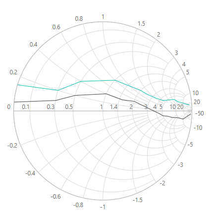

# Getting Started with Blazor Smith Chart in Blazor Web App

This section briefly explains about how to include [Blazor Smith Chart](https://www.syncfusion.com/blazor-components/blazor-smith-chart) component in your Blazor Web App using [Visual Studio](https://visualstudio.microsoft.com/vs/).

## Prerequisites

* [System requirements for Blazor components](https://blazor.syncfusion.com/documentation/system-requirements)

## Create a new Blazor Web App

You can create a **Blazor Web App** using Visual Studio 2022 via [Microsoft Templates](https://learn.microsoft.com/en-us/aspnet/core/blazor/tooling?view=aspnetcore-8.0) or the [Syncfusion Blazor Extension](https://blazor.syncfusion.com/documentation/visual-studio-integration/template-studio).

You need to configure the corresponding [Interactive render mode](https://learn.microsoft.com/en-us/aspnet/core/blazor/components/render-modes?view=aspnetcore-8.0#render-modes) and [Interactivity location](https://learn.microsoft.com/en-us/aspnet/core/blazor/tooling?view=aspnetcore-8.0&pivots=windows) while creating a Blazor Web Application.

## Install Syncfusion Blazor SmithChart NuGet in the App

To add **Blazor Smith Chart** component in the app, open the NuGet package manager in Visual Studio (*Tools → NuGet Package Manager → Manage NuGet Packages for Solution*), search and install [Syncfusion.Blazor.SmithChart](https://www.nuget.org/packages/Syncfusion.Blazor.SmithChart).

If you utilize `WebAssembly or Auto` render modes in the Blazor Web App need to be install Syncfusion Blazor components NuGet packages within the client project.

Alternatively, you can utilize the following package manager command to achieve the same.




Install-Package Syncfusion.Blazor.SmithChart -Version {{ site.releaseversion }}




N> Syncfusion Blazor components are available in [nuget.org](https://www.nuget.org/packages?q=syncfusion.blazor). Refer to [NuGet packages](https://blazor.syncfusion.com/documentation/nuget-packages) topic for available NuGet packages list with component details.

## Register Syncfusion Blazor Service

Open **~/_Imports.razor** file and import the `Syncfusion.Blazor` and `Syncfusion.Blazor.Charts` namespace .

```cshtml

@using Syncfusion.Blazor
@using Syncfusion.Blazor.Charts

```

Now, register the Syncfusion Blazor Service in the **~/Program.cs** file of your Blazor Web App.

If you select an **Interactive render mode** as `WebAssembly` or `Auto`, you need to register the Syncfusion Blazor service in both **~/Program.cs** files of your Blazor Web App.

```cshtml

....
using Syncfusion.Blazor;
....
builder.Services.AddSyncfusionBlazor();
....

```

## Add script resources

The script can be accessed from NuGet through [Static Web Assets](https://blazor.syncfusion.com/documentation/appearance/themes#static-web-assets). Include the script reference at the end of the `<body>` in the ~/Components/App.razor file as shown below:

```html
<body>
    ....
    <script src="_content/Syncfusion.Blazor.Core/scripts/syncfusion-blazor.min.js" type="text/javascript"></script>
</body>
```

N> Check out the [Adding Script Reference](https://blazor.syncfusion.com/documentation/common/adding-script-references) topic to learn different approaches for adding script references in your Blazor application.

## Add Syncfusion Blazor Smith Chart component

Add the Syncfusion Blazor Smith Chart component in the **~Pages/.razor** file. If an interactivity location as `Per page/component` in the web app, define a render mode at the top of the `~Pages/.razor` component, as follows:




@* desired render mode define here *@
@rendermode InteractiveAuto







<SfSmithchart>

</SfSmithchart>




## Adding series to Blazor Smith Chart

`Smith Chart` series can be added in two ways. Use either [Points](https://help.syncfusion.com/cr/blazor/Syncfusion.Blazor.Charts.SmithChartSeries.html#Syncfusion_Blazor_Charts_SmithChartSeries_Points) or [Datasource](https://help.syncfusion.com/cr/blazor/Syncfusion.Blazor.Charts.SmithChartSeries.html#Syncfusion_Blazor_Charts_SmithChartSeries_DataSource) in the [SmithChartSeries](https://help.syncfusion.com/cr/blazor/Syncfusion.Blazor.Charts.SmithChartSeries.html).

If you add using [Datasource](https://help.syncfusion.com/cr/blazor/Syncfusion.Blazor.Charts.SmithChartSeries.html#Syncfusion_Blazor_Charts_SmithChartSeries_DataSource) property, additionally you need to specify data source mapping fields using [Reactance](https://help.syncfusion.com/cr/blazor/Syncfusion.Blazor.Charts.SmithChartSeries.html#Syncfusion_Blazor_Charts_SmithChartSeries_Reactance) and [Resistance](https://help.syncfusion.com/cr/blazor/Syncfusion.Blazor.Charts.SmithChartSeries.html#Syncfusion_Blazor_Charts_SmithChartSeries_Resistance) properties.

If you are using [Points](https://help.syncfusion.com/cr/blazor/Syncfusion.Blazor.Charts.SmithChartSeries.html#Syncfusion_Blazor_Charts_SmithChartSeries_Points), you don't need to specify mapping fields as like in [DataSource](https://help.syncfusion.com/cr/blazor/Syncfusion.Blazor.Charts.SmithChartSeries.html#Syncfusion_Blazor_Charts_SmithChartSeries_DataSource). But the [Points](https://help.syncfusion.com/cr/blazor/Syncfusion.Blazor.Charts.SmithChartSeries.html#Syncfusion_Blazor_Charts_SmithChartSeries_Points) collection should be `SmithChartPoint` type and define `Resistance` and `Reactance` properties mandatorily.

The following sample demonstrates adding two series to Smith Chart in both ways.

* First series `Transmission1` shows `DataSource` bound series.
* Second series `Transmission2` shows `Points` bound series.




<SfSmithChart>
    <SmithChartSeriesCollection>
        <SmithChartSeries Name="Transmission1"
                          Reactance="Reactance"
                          Resistance="Resistance"
                          DataSource="@FirstTransmissionSeries">
        </SmithChartSeries>
        <SmithChartSeries Name="Transmission2"
                          Points="@SecondTransmissionSeries">
        </SmithChartSeries>
    </SmithChartSeriesCollection>
</SfSmithChart>

@code {
    public class SmithDataSource
    {
        public double Resistance { get; set; }
        public double Reactance { get; set; }
    };
    public List<SmithDataSource> FirstTransmissionSeries = new List<SmithDataSource> {
        new SmithDataSource { Resistance= 10, Reactance= 25 },
        new SmithDataSource { Resistance= 8, Reactance= 6 },
        new SmithDataSource { Resistance= 6, Reactance= 4.5 },
        new SmithDataSource { Resistance= 4.5, Reactance= 2 },
        new SmithDataSource { Resistance= 3.5, Reactance= 1.6 },
        new SmithDataSource { Resistance= 2.5, Reactance= 1.3 },
        new SmithDataSource { Resistance= 2, Reactance= 1.2 },
        new SmithDataSource { Resistance= 1.5, Reactance= 1 },
        new SmithDataSource { Resistance= 1, Reactance= 0.8 },
        new SmithDataSource { Resistance= 0.5, Reactance= 0.4 },
        new SmithDataSource { Resistance= 0.3, Reactance= 0.2 },
        new SmithDataSource { Resistance= 0.001, Reactance= 0.15 }
    };
    public List<SmithChartPoint> SecondTransmissionSeries = new List<SmithChartPoint> {
        new SmithChartPoint { Resistance= 20, Reactance= -50 },
        new SmithChartPoint { Resistance= 10, Reactance= -10 },
        new SmithChartPoint { Resistance= 9, Reactance= -4.5 },
        new SmithChartPoint { Resistance= 8, Reactance= -3.5 },
        new SmithChartPoint { Resistance= 7, Reactance= -2.5 },
        new SmithChartPoint { Resistance= 6, Reactance= -1.5 },
        new SmithChartPoint { Resistance= 5, Reactance= -1 },
        new SmithChartPoint { Resistance= 4.5, Reactance= -0.5 },
        new SmithChartPoint { Resistance= 2, Reactance= 0.5 },
        new SmithChartPoint { Resistance= 1.5, Reactance= 0.4 },
        new SmithChartPoint { Resistance= 1, Reactance= 0.4 },
        new SmithChartPoint { Resistance= 0.5, Reactance= 0.2 },
        new SmithChartPoint { Resistance= 0.3, Reactance= 0.1 },
        new SmithChartPoint { Resistance= 0.001, Reactance= 0.05 }
    };
}




Press <kbd>Ctrl</kbd>+<kbd>F5</kbd> (Windows) or <kbd>⌘</kbd>+<kbd>F5</kbd> (macOS) to launch the application. This will render the Syncfusion Blazor Smith Chart component in your default web browser.



N> [View Sample in GitHub](https://github.com/SyncfusionExamples/Blazor-Getting-Started-Examples/tree/main/SmithChart/BlazorWebApp).

## Adding Title

Title can be added to the Smith Chart to provide a quick information to the users about the context of the rendered component. Add a title by using the [Text](https://help.syncfusion.com/cr/blazor/Syncfusion.Blazor.Charts.SmithChartTitle.html#Syncfusion_Blazor_Charts_SmithChartTitle_Text) property in the [SmithChartTitle](https://help.syncfusion.com/cr/blazor/Syncfusion.Blazor.Charts.SmithChartTitle.html).




<SfSmithChart>
    <SmithChartTitle Text="Impedance Transmission">
    </SmithChartTitle>
    <SmithChartSeriesCollection>
        <SmithChartSeries Name="Transmission1"
                          Reactance="Reactance"
                          Resistance="Resistance"
                          DataSource="@FirstTransmissionSeries">
        </SmithChartSeries>
        <SmithChartSeries Name="Transmission2"
                          Points="@SecondTransmissionSeries">
        </SmithChartSeries>
    </SmithChartSeriesCollection>
</SfSmithChart>




N> Refer to the [code block](#adding-series-to-smith-chart) to know about the property value of `FirstTransmissionSeries` and `SecondTransmissionSeries`.


## Enable Marker

To display marker for particular series, set the [Visible](https://help.syncfusion.com/cr/blazor/Syncfusion.Blazor.Charts.SmithChartSeriesMarker.html#Syncfusion_Blazor_Charts_SmithChartSeriesMarker_Visible) property to **true** in the [SmithChartSeriesMarker](https://help.syncfusion.com/cr/blazor/Syncfusion.Blazor.Charts.SmithChartSeriesMarker.html).




<SfSmithChart>
    <SmithChartTitle Text="Impedance Transmission">
    </SmithChartTitle>
    <SmithChartSeriesCollection>
        <SmithChartSeries Name="Transmission1"
                          Reactance="Reactance"
                          Resistance="Resistance"
                          DataSource="@FirstTransmissionSeries">
            <SmithChartSeriesMarker Visible="true"></SmithChartSeriesMarker>
        </SmithChartSeries>
        <SmithChartSeries Name="Transmission2"
                          Points="@SecondTransmissionSeries">
        </SmithChartSeries>
    </SmithChartSeriesCollection>
</SfSmithChart>




N> Refer to the [code block](#adding-series-to-smith-chart) to know about the property value of `FirstTransmissionSeries` and `SecondTransmissionSeries`.


## Enable Data Label

To display data label for particular marker series, set the [Visible](https://help.syncfusion.com/cr/blazor/Syncfusion.Blazor.Charts.SmithChartSeriesDatalabel.html#Syncfusion_Blazor_Charts_SmithChartSeriesDatalabel_Visible) property to **true** in the [SmithChartSeriesDatalabel](https://help.syncfusion.com/cr/blazor/Syncfusion.Blazor.Charts.SmithChartSeriesDatalabel.html).




<SfSmithChart>
    <SmithChartTitle Text="Impedance Transmission">
    </SmithChartTitle>
    <SmithChartSeriesCollection>
        <SmithChartSeries Name="Transmission1"
                          Reactance="Reactance"
                          Resistance="Resistance"
                          DataSource="@FirstTransmissionSeries">
            <SmithChartSeriesMarker Visible="true">
                <SmithChartSeriesDatalabel Visible="true">
                </SmithChartSeriesDatalabel>
            </SmithChartSeriesMarker>
        </SmithChartSeries>
        <SmithChartSeries Name="Transmission2" Points="@SecondTransmissionSeries">
        </SmithChartSeries>
    </SmithChartSeriesCollection>
</SfSmithChart>




N> Refer to the [code block](#adding-series-to-smith-chart) to know the property value of `FirstTransmissionSeries` and `SecondTransmissionSeries`.


## Enable Legend

Use legend for the Smith Chart by setting the [Visible](https://help.syncfusion.com/cr/blazor/Syncfusion.Blazor.Charts.SmithChartLegendSettings.html#Syncfusion_Blazor_Charts_SmithChartLegendSettings_Visible) property to **true** in the [SmithChartLegendSettings](https://help.syncfusion.com/cr/blazor/Syncfusion.Blazor.Charts.SmithChartLegendSettings.html). The legend name can be changed by using the [Name](https://help.syncfusion.com/cr/blazor/Syncfusion.Blazor.Charts.SmithchartSeries.html#Syncfusion_Blazor_Charts_SmithChartSeries_Name) property in the [SmithChartSeries](https://help.syncfusion.com/cr/blazor/Syncfusion.Blazor.Charts.SmithchartSeries.html).




<SfSmithChart>
    <SmithChartLegendSettings Visible="true"></SmithChartLegendSettings>
    <SmithChartTitle Text="Impedance Transmission"></SmithChartTitle>
    <SmithChartSeriesCollection>
        <SmithChartSeries Name="Transmission1"
                          Reactance="Reactance"
                          Resistance="Resistance"
                          DataSource="@FirstTransmissionSeries">
            <SmithChartSeriesMarker Visible="true">
                <SmithChartSeriesDatalabel Visible="true">
                </SmithChartSeriesDatalabel>
            </SmithChartSeriesMarker>
        </SmithChartSeries>
        <SmithChartSeries Name="Transmission2" Points="@SecondTransmissionSeries">
        </SmithChartSeries>
    </SmithChartSeriesCollection>
</SfSmithChart>




N> Refer to the [code block](#adding-series-to-smith-chart) to know the property value of the `FirstTransmissionSeries` and the `SecondTransmissionSeries`.


## Enable Tooltip

When space constraints prevents from displaying information using data labels, the tooltip comes in handy. The tooltip can be enabled by setting the [Visible](https://help.syncfusion.com/cr/blazor/Syncfusion.Blazor.Charts.SmithChartSeriesTooltip.html#Syncfusion_Blazor_Charts_SmithChartSeriesTooltip_Visible) property to **true** in the [SmithChartSeriesTooltip](https://help.syncfusion.com/cr/blazor/Syncfusion.Blazor.Charts.SmithChartSeriesTooltip.html).




<SfSmithChart>
    <SmithChartLegendSettings Visible="true"></SmithChartLegendSettings>
    <SmithChartTitle Text="Impedance Transmission"></SmithChartTitle>
    <SmithChartSeriesCollection>
        <SmithChartSeries Name="Transmission1"
                          Reactance="Reactance"
                          Resistance="Resistance"
                          DataSource="@FirstTransmissionSeries">
            <SmithChartSeriesMarker Visible="true">
                <SmithChartSeriesDatalabel Visible="true">
                </SmithChartSeriesDatalabel>
            </SmithChartSeriesMarker>
            <SmithChartSeriesTooltip Visible="true">
            </SmithChartSeriesTooltip>
        </SmithChartSeries>
        <SmithChartSeries Name="Transmission2" Points="@SecondTransmissionSeries">
        </SmithChartSeries>
    </SmithChartSeriesCollection>
</SfSmithChart>




N> Refer to the [code block](#adding-series-to-smith-chart) to know about the property value of the `FirstTransmissionSeries` and the `SecondTransmissionSeries`.


## See also

* [Getting Started with Syncfusion Blazor for Client-Side in .NET Core CLI](https://blazor.syncfusion.com/documentation/getting-started/blazor-webassembly-dotnet-cli)

* [Getting Started with Syncfusion Blazor for Server-Side in Visual Studio](https://blazor.syncfusion.com/documentation/getting-started/blazor-server-side-visual-studio)

* [Getting Started with Syncfusion Blazor for Server-Side in .NET Core CLI](https://blazor.syncfusion.com/documentation/getting-started/blazor-server-side-dotnet-cli)