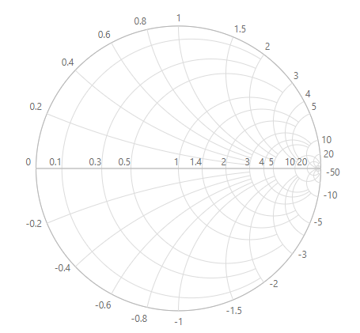
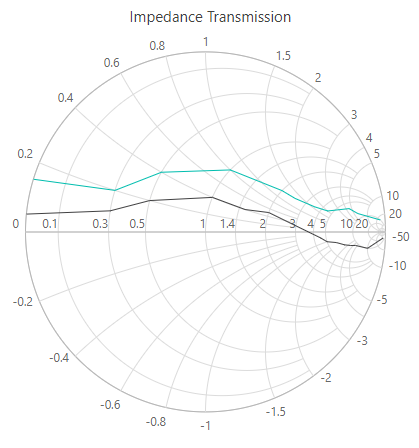
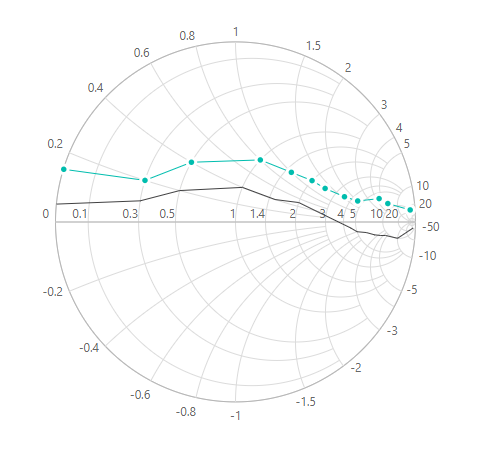
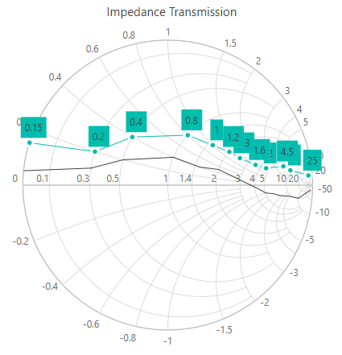
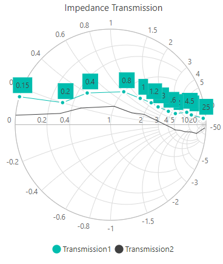
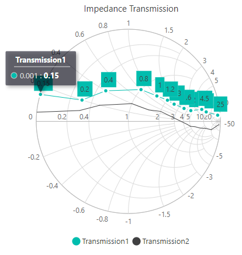

# Getting Started with Blazor Smith Chart Component

This section briefly explains how to include a Smith Chart component in the Blazor server-side application. Refer to the [Getting Started with Syncfusion Blazor for server-side in Visual Studio 2019](https://blazor.syncfusion.com/documentation/getting-started/blazor-server-side-visual-studio-2019/) page for introduction and configuring common specifications.

## Importing Syncfusion Blazor Smith Chart component in the application

1. Install **Syncfusion.Blazor** NuGet package to the application by using the **NuGet Package Manager**.

2. Add the client-side resources through CDN or from NuGet package in the **HEAD** element of the **~/Pages/_Host.cshtml** page.

    ```html
    <head>
        <link href="_content/Syncfusion.Blazor.Themes/bootstrap4.css" rel="stylesheet" />
        <!---CDN--->
        @*<link href="https://cdn.syncfusion.com/blazor/{:version:}/styles/bootstrap4.css" rel="stylesheet" />*@
    </head>
    ```

    > For the Internet Explorer 11, kindly refer to the polyfills. Refer to the [documentation](https://blazor.syncfusion.com/blazor/documentation/common/how-to/render-blazor-server-app-in-ie/) for more information.

    ```html
    <head>
        <link href="https://cdn.syncfusion.com/blazor/{:version:}/styles/bootstrap4.css" rel="stylesheet" />
        <script src="https://github.com/Daddoon/Blazor.Polyfill/releases/download/3.0.1/blazor.polyfill.min.js"></script>
    </head>
    ```

## Adding component package to the application

Open the **~/_Imports.razor** file and include the **Syncfusion.Blazor.Charts** namespace.

```cshtml
@using Syncfusion.Blazor.Charts
```

## Adding SyncfusionBlazor service in Startup.cs

Open the **Startup.cs** file and add the services required by Syncfusion components using the **services.AddSyncfusionBlazor()** method. Add this method in the **ConfigureServices** function as follows.

```csharp
using Syncfusion.Blazor;

namespace BlazorApplication
{
    public class Startup
    {
        ....
        ....
        public void ConfigureServices(IServiceCollection services)
        {
            ....
            ....
            services.AddSyncfusionBlazor();
        }
    }
}
```

> To enable custom client-side source loading from CRG or CDN, please refer to the section about [custom resources in Blazor application](https://blazor.syncfusion.com/documentation/common/custom-resource-generator/#how-to-use-custom-resources-in-the-blazor-application).

## Adding Smith Chart component

To initialize the Smith Chart component, add the below code to the **Index.razor** view page under **~/Pages** folder. In a new application, if **Index.razor** page has any default content template, then those content can be completely removed and following code can be added.

```cshtml
@page "/"

<SfSmithchart>

</SfSmithchart>
```

On successful compilation of the application, the Syncfusion Blazor Smith Chart component will render in the web browser as following.



## Adding series to Smith Chart

`Smith Chart` series can be added in two ways. Use either [`Points`](https://help.syncfusion.com/cr/blazor/Syncfusion.Blazor.Charts.SmithchartSeries.html#Syncfusion_Blazor_Charts_SmithchartSeries_Points) or [`Datasource`](https://help.syncfusion.com/cr/blazor/Syncfusion.Blazor~Syncfusion.Blazor.Charts.SmithchartSeries~DataSource.html) in the [`SmithChartSeries`](https://help.syncfusion.com/cr/blazor/Syncfusion.Blazor.Charts.SmithchartSeries.html).

If you add using [`Datasource`](https://help.syncfusion.com/cr/blazor/Syncfusion.Blazor~Syncfusion.Blazor.Charts.SmithchartSeries~DataSource.html) property, additionally you need to specify data source mapping fields using [`Reactance`](https://help.syncfusion.com/cr/blazor/Syncfusion.Blazor~Syncfusion.Blazor.Charts.SmithchartSeries~Reactance.html) and [`Resistance`](https://help.syncfusion.com/cr/blazor/Syncfusion.Blazor~Syncfusion.Blazor.Charts.SmithchartSeries~Resistance.html) properties.

If you are using [`Points`](https://help.syncfusion.com/cr/blazor/Syncfusion.Blazor~Syncfusion.Blazor.Charts.SmithchartSeries~Points.html), you don't need to specify mapping fields as like in [`DataSource`](https://help.syncfusion.com/cr/blazor/Syncfusion.Blazor~Syncfusion.Blazor.Charts.SmithchartSeries~DataSource.html). But the [`Points`](https://help.syncfusion.com/cr/blazor/Syncfusion.Blazor~Syncfusion.Blazor.Charts.SmithchartSeries~Points.html) collection should be `SmithChartPoint` type and define `Resistance` and `Reactance` properties mandatorily.

The following sample demonstrates adding two series to Smith Chart in both ways.

* First series `Transmission1` shows `DataSource` bound series.
* Second series `Transmission2` shows `Points` bound series.

```csharp
<SfSmithChart>
    <SmithChartSeriesCollection>
        <SmithChartSeries Name="Transmission1"
                          Reactance="Reactance"
                          Resistance="Resistance"
                          DataSource="@FirstTransmissionSeries">
        </SmithChartSeries>
        <SmithChartSeries Name="Transmission2"
                          Points="@SecondTransmissionSeries">
        </SmithChartSeries>
    </SmithChartSeriesCollection>
</SfSmithChart>

@code {
    public class SmithDataSource
    {
        public double Resistance { get; set; }
        public double Reactance { get; set; }
    };
    public List<SmithDataSource> FirstTransmissionSeries = new List<SmithDataSource> {
        new SmithDataSource { Resistance= 10, Reactance= 25 },
        new SmithDataSource { Resistance= 8, Reactance= 6 },
        new SmithDataSource { Resistance= 6, Reactance= 4.5 },
        new SmithDataSource { Resistance= 4.5, Reactance= 2 },
        new SmithDataSource { Resistance= 3.5, Reactance= 1.6 },
        new SmithDataSource { Resistance= 2.5, Reactance= 1.3 },
        new SmithDataSource { Resistance= 2, Reactance= 1.2 },
        new SmithDataSource { Resistance= 1.5, Reactance= 1 },
        new SmithDataSource { Resistance= 1, Reactance= 0.8 },
        new SmithDataSource { Resistance= 0.5, Reactance= 0.4 },
        new SmithDataSource { Resistance= 0.3, Reactance= 0.2 },
        new SmithDataSource { Resistance= 0.001, Reactance= 0.15 }
    };
    public List<SmithChartPoint> SecondTransmissionSeries = new List<SmithChartPoint> {
        new SmithChartPoint { Resistance= 20, Reactance= -50 },
        new SmithChartPoint { Resistance= 10, Reactance= -10 },
        new SmithChartPoint { Resistance= 9, Reactance= -4.5 },
        new SmithChartPoint { Resistance= 8, Reactance= -3.5 },
        new SmithChartPoint { Resistance= 7, Reactance= -2.5 },
        new SmithChartPoint { Resistance= 6, Reactance= -1.5 },
        new SmithChartPoint { Resistance= 5, Reactance= -1 },
        new SmithChartPoint { Resistance= 4.5, Reactance= -0.5 },
        new SmithChartPoint { Resistance= 2, Reactance= 0.5 },
        new SmithChartPoint { Resistance= 1.5, Reactance= 0.4 },
        new SmithChartPoint { Resistance= 1, Reactance= 0.4 },
        new SmithChartPoint { Resistance= 0.5, Reactance= 0.2 },
        new SmithChartPoint { Resistance= 0.3, Reactance= 0.1 },
        new SmithChartPoint { Resistance= 0.001, Reactance= 0.05 }
    };
}
```


## Adding Title

Title can be added to the Smith Chart to provide a quick information to the users about the context of the rendered component. Add a title by using the [`Text`](https://help.syncfusion.com/cr/blazor/Syncfusion.Blazor~Syncfusion.Blazor.Charts.SmithchartTitle~Text.html) property in the [`SmithChartTitle`](https://help.syncfusion.com/cr/blazor/Syncfusion.Blazor~Syncfusion.Blazor.Charts.SmithchartTitle.html).

```csharp
<SfSmithChart>
    <SmithChartTitle Text="Impedance Transmission">
    </SmithChartTitle>
    <SmithChartSeriesCollection>
        <SmithChartSeries Name="Transmission1"
                          Reactance="Reactance"
                          Resistance="Resistance"
                          DataSource="@FirstTransmissionSeries">
        </SmithChartSeries>
        <SmithChartSeries Name="Transmission2"
                          Points="@SecondTransmissionSeries">
        </SmithChartSeries>
    </SmithChartSeriesCollection>
</SfSmithChart>
```

> Refer to the [code block](#add-series-to-smith-chart) to know about the property value of `FirstTransmissionSeries` and `SecondTransmissionSeries`.



## Enable Marker

To display marker for particular series, set the [`Visible`](https://help.syncfusion.com/cr/blazor/Syncfusion.Blazor~Syncfusion.Blazor.Charts.SmithchartSeriesMarker~Visible.html) property to **true** in the [`SmithChartSeriesMarker`](https://help.syncfusion.com/cr/blazor/Syncfusion.Blazor~Syncfusion.Blazor.Charts.SmithchartSeriesMarker.html).

> In the following example, marker is enabled for first series only.

```csharp
<SfSmithChart>
    <SmithChartTitle Text="Impedance Transmission">
    </SmithChartTitle>
    <SmithChartSeriesCollection>
        <SmithChartSeries Name="Transmission1"
                          Reactance="Reactance"
                          Resistance="Resistance"
                          DataSource="@FirstTransmissionSeries">
            <SmithChartSeriesMarker Visible="true"></SmithChartSeriesMarker>
        </SmithChartSeries>
        <SmithChartSeries Name="Transmission2"
                          Points="@SecondTransmissionSeries">
        </SmithChartSeries>
    </SmithChartSeriesCollection>
</SfSmithChart>
```

> Refer to the [code block](#add-series-to-smith-chart) to know about the property value of `FirstTransmissionSeries` and `SecondTransmissionSeries`.



## Enable Data Label

To display data label for particular marker series, set the [`Visible`](https://help.syncfusion.com/cr/blazor/Syncfusion.Blazor~Syncfusion.Blazor.Charts.SmithchartSeriesMarker~Visible.html) property to **true** in the [`SmithChartSeriesDatalabel`](https://help.syncfusion.com/cr/blazor/Syncfusion.Blazor~Syncfusion.Blazor.Charts.SmithchartSeriesDatalabel.html).

> In the following example, data label is enabled for the first series only.

```csharp
<SfSmithChart>
    <SmithChartTitle Text="Impedance Transmission">
    </SmithChartTitle>
    <SmithChartSeriesCollection>
        <SmithChartSeries Name="Transmission1"
                          Reactance="Reactance"
                          Resistance="Resistance"
                          DataSource="@FirstTransmissionSeries">
            <SmithChartSeriesMarker Visible="true">
                <SmithChartSeriesDatalabel Visible="true">
                </SmithChartSeriesDatalabel>
            </SmithChartSeriesMarker>
        </SmithChartSeries>
        <SmithChartSeries Name="Transmission2" Points="@SecondTransmissionSeries">
        </SmithChartSeries>
    </SmithChartSeriesCollection>
</SfSmithChart>
```

> Refer to the [code block](#add-series-to-smith-chart) to know the property value of `FirstTransmissionSeries` and `SecondTransmissionSeries`.



## Enable Legend

Use legend for the Smith Chart by setting the [`Visible`](https://help.syncfusion.com/cr/blazor/Syncfusion.Blazor~Syncfusion.Blazor.Charts.SmithchartLegendSettingsModel~Visible.html) property to **true** in the [`SmithChartLegendSettings`](https://help.syncfusion.com/cr/blazor/Syncfusion.Blazor~Syncfusion.Blazor.Charts.SmithchartLegendSettings.html). The legend name can be changed by using the [`Name`](https://help.syncfusion.com/cr/blazor/Syncfusion.Blazor.Charts.SmithchartSeries.html#Syncfusion_Blazor_Charts_SmithchartSeries_Name) property in the [`SmithChartSeries`](https://help.syncfusion.com/cr/blazor/Syncfusion.Blazor.Charts.SmithchartSeries.html).

```csharp
<SfSmithChart>
    <SmithChartLegendSettings Visible="true"></SmithChartLegendSettings>
    <SmithChartTitle Text="Impedance Transmission"></SmithChartTitle>
    <SmithChartSeriesCollection>
        <SmithChartSeries Name="Transmission1"
                          Reactance="Reactance"
                          Resistance="Resistance"
                          DataSource="@FirstTransmissionSeries">
            <SmithChartSeriesMarker Visible="true">
                <SmithChartSeriesDatalabel Visible="true">
                </SmithChartSeriesDatalabel>
            </SmithChartSeriesMarker>
        </SmithChartSeries>
        <SmithChartSeries Name="Transmission2" Points="@SecondTransmissionSeries">
        </SmithChartSeries>
    </SmithChartSeriesCollection>
</SfSmithChart>
```

> Refer to the [code block](#add-series-to-smith-chart) to know the property value of the `FirstTransmissionSeries` and the `SecondTransmissionSeries`.



## Enable Tooltip

When space constraints prevents from displaying information using data labels, the tooltip comes in handy. The tooltip can be enabled by setting the [`Visible`](https://help.syncfusion.com/cr/blazor/Syncfusion.Blazor~Syncfusion.Blazor.Charts.SmithchartSeriesTooltip~Visible.html) property to **true** in the [`SmithChartSeriesTooltip`](https://help.syncfusion.com/cr/blazor/Syncfusion.Blazor~Syncfusion.Blazor.Charts.SmithchartSeriesTooltip.html).

```csharp
<SfSmithChart>
    <SmithChartLegendSettings Visible="true"></SmithChartLegendSettings>
    <SmithChartTitle Text="Impedance Transmission"></SmithChartTitle>
    <SmithChartSeriesCollection>
        <SmithChartSeries Name="Transmission1"
                          Reactance="Reactance"
                          Resistance="Resistance"
                          DataSource="@FirstTransmissionSeries">
            <SmithChartSeriesMarker Visible="true">
                <SmithChartSeriesDatalabel Visible="true">
                </SmithChartSeriesDatalabel>
            </SmithChartSeriesMarker>
            <SmithChartSeriesTooltip Visible="true">
            </SmithChartSeriesTooltip>
        </SmithChartSeries>
        <SmithChartSeries Name="Transmission2" Points="@SecondTransmissionSeries">
        </SmithChartSeries>
    </SmithChartSeriesCollection>
</SfSmithChart>
```

> Refer to the [code block](#add-series-to-smith-chart) to know about the property value of the `FirstTransmissionSeries` and the `SecondTransmissionSeries`.



## See also

* [Getting Started with Syncfusion Blazor for Client-Side in .NET Core CLI](https://blazor.syncfusion.com/documentation/getting-started/dotnet-cli-blazor/)

* [Getting Started with Syncfusion Blazor for Server-Side in Visual Studio 2019](https://blazor.syncfusion.com/documentation/getting-started/blazor-server-side-visual-studio-2019/)

* [Getting Started with Syncfusion Blazor for Server-Side in .NET Core CLI](https://blazor.syncfusion.com/documentation/getting-started/dotnet-cli-blazor-server/)et-cli-blazor-server/)
