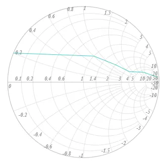
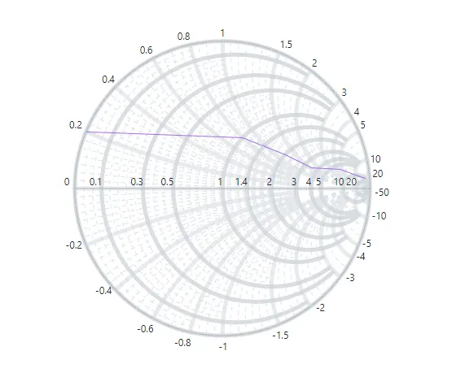
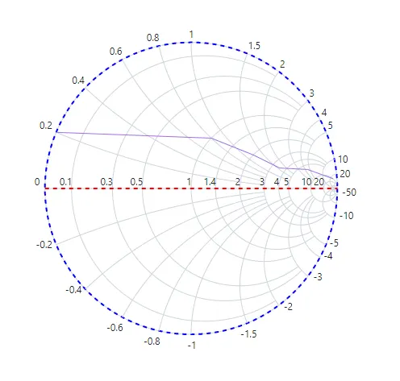

# Blazor Smith Chart Axis

Smith Chart supports two types of axes:
* **Horizontal axis** - The axis is drawn as a straight line in the horizontal direction of the Smith Chart.
* **Radial axis** - The axis is drawn as a circular path.

## Labels Customization

Axis labels indicate the values represented in the Smith Chart and make it easier to identify the intervals at which data is plotted. Labels for the horizontal and radial axes can be customized using the following properties.

* [Horizontal Visible](https://help.syncfusion.com/cr/blazor/Syncfusion.Blazor.Charts.SmithChartHorizontalAxis.html#Syncfusion_Blazor_Charts_SmithChartHorizontalAxis_Visible) and [Radial Visible](https://help.syncfusion.com/cr/blazor/Syncfusion.Blazor.Charts.SmithChartRadialAxis.html#Syncfusion_Blazor_Charts_SmithChartRadialAxis_Visible) - Used to specify the visibility of the axis.
* [Horizontal LabelPosition](https://help.syncfusion.com/cr/blazor/Syncfusion.Blazor.Charts.SmithChartHorizontalAxis.html#Syncfusion_Blazor_Charts_SmithChartHorizontalAxis_LabelPosition) and [Radial LabelPosition](https://help.syncfusion.com/cr/blazor/Syncfusion.Blazor.Charts.SmithChartRadialAxis.html#Syncfusion_Blazor_Charts_SmithChartRadialAxis_LabelPosition) - Used to place labels either inside or outside the axis line.
* [Horizontal LabelIntersectAction](https://help.syncfusion.com/cr/blazor/Syncfusion.Blazor.Charts.SmithChartHorizontalAxis.html#Syncfusion_Blazor_Charts_SmithChartHorizontalAxis_LabelIntersectAction) and [Radial LabelIntersectAction](https://help.syncfusion.com/cr/blazor/Syncfusion.Blazor.Charts.SmithChartRadialAxis.html#Syncfusion_Blazor_Charts_SmithChartRadialAxis_LabelIntersectAction) - Used to hide labels when they intersect.
* [SmithChartRadialAxisLabelStyle](https://help.syncfusion.com/cr/blazor/Syncfusion.Blazor.Charts.SmithChartRadialAxisLabelStyle.html) and [SmithChartHorizontalAxisLabelStyle](https://help.syncfusion.com/cr/blazor/Syncfusion.Blazor.Charts.SmithChartHorizontalAxisLabelStyle.html) - Used to customize properties such as [FontFamily](https://help.syncfusion.com/cr/blazor/Syncfusion.Blazor.Charts.SmithChartCommonFont.html#Syncfusion_Blazor_Charts_SmithChartCommonFont_FontFamily), [FontWeight](https://help.syncfusion.com/cr/blazor/Syncfusion.Blazor.Charts.SmithChartCommonFont.html#Syncfusion_Blazor_Charts_SmithChartCommonFont_FontWeight), [FontStyle](https://help.syncfusion.com/cr/blazor/Syncfusion.Blazor.Charts.SmithChartCommonFont.html#Syncfusion_Blazor_Charts_SmithChartCommonFont_FontStyle), [Opacity](https://help.syncfusion.com/cr/blazor/Syncfusion.Blazor.Charts.SmithChartCommonFont.html#Syncfusion_Blazor_Charts_SmithChartCommonFont_Opacity), [Color](https://help.syncfusion.com/cr/blazor/Syncfusion.Blazor.Charts.SmithChartCommonFont.html#Syncfusion_Blazor_Charts_SmithChartCommonFont_Color), and [Size](https://help.syncfusion.com/cr/blazor/Syncfusion.Blazor.Charts.SmithChartCommonFont.html#Syncfusion_Blazor_Charts_SmithChartCommonFont_Size).

```cshtml
@using Syncfusion.Blazor.Charts

<SfSmithChart>
    <SmithChartHorizontalAxis>
        <SmithChartHorizontalAxisLabelStyle FontFamily="Times New Roman"
                                            FontWeight="bold"
                                            FontStyle="Italic"
                                            Opacity='0.75'
                                            Size="14px">
        </SmithChartHorizontalAxisLabelStyle>
    </SmithChartHorizontalAxis>
    <SmithChartRadialAxis LabelPosition='AxisLabelPosition.Inside'
                          LabelIntersectAction='SmithChartLabelIntersectAction.None'>
        <SmithChartRadialAxisLabelStyle FontFamily="Times New Roman"
                                        FontWeight="bold"
                                        FontStyle="Italic"
                                        Opacity='0.75'
                                        Size="14px">
        </SmithChartRadialAxisLabelStyle>
    </SmithChartRadialAxis>
    <SmithChartSeriesCollection>
        <SmithChartSeries DataSource='TransmissionData' Reactance="Reactance" Resistance="Resistance">
        </SmithChartSeries>
    </SmithChartSeriesCollection>
</SfSmithChart>

@code {
    public class SmithChartData
    {
        public double? Resistance { get; set; }
        public double? Reactance { get; set; }
    };
    public List<SmithChartData> TransmissionData = new List<SmithChartData> {
        new SmithChartData { Resistance= 10, Reactance= 25 },
        new SmithChartData { Resistance= 6, Reactance= 4.5 },
        new SmithChartData { Resistance= 3.5, Reactance= 1.6 },
        new SmithChartData { Resistance= 2, Reactance= 1.2 },
        new SmithChartData { Resistance= 1, Reactance= 0.8 },
        new SmithChartData { Resistance= 0, Reactance= 0.2 }
    };
}
```



## Gridlines

Gridlines on the horizontal and radial axes make data in the Smith Chart easier to see. Gridlines extend across the plot area of the Smith Chart. Both axes support major and minor gridlines. Major gridlines are drawn at the positions of the axis labels. Minor gridlines are drawn between two major gridlines using the [Count](https://help.syncfusion.com/cr/blazor/Syncfusion.Blazor.Charts.SmithChartHorizontalMinorGridLines.html#Syncfusion_Blazor_Charts_SmithChartHorizontalMinorGridLines_Count) property.

The following properties can be customized for the gridlines.

* [Width](https://help.syncfusion.com/cr/blazor/Syncfusion.Blazor.Charts.SmithChartHorizontalMinorGridLines.html#Syncfusion_Blazor_Charts_SmithChartHorizontalMinorGridLines_Width) and [radial Width](https://help.syncfusion.com/cr/blazor/Syncfusion.Blazor.Charts.SmithChartRadialMinorGridLines.html#Syncfusion_Blazor_Charts_SmithChartRadialMinorGridLines_Width) - Used to customize the width of the gridlines.
* [DashArray](https://help.syncfusion.com/cr/blazor/Syncfusion.Blazor.Charts.SmithChartMinorGridLines.html#Syncfusion_Blazor_Charts_SmithChartMinorGridLines_DashArray) - Used to render gridlines as solid or dashed lines.
* [Visible](https://help.syncfusion.com/cr/blazor/Syncfusion.Blazor.Charts.SmithChartHorizontalMinorGridLines.html#Syncfusion_Blazor_Charts_SmithChartHorizontalMinorGridLines_Visible) and [radial Visible](https://help.syncfusion.com/cr/blazor/Syncfusion.Blazor.Charts.SmithChartRadialMinorGridLines.html#Syncfusion_Blazor_Charts_SmithChartRadialMinorGridLines_Visible) - Used to enable or disable the visibility of the gridlines.
* [Opacity](https://help.syncfusion.com/cr/blazor/Syncfusion.Blazor.Charts.SmithChartHorizontalMajorGridLines.html#Syncfusion_Blazor_Charts_SmithChartHorizontalMajorGridLines_Opacity) and [radial Opacity](https://help.syncfusion.com/cr/blazor/Syncfusion.Blazor.Charts.SmithChartRadialMajorGridLines.html#Syncfusion_Blazor_Charts_SmithChartRadialMajorGridLines_Opacity) - Used to customize the opacity of the major gridlines.
* [Color](https://help.syncfusion.com/cr/blazor/Syncfusion.Blazor.Charts.SmithChartMajorGridLines.html#Syncfusion_Blazor_Charts_SmithChartMajorGridLines_Color) and [radial Color](https://help.syncfusion.com/cr/blazor/Syncfusion.Blazor.Charts.SmithChartRadialMajorGridLines.html#Syncfusion_Blazor_Charts_SmithChartRadialMajorGridLines_Color) - Used to customize the color of the major gridlines.
* [Count](https://help.syncfusion.com/cr/blazor/Syncfusion.Blazor.Charts.SmithChartHorizontalMinorGridLines.html#Syncfusion_Blazor_Charts_SmithChartHorizontalMinorGridLines_Count) and [radial Count](https://help.syncfusion.com/cr/blazor/Syncfusion.Blazor.Charts.SmithChartRadialMinorGridLines.html#Syncfusion_Blazor_Charts_SmithChartRadialMinorGridLines_Count) - Used to customize the number of minor gridlines between major gridlines.

```cshtml
@using Syncfusion.Blazor.Charts

<SfSmithChart>
    <SmithChartHorizontalAxis>
        <SmithChartHorizontalMajorGridLines Visible='true' Opacity='0.8' Width='5'>
        </SmithChartHorizontalMajorGridLines>
        <SmithChartHorizontalMinorGridLines Visible='true' DashArray="5" Count="10">
        </SmithChartHorizontalMinorGridLines>
    </SmithChartHorizontalAxis>
    <SmithChartRadialAxis>
        <SmithChartRadialMajorGridLines Visible='true' Opacity='0.5' Width='5'>
        </SmithChartRadialMajorGridLines>
        <SmithChartRadialMinorGridLines Visible='true' DashArray="5" Count="10">
        </SmithChartRadialMinorGridLines>
    </SmithChartRadialAxis>
    <SmithChartSeriesCollection>
        <SmithChartSeries DataSource='TransmissionData' Reactance="Reactance" Resistance="Resistance">
        </SmithChartSeries>
    </SmithChartSeriesCollection>
</SfSmithChart>

@code {
    public class SmithChartData
    {
        public double? Resistance { get; set; }
        public double? Reactance { get; set; }
    };
    public List<SmithChartData> TransmissionData = new List<SmithChartData> {
        new SmithChartData { Resistance= 10, Reactance= 25 },
        new SmithChartData { Resistance= 6, Reactance= 4.5 },
        new SmithChartData { Resistance= 3.5, Reactance= 1.6 },
        new SmithChartData { Resistance= 2, Reactance= 1.2 },
        new SmithChartData { Resistance= 1, Reactance= 0.8 },
        new SmithChartData { Resistance= 0, Reactance= 0.2 }
    };
}
```



## Axis Line

By default, axis lines are visible. Their visibility can be changed using the [horizontal Visible](https://help.syncfusion.com/cr/blazor/Syncfusion.Blazor.Charts.SmithChartHorizontalAxisLine.html#Syncfusion_Blazor_Charts_SmithChartHorizontalAxisLine_Visible) and [radial Visible](https://help.syncfusion.com/cr/blazor/Syncfusion.Blazor.Charts.SmithChartRadialAxisLine.html#Syncfusion_Blazor_Charts_SmithChartRadialAxisLine_Visible) properties. In addition to visibility, the following properties can be used to customize the axis lines.

* [Width](https://help.syncfusion.com/cr/blazor/Syncfusion.Blazor.Charts.SmithChartAxisLine.html#Syncfusion_Blazor_Charts_SmithChartAxisLine_Width) - Used to customize the width of the axis lines.
* [DashArray](https://help.syncfusion.com/cr/blazor/Syncfusion.Blazor.Charts.SmithChartAxisLine.html#Syncfusion_Blazor_Charts_SmithChartAxisLine_DashArray) - Used to render the axis lines as solid or dashed lines.
* [Color](https://help.syncfusion.com/cr/blazor/Syncfusion.Blazor.Charts.SmithChartAxisLine.html#Syncfusion_Blazor_Charts_SmithChartAxisLine_Color) - Used to customize the color of the axis lines.

```cshtml
@using Syncfusion.Blazor.Charts

<SfSmithChart>
    <SmithChartHorizontalAxis>
        <SmithChartHorizontalAxisLine Width="2" Visible="true" DashArray="5" Color="blue">
        </SmithChartHorizontalAxisLine>
    </SmithChartHorizontalAxis>
    <SmithChartRadialAxis>
        <SmithChartRadialAxisLine Width="2" Visible="true" DashArray="5" Color="red">
        </SmithChartRadialAxisLine>
    </SmithChartRadialAxis>
    <SmithChartSeriesCollection>
        <SmithChartSeries DataSource='TransmissionData' Reactance="Reactance" Resistance="Resistance">
        </SmithChartSeries>
    </SmithChartSeriesCollection>
</SfSmithChart>

@code {
    public class SmithChartData
    {
        public double? Resistance { get; set; }
        public double? Reactance { get; set; }
    };
    public List<SmithChartData> TransmissionData = new List<SmithChartData> {
        new SmithChartData { Resistance= 10, Reactance= 25 },
        new SmithChartData { Resistance= 6, Reactance= 4.5 },
        new SmithChartData { Resistance= 3.5, Reactance= 1.6 },
        new SmithChartData { Resistance= 2, Reactance= 1.2 },
        new SmithChartData { Resistance= 1, Reactance= 0.8 },
        new SmithChartData { Resistance= 0, Reactance= 0.2 }
    };
}
```

