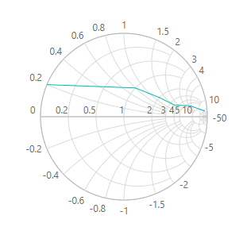

# Dimensions in Blazor Smith Chart Component

The dimensions of the Smith Chart can be modified in the following ways.

* Using CSS
* Using API

## Using CSS

To set the size using CSS, add an [ID](https://help.syncfusion.com/cr/blazor/Syncfusion.Blazor.Charts.SfSmithChart.html#Syncfusion_Blazor_Charts_SfSmithChart_ID) to the `SfSmithChart` tag, and set the width and the height of the Smith Chart in the style tag as following.

```cshtml
@using Syncfusion.Blazor.Charts

<SfSmithChart ID="smChart">
    <SmithChartSeriesCollection>
        <SmithChartSeries DataSource='TransmissionData' Reactance="Reactance" Resistance="Resistance">
        </SmithChartSeries>
    </SmithChartSeriesCollection>
</SfSmithChart>

<style>
    #smChart {
        height: 300px !important;
        width: 300px !important;
    }
</style>

@code {
    public class SmithChartData
    {
        public double? Resistance { get; set; }
        public double? Reactance { get; set; }
    };
    public List<SmithChartData> TransmissionData = new List<SmithChartData> {
        new SmithChartData { Resistance= 10, Reactance= 25 },
        new SmithChartData { Resistance= 6, Reactance= 4.5 },
        new SmithChartData { Resistance= 3.5, Reactance= 1.6 },
        new SmithChartData { Resistance= 2, Reactance= 1.2 },
        new SmithChartData { Resistance= 1, Reactance= 0.8 },
        new SmithChartData { Resistance= 0, Reactance= 0.2 }
    };
}
```



## Using API

The width and the height of the Smith Chart can also be set directly using the [Width](https://help.syncfusion.com/cr/blazor/Syncfusion.Blazor.Charts.SfSmithChart.html#Syncfusion_Blazor_Charts_SfSmithChart_Width) and the [Height](https://help.syncfusion.com/cr/blazor/Syncfusion.Blazor.Charts.SfSmithChart.html#Syncfusion_Blazor_Charts_SfSmithChart_Height) properties respectively. It can be in pixel or in percentage.

### In Pixel

The [Width](https://help.syncfusion.com/cr/blazor/Syncfusion.Blazor.Charts.SfSmithChart.html#Syncfusion_Blazor_Charts_SfSmithChart_Width) and the [Height](https://help.syncfusion.com/cr/blazor/Syncfusion.Blazor.Charts.SfSmithChart.html#Syncfusion_Blazor_Charts_SfSmithChart_Height) properties in the Smith Chart can be directly given in pixels, as following.

```cshtml
@using Syncfusion.Blazor.Charts

<SfSmithChart Height="300px" Width="300px">
    <SmithChartSeriesCollection>
        <SmithChartSeries DataSource='TransmissionData' Reactance="Reactance" Resistance="Resistance">
        </SmithChartSeries>
    </SmithChartSeriesCollection>
</SfSmithChart>

@code {
    public class SmithChartData
    {
        public double? Resistance { get; set; }
        public double? Reactance { get; set; }
    };
    public List<SmithChartData> TransmissionData = new List<SmithChartData> {
        new SmithChartData { Resistance= 10, Reactance= 25 },
        new SmithChartData { Resistance= 6, Reactance= 4.5 },
        new SmithChartData { Resistance= 3.5, Reactance= 1.6 },
        new SmithChartData { Resistance= 2, Reactance= 1.2 },
        new SmithChartData { Resistance= 1, Reactance= 0.8 },
        new SmithChartData { Resistance= 0, Reactance= 0.2 }
    };
}
```


### In percentage

The Smith Chart's [Width](https://help.syncfusion.com/cr/blazor/Syncfusion.Blazor.Charts.SfSmithChart.html#Syncfusion_Blazor_Charts_SfSmithChart_Width) and [Height](https://help.syncfusion.com/cr/blazor/Syncfusion.Blazor.Charts.SfSmithChart.html#Syncfusion_Blazor_Charts_SfSmithChart_Height) properties can be directly given in percentage, as shown in the following. The component will be rendered as a percentage of its container size.

```cshtml
@using Syncfusion.Blazor.Charts

<div style="height:600px; width:600px">
    <SfSmithChart Height="50%" Width="50%">
        <SmithChartSeriesCollection>
            <SmithChartSeries DataSource='FirstTransmissionData' Reactance="Reactance" Resistance="Resistance">
            </SmithChartSeries>
        </SmithChartSeriesCollection>
    </SfSmithChart>
</div>

@code {
    public class SmithChartData
    {
        public double? Resistance { get; set; }
        public double? Reactance { get; set; }
    };
    
    public List<SmithChartData> FirstTransmissionData = new List<SmithChartData> {
        new SmithChartData { Resistance= 10, Reactance= 25 },
        new SmithChartData { Resistance= 6, Reactance= 4.5 },
        new SmithChartData { Resistance= 3.5, Reactance= 1.6 },
        new SmithChartData { Resistance= 2, Reactance= 1.2 },
        new SmithChartData { Resistance= 1, Reactance= 0.8 },
        new SmithChartData { Resistance= 0, Reactance= 0.2 }
    };
}
```

