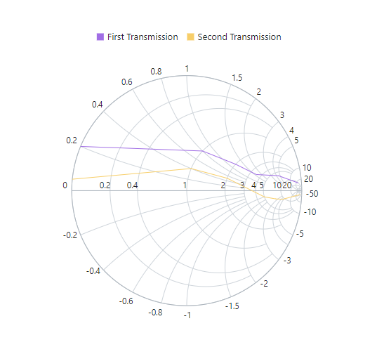

# Legend in Blazor Smith Chart Component

In the Smith Chart, a legend is a key containing symbols and descriptions. It can be interpreted in various colors, shapes, or other identifiers based on the data, and it provides valuable information for interpreting what the Smith Chart is displaying. In simple words, the legend is used to denote the series rendered in the Smith Chart.

## Position

By default, the visibility of the legend is **false**. To enable the legend, set the [Visible](https://help.syncfusion.com/cr/blazor/Syncfusion.Blazor.Charts.SmithChartLegendSettings.html#Syncfusion_Blazor_Charts_SmithChartLegendSettings_Visible) property to **true** in the [SmithChartLegendSettings](https://help.syncfusion.com/cr/blazor/Syncfusion.Blazor.Charts.SmithChartLegendSettings.html). The default position for the legend is **Bottom**. By using the [Position](https://help.syncfusion.com/cr/blazor/Syncfusion.Blazor.Charts.SmithChartLegendSettings.html#Syncfusion_Blazor_Charts_SmithChartLegendSettings_Position) property, the position of the legend can be changed. The legend can be placed on the Smith Chart's bottom, top, right, or left side.

```cshtml
@using Syncfusion.Blazor.Charts

<SfSmithChart>
    <SmithChartLegendSettings Visible='true' Position='@LegendPosition.Top'>
    <SmithChartLegendSettings>
    <SmithChartSeriesCollection>
        <SmithChartSeries Name="First Transmission" DataSource='FirstTransmissionData' Reactance="Reactance" Resistance="Resistance"></SmithChartSeries>
        <SmithChartSeries Name="Second Transmission" DataSource='SecondTransmissionData' Reactance="Reactance" Resistance="Resistance"></SmithChartSeries>
    </SmithChartSeriesCollection>
</SfSmithChart>

@code {
    public class SmithChartData
    {
        public double? Resistance { get; set; }
        public double? Reactance { get; set; }
    };
    public List<SmithChartData> FirstTransmissionData = new List<SmithChartData> {
        new SmithChartData { Resistance= 10, Reactance= 25 },
        new SmithChartData { Resistance= 6, Reactance= 4.5 },
        new SmithChartData { Resistance= 3.5, Reactance= 1.6 },
        new SmithChartData { Resistance= 2, Reactance= 1.2 },
        new SmithChartData { Resistance= 1, Reactance= 0.8 },
        new SmithChartData { Resistance= 0, Reactance= 0.2 }
    };
    public List<SmithChartData> SecondTransmissionData = new List<SmithChartData> {
        new SmithChartData { Resistance= 20, Reactance= -50 },
        new SmithChartData { Resistance= 9, Reactance= -4.5 },
        new SmithChartData { Resistance= 7, Reactance= -2.5 },
        new SmithChartData { Resistance= 5, Reactance= -1 },
        new SmithChartData { Resistance= 2, Reactance= 0.5 },
        new SmithChartData { Resistance= 1, Reactance= 0.4 },
        new SmithChartData { Resistance= 0, Reactance= 0.05 }
    };
}
```


Other than these positions, the legend can be placed anywhere in the Smith Chart. To achieve this, set the [Position](https://help.syncfusion.com/cr/blazor/Syncfusion.Blazor.Charts.SmithChartLegendSettings.html#Syncfusion_Blazor_Charts_SmithChartLegendSettings_Position) as **Custom** in the [SmithChartLegendSettings](https://help.syncfusion.com/cr/blazor/Syncfusion.Blazor.Charts.SmithChartLegendSettings.html) and specify the X and Y coordinates using the [X](https://help.syncfusion.com/cr/blazor/Syncfusion.Blazor.Charts.SmithChartLegendLocation.html#Syncfusion_Blazor_Charts_SmithChartLegendLocation_X) and [Y](https://help.syncfusion.com/cr/blazor/Syncfusion.Blazor.Charts.SmithChartLegendLocation.html#Syncfusion_Blazor_Charts_SmithChartLegendLocation_Y) properties in the [SmithChartLegendLocation](https://help.syncfusion.com/cr/blazor/Syncfusion.Blazor.Charts.SmithChartLegendLocation.html).

```cshtml
@using Syncfusion.Blazor.Charts

<SfSmithChart>
    <SmithChartLegendSettings Visible='true' Position='@LegendPosition.Custom'>
        <SmithChartLegendLocation X='80' Y='100'></SmithChartLegendLocation>
    </SmithChartLegendSettings>
    <SmithChartSeriesCollection>
        <SmithChartSeries Name="First Transmission" DataSource='FirstTransmissionData' Reactance="Reactance" Resistance="Resistance"></SmithChartSeries>
        <SmithChartSeries Name="Second Transmission" DataSource='SecondTransmissionData' Reactance="Reactance" Resistance="Resistance"></SmithChartSeries>
    </SmithChartSeriesCollection>
</SfSmithChart>

@code {
    public class SmithChartData
    {
        public double? Resistance { get; set; }
        public double? Reactance { get; set; }
    };
    public List<SmithChartData> FirstTransmissionData = new List<SmithChartData> {
        new SmithChartData { Resistance= 10, Reactance= 25 },
        new SmithChartData { Resistance= 6, Reactance= 4.5 },
        new SmithChartData { Resistance= 3.5, Reactance= 1.6 },
        new SmithChartData { Resistance= 2, Reactance= 1.2 },
        new SmithChartData { Resistance= 1, Reactance= 0.8 },
        new SmithChartData { Resistance= 0, Reactance= 0.2 }
    };
    public List<SmithChartData> SecondTransmissionData = new List<SmithChartData> {
        new SmithChartData { Resistance= 20, Reactance= -50 },
        new SmithChartData { Resistance= 9, Reactance= -4.5 },
        new SmithChartData { Resistance= 7, Reactance= -2.5 },
        new SmithChartData { Resistance= 5, Reactance= -1 },
        new SmithChartData { Resistance= 2, Reactance= 0.5 },
        new SmithChartData { Resistance= 1, Reactance= 0.4 },
        new SmithChartData { Resistance= 0, Reactance= 0.05 }
    };
}
```


## Legend Alignment

Other than positioning the legend in the Smith Chart, its alignment also can be customized. By default, the legend is aligned in the **Center** position. Using the [Alignment](https://help.syncfusion.com/cr/blazor/Syncfusion.Blazor.Charts.SmithChartLegendSettings.html#Syncfusion_Blazor_Charts_SmithChartLegendSettings_Alignment) property, the legend can be aligned in the Smith Chart's near, centre, or far locations.

```cshtml
@using Syncfusion.Blazor.Charts

<SfSmithChart>
    <SmithChartLegendSettings Visible='true'
                              Position='@LegendPosition.Top'
                              Alignment='@SmithChartAlignment.Near'>
    </SmithChartLegendSettings>
    <SmithChartSeriesCollection>
        <SmithChartSeries Name="First Transmission" DataSource='FirstTransmissionData' Reactance="Reactance" Resistance="Resistance"></SmithChartSeries>
        <SmithChartSeries Name="Second Transmission" DataSource='SecondTransmissionData' Reactance="Reactance" Resistance="Resistance"></SmithChartSeries>
    </SmithChartSeriesCollection>
</SfSmithChart>

@code {
    public class SmithChartData
    {
        public double? Resistance { get; set; }
        public double? Reactance { get; set; }
    };
    public List<SmithChartData> FirstTransmissionData = new List<SmithChartData> {
        new SmithChartData { Resistance= 10, Reactance= 25 },
        new SmithChartData { Resistance= 6, Reactance= 4.5 },
        new SmithChartData { Resistance= 3.5, Reactance= 1.6 },
        new SmithChartData { Resistance= 2, Reactance= 1.2 },
        new SmithChartData { Resistance= 1, Reactance= 0.8 },
        new SmithChartData { Resistance= 0, Reactance= 0.2 }
    };
    public List<SmithChartData> SecondTransmissionData = new List<SmithChartData> {
        new SmithChartData { Resistance= 20, Reactance= -50 },
        new SmithChartData { Resistance= 9, Reactance= -4.5 },
        new SmithChartData { Resistance= 7, Reactance= -2.5 },
        new SmithChartData { Resistance= 5, Reactance= -1 },
        new SmithChartData { Resistance= 2, Reactance= 0.5 },
        new SmithChartData { Resistance= 1, Reactance= 0.4 },
        new SmithChartData { Resistance= 0, Reactance= 0.05 }
    };
}
```


## Customization

### Legend Shape

By default, the legend is rendered in **Circle** shape and the color of the shape is as same as the series color in the Smith Chart. Using the property [Shape](https://help.syncfusion.com/cr/blazor/Syncfusion.Blazor.Charts.SmithChartLegendSettings.html#Syncfusion_Blazor_Charts_SmithChartLegendSettings_Shape) in the legend settings, the shape of the legend can be changed to rectangle, triangle, and so on.

```cshtml
@using Syncfusion.Blazor.Charts

<SfSmithChart>
    <SmithChartLegendSettings Visible='true'
                              Position='@LegendPosition.Top'
                              Shape='@Shape.Rectangle'>
    </SmithChartLegendSettings>
    <SmithChartSeriesCollection>
        <SmithChartSeries Name="First Transmission" DataSource='FirstTransmissionData' Reactance="Reactance" Resistance="Resistance"></SmithChartSeries>
        <SmithChartSeries Name="Second Transmission" DataSource='SecondTransmissionData' Reactance="Reactance" Resistance="Resistance"></SmithChartSeries>
    </SmithChartSeriesCollection>
</SfSmithChart>

@code {
    public class SmithChartData
    {
        public double? Resistance { get; set; }
        public double? Reactance { get; set; }
    };
    public List<SmithChartData> FirstTransmissionData = new List<SmithChartData> {
        new SmithChartData { Resistance= 10, Reactance= 25 },
        new SmithChartData { Resistance= 6, Reactance= 4.5 },
        new SmithChartData { Resistance= 3.5, Reactance= 1.6 },
        new SmithChartData { Resistance= 2, Reactance= 1.2 },
        new SmithChartData { Resistance= 1, Reactance= 0.8 },
        new SmithChartData { Resistance= 0, Reactance= 0.2 }
    };
    public List<SmithChartData> SecondTransmissionData = new List<SmithChartData> {
        new SmithChartData { Resistance= 20, Reactance= -50 },
        new SmithChartData { Resistance= 9, Reactance= -4.5 },
        new SmithChartData { Resistance= 7, Reactance= -2.5 },
        new SmithChartData { Resistance= 5, Reactance= -1 },
        new SmithChartData { Resistance= 2, Reactance= 0.5 },
        new SmithChartData { Resistance= 1, Reactance= 0.4 },
        new SmithChartData { Resistance= 0, Reactance= 0.05 }
    };
}
```



### Legend Size

By default, the legend takes 20% - 25% of the Smith Chart's height horizontally when it is placed on the top or the bottom position, and 20% - 25% of the width vertically when it is placed on the left or the right position of the Chart. It can be changed by using the [Width](https://help.syncfusion.com/cr/blazor/Syncfusion.Blazor.Charts.SmithChartLegendSettings.html#Syncfusion_Blazor_Charts_SmithChartLegendSettings_Width) and the [Height](https://help.syncfusion.com/cr/blazor/Syncfusion.Blazor.Charts.SmithChartLegendSettings.html#Syncfusion_Blazor_Charts_SmithChartLegendSettings_Height) property of the legend settings. It can be in pixel or in percentage.

```cshtml
@using Syncfusion.Blazor.Charts

<SfSmithChart>
    <SmithChartLegendSettings Visible='true' Position='@LegendPosition.Top' Height='100px' Width='200px'>
    </SmithChartLegendSettings>
    <SmithChartSeriesCollection>
        <SmithChartSeries Name="First Transmission" DataSource='FirstTransmissionData' Reactance="Reactance" Resistance="Resistance"></SmithChartSeries>
        <SmithChartSeries Name="Second Transmission" DataSource='SecondTransmissionData' Reactance="Reactance" Resistance="Resistance"></SmithChartSeries>
    </SmithChartSeriesCollection>
</SfSmithChart>

@code {
    public class SmithChartData
    {
        public double? Resistance { get; set; }
        public double? Reactance { get; set; }
    };
    public List<SmithChartData> FirstTransmissionData = new List<SmithChartData> {
        new SmithChartData { Resistance= 10, Reactance= 25 },
        new SmithChartData { Resistance= 6, Reactance= 4.5 },
        new SmithChartData { Resistance= 3.5, Reactance= 1.6 },
        new SmithChartData { Resistance= 2, Reactance= 1.2 },
        new SmithChartData { Resistance= 1, Reactance= 0.8 },
        new SmithChartData { Resistance= 0, Reactance= 0.2 }
    };
    public List<SmithChartData> SecondTransmissionData = new List<SmithChartData> {
        new SmithChartData { Resistance= 20, Reactance= -50 },
        new SmithChartData { Resistance= 9, Reactance= -4.5 },
        new SmithChartData { Resistance= 7, Reactance= -2.5 },
        new SmithChartData { Resistance= 5, Reactance= -1 },
        new SmithChartData { Resistance= 2, Reactance= 0.5 },
        new SmithChartData { Resistance= 1, Reactance= 0.4 },
        new SmithChartData { Resistance= 0, Reactance= 0.05 }
    };
}
```


### Padding

The space between two legend items can be customized using the [ItemPadding](https://help.syncfusion.com/cr/blazor/Syncfusion.Blazor.Charts.SmithChartLegendSettings.html#Syncfusion_Blazor_Charts_SmithChartLegendSettings_ItemPadding) property and, the space between legend shape and text can be customized using the [ShapePadding](https://help.syncfusion.com/cr/blazor/Syncfusion.Blazor.Charts.SmithChartLegendSettings.html#Syncfusion_Blazor_Charts_SmithChartLegendSettings_ShapePadding) property.

```cshtml
@using Syncfusion.Blazor.Charts

<SfSmithChart>
    <SmithChartLegendSettings Visible='true'
                              Position='@LegendPosition.Top'
                              ItemPadding='40'
                              ShapePadding='10'>
    </SmithChartLegendSettings>
    <SmithChartSeriesCollection>
        <SmithChartSeries Name="First Transmission" DataSource='FirstTransmissionData' Reactance="Reactance" Resistance="Resistance"></SmithChartSeries>
        <SmithChartSeries Name="Second Transmission" DataSource='SecondTransmissionData' Reactance="Reactance" Resistance="Resistance"></SmithChartSeries>
    </SmithChartSeriesCollection>
</SfSmithChart>

@code {
    public class SmithChartData
    {
        public double? Resistance { get; set; }
        public double? Reactance { get; set; }
    };
    public List<SmithChartData> FirstTransmissionData = new List<SmithChartData> {
        new SmithChartData { Resistance= 10, Reactance= 25 },
        new SmithChartData { Resistance= 6, Reactance= 4.5 },
        new SmithChartData { Resistance= 3.5, Reactance= 1.6 },
        new SmithChartData { Resistance= 2, Reactance= 1.2 },
        new SmithChartData { Resistance= 1, Reactance= 0.8 },
        new SmithChartData { Resistance= 0, Reactance= 0.2 }
    };
    public List<SmithChartData> SecondTransmissionData = new List<SmithChartData> {
        new SmithChartData { Resistance= 20, Reactance= -50 },
        new SmithChartData { Resistance= 9, Reactance= -4.5 },
        new SmithChartData { Resistance= 7, Reactance= -2.5 },
        new SmithChartData { Resistance= 5, Reactance= -1 },
        new SmithChartData { Resistance= 2, Reactance= 0.5 },
        new SmithChartData { Resistance= 1, Reactance= 0.4 },
        new SmithChartData { Resistance= 0, Reactance= 0.05 }
    };
}
```


### Other customization

Each legend item's style, border, and text can be customized in the Smith Chart by using the following properties.

* [SmithChartLegendItemStyle](https://help.syncfusion.com/cr/blazor/Syncfusion.Blazor.Charts.SmithChartLegendItemStyle.html) - Used to customize the height and the width of each legend item using the [Height](https://help.syncfusion.com/cr/blazor/Syncfusion.Blazor.Charts.SmithChartLegendItemStyle.html#Syncfusion_Blazor_Charts_SmithChartLegendItemStyle_Height) and the [Width](https://help.syncfusion.com/cr/blazor/Syncfusion.Blazor.Charts.SmithChartLegendItemStyle.html#Syncfusion_Blazor_Charts_SmithChartLegendItemStyle_Width) properties.
* [SmithChartLegendBorder](https://help.syncfusion.com/cr/blazor/Syncfusion.Blazor.Charts.SmithChartLegendBorder.html) - Used to customize the border color and the width for legend collection using the [Color](https://help.syncfusion.com/cr/blazor/Syncfusion.Blazor.Charts.SmithChartCommonBorder.html#Syncfusion_Blazor_Charts_SmithChartCommonBorder_Color) and the [Width](https://help.syncfusion.com/cr/blazor/Syncfusion.Blazor.Charts.SmithChartCommonBorder.html#Syncfusion_Blazor_Charts_SmithChartCommonBorder_Width) properties.
* [SmithChartLegendTextStyle](https://help.syncfusion.com/cr/blazor/Syncfusion.Blazor.Charts.SmithChartLegendTextStyle.html) - Used to customize the properties such as [FontFamily](https://help.syncfusion.com/cr/blazor/Syncfusion.Blazor.Charts.SmithChartCommonFont.html#Syncfusion_Blazor_Charts_SmithChartCommonFont_FontFamily), [FontWeight](https://help.syncfusion.com/cr/blazor/Syncfusion.Blazor.Charts.SmithChartCommonFont.html#Syncfusion_Blazor_Charts_SmithChartCommonFont_FontWeight), [FontStyle](https://help.syncfusion.com/cr/blazor/Syncfusion.Blazor.Charts.SmithChartCommonFont.html#Syncfusion_Blazor_Charts_SmithChartCommonFont_FontStyle), [Opacity](https://help.syncfusion.com/cr/blazor/Syncfusion.Blazor.Charts.SmithChartCommonFont.html#Syncfusion_Blazor_Charts_SmithChartCommonFont_Opacity), [Color](https://help.syncfusion.com/cr/blazor/Syncfusion.Blazor.Charts.SmithChartCommonFont.html#Syncfusion_Blazor_Charts_SmithChartCommonFont_Color) and [Size](https://help.syncfusion.com/cr/blazor/Syncfusion.Blazor.Charts.SmithChartCommonFont.html#Syncfusion_Blazor_Charts_SmithChartCommonFont_Size) for each legend text.

```cshtml
@using Syncfusion.Blazor.Charts

<SfSmithChart>
    <SmithChartLegendSettings Visible='true' Position='@LegendPosition.Top'>
        <SmithChartLegendTextStyle Color="red"></SmithChartLegendTextStyle>
        <SmithChartLegendItemStyle Height="20" Width="20"></SmithChartLegendItemStyle>
        <SmithChartLegendBorder Color="blue" Width="1"></SmithChartLegendBorder>
    </SmithChartLegendSettings>
    <SmithChartSeriesCollection>
        <SmithChartSeries Name="First Transmission" DataSource='FirstTransmissionData' Reactance="Reactance" Resistance="Resistance"></SmithChartSeries>
        <SmithChartSeries Name="Second Transmission" DataSource='SecondTransmissionData' Reactance="Reactance" Resistance="Resistance"></SmithChartSeries>
    </SmithChartSeriesCollection>
</SfSmithChart>

@code {
    public class SmithChartData
    {
        public double? Resistance { get; set; }
        public double? Reactance { get; set; }
    };
    public List<SmithChartData> FirstTransmissionData = new List<SmithChartData> {
        new SmithChartData { Resistance= 10, Reactance= 25 },
        new SmithChartData { Resistance= 6, Reactance= 4.5 },
        new SmithChartData { Resistance= 3.5, Reactance= 1.6 },
        new SmithChartData { Resistance= 2, Reactance= 1.2 },
        new SmithChartData { Resistance= 1, Reactance= 0.8 },
        new SmithChartData { Resistance= 0, Reactance= 0.2 }
    };
    public List<SmithChartData> SecondTransmissionData = new List<SmithChartData> {
        new SmithChartData { Resistance= 20, Reactance= -50 },
        new SmithChartData { Resistance= 9, Reactance= -4.5 },
        new SmithChartData { Resistance= 7, Reactance= -2.5 },
        new SmithChartData { Resistance= 5, Reactance= -1 },
        new SmithChartData { Resistance= 2, Reactance= 0.5 },
        new SmithChartData { Resistance= 1, Reactance= 0.4 },
        new SmithChartData { Resistance= 0, Reactance= 0.05 }
    };
}
```


## Toggle Visibility

By default, the series name is displayed in the legend. The visibility of the series can be collapsed by clicking the legend of that particular series. The series visibility can be toggled by using the [ToggleVisibility](https://help.syncfusion.com/cr/blazor/Syncfusion.Blazor.Charts.SmithChartLegendSettings.html#Syncfusion_Blazor_Charts_SmithChartLegendSettings_ToggleVisibility) property. By default, it is **true**.

```cshtml
@using Syncfusion.Blazor.Charts

<SfSmithChart>
    <SmithChartLegendSettings Visible='true'
                              Position='@LegendPosition.Top'
                              ToggleVisibility="true">
    </SmithChartLegendSettings>
    <SmithChartSeriesCollection>
        <SmithChartSeries Name="First Transmission" DataSource='FirstTransmissionData' Reactance="Reactance" Resistance="Resistance"></SmithChartSeries>
        <SmithChartSeries Name="Second Transmission" DataSource='SecondTransmissionData' Reactance="Reactance" Resistance="Resistance"></SmithChartSeries>
    </SmithChartSeriesCollection>
</SfSmithChart>

@code {
    public class SmithChartData
    {
        public double? Resistance { get; set; }
        public double? Reactance { get; set; }
    };
    public List<SmithChartData> FirstTransmissionData = new List<SmithChartData> {
        new SmithChartData { Resistance= 10, Reactance= 25 },
        new SmithChartData { Resistance= 6, Reactance= 4.5 },
        new SmithChartData { Resistance= 3.5, Reactance= 1.6 },
        new SmithChartData { Resistance= 2, Reactance= 1.2 },
        new SmithChartData { Resistance= 1, Reactance= 0.8 },
        new SmithChartData { Resistance= 0, Reactance= 0.2 }
    };
    public List<SmithChartData> SecondTransmissionData = new List<SmithChartData> {
        new SmithChartData { Resistance= 20, Reactance= -50 },
        new SmithChartData { Resistance= 9, Reactance= -4.5 },
        new SmithChartData { Resistance= 7, Reactance= -2.5 },
        new SmithChartData { Resistance= 5, Reactance= -1 },
        new SmithChartData { Resistance= 2, Reactance= 0.5 },
        new SmithChartData { Resistance= 1, Reactance= 0.4 },
        new SmithChartData { Resistance= 0, Reactance= 0.05 }
    };
}
```

## Row and column

The legend can also be placed in rows and columns using the [RowCount](https://help.syncfusion.com/cr/blazor/Syncfusion.Blazor.Charts.SmithChartLegendSettings.html#Syncfusion_Blazor_Charts_SmithChartLegendSettings_RowCount) and the [ColumnCount](https://help.syncfusion.com/cr/blazor/Syncfusion.Blazor.Charts.SmithChartLegendSettings.html#Syncfusion_Blazor_Charts_SmithChartLegendSettings_ColumnCount) property. By default, their value is **0**.

```cshtml
@using Syncfusion.Blazor.Charts

<SfSmithChart>
    <SmithChartLegendSettings Visible='true' ColumnCount="1"
                              Position='@LegendPosition.Top'>
    </SmithChartLegendSettings>
    <SmithChartSeriesCollection>
        <SmithChartSeries Name="First Transmission" DataSource='FirstTransmissionData' Reactance="Reactance" Resistance="Resistance"></SmithChartSeries>
        <SmithChartSeries Name="Second Transmission" DataSource='SecondTransmissionData' Reactance="Reactance" Resistance="Resistance"></SmithChartSeries>
    </SmithChartSeriesCollection>
</SfSmithChart>

@code {
    public class SmithChartData
    {
        public double? Resistance { get; set; }
        public double? Reactance { get; set; }
    };
    public List<SmithChartData> FirstTransmissionData = new List<SmithChartData> {
        new SmithChartData { Resistance= 10, Reactance= 25 },
        new SmithChartData { Resistance= 6, Reactance= 4.5 },
        new SmithChartData { Resistance= 3.5, Reactance= 1.6 },
        new SmithChartData { Resistance= 2, Reactance= 1.2 },
        new SmithChartData { Resistance= 1, Reactance= 0.8 },
        new SmithChartData { Resistance= 0, Reactance= 0.2 }
    };
    public List<SmithChartData> SecondTransmissionData = new List<SmithChartData> {
        new SmithChartData { Resistance= 20, Reactance= -50 },
        new SmithChartData { Resistance= 9, Reactance= -4.5 },
        new SmithChartData { Resistance= 7, Reactance= -2.5 },
        new SmithChartData { Resistance= 5, Reactance= -1 },
        new SmithChartData { Resistance= 2, Reactance= 0.5 },
        new SmithChartData { Resistance= 1, Reactance= 0.4 },
        new SmithChartData { Resistance= 0, Reactance= 0.05 }
    };
}
```


## Title

The title depicts the information about the legend collection in the Smith Chart. It can be customized using the following properties in the [SmithChartLegendTitle](https://help.syncfusion.com/cr/blazor/Syncfusion.Blazor.Charts.SmithChartLegendTitle.html).

* [Text](https://help.syncfusion.com/cr/blazor/Syncfusion.Blazor.Charts.SmithChartLegendTitle.html#Syncfusion_Blazor_Charts_SmithChartLegendTitle_Text) - Used to customize the legend title text.
* [Visible](https://help.syncfusion.com/cr/blazor/Syncfusion.Blazor.Charts.SmithChartLegendTitle.html#Syncfusion_Blazor_Charts_SmithChartLegendTitle_Visible) - Used to specify the visibility of the legend title. By default, it is **true**.
* [TextAlignment](https://help.syncfusion.com/cr/blazor/Syncfusion.Blazor.Charts.SmithChartLegendTitle.html#Syncfusion_Blazor_Charts_SmithChartLegendTitle_TextAlignment) - Used to specify the legend title alignment.
* [SmithChartLegendTitleTextStyle](https://help.syncfusion.com/cr/blazor/Syncfusion.Blazor.Charts.SmithChartLegendTitleTextStyle.html) - Used to customize the properties such as [FontFamily](https://help.syncfusion.com/cr/blazor/Syncfusion.Blazor.Charts.SmithChartCommonFont.html#Syncfusion_Blazor_Charts_SmithChartCommonFont_FontFamily), [FontWeight](https://help.syncfusion.com/cr/blazor/Syncfusion.Blazor.Charts.SmithChartCommonFont.html#Syncfusion_Blazor_Charts_SmithChartCommonFont_FontWeight), [FontStyle](https://help.syncfusion.com/cr/blazor/Syncfusion.Blazor.Charts.SmithChartCommonFont.html#Syncfusion_Blazor_Charts_SmithChartCommonFont_FontStyle), [Opacity](https://help.syncfusion.com/cr/blazor/Syncfusion.Blazor.Charts.SmithChartCommonFont.html#Syncfusion_Blazor_Charts_SmithChartCommonFont_Opacity), [Color](https://help.syncfusion.com/cr/blazor/Syncfusion.Blazor.Charts.SmithChartCommonFont.html#Syncfusion_Blazor_Charts_SmithChartCommonFont_Color) and [Size](https://help.syncfusion.com/cr/blazor/Syncfusion.Blazor.Charts.SmithChartLegendTitleTextStyle.html#Syncfusion_Blazor_Charts_SmithChartLegendTitleTextStyle_Size) for the title text.

```cshtml
@using Syncfusion.Blazor.Charts

<SfSmithChart>
    <SmithChartLegendSettings Visible='true' Position='@LegendPosition.Top'>
        <SmithChartLegendTitle Text="Legend Title" TextAlignment="@SmithChartAlignment.Center">
            <SmithChartLegendTitleTextStyle Color="red"></SmithChartLegendTitleTextStyle>
        </SmithChartLegendTitle>
    </SmithChartLegendSettings>
    <SmithChartSeriesCollection>
        <SmithChartSeries Name="First Transmission" DataSource='FirstTransmissionData' Reactance="Reactance" Resistance="Resistance"></SmithChartSeries>
        <SmithChartSeries Name="Second Transmission" DataSource='SecondTransmissionData' Reactance="Reactance" Resistance="Resistance"></SmithChartSeries>
    </SmithChartSeriesCollection>
</SfSmithChart>

@code {
    public class SmithChartData
    {
        public double? Resistance { get; set; }
        public double? Reactance { get; set; }
    };
    public List<SmithChartData> FirstTransmissionData = new List<SmithChartData> {
        new SmithChartData { Resistance= 10, Reactance= 25 },
        new SmithChartData { Resistance= 6, Reactance= 4.5 },
        new SmithChartData { Resistance= 3.5, Reactance= 1.6 },
        new SmithChartData { Resistance= 2, Reactance= 1.2 },
        new SmithChartData { Resistance= 1, Reactance= 0.8 },
        new SmithChartData { Resistance= 0, Reactance= 0.2 }
    };
    public List<SmithChartData> SecondTransmissionData = new List<SmithChartData> {
        new SmithChartData { Resistance= 20, Reactance= -50 },
        new SmithChartData { Resistance= 9, Reactance= -4.5 },
        new SmithChartData { Resistance= 7, Reactance= -2.5 },
        new SmithChartData { Resistance= 5, Reactance= -1 },
        new SmithChartData { Resistance= 2, Reactance= 0.5 },
        new SmithChartData { Resistance= 1, Reactance= 0.4 },
        new SmithChartData { Resistance= 0, Reactance= 0.05 }
    };
}
```


