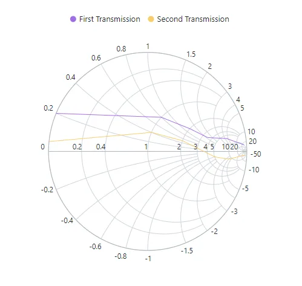
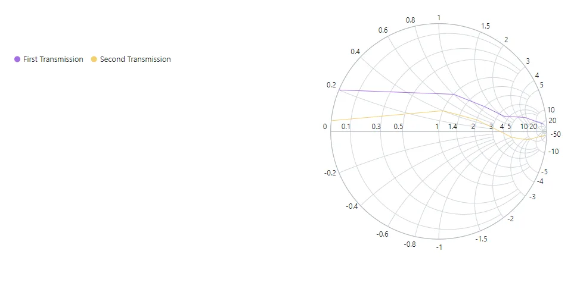
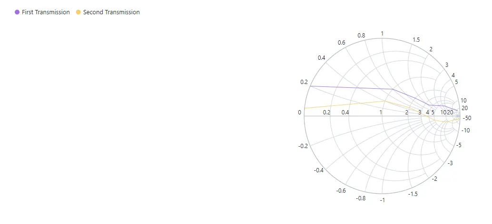
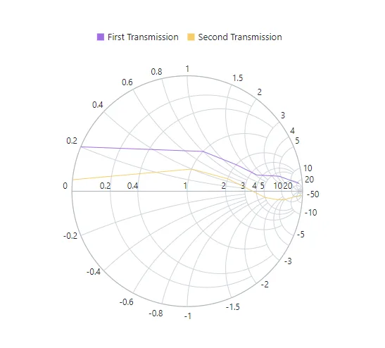
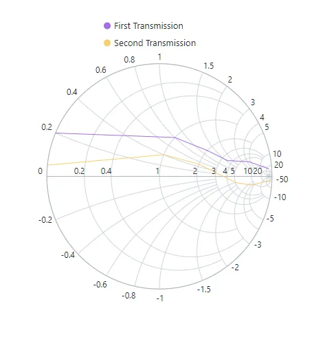
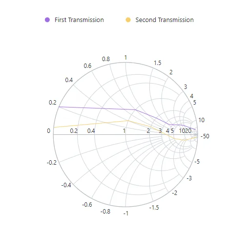
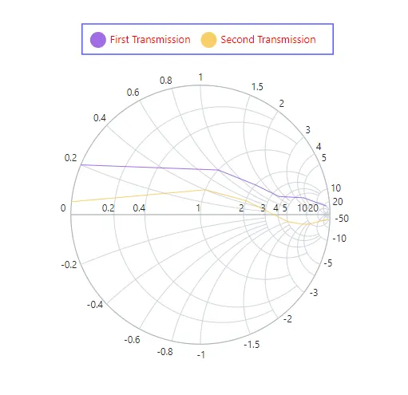
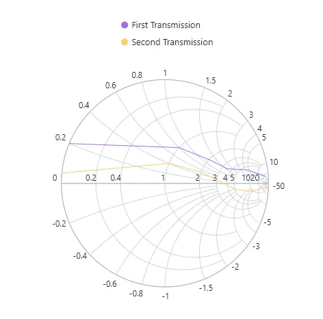
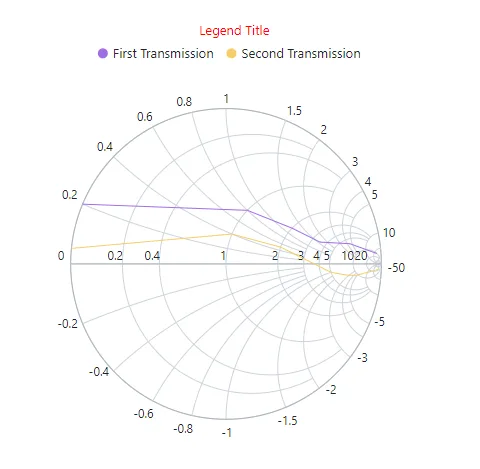

# Blazor Smith Chart Legend

In the Smith Chart, a legend is a key containing symbols and descriptions. It can be interpreted in various colors, shapes, or other identifiers based on the data, and it provides valuable information for interpreting what the Smith Chart is displaying. In simple words, the legend is used to denote the series rendered in the Smith Chart.

## Position

By default, the visibility of the legend is **false**. To enable the legend, set the [Visible](https://help.syncfusion.com/cr/blazor/Syncfusion.Blazor.Charts.SmithChartLegendSettings.html#Syncfusion_Blazor_Charts_SmithChartLegendSettings_Visible) property to **true** in the [SmithChartLegendSettings](https://help.syncfusion.com/cr/blazor/Syncfusion.Blazor.Charts.SmithChartLegendSettings.html). The default position for the legend is **Bottom**. By using the [Position](https://help.syncfusion.com/cr/blazor/Syncfusion.Blazor.Charts.SmithChartLegendSettings.html#Syncfusion_Blazor_Charts_SmithChartLegendSettings_Position) property, the position of the legend can be changed. The legend can be placed on the Smith Chart's bottom, top, right, or left side.

```cshtml
@using Syncfusion.Blazor.Charts

<SfSmithChart>
    <SmithChartLegendSettings Visible='true' Position='@LegendPosition.Top'>
    </SmithChartLegendSettings>
    <SmithChartSeriesCollection>
        <SmithChartSeries Name="First Transmission" DataSource='FirstTransmissionData' Reactance="Reactance" Resistance="Resistance"></SmithChartSeries>
        <SmithChartSeries Name="Second Transmission" DataSource='SecondTransmissionData' Reactance="Reactance" Resistance="Resistance"></SmithChartSeries>
    </SmithChartSeriesCollection>
</SfSmithChart>

@code {
    public class SmithChartData
    {
        public double? Resistance { get; set; }
        public double? Reactance { get; set; }
    };
    public List<SmithChartData> FirstTransmissionData = new List<SmithChartData> {
        new SmithChartData { Resistance= 10, Reactance= 25 },
        new SmithChartData { Resistance= 6, Reactance= 4.5 },
        new SmithChartData { Resistance= 3.5, Reactance= 1.6 },
        new SmithChartData { Resistance= 2, Reactance= 1.2 },
        new SmithChartData { Resistance= 1, Reactance= 0.8 },
        new SmithChartData { Resistance= 0, Reactance= 0.2 }
    };
    public List<SmithChartData> SecondTransmissionData = new List<SmithChartData> {
        new SmithChartData { Resistance= 20, Reactance= -50 },
        new SmithChartData { Resistance= 9, Reactance= -4.5 },
        new SmithChartData { Resistance= 7, Reactance= -2.5 },
        new SmithChartData { Resistance= 5, Reactance= -1 },
        new SmithChartData { Resistance= 2, Reactance= 0.5 },
        new SmithChartData { Resistance= 1, Reactance= 0.4 },
        new SmithChartData { Resistance= 0, Reactance= 0.05 }
    };
}
```



In addition to these positions, the legend can be placed anywhere in the Smith Chart. To achieve this, set the [Position](https://help.syncfusion.com/cr/blazor/Syncfusion.Blazor.Charts.SmithChartLegendSettings.html#Syncfusion_Blazor_Charts_SmithChartLegendSettings_Position) as **Custom** in the [SmithChartLegendSettings](https://help.syncfusion.com/cr/blazor/Syncfusion.Blazor.Charts.SmithChartLegendSettings.html) and specify the X and Y coordinates using the [X](https://help.syncfusion.com/cr/blazor/Syncfusion.Blazor.Charts.SmithChartLegendLocation.html#Syncfusion_Blazor_Charts_SmithChartLegendLocation_X) and [Y](https://help.syncfusion.com/cr/blazor/Syncfusion.Blazor.Charts.SmithChartLegendLocation.html#Syncfusion_Blazor_Charts_SmithChartLegendLocation_Y) properties in the [SmithChartLegendLocation](https://help.syncfusion.com/cr/blazor/Syncfusion.Blazor.Charts.SmithChartLegendLocation.html).

```cshtml
@using Syncfusion.Blazor.Charts

<SfSmithChart>
    <SmithChartLegendSettings Visible='true' Position='@LegendPosition.Custom'>
        <SmithChartLegendLocation X='80' Y='100'></SmithChartLegendLocation>
    </SmithChartLegendSettings>
    <SmithChartSeriesCollection>
        <SmithChartSeries Name="First Transmission" DataSource='FirstTransmissionData' Reactance="Reactance" Resistance="Resistance"></SmithChartSeries>
        <SmithChartSeries Name="Second Transmission" DataSource='SecondTransmissionData' Reactance="Reactance" Resistance="Resistance"></SmithChartSeries>
    </SmithChartSeriesCollection>
</SfSmithChart>

@code {
    public class SmithChartData
    {
        public double? Resistance { get; set; }
        public double? Reactance { get; set; }
    };
    public List<SmithChartData> FirstTransmissionData = new List<SmithChartData> {
        new SmithChartData { Resistance= 10, Reactance= 25 },
        new SmithChartData { Resistance= 6, Reactance= 4.5 },
        new SmithChartData { Resistance= 3.5, Reactance= 1.6 },
        new SmithChartData { Resistance= 2, Reactance= 1.2 },
        new SmithChartData { Resistance= 1, Reactance= 0.8 },
        new SmithChartData { Resistance= 0, Reactance= 0.2 }
    };
    public List<SmithChartData> SecondTransmissionData = new List<SmithChartData> {
        new SmithChartData { Resistance= 20, Reactance= -50 },
        new SmithChartData { Resistance= 9, Reactance= -4.5 },
        new SmithChartData { Resistance= 7, Reactance= -2.5 },
        new SmithChartData { Resistance= 5, Reactance= -1 },
        new SmithChartData { Resistance= 2, Reactance= 0.5 },
        new SmithChartData { Resistance= 1, Reactance= 0.4 },
        new SmithChartData { Resistance= 0, Reactance= 0.05 }
    };
}
```



## Legend Alignment

In addition to positioning the legend in the Smith Chart, its alignment can also be customized. By default, the legend is aligned in the **Center** position. Using the [Alignment](https://help.syncfusion.com/cr/blazor/Syncfusion.Blazor.Charts.SmithChartLegendSettings.html#Syncfusion_Blazor_Charts_SmithChartLegendSettings_Alignment) property, the legend can be aligned in the Smith Chart's near, center, or far locations.

```cshtml
@using Syncfusion.Blazor.Charts

<SfSmithChart>
    <SmithChartLegendSettings Visible='true'
                              Position='@LegendPosition.Top'
                              Alignment='@SmithChartAlignment.Near'>
    </SmithChartLegendSettings>
    <SmithChartSeriesCollection>
        <SmithChartSeries Name="First Transmission" DataSource='FirstTransmissionData' Reactance="Reactance" Resistance="Resistance"></SmithChartSeries>
        <SmithChartSeries Name="Second Transmission" DataSource='SecondTransmissionData' Reactance="Reactance" Resistance="Resistance"></SmithChartSeries>
    </SmithChartSeriesCollection>
</SfSmithChart>

@code {
    public class SmithChartData
    {
        public double? Resistance { get; set; }
        public double? Reactance { get; set; }
    };
    public List<SmithChartData> FirstTransmissionData = new List<SmithChartData> {
        new SmithChartData { Resistance= 10, Reactance= 25 },
        new SmithChartData { Resistance= 6, Reactance= 4.5 },
        new SmithChartData { Resistance= 3.5, Reactance= 1.6 },
        new SmithChartData { Resistance= 2, Reactance= 1.2 },
        new SmithChartData { Resistance= 1, Reactance= 0.8 },
        new SmithChartData { Resistance= 0, Reactance= 0.2 }
    };
    public List<SmithChartData> SecondTransmissionData = new List<SmithChartData> {
        new SmithChartData { Resistance= 20, Reactance= -50 },
        new SmithChartData { Resistance= 9, Reactance= -4.5 },
        new SmithChartData { Resistance= 7, Reactance= -2.5 },
        new SmithChartData { Resistance= 5, Reactance= -1 },
        new SmithChartData { Resistance= 2, Reactance= 0.5 },
        new SmithChartData { Resistance= 1, Reactance= 0.4 },
        new SmithChartData { Resistance= 0, Reactance= 0.05 }
    };
}
```



## Customization

### Legend Shape

By default, the legend is rendered in a **Circle** shape, and the shape color matches the series color in the Smith Chart. Using the [Shape](https://help.syncfusion.com/cr/blazor/Syncfusion.Blazor.Charts.SmithChartLegendSettings.html#Syncfusion_Blazor_Charts_SmithChartLegendSettings_Shape) property in the legend settings, the legend shape can be changed to a rectangle, triangle, and so on.

```cshtml
@using Syncfusion.Blazor.Charts

<SfSmithChart>
    <SmithChartLegendSettings Visible='true'
                              Position='@LegendPosition.Top'
                              Shape='@Shape.Rectangle'>
    </SmithChartLegendSettings>
    <SmithChartSeriesCollection>
        <SmithChartSeries Name="First Transmission" DataSource='FirstTransmissionData' Reactance="Reactance" Resistance="Resistance"></SmithChartSeries>
        <SmithChartSeries Name="Second Transmission" DataSource='SecondTransmissionData' Reactance="Reactance" Resistance="Resistance"></SmithChartSeries>
    </SmithChartSeriesCollection>
</SfSmithChart>

@code {
    public class SmithChartData
    {
        public double? Resistance { get; set; }
        public double? Reactance { get; set; }
    };
    public List<SmithChartData> FirstTransmissionData = new List<SmithChartData> {
        new SmithChartData { Resistance= 10, Reactance= 25 },
        new SmithChartData { Resistance= 6, Reactance= 4.5 },
        new SmithChartData { Resistance= 3.5, Reactance= 1.6 },
        new SmithChartData { Resistance= 2, Reactance= 1.2 },
        new SmithChartData { Resistance= 1, Reactance= 0.8 },
        new SmithChartData { Resistance= 0, Reactance= 0.2 }
    };
    public List<SmithChartData> SecondTransmissionData = new List<SmithChartData> {
        new SmithChartData { Resistance= 20, Reactance= -50 },
        new SmithChartData { Resistance= 9, Reactance= -4.5 },
        new SmithChartData { Resistance= 7, Reactance= -2.5 },
        new SmithChartData { Resistance= 5, Reactance= -1 },
        new SmithChartData { Resistance= 2, Reactance= 0.5 },
        new SmithChartData { Resistance= 1, Reactance= 0.4 },
        new SmithChartData { Resistance= 0, Reactance= 0.05 }
    };
}
```



### Legend Size

By default, the legend takes 20% - 25% of the Smith Chart's height when it is placed at the top or bottom, and 20% - 25% of the chart's width when it is placed on the left or right. It can be changed by using the [Width](https://help.syncfusion.com/cr/blazor/Syncfusion.Blazor.Charts.SmithChartLegendSettings.html#Syncfusion_Blazor_Charts_SmithChartLegendSettings_Width) and [Height](https://help.syncfusion.com/cr/blazor/Syncfusion.Blazor.Charts.SmithChartLegendSettings.html#Syncfusion_Blazor_Charts_SmithChartLegendSettings_Height) properties of the legend settings. Values can be specified in pixels or percentages.

```cshtml
@using Syncfusion.Blazor.Charts

<SfSmithChart>
    <SmithChartLegendSettings Visible='true' Position='@LegendPosition.Top' Height='100px' Width='200px'>
    </SmithChartLegendSettings>
    <SmithChartSeriesCollection>
        <SmithChartSeries Name="First Transmission" DataSource='FirstTransmissionData' Reactance="Reactance" Resistance="Resistance"></SmithChartSeries>
        <SmithChartSeries Name="Second Transmission" DataSource='SecondTransmissionData' Reactance="Reactance" Resistance="Resistance"></SmithChartSeries>
    </SmithChartSeriesCollection>
</SfSmithChart>

@code {
    public class SmithChartData
    {
        public double? Resistance { get; set; }
        public double? Reactance { get; set; }
    };
    public List<SmithChartData> FirstTransmissionData = new List<SmithChartData> {
        new SmithChartData { Resistance= 10, Reactance= 25 },
        new SmithChartData { Resistance= 6, Reactance= 4.5 },
        new SmithChartData { Resistance= 3.5, Reactance= 1.6 },
        new SmithChartData { Resistance= 2, Reactance= 1.2 },
        new SmithChartData { Resistance= 1, Reactance= 0.8 },
        new SmithChartData { Resistance= 0, Reactance= 0.2 }
    };
    public List<SmithChartData> SecondTransmissionData = new List<SmithChartData> {
        new SmithChartData { Resistance= 20, Reactance= -50 },
        new SmithChartData { Resistance= 9, Reactance= -4.5 },
        new SmithChartData { Resistance= 7, Reactance= -2.5 },
        new SmithChartData { Resistance= 5, Reactance= -1 },
        new SmithChartData { Resistance= 2, Reactance= 0.5 },
        new SmithChartData { Resistance= 1, Reactance= 0.4 },
        new SmithChartData { Resistance= 0, Reactance= 0.05 }
    };
}
```



### Padding

The space between two legend items can be customized using the [ItemPadding](https://help.syncfusion.com/cr/blazor/Syncfusion.Blazor.Charts.SmithChartLegendSettings.html#Syncfusion_Blazor_Charts_SmithChartLegendSettings_ItemPadding) property, and the space between the legend shape and text can be customized using the [ShapePadding](https://help.syncfusion.com/cr/blazor/Syncfusion.Blazor.Charts.SmithChartLegendSettings.html#Syncfusion_Blazor_Charts_SmithChartLegendSettings_ShapePadding) property.

```cshtml
@using Syncfusion.Blazor.Charts

<SfSmithChart>
    <SmithChartLegendSettings Visible='true'
                              Position='@LegendPosition.Top'
                              ItemPadding='40'
                              ShapePadding='10'>
    </SmithChartLegendSettings>
    <SmithChartSeriesCollection>
        <SmithChartSeries Name="First Transmission" DataSource='FirstTransmissionData' Reactance="Reactance" Resistance="Resistance"></SmithChartSeries>
        <SmithChartSeries Name="Second Transmission" DataSource='SecondTransmissionData' Reactance="Reactance" Resistance="Resistance"></SmithChartSeries>
    </SmithChartSeriesCollection>
</SfSmithChart>

@code {
    public class SmithChartData
    {
        public double? Resistance { get; set; }
        public double? Reactance { get; set; }
    };
    public List<SmithChartData> FirstTransmissionData = new List<SmithChartData> {
        new SmithChartData { Resistance= 10, Reactance= 25 },
        new SmithChartData { Resistance= 6, Reactance= 4.5 },
        new SmithChartData { Resistance= 3.5, Reactance= 1.6 },
        new SmithChartData { Resistance= 2, Reactance= 1.2 },
        new SmithChartData { Resistance= 1, Reactance= 0.8 },
        new SmithChartData { Resistance= 0, Reactance= 0.2 }
    };
    public List<SmithChartData> SecondTransmissionData = new List<SmithChartData> {
        new SmithChartData { Resistance= 20, Reactance= -50 },
        new SmithChartData { Resistance= 9, Reactance= -4.5 },
        new SmithChartData { Resistance= 7, Reactance= -2.5 },
        new SmithChartData { Resistance= 5, Reactance= -1 },
        new SmithChartData { Resistance= 2, Reactance= 0.5 },
        new SmithChartData { Resistance= 1, Reactance= 0.4 },
        new SmithChartData { Resistance= 0, Reactance= 0.05 }
    };
}
```



### Other customization

Each legend item's style, border, and text can be customized in the Smith Chart by using the following properties.

* [SmithChartLegendItemStyle](https://help.syncfusion.com/cr/blazor/Syncfusion.Blazor.Charts.SmithChartLegendItemStyle.html) - Used to customize the height and the width of each legend item using the [Height](https://help.syncfusion.com/cr/blazor/Syncfusion.Blazor.Charts.SmithChartLegendItemStyle.html#Syncfusion_Blazor_Charts_SmithChartLegendItemStyle_Height) and the [Width](https://help.syncfusion.com/cr/blazor/Syncfusion.Blazor.Charts.SmithChartLegendItemStyle.html#Syncfusion_Blazor_Charts_SmithChartLegendItemStyle_Width) properties.
* [SmithChartLegendBorder](https://help.syncfusion.com/cr/blazor/Syncfusion.Blazor.Charts.SmithChartLegendBorder.html) - Used to customize the border color and width for the legend using the [Color](https://help.syncfusion.com/cr/blazor/Syncfusion.Blazor.Charts.SmithChartCommonBorder.html#Syncfusion_Blazor_Charts_SmithChartCommonBorder_Color) and the [Width](https://help.syncfusion.com/cr/blazor/Syncfusion.Blazor.Charts.SmithChartCommonBorder.html#Syncfusion_Blazor_Charts_SmithChartCommonBorder_Width) properties.
* [Description](https://help.syncfusion.com/cr/blazor/Syncfusion.Blazor.Charts.SmithChartLegendSettings.html#Syncfusion_Blazor_Charts_SmithChartLegendSettings_Description) - Used to specify the legend description.
* [SmithChartLegendTextStyle](https://help.syncfusion.com/cr/blazor/Syncfusion.Blazor.Charts.SmithChartLegendTextStyle.html) - Used to customize the properties such as [FontFamily](https://help.syncfusion.com/cr/blazor/Syncfusion.Blazor.Charts.SmithChartCommonFont.html#Syncfusion_Blazor_Charts_SmithChartCommonFont_FontFamily), [FontWeight](https://help.syncfusion.com/cr/blazor/Syncfusion.Blazor.Charts.SmithChartCommonFont.html#Syncfusion_Blazor_Charts_SmithChartCommonFont_FontWeight), [FontStyle](https://help.syncfusion.com/cr/blazor/Syncfusion.Blazor.Charts.SmithChartCommonFont.html#Syncfusion_Blazor_Charts_SmithChartCommonFont_FontStyle), [Opacity](https://help.syncfusion.com/cr/blazor/Syncfusion.Blazor.Charts.SmithChartCommonFont.html#Syncfusion_Blazor_Charts_SmithChartCommonFont_Opacity), [Color](https://help.syncfusion.com/cr/blazor/Syncfusion.Blazor.Charts.SmithChartCommonFont.html#Syncfusion_Blazor_Charts_SmithChartCommonFont_Color) and [Size](https://help.syncfusion.com/cr/blazor/Syncfusion.Blazor.Charts.SmithChartCommonFont.html#Syncfusion_Blazor_Charts_SmithChartCommonFont_Size) for each legend text.

```cshtml
@using Syncfusion.Blazor.Charts

<SfSmithChart>
    <SmithChartLegendSettings Visible='true' Position='@LegendPosition.Top'>
        <SmithChartLegendTextStyle Color="red"></SmithChartLegendTextStyle>
        <SmithChartLegendItemStyle Height="20" Width="20"></SmithChartLegendItemStyle>
        <SmithChartLegendBorder Color="blue" Width="1"></SmithChartLegendBorder>
    </SmithChartLegendSettings>
    <SmithChartSeriesCollection>
        <SmithChartSeries Name="First Transmission" DataSource='FirstTransmissionData' Reactance="Reactance" Resistance="Resistance"></SmithChartSeries>
        <SmithChartSeries Name="Second Transmission" DataSource='SecondTransmissionData' Reactance="Reactance" Resistance="Resistance"></SmithChartSeries>
    </SmithChartSeriesCollection>
</SfSmithChart>

@code {
    public class SmithChartData
    {
        public double? Resistance { get; set; }
        public double? Reactance { get; set; }
    };
    public List<SmithChartData> FirstTransmissionData = new List<SmithChartData> {
        new SmithChartData { Resistance= 10, Reactance= 25 },
        new SmithChartData { Resistance= 6, Reactance= 4.5 },
        new SmithChartData { Resistance= 3.5, Reactance= 1.6 },
        new SmithChartData { Resistance= 2, Reactance= 1.2 },
        new SmithChartData { Resistance= 1, Reactance= 0.8 },
        new SmithChartData { Resistance= 0, Reactance= 0.2 }
    };
    public List<SmithChartData> SecondTransmissionData = new List<SmithChartData> {
        new SmithChartData { Resistance= 20, Reactance= -50 },
        new SmithChartData { Resistance= 9, Reactance= -4.5 },
        new SmithChartData { Resistance= 7, Reactance= -2.5 },
        new SmithChartData { Resistance= 5, Reactance= -1 },
        new SmithChartData { Resistance= 2, Reactance= 0.5 },
        new SmithChartData { Resistance= 1, Reactance= 0.4 },
        new SmithChartData { Resistance= 0, Reactance= 0.05 }
    };
}
```



## Toggle Visibility

By default, the series name is displayed in the legend. The series can be hidden by clicking the legend item for that series. Series visibility can be toggled by using the [ToggleVisibility](https://help.syncfusion.com/cr/blazor/Syncfusion.Blazor.Charts.SmithChartLegendSettings.html#Syncfusion_Blazor_Charts_SmithChartLegendSettings_ToggleVisibility) property. By default, it is **true**.

```cshtml
@using Syncfusion.Blazor.Charts

<SfSmithChart>
    <SmithChartLegendSettings Visible='true'
                              Position='@LegendPosition.Top'
                              ToggleVisibility="true">
    </SmithChartLegendSettings>
    <SmithChartSeriesCollection>
        <SmithChartSeries Name="First Transmission" DataSource='FirstTransmissionData' Reactance="Reactance" Resistance="Resistance"></SmithChartSeries>
        <SmithChartSeries Name="Second Transmission" DataSource='SecondTransmissionData' Reactance="Reactance" Resistance="Resistance"></SmithChartSeries>
    </SmithChartSeriesCollection>
</SfSmithChart>

@code {
    public class SmithChartData
    {
        public double? Resistance { get; set; }
        public double? Reactance { get; set; }
    };
    public List<SmithChartData> FirstTransmissionData = new List<SmithChartData> {
        new SmithChartData { Resistance= 10, Reactance= 25 },
        new SmithChartData { Resistance= 6, Reactance= 4.5 },
        new SmithChartData { Resistance= 3.5, Reactance= 1.6 },
        new SmithChartData { Resistance= 2, Reactance= 1.2 },
        new SmithChartData { Resistance= 1, Reactance= 0.8 },
        new SmithChartData { Resistance= 0, Reactance= 0.2 }
    };
    public List<SmithChartData> SecondTransmissionData = new List<SmithChartData> {
        new SmithChartData { Resistance= 20, Reactance= -50 },
        new SmithChartData { Resistance= 9, Reactance= -4.5 },
        new SmithChartData { Resistance= 7, Reactance= -2.5 },
        new SmithChartData { Resistance= 5, Reactance= -1 },
        new SmithChartData { Resistance= 2, Reactance= 0.5 },
        new SmithChartData { Resistance= 1, Reactance= 0.4 },
        new SmithChartData { Resistance= 0, Reactance= 0.05 }
    };
}
```

## Rows and Columns

The legend can also be arranged in rows and columns using the [RowCount](https://help.syncfusion.com/cr/blazor/Syncfusion.Blazor.Charts.SmithChartLegendSettings.html#Syncfusion_Blazor_Charts_SmithChartLegendSettings_RowCount) and [ColumnCount](https://help.syncfusion.com/cr/blazor/Syncfusion.Blazor.Charts.SmithChartLegendSettings.html#Syncfusion_Blazor_Charts_SmithChartLegendSettings_ColumnCount) properties. By default, their values are **0**.

```cshtml
@using Syncfusion.Blazor.Charts

<SfSmithChart>
    <SmithChartLegendSettings Visible='true' RowCount="2" ColumnCount="1"
                              Position='@LegendPosition.Top'>
    </SmithChartLegendSettings>
    <SmithChartSeriesCollection>
        <SmithChartSeries Name="First Transmission" DataSource='FirstTransmissionData' Reactance="Reactance" Resistance="Resistance"></SmithChartSeries>
        <SmithChartSeries Name="Second Transmission" DataSource='SecondTransmissionData' Reactance="Reactance" Resistance="Resistance"></SmithChartSeries>
    </SmithChartSeriesCollection>
</SfSmithChart>

@code {
    public class SmithChartData
    {
        public double? Resistance { get; set; }
        public double? Reactance { get; set; }
    };
    public List<SmithChartData> FirstTransmissionData = new List<SmithChartData> {
        new SmithChartData { Resistance= 10, Reactance= 25 },
        new SmithChartData { Resistance= 6, Reactance= 4.5 },
        new SmithChartData { Resistance= 3.5, Reactance= 1.6 },
        new SmithChartData { Resistance= 2, Reactance= 1.2 },
        new SmithChartData { Resistance= 1, Reactance= 0.8 },
        new SmithChartData { Resistance= 0, Reactance= 0.2 }
    };
    public List<SmithChartData> SecondTransmissionData = new List<SmithChartData> {
        new SmithChartData { Resistance= 20, Reactance= -50 },
        new SmithChartData { Resistance= 9, Reactance= -4.5 },
        new SmithChartData { Resistance= 7, Reactance= -2.5 },
        new SmithChartData { Resistance= 5, Reactance= -1 },
        new SmithChartData { Resistance= 2, Reactance= 0.5 },
        new SmithChartData { Resistance= 1, Reactance= 0.4 },
        new SmithChartData { Resistance= 0, Reactance= 0.05 }
    };
}
```



## Title

The title provides information about the legend in the Smith Chart. It can be customized using the following properties in the [SmithChartLegendTitle](https://help.syncfusion.com/cr/blazor/Syncfusion.Blazor.Charts.SmithChartLegendTitle.html).

* [Text](https://help.syncfusion.com/cr/blazor/Syncfusion.Blazor.Charts.SmithChartLegendTitle.html#Syncfusion_Blazor_Charts_SmithChartLegendTitle_Text) - Used to customize the legend title text.
* [Visible](https://help.syncfusion.com/cr/blazor/Syncfusion.Blazor.Charts.SmithChartLegendTitle.html#Syncfusion_Blazor_Charts_SmithChartLegendTitle_Visible) - Used to specify the visibility of the legend title. By default, it is **true**.
* [TextAlignment](https://help.syncfusion.com/cr/blazor/Syncfusion.Blazor.Charts.SmithChartLegendTitle.html#Syncfusion_Blazor_Charts_SmithChartLegendTitle_TextAlignment) - Used to specify the legend title alignment.
* [Description](https://help.syncfusion.com/cr/blazor/Syncfusion.Blazor.Charts.SmithChartLegendTitle.html#Syncfusion_Blazor_Charts_SmithChartLegendTitle_Description) - Used to specify the legend title description.
* [SmithChartLegendTitleTextStyle](https://help.syncfusion.com/cr/blazor/Syncfusion.Blazor.Charts.SmithChartLegendTitleTextStyle.html) - Used to customize the properties such as [FontFamily](https://help.syncfusion.com/cr/blazor/Syncfusion.Blazor.Charts.SmithChartCommonFont.html#Syncfusion_Blazor_Charts_SmithChartCommonFont_FontFamily), [FontWeight](https://help.syncfusion.com/cr/blazor/Syncfusion.Blazor.Charts.SmithChartCommonFont.html#Syncfusion_Blazor_Charts_SmithChartCommonFont_FontWeight), [FontStyle](https://help.syncfusion.com/cr/blazor/Syncfusion.Blazor.Charts.SmithChartCommonFont.html#Syncfusion_Blazor_Charts_SmithChartCommonFont_FontStyle), [Opacity](https://help.syncfusion.com/cr/blazor/Syncfusion.Blazor.Charts.SmithChartCommonFont.html#Syncfusion_Blazor_Charts_SmithChartCommonFont_Opacity), [Color](https://help.syncfusion.com/cr/blazor/Syncfusion.Blazor.Charts.SmithChartCommonFont.html#Syncfusion_Blazor_Charts_SmithChartCommonFont_Color) and [Size](https://help.syncfusion.com/cr/blazor/Syncfusion.Blazor.Charts.SmithChartLegendTitleTextStyle.html#Syncfusion_Blazor_Charts_SmithChartLegendTitleTextStyle_Size) for the title text.

```cshtml
@using Syncfusion.Blazor.Charts

<SfSmithChart>
    <SmithChartLegendSettings Visible='true' Position='@LegendPosition.Top'>
        <SmithChartLegendTitle Text="Legend Title" TextAlignment="@SmithChartAlignment.Center">
            <SmithChartLegendTitleTextStyle Color="red"></SmithChartLegendTitleTextStyle>
        </SmithChartLegendTitle>
    </SmithChartLegendSettings>
    <SmithChartSeriesCollection>
        <SmithChartSeries Name="First Transmission" DataSource='FirstTransmissionData' Reactance="Reactance" Resistance="Resistance"></SmithChartSeries>
        <SmithChartSeries Name="Second Transmission" DataSource='SecondTransmissionData' Reactance="Reactance" Resistance="Resistance"></SmithChartSeries>
    </SmithChartSeriesCollection>
</SfSmithChart>

@code {
    public class SmithChartData
    {
        public double? Resistance { get; set; }
        public double? Reactance { get; set; }
    };
    public List<SmithChartData> FirstTransmissionData = new List<SmithChartData> {
        new SmithChartData { Resistance= 10, Reactance= 25 },
        new SmithChartData { Resistance= 6, Reactance= 4.5 },
        new SmithChartData { Resistance= 3.5, Reactance= 1.6 },
        new SmithChartData { Resistance= 2, Reactance= 1.2 },
        new SmithChartData { Resistance= 1, Reactance= 0.8 },
        new SmithChartData { Resistance= 0, Reactance= 0.2 }
    };
    public List<SmithChartData> SecondTransmissionData = new List<SmithChartData> {
        new SmithChartData { Resistance= 20, Reactance= -50 },
        new SmithChartData { Resistance= 9, Reactance= -4.5 },
        new SmithChartData { Resistance= 7, Reactance= -2.5 },
        new SmithChartData { Resistance= 5, Reactance= -1 },
        new SmithChartData { Resistance= 2, Reactance= 0.5 },
        new SmithChartData { Resistance= 1, Reactance= 0.4 },
        new SmithChartData { Resistance= 0, Reactance= 0.05 }
    };
}
```


