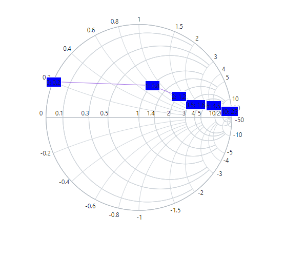

# Marker and Data labels in Blazor Smith Chart Component

Markers and data labels are used to provide information about the data points in the series. Both the marker and the datalabel are disabled by default in the Smith Chart. Both can be enabled by making the [Visible](https://help.syncfusion.com/cr/blazor/Syncfusion.Blazor.Charts.SmithChartSeriesMarker.html#Syncfusion_Blazor_Charts_SmithChartSeriesMarker_Visible) property in the marker and the datalabel settings to **true**.

## Marker

By default, the visibility of the marker is **false**. It can be enabled by setting the [Visible](https://help.syncfusion.com/cr/blazor/Syncfusion.Blazor.Charts.SmithChartSeriesMarker.html#Syncfusion_Blazor_Charts_SmithChartSeriesMarker_Visible) property to **true** in the [SmithChartSeriesMarker](https://help.syncfusion.com/cr/blazor/Syncfusion.Blazor.Charts.SmithChartSeriesMarker.html). This will add a marker for each data point in the series. Using marker setting, it can be customized differently for each series in the Smith Chart.

```cshtml
@using Syncfusion.Blazor.Charts

<SfSmithChart>
    <SmithChartSeriesCollection>
        <SmithChartSeries Name="Transmission" DataSource='TransmissionData' Reactance="Reactance" Resistance="Resistance">
            <SmithChartSeriesMarker Visible='true'></SmithChartSeriesMarker>
        </SmithChartSeries>
    </SmithChartSeriesCollection>
</SfSmithChart>

@code {
    public class SmithChartData
    {
        public double? Resistance { get; set; }
        public double? Reactance { get; set; }
    };
    public List<SmithChartData> TransmissionData = new List<SmithChartData> {
        new SmithChartData { Resistance= 10, Reactance= 25 },
        new SmithChartData { Resistance= 6, Reactance= 4.5 },
        new SmithChartData { Resistance= 3.5, Reactance= 1.6 },
        new SmithChartData { Resistance= 2, Reactance= 1.2 },
        new SmithChartData { Resistance= 1, Reactance= 0.8 },
        new SmithChartData { Resistance= 0, Reactance= 0.2 }
    };
}
```


### Marker Customization

Using the [SmithChartSeriesMarker](https://help.syncfusion.com/cr/blazor/Syncfusion.Blazor.Charts.SmithChartSeriesMarker.html), the following marker properties can be customized differently for each series in the Smith Chart.

* [Width](https://help.syncfusion.com/cr/blazor/Syncfusion.Blazor.Charts.SmithChartSeriesMarker.html#Syncfusion_Blazor_Charts_SmithChartSeriesMarker_Width) - Used to customize the width of the marker.
* [Height](https://help.syncfusion.com/cr/blazor/Syncfusion.Blazor.Charts.SmithChartSeriesMarker.html#Syncfusion_Blazor_Charts_SmithChartSeriesMarker_Height) - Used to customize the height of the marker.
* [Fill](https://help.syncfusion.com/cr/blazor/Syncfusion.Blazor.Charts.SmithChartSeriesMarker.html#Syncfusion_Blazor_Charts_SmithChartSeriesMarker_Fill) - Used to customize the fill color of the marker.
* [Opacity](https://help.syncfusion.com/cr/blazor/Syncfusion.Blazor.Charts.SmithChartSeriesMarker.html#Syncfusion_Blazor_Charts_SmithChartSeriesMarker_Opacity) - Used to customize the opacity of the marker.
* [SmithChartSeriesMarkerBorder](https://help.syncfusion.com/cr/blazor/Syncfusion.Blazor.Charts.SmithChartSeriesMarkerBorder.html) - Used to control the width and the color of the marker's border using the [Color](https://help.syncfusion.com/cr/blazor/Syncfusion.Blazor.Charts.SmithChartSeriesMarkerBorder.html#Syncfusion_Blazor_Charts_SmithChartSeriesMarkerBorder_Color) and the [Width](https://help.syncfusion.com/cr/blazor/Syncfusion.Blazor.Charts.SmithChartSeriesMarkerBorder.html#Syncfusion_Blazor_Charts_SmithChartSeriesMarkerBorder_Width) properties.
* [Shape](https://help.syncfusion.com/cr/blazor/Syncfusion.Blazor.Charts.SmithChartSeriesMarker.html#Syncfusion_Blazor_Charts_SmithChartSeriesMarker_Shape) - Used to change the shape of the marker.

```cshtml
@using Syncfusion.Blazor.Charts

<SfSmithChart>
    <SmithChartSeriesCollection>
        <SmithChartSeries Name="Transmission" DataSource='TransmissionData' Reactance="Reactance" Resistance="Resistance">
            <SmithChartSeriesMarker Visible='true'
                                    Height='10'
                                    Width='10'
                                    Fill="#ff99ff"
                                    Opacity='1'
                                    Shape='@Shape.Rectangle'>
                <SmithChartSeriesMarkerBorder Width='2' Color="#cc00cc">
                </SmithChartSeriesMarkerBorder>
            </SmithChartSeriesMarker>
        </SmithChartSeries>
    </SmithChartSeriesCollection>
</SfSmithChart>

@code {
    public class SmithChartData
    {
        public double? Resistance { get; set; }
        public double? Reactance { get; set; }
    };
    public List<SmithChartData> TransmissionData = new List<SmithChartData> {
        new SmithChartData { Resistance= 10, Reactance= 25 },
        new SmithChartData { Resistance= 6, Reactance= 4.5 },
        new SmithChartData { Resistance= 3.5, Reactance= 1.6 },
        new SmithChartData { Resistance= 2, Reactance= 1.2 },
        new SmithChartData { Resistance= 1, Reactance= 0.8 },
        new SmithChartData { Resistance= 0, Reactance= 0.2 }
    };
}
```


## Data labels

By default, the data labels are disabled. It can be enabled by setting the [Visible](https://help.syncfusion.com/cr/blazor/Syncfusion.Blazor.Charts.SmithChartSeriesDatalabel.html#Syncfusion_Blazor_Charts_SmithChartSeriesDatalabel_Visible) property to **true** in the [SmithChartSeriesDatalabel](https://help.syncfusion.com/cr/blazor/Syncfusion.Blazor.Charts.SmithChartSeriesDatalabel.html). For each point in the series, a datalabel is created.

```cshtml
@using Syncfusion.Blazor.Charts

<SfSmithChart>
    <SmithChartSeriesCollection>
        <SmithChartSeries Name="Transmission" DataSource='TransmissionData' Reactance="Reactance" Resistance="Resistance">
            <SmithChartSeriesMarker>
                <SmithChartSeriesDatalabel Visible='true'></SmithChartSeriesDatalabel>
            </SmithChartSeriesMarker>
        </SmithChartSeries>
    </SmithChartSeriesCollection>
</SfSmithChart>

@code {
    public class SmithChartData
    {
        public double? Resistance { get; set; }
        public double? Reactance { get; set; }
    };
    public List<SmithChartData> TransmissionData = new List<SmithChartData> {
        new SmithChartData { Resistance= 10, Reactance= 25 },
        new SmithChartData { Resistance= 6, Reactance= 4.5 },
        new SmithChartData { Resistance= 3.5, Reactance= 1.6 },
        new SmithChartData { Resistance= 2, Reactance= 1.2 },
        new SmithChartData { Resistance= 1, Reactance= 0.8 },
        new SmithChartData { Resistance= 0, Reactance= 0.2 }
    };
}
```


### Data labels customization

The data labels can be customized using the following properties.

* [Fill](https://help.syncfusion.com/cr/blazor/Syncfusion.Blazor.Charts.SmithChartSeriesDatalabel.html#Syncfusion_Blazor_Charts_SmithChartSeriesDatalabel_Fill) - Used to change the fill color of the data labels.
* [Opacity](https://help.syncfusion.com/cr/blazor/Syncfusion.Blazor.Charts.SmithChartSeriesDatalabel.html#Syncfusion_Blazor_Charts_SmithChartSeriesDatalabel_Opacity) - Used to control the opacity of the data labels.
* [SmithChartSeriesDataLabelBorder](https://help.syncfusion.com/cr/blazor/Syncfusion.Blazor.Charts.SmithChartSeriesDataLabelBorder.html) - Used to customize width and color of the border using the [Width](https://help.syncfusion.com/cr/blazor/Syncfusion.Blazor.Charts.SmithChartSeriesDataLabelBorder.html#Syncfusion_Blazor_Charts_SmithChartSeriesDataLabelBorder_Width) and the [Color](https://help.syncfusion.com/cr/blazor/Syncfusion.Blazor.Charts.SmithChartSeriesDataLabelBorder.html#Syncfusion_Blazor_Charts_SmithChartSeriesDataLabelBorder_Color) properties.
* [SmithChartDataLabelTextStyle](https://help.syncfusion.com/cr/blazor/Syncfusion.Blazor.Charts.SmithChartDataLabelTextStyle.html) - Used to customize properties such as [FontFamily](https://help.syncfusion.com/cr/blazor/Syncfusion.Blazor.Charts.SmithChartCommonFont.html#Syncfusion_Blazor_Charts_SmithChartCommonFont_FontFamily), [FontWeight](https://help.syncfusion.com/cr/blazor/Syncfusion.Blazor.Charts.SmithChartCommonFont.html#Syncfusion_Blazor_Charts_SmithChartCommonFont_FontWeight), [FontStyle](https://help.syncfusion.com/cr/blazor/Syncfusion.Blazor.Charts.SmithChartCommonFont.html#Syncfusion_Blazor_Charts_SmithChartCommonFont_FontStyle), [Opacity](https://help.syncfusion.com/cr/blazor/Syncfusion.Blazor.Charts.SmithChartCommonFont.html#Syncfusion_Blazor_Charts_SmithChartCommonFont_Opacity), [Color](https://help.syncfusion.com/cr/blazor/Syncfusion.Blazor.Charts.SmithChartCommonFont.html#Syncfusion_Blazor_Charts_SmithChartCommonFont_Color), and [Size](https://help.syncfusion.com/cr/blazor/Syncfusion.Blazor.Charts.SmithChartCommonFont.html#Syncfusion_Blazor_Charts_SmithChartCommonFont_Size) for datalabel font.

```cshtml
@using Syncfusion.Blazor.Charts

<SfSmithChart>
    <SmithChartSeriesCollection>
        <SmithChartSeries Name="Transmission" DataSource='TransmissionData' Reactance="Reactance" Resistance="Resistance">
            <SmithChartSeriesMarker Visible='true'>
                <SmithChartSeriesDatalabel Visible='true' Fill="#99ffcc" Opacity='1'>
                    <SmithChartDataLabelTextStyle Color="red" Size="15px"></SmithChartDataLabelTextStyle>
                    <SmithChartSeriesDataLabelBorder Color="green" Width='2'>
                    </SmithChartSeriesDataLabelBorder>
                </SmithChartSeriesDatalabel>
            </SmithChartSeriesMarker>
        </SmithChartSeries>
    </SmithChartSeriesCollection>
</SfSmithChart>

@code {
    public class SmithChartData
    {
        public double? Resistance { get; set; }
        public double? Reactance { get; set; }
    };
    private List<SmithChartData> TransmissionData = new List<SmithChartData> {
        new SmithChartData { Resistance= 10, Reactance= 25 },
        new SmithChartData { Resistance= 6, Reactance= 4.5 },
        new SmithChartData { Resistance= 3.5, Reactance= 1.6 },
        new SmithChartData { Resistance= 2, Reactance= 1.2 },
        new SmithChartData { Resistance= 1, Reactance= 0.8 },
        new SmithChartData { Resistance= 0, Reactance= 0.2 }
    };
}
```


### Smart Labels

Data labels can be placed smartly by setting the [EnableSmartLabels](https://help.syncfusion.com/cr/blazor/Syncfusion.Blazor.Charts.SmithChartSeries.html#Syncfusion_Blazor_Charts_SmithChartSeries_EnableSmartLabels) to **true** in the Smith Chart series. A line will be connected for smartly aligned labels. It's color and width can be customized using the [Color](https://help.syncfusion.com/cr/blazor/Syncfusion.Blazor.Charts.SmithChartDataLabelConnectorLine.html#Syncfusion_Blazor_Charts_SmithChartDataLabelConnectorLine_Color) and the [Width](https://help.syncfusion.com/cr/blazor/Syncfusion.Blazor.Charts.SmithChartDataLabelConnectorLine.html#Syncfusion_Blazor_Charts_SmithChartDataLabelConnectorLine_Width) properties in the [SmithChartDataLabelConnectorLine](https://help.syncfusion.com/cr/blazor/Syncfusion.Blazor.Charts.SmithChartDataLabelConnectorLine.html).

```cshtml
@using Syncfusion.Blazor.Charts

<SfSmithChart>
    <SmithChartSeriesCollection>
        <SmithChartSeries EnableSmartLabels="true" Name="Transmission" DataSource='TransmissionData' Reactance="Reactance" Resistance="Resistance">
            <SmithChartSeriesMarker Visible='true'>
                <SmithChartSeriesDatalabel Visible='true'>
                    <SmithChartDataLabelConnectorLine Color="red" Width="1.5"></SmithChartDataLabelConnectorLine>
                </SmithChartSeriesDatalabel>
            </SmithChartSeriesMarker>
        </SmithChartSeries>
    </SmithChartSeriesCollection>
</SfSmithChart>

@code {
    public class SmithChartData
    {
        public double? Resistance { get; set; }
        public double? Reactance { get; set; }
    };
    public List<SmithChartData> TransmissionData = new List<SmithChartData> {
        new SmithChartData { Resistance= 10, Reactance= 25 }, new SmithChartData { Resistance= 8, Reactance= 6 },
        new SmithChartData { Resistance= 6, Reactance= 4.5 }, new SmithChartData { Resistance= 4.5, Reactance= 2 },
        new SmithChartData { Resistance= 3.5, Reactance= 1.6 }, new SmithChartData { Resistance= 2.5, Reactance= 1.3 },
        new SmithChartData { Resistance= 2, Reactance= 1.2 }, new SmithChartData { Resistance= 1.5, Reactance= 1 },
        new SmithChartData { Resistance= 1, Reactance= 0.8 }, new SmithChartData { Resistance= 0.5, Reactance= 0.4 },
        new SmithChartData { Resistance= 0.3, Reactance= 0.2 }, new SmithChartData { Resistance= 0, Reactance= 0.15 },
    };
}
```


### Datalabel Template

To access the aggregate values inside the template, the implicit named parameter context can be used. The context can be typecast as [SmithChartPoint](https://help.syncfusion.com/cr/blazor/Syncfusion.Blazor.Charts.SmithChartPoint.html) to get aggregate values inside the template. The datalabel template using the context is shown as following.

```cshtml
@using Syncfusion.Blazor.Charts

<SfSmithChart>
    <SmithChartSeriesCollection>
        <SmithChartSeries Name="Transmission" DataSource='TransmissionData' Reactance="Reactance" Resistance="Resistance">
            <SmithChartSeriesMarker Visible='true'>
                <SmithChartSeriesDatalabel Visible='true'>
                    <Template>
                        @{
                            var data = context as SmithChartPoint;
                        }
                        <div style="background-color: blue">@data.Resistance: @data.Reactance</div>
                    </Template>
                </SmithChartSeriesDatalabel>
            </SmithChartSeriesMarker>
        </SmithChartSeries>
    </SmithChartSeriesCollection>
</SfSmithChart>

@code {
    public class SmithChartData
    {
        public double? Resistance { get; set; }
        public double? Reactance { get; set; }
    };
    public List<SmithChartData> TransmissionData = new List<SmithChartData> {
        new SmithChartData { Resistance= 10, Reactance= 25 },
        new SmithChartData { Resistance= 6, Reactance= 4.5 },
        new SmithChartData { Resistance= 3.5, Reactance= 1.6 },
        new SmithChartData { Resistance= 2, Reactance= 1.2 },
        new SmithChartData { Resistance= 1, Reactance= 0.8 },
        new SmithChartData { Resistance= 0, Reactance= 0.2 }
    };
}
```

