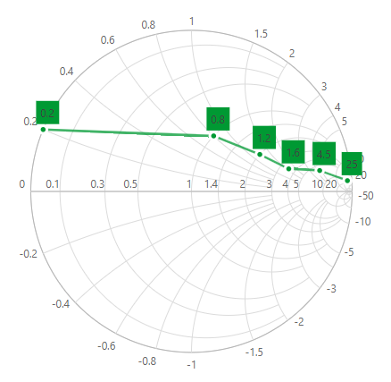

# Series in Blazor Smith Chart Component

The [SmithChartSeries](https://help.syncfusion.com/cr/blazor/Syncfusion.Blazor.Charts.SmithChartSeries.html#properties) visually represents data in the Smith Chart. Each series can be customized using the following options:

* [Fill](https://help.syncfusion.com/cr/blazor/Syncfusion.Blazor.Charts.SmithChartSeries.html#Syncfusion_Blazor_Charts_SmithChartSeries_Fill) – Sets the fill color for the series.
* [Visible](https://help.syncfusion.com/cr/blazor/Syncfusion.Blazor.Charts.SmithChartSeries.html#Syncfusion_Blazor_Charts_SmithChartSeries_Visible) – Controls the visibility of the series.
* [Opacity](https://help.syncfusion.com/cr/blazor/Syncfusion.Blazor.Charts.SmithChartSeries.html#Syncfusion_Blazor_Charts_SmithChartSeries_Opacity) – Sets the opacity of the series line.
* [Width](https://help.syncfusion.com/cr/blazor/Syncfusion.Blazor.Charts.SmithChartSeries.html#Syncfusion_Blazor_Charts_SmithChartSeries_Width) – Sets the width of the series line.

```cshtml

@using Syncfusion.Blazor.Charts

<SfSmithChart>
    <SmithChartSeriesCollection>
        <SmithChartSeries Name="Transmission" DataSource='TransmissionData'
                          Reactance="Reactance" Resistance="Resistance" Fill="#009933"
                          Visible="true"
                          Opacity="0.75"
                          Width="2.5">
            <SmithChartSeriesMarker Visible='true'>
                <SmithChartSeriesDatalabel Visible='true'></SmithChartSeriesDatalabel>
            </SmithChartSeriesMarker>
        </SmithChartSeries>
    </SmithChartSeriesCollection>
</SfSmithChart>

@code {
    public class SmithChartData
    {
        public double? Resistance { get; set; }
        public double? Reactance { get; set; }
    };

    public List<SmithChartData> TransmissionData = new List<SmithChartData> {
        new SmithChartData { Resistance = 10, Reactance = 25 },
        new SmithChartData { Resistance = 6, Reactance = 4.5 },
        new SmithChartData { Resistance = 3.5, Reactance = 1.6 },
        new SmithChartData { Resistance = 2, Reactance = 1.2 },
        new SmithChartData { Resistance = 1, Reactance = 0.8 },
        new SmithChartData { Resistance = 0, Reactance = 0.2 }
    };
}

```



## Animation

Enable animation for the Smith Chart series using the [EnableAnimation](https://help.syncfusion.com/cr/blazor/Syncfusion.Blazor.Charts.SmithChartSeries.html#Syncfusion_Blazor_Charts_SmithChartSeries_EnableAnimation) property. By default, animation is disabled. Control the animation speed with the [AnimationDuration](https://help.syncfusion.com/cr/blazor/Syncfusion.Blazor.Charts.SmithChartSeries.html#Syncfusion_Blazor_Charts_SmithChartSeries_AnimationDuration) property, which defaults to **2000** milliseconds.

```cshtml

@using Syncfusion.Blazor.Charts

<SfSmithChart>
    <SmithChartSeriesCollection>
        <SmithChartSeries Name="Transmission" DataSource='TransmissionData'
                          Reactance="Reactance" Resistance="Resistance" EnableAnimation="true" AnimationDuration="1500">
            <SmithChartSeriesMarker Visible='true'>
                <SmithChartSeriesDatalabel Visible='true'></SmithChartSeriesDatalabel>
            </SmithChartSeriesMarker>
        </SmithChartSeries>
    </SmithChartSeriesCollection>
</SfSmithChart>

@code {
    public class SmithChartData
    {
        public double? Resistance { get; set; }
        public double? Reactance { get; set; }
    };

    public List<SmithChartData> TransmissionData = new List<SmithChartData> {
        new SmithChartData { Resistance = 10, Reactance = 25 },
        new SmithChartData { Resistance = 6, Reactance = 4.5 },
        new SmithChartData { Resistance = 3.5, Reactance = 1.6 },
        new SmithChartData { Resistance = 2, Reactance = 1.2 },
        new SmithChartData { Resistance = 1, Reactance = 0.8 },
        new SmithChartData { Resistance = 0, Reactance = 0.2 }
    };
}

```
