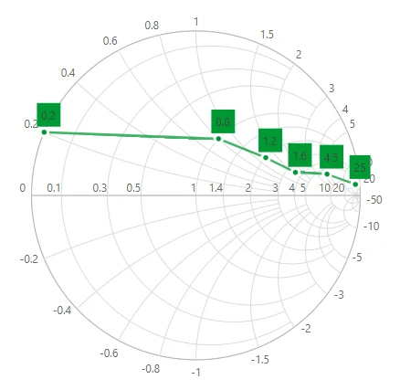

# Smith Chart Series in Blazor

The [SmithChartSeries](https://help.syncfusion.com/cr/blazor/Syncfusion.Blazor.Charts.SmithChartSeries.html#properties) component represents data visually in the Smith Chart. The series can be populated using the [DataSource](https://help.syncfusion.com/cr/blazor/Syncfusion.Blazor.Charts.SmithChartSeries.html#Syncfusion_Blazor_Charts_SmithChartSeries_DataSource) and [Points](https://help.syncfusion.com/cr/blazor/Syncfusion.Blazor.Charts.SmithChartSeries.html#Syncfusion_Blazor_Charts_SmithChartSeries_Points) properties. When using `DataSource`, specify the [Reactance](https://help.syncfusion.com/cr/blazor/Syncfusion.Blazor.Charts.SmithChartSeries.html#Syncfusion_Blazor_Charts_SmithChartSeries_Reactance) and [Resistance](https://help.syncfusion.com/cr/blazor/Syncfusion.Blazor.Charts.SmithChartSeries.html#Syncfusion_Blazor_Charts_SmithChartSeries_Resistance) mapping fields.


The following properties customize each series.

* [Name](https://help.syncfusion.com/cr/blazor/Syncfusion.Blazor.Charts.SmithChartSeries.html#Syncfusion_Blazor_Charts_SmithChartSeries_Name) - Specifies the name of the series displayed in the legend.
* [Fill](https://help.syncfusion.com/cr/blazor/Syncfusion.Blazor.Charts.SmithChartSeries.html#Syncfusion_Blazor_Charts_SmithChartSeries_Fill) - Sets the color of the series.
* [Visible](https://help.syncfusion.com/cr/blazor/Syncfusion.Blazor.Charts.SmithChartSeries.html#Syncfusion_Blazor_Charts_SmithChartSeries_Visible) - Controls the visibility of the series.
* [Opacity](https://help.syncfusion.com/cr/blazor/Syncfusion.Blazor.Charts.SmithChartSeries.html#Syncfusion_Blazor_Charts_SmithChartSeries_Opacity) - Sets the opacity of the series line.
* [Width](https://help.syncfusion.com/cr/blazor/Syncfusion.Blazor.Charts.SmithChartSeries.html#Syncfusion_Blazor_Charts_SmithChartSeries_Width) - Sets the width of the series line.
* [TooltipMappingName](https://help.syncfusion.com/cr/blazor/Syncfusion.Blazor.Charts.SmithChartSeries.html#Syncfusion_Blazor_Charts_SmithChartSeries_TooltipMappingName) - Specifies the data-source field used in the series tooltip.
* [EnableSmartLabels](https://help.syncfusion.com/cr/blazor/Syncfusion.Blazor.Charts.SmithChartSeries.html#Syncfusion_Blazor_Charts_SmithChartSeries_EnableSmartLabels) - Avoids overlapping data labels.

```cshtml
@using Syncfusion.Blazor.Charts

<SfSmithChart>
    <SmithChartSeriesCollection>
        <SmithChartSeries Name="Transmission" DataSource='TransmissionData'
                          Reactance="Reactance" Resistance="Resistance" Fill="#009933"
                          Visible="true"
                          Opacity="0.75"
                          Width="2.5">
            <SmithChartSeriesMarker Visible='true'>
                <SmithChartSeriesDatalabel Visible='true'></SmithChartSeriesDatalabel>
            </SmithChartSeriesMarker>
        </SmithChartSeries>
    </SmithChartSeriesCollection>
</SfSmithChart>

@code {
    public class SmithChartData
    {
        public double? Resistance { get; set; }
        public double? Reactance { get; set; }
    };
    public List<SmithChartData> TransmissionData = new List<SmithChartData> {
        new SmithChartData { Resistance= 10, Reactance= 25 },
        new SmithChartData { Resistance= 6, Reactance= 4.5 },
        new SmithChartData { Resistance= 3.5, Reactance= 1.6 },
        new SmithChartData { Resistance= 2, Reactance= 1.2 },
        new SmithChartData { Resistance= 1, Reactance= 0.8 },
        new SmithChartData { Resistance= 0, Reactance= 0.2 }
    };
}
```



## Animation

Animation for the Smith Chart series can be enabled using the [EnableAnimation](https://help.syncfusion.com/cr/blazor/Syncfusion.Blazor.Charts.SmithChartSeries.html#Syncfusion_Blazor_Charts_SmithChartSeries_EnableAnimation) property in the [SmithChartSeries](https://help.syncfusion.com/cr/blazor/Syncfusion.Blazor.Charts.SmithChartSeries.html#properties). By default, the value is **false**. The duration of the animation can be controlled using the [AnimationDuration](https://help.syncfusion.com/cr/blazor/Syncfusion.Blazor.Charts.SmithChartSeries.html#Syncfusion_Blazor_Charts_SmithChartSeries_AnimationDuration) property. By default, the value of the [AnimationDuration](https://help.syncfusion.com/cr/blazor/Syncfusion.Blazor.Charts.SmithChartSeries.html#Syncfusion_Blazor_Charts_SmithChartSeries_AnimationDuration) property is **2000** milliseconds.

```cshtml
@using Syncfusion.Blazor.Charts

<SfSmithChart>
    <SmithChartSeriesCollection>
        <SmithChartSeries Name="Transmission" DataSource='TransmissionData'
                          Reactance="Reactance" Resistance="Resistance" EnableAnimation="true" AnimationDuration="1500">
            <SmithChartSeriesMarker Visible='true'>
                <SmithChartSeriesDatalabel Visible='true'></SmithChartSeriesDatalabel>
            </SmithChartSeriesMarker>
        </SmithChartSeries>
    </SmithChartSeriesCollection>
</SfSmithChart>

@code {
    public class SmithChartData
    {
        public double? Resistance { get; set; }
        public double? Reactance { get; set; }
    };
    public List<SmithChartData> TransmissionData = new List<SmithChartData> {
        new SmithChartData { Resistance= 10, Reactance= 25 },
        new SmithChartData { Resistance= 6, Reactance= 4.5 },
        new SmithChartData { Resistance= 3.5, Reactance= 1.6 },
        new SmithChartData { Resistance= 2, Reactance= 1.2 },
        new SmithChartData { Resistance= 1, Reactance= 0.8 },
        new SmithChartData { Resistance= 0, Reactance= 0.2 }
    };
}
```