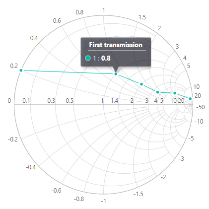
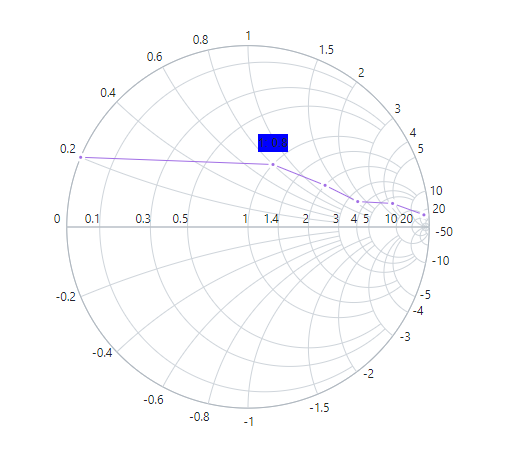

# Tooltip in Blazor Smith Chart Component

When the mouse is moved over a point in the Smith Chart, a tooltip will appear displaying information about the point. By default, the tooltip is disabled. To enable the tooltip, set the [Visible](https://help.syncfusion.com/cr/blazor/Syncfusion.Blazor.Charts.SmithChartSeriesTooltip.html#Syncfusion_Blazor_Charts_SmithChartSeriesTooltip_Visible) property to **true** in the [SmithChartSeriesTooltip](https://help.syncfusion.com/cr/blazor/Syncfusion.Blazor.Charts.SmithChartSeriesTooltip.html).

```cshtml
@using Syncfusion.Blazor.Charts

<SfSmithChart>
    <SmithChartSeriesCollection>
        <SmithChartSeries Name="First transmission" DataSource='TransmissionData' Reactance="Reactance" Resistance="Resistance">
            <SmithChartSeriesMarker Visible='true'></SmithChartSeriesMarker>
            <SmithChartSeriesTooltip Visible='true'></SmithChartSeriesTooltip>
        </SmithChartSeries>
    </SmithChartSeriesCollection>
</SfSmithChart>

@code {
    public class SmithChartData
    {
        public double? Resistance { get; set; }
        public double? Reactance { get; set; }
    };
    public List<SmithChartData> TransmissionData = new List<SmithChartData> {
        new SmithChartData { Resistance= 10, Reactance= 25 },
        new SmithChartData { Resistance= 6, Reactance= 4.5 },
        new SmithChartData { Resistance= 3.5, Reactance= 1.6 },
        new SmithChartData { Resistance= 2, Reactance= 1.2 },
        new SmithChartData { Resistance= 1, Reactance= 0.8 },
        new SmithChartData { Resistance= 0, Reactance= 0.2 }
    };
}
```



## Tooltip Customization

The tooltip can be customized for each series using the following properties.

* [Fill](https://help.syncfusion.com/cr/blazor/Syncfusion.Blazor.Charts.SmithChartSeriesTooltip.html#Syncfusion_Blazor_Charts_SmithChartSeriesTooltip_Fill) - Used to change the fill color of the tooltip.
* [Opacity](https://help.syncfusion.com/cr/blazor/Syncfusion.Blazor.Charts.SmithChartSeriesTooltip.html#Syncfusion_Blazor_Charts_SmithChartSeriesTooltip_Opacity) - Used to control the opacity of the tooltip.
* [SmithChartSeriesTooltipBorder](https://help.syncfusion.com/cr/blazor/Syncfusion.Blazor.Charts.SmithChartSeriesTooltipBorder.html) - Used to customize the width and color of the border using the [Width](https://help.syncfusion.com/cr/blazor/Syncfusion.Blazor.Charts.SmithChartCommonBorder.html#Syncfusion_Blazor_Charts_SmithChartCommonBorder_Width) and the [Color](https://help.syncfusion.com/cr/blazor/Syncfusion.Blazor.Charts.SmithChartCommonBorder.html#Syncfusion_Blazor_Charts_SmithChartCommonBorder_Color) properties.

```cshtml
@using Syncfusion.Blazor.Charts

<SfSmithChart>
    <SmithChartSeriesCollection>
        <SmithChartSeries Name="Transmission" DataSource='TransmissionData' Reactance="Reactance" Resistance="Resistance">
            <SmithChartSeriesMarker Visible='true'></SmithChartSeriesMarker>
            <SmithChartSeriesTooltip Visible='true' Fill="red" Opacity="0.5">
                <SmithChartSeriesTooltipBorder Color="blue" Width="2"></SmithChartSeriesTooltipBorder>
            </SmithChartSeriesTooltip>
        </SmithChartSeries>
    </SmithChartSeriesCollection>
</SfSmithChart>

@code {
    public class SmithChartData
    {
        public double? Resistance { get; set; }
        public double? Reactance { get; set; }
    };
    public List<SmithChartData> TransmissionData = new List<SmithChartData> {
        new SmithChartData { Resistance= 10, Reactance= 25 },
        new SmithChartData { Resistance= 6, Reactance= 4.5 },
        new SmithChartData { Resistance= 3.5, Reactance= 1.6 },
        new SmithChartData { Resistance= 2, Reactance= 1.2 },
        new SmithChartData { Resistance= 1, Reactance= 0.8 },
        new SmithChartData { Resistance= 0, Reactance= 0.2 }
    };
}
```


## Tooltip Template

To access the aggregate values inside the template, the implicit named parameter context can be used. The context can be typecast as the [SmithChartPoint](https://help.syncfusion.com/cr/blazor/Syncfusion.Blazor.Charts.SmithChartPoint.html) to get aggregate values inside the template. The tooltip template using the context is as follows.

```cshtml
@using Syncfusion.Blazor.Charts

<SfSmithChart>
    <SmithChartSeriesCollection>
        <SmithChartSeries Name="Transmission" DataSource='TransmissionData' Reactance="Reactance" Resistance="Resistance">
            <SmithChartSeriesMarker Visible='true'></SmithChartSeriesMarker>
            <SmithChartSeriesTooltip Visible='true'>
                <Template>
                    @{
                        var data = context as SmithChartPoint;
                    }
                    <div style="background-color: blue">@data.Resistance: @data.Reactance</div>
                </Template>
            </SmithChartSeriesTooltip>
        </SmithChartSeries>
    </SmithChartSeriesCollection>
</SfSmithChart>

@code {
    public class SmithChartData
    {
        public double? Resistance { get; set; }
        public double? Reactance { get; set; }
    };
    public List<SmithChartData> TransmissionData = new List<SmithChartData> {
        new SmithChartData { Resistance= 10, Reactance= 25 },
        new SmithChartData { Resistance= 6, Reactance= 4.5 },
        new SmithChartData { Resistance= 3.5, Reactance= 1.6 },
        new SmithChartData { Resistance= 2, Reactance= 1.2 },
        new SmithChartData { Resistance= 1, Reactance= 0.8 },
        new SmithChartData { Resistance= 0, Reactance= 0.2 }
    };
}
```

