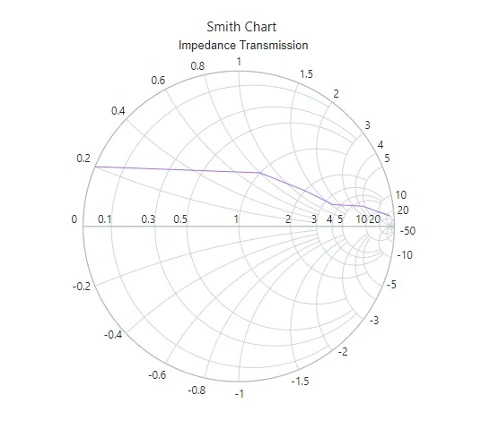
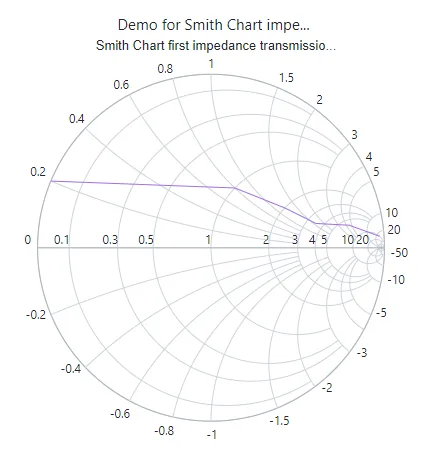
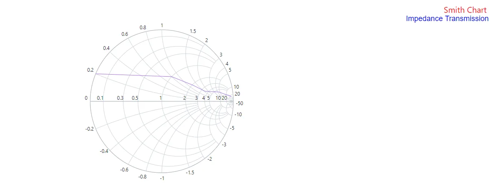

# Blazor Smith Chart Title and Subtitle

## Enable Title and Subtitle

The title and subtitle describe the data plotted in the Smith Chart. Use the [Text](https://help.syncfusion.com/cr/blazor/Syncfusion.Blazor.Charts.SmithChartTitle.html#Syncfusion_Blazor_Charts_SmithChartTitle_Text) property in [SmithChartTitle](https://help.syncfusion.com/cr/blazor/Syncfusion.Blazor.Charts.SmithChartTitle.html) and [SmithChartSubtitle](https://help.syncfusion.com/cr/blazor/Syncfusion.Blazor.Charts.SmithChartSubtitle.html) to specify their text. Both are visible by default. To hide either one, set its [Visible](https://help.syncfusion.com/cr/blazor/Syncfusion.Blazor.Charts.SmithChartTitle.html#Syncfusion_Blazor_Charts_SmithChartTitle_Visible) property to **false**. The following example specifies a title and subtitle.

Use the [Description](https://help.syncfusion.com/cr/blazor/Syncfusion.Blazor.Charts.SmithChartTitle.html#Syncfusion_Blazor_Charts_SmithChartTitle_Description) property to provide an accessible description for the title or subtitle.

```cshtml
@using Syncfusion.Blazor.Charts

<SfSmithChart>
    <SmithChartTitle Text="Smith Chart">
        <SmithChartSubtitle Text="Impedance Transmission"></SmithChartSubtitle>
    </SmithChartTitle>
    <SmithChartSeriesCollection>
        <SmithChartSeries DataSource='TransmissionData' Reactance="Reactance" Resistance="Resistance">
        </SmithChartSeries>
    </SmithChartSeriesCollection>
</SfSmithChart>

@code {
    public class SmithChartData
    {
        public double? Resistance { get; set; }
        public double? Reactance { get; set; }
    };
    public List<SmithChartData> TransmissionData = new List<SmithChartData> {
        new SmithChartData { Resistance= 10, Reactance= 25 },
        new SmithChartData { Resistance= 6, Reactance= 4.5 },
        new SmithChartData { Resistance= 3.5, Reactance= 1.6 },
        new SmithChartData { Resistance= 2, Reactance= 1.2 },
        new SmithChartData { Resistance= 1, Reactance= 0.8 },
        new SmithChartData { Resistance= 0, Reactance= 0.2 }
    };
}
```



## Trim Title and Subtitle

The title and subtitle can be trimmed when either exceeds its maximum width. Set the [MaximumWidth](https://help.syncfusion.com/cr/blazor/Syncfusion.Blazor.Charts.SmithChartTitle.html#Syncfusion_Blazor_Charts_SmithChartTitle_MaximumWidth) property to specify the maximum width. Enable trimming by setting the [EnableTrim](https://help.syncfusion.com/cr/blazor/Syncfusion.Blazor.Charts.SmithChartTitle.html#Syncfusion_Blazor_Charts_SmithChartTitle_EnableTrim) property to **true**.

```cshtml
@using Syncfusion.Blazor.Charts

<SfSmithChart>
    <SmithChartTitle Text="Demo for Smith Chart impedance transmission"
                     EnableTrim="true"
                     MaximumWidth="200">
        <SmithChartSubtitle Text="Smith Chart first impedance transmission. For more info."
                     EnableTrim="true"
                     MaximumWidth="250">
        </SmithChartSubtitle>
    </SmithChartTitle>
    <SmithChartSeriesCollection>
        <SmithChartSeries DataSource='TransmissionData' Reactance="Reactance" Resistance="Resistance">
        </SmithChartSeries>
    </SmithChartSeriesCollection>
</SfSmithChart>

@code {
    public class SmithChartData
    {
        public double? Resistance { get; set; }
        public double? Reactance { get; set; }
    };
    public List<SmithChartData> TransmissionData = new List<SmithChartData> {
        new SmithChartData { Resistance= 10, Reactance= 25 },
        new SmithChartData { Resistance= 6, Reactance= 4.5 },
        new SmithChartData { Resistance= 3.5, Reactance= 1.6 },
        new SmithChartData { Resistance= 2, Reactance= 1.2 },
        new SmithChartData { Resistance= 1, Reactance= 0.8 },
        new SmithChartData { Resistance= 0, Reactance= 0.2 }
    };
}
```



## Title and Subtitle Customization

The title and subtitle can be customized using the following properties.

* [TextAlignment](https://help.syncfusion.com/cr/blazor/Syncfusion.Blazor.Charts.SmithChartTitle.html#Syncfusion_Blazor_Charts_SmithChartTitle_TextAlignment) and [SmithChartSubtitle.TextAlignment](https://help.syncfusion.com/cr/blazor/Syncfusion.Blazor.Charts.SmithChartSubtitle.html#Syncfusion_Blazor_Charts_SmithChartSubtitle_TextAlignment) - Align the title or subtitle using the [SmithChartAlignment](https://help.syncfusion.com/cr/blazor/Syncfusion.Blazor.Charts.SmithChartAlignment.html) values **Near**, **Center**, and **Far**. The default is **Center**.
* [SmithChartTitleTextStyle](https://help.syncfusion.com/cr/blazor/Syncfusion.Blazor.Charts.SmithChartTitleTextStyle.html) and [SmithChartSubtitleTextStyle](https://help.syncfusion.com/cr/blazor/Syncfusion.Blazor.Charts.SmithChartSubtitleTextStyle.html) - Specify [FontFamily](https://help.syncfusion.com/cr/blazor/Syncfusion.Blazor.Charts.SmithChartCommonFont.html#Syncfusion_Blazor_Charts_SmithChartCommonFont_FontFamily), [FontWeight](https://help.syncfusion.com/cr/blazor/Syncfusion.Blazor.Charts.SmithChartCommonFont.html#Syncfusion_Blazor_Charts_SmithChartCommonFont_FontWeight), [FontStyle](https://help.syncfusion.com/cr/blazor/Syncfusion.Blazor.Charts.SmithChartCommonFont.html#Syncfusion_Blazor_Charts_SmithChartCommonFont_FontStyle), [Opacity](https://help.syncfusion.com/cr/blazor/Syncfusion.Blazor.Charts.SmithChartCommonFont.html#Syncfusion_Blazor_Charts_SmithChartCommonFont_Opacity), [Color](https://help.syncfusion.com/cr/blazor/Syncfusion.Blazor.Charts.SmithChartTitleTextStyle.html#Syncfusion_Blazor_Charts_SmithChartTitleTextStyle_Color), and [Size](https://help.syncfusion.com/cr/blazor/Syncfusion.Blazor.Charts.SmithChartTitleTextStyle.html#Syncfusion_Blazor_Charts_SmithChartTitleTextStyle_Size) for the title or subtitle text.

```cshtml
@using Syncfusion.Blazor.Charts

<SfSmithChart>
    <SmithChartTitle Text="Smith Chart" TextAlignment="@SmithChartAlignment.Far">
        <SmithChartTitleTextStyle Color="red" Size="20px"></SmithChartTitleTextStyle>
        <SmithChartSubtitle Text="Impedance Transmission" TextAlignment="@SmithChartAlignment.Far">
            <SmithChartSubtitleTextStyle Color="blue" Size="18px"></SmithChartSubtitleTextStyle>
        </SmithChartSubtitle>
    </SmithChartTitle>
    <SmithChartSeriesCollection>
        <SmithChartSeries DataSource='TransmissionData' Reactance="Reactance" Resistance="Resistance">
        </SmithChartSeries>
    </SmithChartSeriesCollection>
</SfSmithChart>

@code {
    public class SmithChartData
    {
        public double? Resistance { get; set; }
        public double? Reactance { get; set; }
    };
    public List<SmithChartData> TransmissionData = new List<SmithChartData> {
        new SmithChartData { Resistance= 10, Reactance= 25 },
        new SmithChartData { Resistance= 6, Reactance= 4.5 },
        new SmithChartData { Resistance= 3.5, Reactance= 1.6 },
        new SmithChartData { Resistance= 2, Reactance= 1.2 },
        new SmithChartData { Resistance= 1, Reactance= 0.8 },
        new SmithChartData { Resistance= 0, Reactance= 0.2 }
    };
}
```



## Troubleshooting

If the chart does not render, verify that the `Syncfusion.Blazor.SmithChart` package is installed, the Syncfusion services are registered, and the required script resources are included as described in [Getting Started with Blazor Smith Chart](getting-started.md). If `List<SmithChartData>` is not recognized, verify that the `System.Collections.Generic` namespace is imported in the component.