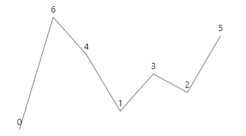
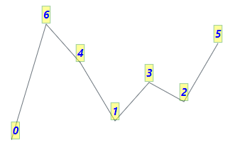
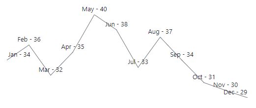

# Data Labels in Blazor Sparkline Component

To improve readability, the Data Labels are used to display the value of data points.

## Enable Data Label

The [Visible](https://help.syncfusion.com/cr/blazor/Syncfusion.Blazor.Charts.SparklineDataLabelSettings.html#Syncfusion_Blazor_Charts_SparklineDataLabelSettings_Visible) property in the [SparklineDataLabelSettings](https://help.syncfusion.com/cr/blazor/Syncfusion.Blazor.Charts.SparklineDataLabelSettings.html) can be used to enable the Data Label by specifying a collection of special points. The following special points are applicable for the Sparkline Data Label.

* [All](https://help.syncfusion.com/cr/blazor/Syncfusion.Blazor.Charts.VisibleType.html#Syncfusion_Blazor_Charts_VisibleType_All) - Data label for all points are enabled.
* [Start](https://help.syncfusion.com/cr/blazor/Syncfusion.Blazor.Charts.VisibleType.html#Syncfusion_Blazor_Charts_VisibleType_Start) - Data label for start points are enabled.
* [End](https://help.syncfusion.com/cr/blazor/Syncfusion.Blazor.Charts.VisibleType.html#Syncfusion_Blazor_Charts_VisibleType_End) - Data label for end points are enabled.
* [High](https://help.syncfusion.com/cr/blazor/Syncfusion.Blazor.Charts.VisibleType.html#Syncfusion_Blazor_Charts_VisibleType_High) - Data label for high points are enabled.
* [Low](https://help.syncfusion.com/cr/blazor/Syncfusion.Blazor.Charts.VisibleType.html#Syncfusion_Blazor_Charts_VisibleType_Low) - Data label for low points are enabled.
* [Negative](https://help.syncfusion.com/cr/blazor/Syncfusion.Blazor.Charts.VisibleType.html#Syncfusion_Blazor_Charts_VisibleType_Negative) - Data label for negative points are enabled.
* [None](https://help.syncfusion.com/cr/blazor/Syncfusion.Blazor.Charts.VisibleType.html#Syncfusion_Blazor_Charts_VisibleType_None) - Data label for all points are disabled.


```cshtml
@using Syncfusion.Blazor.Charts

<SfSparkline DataSource="new int[]{ 0, 6, 4, 1, 3, 2, 5 }" Type="SparklineType.Line" Height="200px" Width="350px">
    <SparklineAxisSettings MinX="-1" MaxX="7" MaxY="7" MinY="-1"></SparklineAxisSettings>
    <SparklineDataLabelSettings Visible="new List<VisibleType>() { VisibleType.All }"></SparklineDataLabelSettings>
</SfSparkline>
```



## Data Label customization

The following properties can be used to customize the Sparkline Data Label:

* [Fill](https://help.syncfusion.com/cr/blazor/Syncfusion.Blazor.Charts.SparklineDataLabelSettings.html#Syncfusion_Blazor_Charts_SparklineDataLabelSettings_Fill) - Specifies color for the Data Label.
* [Opacity](https://help.syncfusion.com/cr/blazor/Syncfusion.Blazor.Charts.SparklineDataLabelSettings.html#Syncfusion_Blazor_Charts_SparklineDataLabelSettings_Opacity) - Specifies opacity of [Fill](https://help.syncfusion.com/cr/blazor/Syncfusion.Blazor.Charts.SparklineDataLabelSettings.html#Syncfusion_Blazor_Charts_SparklineDataLabelSettings_Fill) color for the Data Label.
* [EdgeLabelMode](https://help.syncfusion.com/cr/blazor/Syncfusion.Blazor.Charts.SparklineDataLabelSettings.html#Syncfusion_Blazor_Charts_SparklineDataLabelSettings_EdgeLabelMode) - Specifies controlling option when the label comes in the edge. Available options are the [Shift](https://help.syncfusion.com/cr/blazor/Syncfusion.Blazor.Charts.EdgeLabelMode.html#Syncfusion_Blazor_Charts_EdgeLabelMode_Shift), the [None](https://help.syncfusion.com/cr/blazor/Syncfusion.Blazor.Charts.EdgeLabelMode.html#Syncfusion_Blazor_Charts_EdgeLabelMode_None) and the [Hide](https://help.syncfusion.com/cr/blazor/Syncfusion.Blazor.Charts.EdgeLabelMode.html#Syncfusion_Blazor_Charts_EdgeLabelMode_Hide).
* [SparklineFont](https://help.syncfusion.com/cr/blazor/Syncfusion.Blazor~Syncfusion.Blazor.Charts.SparklineFont.html) - To customize the Data Label font family, font style, font weight, color, opacity and size.
* [SparklineDataLabelBorder](https://help.syncfusion.com/cr/blazor/Syncfusion.Blazor~Syncfusion.Blazor.Charts.SparklineDataLabelBorder.html) - Specifies the color and the width for the Data Label border.
* [SparklineDataLabelOffset](https://help.syncfusion.com/cr/blazor/Syncfusion.Blazor~Syncfusion.Blazor.Charts.SparklineDataLabelOffset.html) - Specifies the label offset position from its default position.

```cshtml
@using Syncfusion.Blazor.Charts

<SfSparkline DataSource="new int[]{ 0, 6, 4, 1, 3, 2, 5 }" Type="SparklineType.Line" Height="200px" Width="350px">
    <SparklineAxisSettings MinX="-1" MaxX="7" MaxY="7" MinY="-1"></SparklineAxisSettings>
    <SparklineDataLabelSettings Visible="new List<VisibleType>() { VisibleType.All }" Fill="yellow" Opacity="0.4" EdgeLabelMode="EdgeLabelMode.Shift">
        <SparklineFont Color="blue" FontStyle="italic" FontWeight="bold" Size="15" Opacity="0.8">
        </SparklineFont>
        <SparklineDataLabelBorder Color="green" Width="1">
        </SparklineDataLabelBorder>
    </SparklineDataLabelSettings>
</SfSparkline>
```



## Format

The Data Label text can be formatted by specifying the property name from the datasource to the [Format](https://help.syncfusion.com/cr/blazor/Syncfusion.Blazor.Charts.SparklineDataLabelSettings.html#Syncfusion_Blazor_Charts_SparklineDataLabelSettings_Format) property in the [SparklineDataLabelSettings](https://help.syncfusion.com/cr/blazor/Syncfusion.Blazor.Charts.SparklineDataLabelSettings.html). By default, Data Label text will be based on [YName](https://help.syncfusion.com/cr/blazor/Syncfusion.Blazor.Charts.SfSparkline-1.html#Syncfusion_Blazor_Charts_SfSparkline_1_YName) property.

```cshtml
@using Syncfusion.Blazor.Charts

<SfSparkline DataSource="ClimateData" TValue="WeatherReport" XName="Month" YName="Celsius" ValueType="SparklineValueType.Category" Height="200px" Width="500px">
    <SparklineDataLabelSettings Visible="new List<VisibleType> { VisibleType.All}" Format="${Month} - ${Celsius}" EdgeLabelMode="EdgeLabelMode.Shift">
    </SparklineDataLabelSettings>
    <SparklinePadding Top="25"></SparklinePadding>
</SfSparkline>

@code {
    public class WeatherReport
    {
        public string Month { get; set; }
        public double Celsius { get; set; }
    };
    public List<WeatherReport> ClimateData = new List<WeatherReport> {
        new  WeatherReport { Month= "Jan", Celsius= 34 },
        new  WeatherReport { Month= "Feb", Celsius= 36 },
        new  WeatherReport { Month= "Mar", Celsius= 32 },
        new  WeatherReport { Month= "Apr", Celsius= 35 },
        new  WeatherReport { Month= "May", Celsius= 40 },
        new  WeatherReport { Month= "Jun", Celsius= 38 },
        new  WeatherReport { Month= "Jul", Celsius= 33 },
        new  WeatherReport { Month= "Aug", Celsius= 37 },
        new  WeatherReport { Month= "Sep", Celsius= 34 },
        new  WeatherReport { Month= "Oct", Celsius= 31 },
        new  WeatherReport { Month= "Nov", Celsius= 30 },
        new  WeatherReport { Month= "Dec", Celsius= 29}
    };
}
```

