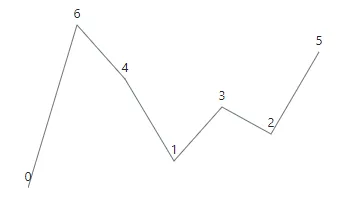
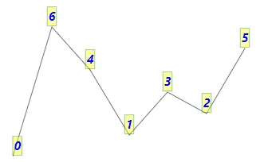
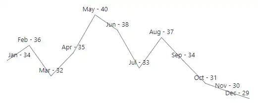

# Blazor Sparkline Charts Data Labels

Data labels display data-point values to improve readability.

## Enable Data Label

The [Visible](https://help.syncfusion.com/cr/blazor/Syncfusion.Blazor.Charts.SparklineDataLabelSettings.html#Syncfusion_Blazor_Charts_SparklineDataLabelSettings_Visible) property in [SparklineDataLabelSettings](https://help.syncfusion.com/cr/blazor/Syncfusion.Blazor.Charts.SparklineDataLabelSettings.html) enables data labels by specifying a collection of special points. The following special points are applicable:

* [All](https://help.syncfusion.com/cr/blazor/Syncfusion.Blazor.Charts.VisibleType.html#Syncfusion_Blazor_Charts_VisibleType_All) – Data label for all points
* [Start](https://help.syncfusion.com/cr/blazor/Syncfusion.Blazor.Charts.VisibleType.html#Syncfusion_Blazor_Charts_VisibleType_Start) – Data label for start points
* [End](https://help.syncfusion.com/cr/blazor/Syncfusion.Blazor.Charts.VisibleType.html#Syncfusion_Blazor_Charts_VisibleType_End) – Data label for end points
* [High](https://help.syncfusion.com/cr/blazor/Syncfusion.Blazor.Charts.VisibleType.html#Syncfusion_Blazor_Charts_VisibleType_High) – Data label for high points
* [Low](https://help.syncfusion.com/cr/blazor/Syncfusion.Blazor.Charts.VisibleType.html#Syncfusion_Blazor_Charts_VisibleType_Low) – Data label for low points
* [Negative](https://help.syncfusion.com/cr/blazor/Syncfusion.Blazor.Charts.VisibleType.html#Syncfusion_Blazor_Charts_VisibleType_Negative) – Data label for negative points
* [None](https://help.syncfusion.com/cr/blazor/Syncfusion.Blazor.Charts.VisibleType.html#Syncfusion_Blazor_Charts_VisibleType_None) – Data labels are disabled for all points

```cshtml

@using Syncfusion.Blazor.Charts

<SfSparkline DataSource="new int[]{ 0, 6, 4, 1, 3, 2, 5 }" Type="SparklineType.Line" Height="200px" Width="350px">
    <SparklineAxisSettings MinX="-1" MaxX="7" MaxY="7" MinY="-1"></SparklineAxisSettings>
    <SparklineDataLabelSettings Visible="new List<VisibleType>() { VisibleType.All }"></SparklineDataLabelSettings>
</SfSparkline>

```



## Data Label Customization

The following properties and nested settings components can be used to customize Sparkline data labels:

* [Fill](https://help.syncfusion.com/cr/blazor/Syncfusion.Blazor.Charts.SparklineDataLabelSettings.html#Syncfusion_Blazor_Charts_SparklineDataLabelSettings_Fill) – Specifies the data-label fill color
* [Opacity](https://help.syncfusion.com/cr/blazor/Syncfusion.Blazor.Charts.SparklineDataLabelSettings.html#Syncfusion_Blazor_Charts_SparklineDataLabelSettings_Opacity) – Specifies the opacity of the data-label fill color
* [EdgeLabelMode](https://help.syncfusion.com/cr/blazor/Syncfusion.Blazor.Charts.SparklineDataLabelSettings.html#Syncfusion_Blazor_Charts_SparklineDataLabelSettings_EdgeLabelMode) – Specifies how labels are handled when they reach the chart edge. Available options are [Shift](https://help.syncfusion.com/cr/blazor/Syncfusion.Blazor.Charts.EdgeLabelMode.html#Syncfusion_Blazor_Charts_EdgeLabelMode_Shift), [None](https://help.syncfusion.com/cr/blazor/Syncfusion.Blazor.Charts.EdgeLabelMode.html#Syncfusion_Blazor_Charts_EdgeLabelMode_None), and [Hide](https://help.syncfusion.com/cr/blazor/Syncfusion.Blazor.Charts.EdgeLabelMode.html#Syncfusion_Blazor_Charts_EdgeLabelMode_Hide)
* [SparklineFont](https://help.syncfusion.com/cr/blazor/Syncfusion.Blazor.Charts.SparklineFont.html) – Customizes the data-label font family, style, weight, color, opacity, and size
* [SparklineDataLabelBorder](https://help.syncfusion.com/cr/blazor/Syncfusion.Blazor.Charts.SparklineDataLabelBorder.html) – Specifies the data-label border color and width
* [SparklineDataLabelOffset](https://help.syncfusion.com/cr/blazor/Syncfusion.Blazor.Charts.SparklineDataLabelOffset.html) – Specifies the label offset from its default position

```cshtml

@using Syncfusion.Blazor.Charts

<SfSparkline DataSource="new int[]{ 0, 6, 4, 1, 3, 2, 5 }" Type="SparklineType.Line" Height="200px" Width="350px">
    <SparklineAxisSettings MinX="-1" MaxX="7" MaxY="7" MinY="-1"></SparklineAxisSettings>
    <SparklineDataLabelSettings Visible="new List<VisibleType>() { VisibleType.All }" Fill="yellow" Opacity="0.4" EdgeLabelMode="EdgeLabelMode.Shift">
        <SparklineFont Color="blue" FontStyle="italic" FontWeight="bold" Size="15" Opacity="0.8">
        </SparklineFont>
        <SparklineDataLabelBorder Color="green" Width="1">
        </SparklineDataLabelBorder>
    </SparklineDataLabelSettings>
</SfSparkline>

```



## Format

The data-label text can be formatted by specifying data-source property placeholders in the [Format](https://help.syncfusion.com/cr/blazor/Syncfusion.Blazor.Charts.SparklineDataLabelSettings.html#Syncfusion_Blazor_Charts_SparklineDataLabelSettings_Format) property of [SparklineDataLabelSettings](https://help.syncfusion.com/cr/blazor/Syncfusion.Blazor.Charts.SparklineDataLabelSettings.html). For object data sources, the default data-label text is based on the [YName](https://help.syncfusion.com/cr/blazor/Syncfusion.Blazor.Charts.SfSparkline-1.html#Syncfusion_Blazor_Charts_SfSparkline_1_YName) property.

```cshtml

@using Syncfusion.Blazor.Charts

<SfSparkline DataSource="ClimateData" TValue="WeatherReport" XName="Month" YName="Celsius" ValueType="SparklineValueType.Category" Height="200px" Width="500px">
    <SparklineDataLabelSettings Visible="new List<VisibleType> { VisibleType.All}" Format="${Month} - ${Celsius}" EdgeLabelMode="EdgeLabelMode.Shift">
    </SparklineDataLabelSettings>
    <SparklinePadding Top="25"></SparklinePadding>
</SfSparkline>

@code {
    public class WeatherReport
    {
        public string Month { get; set; }
        public double Celsius { get; set; }
    };

    public List<WeatherReport> ClimateData = new List<WeatherReport> {
        new  WeatherReport { Month = "Jan", Celsius = 34 },
        new  WeatherReport { Month = "Feb", Celsius = 36 },
        new  WeatherReport { Month = "Mar", Celsius = 32 },
        new  WeatherReport { Month = "Apr", Celsius = 35 },
        new  WeatherReport { Month = "May", Celsius = 40 },
        new  WeatherReport { Month = "Jun", Celsius = 38 },
        new  WeatherReport { Month = "Jul", Celsius = 33 },
        new  WeatherReport { Month = "Aug", Celsius = 37 },
        new  WeatherReport { Month = "Sep", Celsius = 34 },
        new  WeatherReport { Month = "Oct", Celsius = 31 },
        new  WeatherReport { Month = "Nov", Celsius = 30 },
        new  WeatherReport { Month = "Dec", Celsius = 29}
    };
}

```



If a formatted label is empty or displays an unexpected value, verify that each placeholder matches a property in the data source and that `XName` and `YName` match the corresponding property names.
