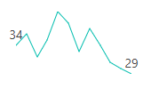

# Getting Started with Blazor Sparkline Component

This section briefly explains about how to include [Blazor Sparkline](https://www.syncfusion.com/blazor-components/blazor-sparkline) component in your Blazor Server App and Blazor WebAssembly App using Visual Studio.

## Prerequisites

* [System requirements for Blazor components](https://blazor.syncfusion.com/documentation/system-requirements)

## Create a new Blazor App in Visual Studio

You can create **Blazor Server App** or **Blazor WebAssembly App** using Visual Studio in one of the following ways,

* [Create a Project using Microsoft Templates](https://docs.microsoft.com/en-us/aspnet/core/blazor/tooling?pivots=windows)

* [Create a Project using Syncfusion Blazor Extension](https://blazor.syncfusion.com/documentation/visual-studio-integration/vs2019-extensions/create-project)

## Install Syncfusion Blazor Sparkline NuGet in the App

Syncfusion Blazor components are available in [nuget.org](https://www.nuget.org/packages?q=syncfusion.blazor). To use Syncfusion Blazor components in the application, add reference to the corresponding NuGet. Refer to [NuGet packages topic](https://blazor.syncfusion.com/documentation/nuget-packages) for available NuGet packages list with component details.

To add Blazor Sparkline component in the app, open the NuGet package manager in Visual Studio (*Tools → NuGet Package Manager → Manage NuGet Packages for Solution*), search for [Syncfusion.Blazor.Sparkline](https://www.nuget.org/packages/Syncfusion.Blazor.Sparkline) and then install it.

## Register Syncfusion Blazor Service

Open **~/_Imports.razor** file and import the Syncfusion.Blazor namespace.




@using Syncfusion.Blazor




Now, register the Syncfusion Blazor Service in the Blazor Server App or Blazor WebAssembly App. Here, Syncfusion Blazor Service is registered by setting [IgnoreScriptIsolation](https://help.syncfusion.com/cr/blazor/Syncfusion.Blazor.GlobalOptions.html#Syncfusion_Blazor_GlobalOptions_IgnoreScriptIsolation) property as true to load the scripts externally in the [next steps](#add-script-reference).

### Blazor Server App

* For **.NET 6** app, open the **~/Program.cs** file and register the Syncfusion Blazor Service.

* For **.NET 5 and .NET 3.X** app, open the **~/Startup.cs** file and register the Syncfusion Blazor Service.




using Microsoft.AspNetCore.Components;
using Microsoft.AspNetCore.Components.Web;
using Syncfusion.Blazor;

var builder = WebApplication.CreateBuilder(args);

// Add services to the container.
builder.Services.AddRazorPages();
builder.Services.AddServerSideBlazor();
builder.Services.AddSyncfusionBlazor(options => { options.IgnoreScriptIsolation = true; });

var app = builder.Build();
....





using Syncfusion.Blazor;

namespace BlazorApplication
{
    public class Startup
    {
        ...
        public void ConfigureServices(IServiceCollection services)
        {
            services.AddRazorPages();
            services.AddServerSideBlazor();
            services.AddSyncfusionBlazor(options => { options.IgnoreScriptIsolation = true; });
        }
        ...
    }
}




### Blazor WebAssembly App

Open **~/Program.cs** file and register the Syncfusion Blazor Service in the client web app.




using Microsoft.AspNetCore.Components.Web;
using Microsoft.AspNetCore.Components.WebAssembly.Hosting;
using Syncfusion.Blazor;

var builder = WebAssemblyHostBuilder.CreateDefault(args);
builder.RootComponents.Add<App>("#app");
builder.RootComponents.Add<HeadOutlet>("head::after");

builder.Services.AddScoped(sp => new HttpClient { BaseAddress = new Uri(builder.HostEnvironment.BaseAddress) });

builder.Services.AddSyncfusionBlazor(options => { options.IgnoreScriptIsolation = true; });
await builder.Build().RunAsync();
....





using Syncfusion.Blazor;

namespace WebApplication1
{
    public class Program
    {
        public static async Task Main(string[] args)
        {
            ....
            builder.Services.AddSyncfusionBlazor(options => { options.IgnoreScriptIsolation = true; });
            await builder.Build().RunAsync();
        }
    }
}




## Add Style Sheet

Checkout the [Blazor Themes topic](https://blazor.syncfusion.com/documentation/appearance/themes) to learn different ways ([Static Web Assets](https://blazor.syncfusion.com/documentation/appearance/themes#static-web-assets), [CDN](https://sfblazor.azurewebsites.net/staging/documentation/appearance/themes#cdn-reference) and [CRG](https://blazor.syncfusion.com/documentation/common/custom-resource-generator)) to refer themes in Blazor application, and to have the expected appearance for Syncfusion Blazor components. Here, the theme is referred using [Static Web Assets](https://blazor.syncfusion.com/documentation/appearance/themes#static-web-assets).

To add theme to the app, open the NuGet package manager in Visual Studio (*Tools → NuGet Package Manager → Manage NuGet Packages for Solution*), search for [Syncfusion.Blazor.Themes](https://www.nuget.org/packages/Syncfusion.Blazor.Themes/) and then install it. Then, the theme style sheet from NuGet can be referred as follows,

### Blazor Server App

* For .NET 6 app, add the Syncfusion bootstrap5 theme in the `<head>` of the **~/Pages/_Layout.cshtml** file.

* For .NET 5 and .NET 3.X app, add the Syncfusion bootstrap5 theme in the `<head>` of the **~/Pages/_Host.cshtml** file.




<head>
    <link href="_content/Syncfusion.Blazor.Themes/bootstrap5.css" rel="stylesheet" />
</head>





<head>
    <link href="_content/Syncfusion.Blazor.Themes/bootstrap5.css" rel="stylesheet" />
</head>




### Blazor WebAssembly App

For Blazor WebAssembly App, Refer the theme style sheet from NuGet in the `<head>` of **wwwroot/index.html** file in the client web app.




<head>
    <link href="_content/Syncfusion.Blazor.Themes/bootstrap5.css" rel="stylesheet" />
</head>




## Add Script Reference

Checkout [Adding Script Reference topic](https://blazor.syncfusion.com/documentation/common/adding-script-references) to learn different ways to add script reference in Blazor Application. In this getting started walk-through, the required scripts are referred using [Static Web Assets](https://sfblazor.azurewebsites.net/staging/documentation/common/adding-script-references#static-web-assets) externally inside the `<head>` as follows,

### Blazor Server App

* For **.NET 6** app, Refer script in the `<head>` of the **~/Pages/_Layout.cshtml** file.

* For **.NET 5 and .NET 3.X** app, Refer script in the `<head>` of the **~/Pages/_Host.cshtml** file.




<head>
    ....
    <link href="_content/Syncfusion.Blazor.Themes/bootstrap5.css" rel="stylesheet" />
    
</head>





<head>
    ....
    <link href="_content/Syncfusion.Blazor.Themes/bootstrap5.css" rel="stylesheet" />
    
</head>




### Blazor WebAssembly App

For Blazor WebAssembly App, Refer script in the `<head>` of the **~/index.html** file.




<head>
    ....
    <link href="_content/Syncfusion.Blazor.Themes/bootstrap5.css" rel="stylesheet" />
    
</head>




> Syncfusion recommends to reference scripts using [Static Web Assets](https://blazor.syncfusion.com/documentation/common/adding-script-references#static-web-assets), [CDN](https://blazor.syncfusion.com/documentation/common/adding-script-references#cdn-reference) and [CRG](https://blazor.syncfusion.com/documentation/common/custom-resource-generator) by [disabling JavaScript isolation](https://blazor.syncfusion.com/documentation/common/adding-script-references#disable-javascript-isolation) for better loading performance of the Blazor application.

## Add Blazor Sparkline Component

* Open **~/_Imports.razor** file or any other page under the `~/Pages` folder where the component is to be added and import the **Syncfusion.Blazor.Charts** namespace.




@using Syncfusion.Blazor
@using Syncfusion.Blazor.Charts




* Now, add the Syncfusion Sparkline component in razor file. Here, the Sparkline component is added in the **~/Pages/Index.razor** file under the **~/Pages** folder.




<SfSparkline>

</SfSparkline>




## Populate Sparkline with Data

To bind data for the Sparkline component, assign a `IEnumerable` object to the [DataSource](https://help.syncfusion.com/cr/blazor/Syncfusion.Blazor.Charts.SfSparkline-1.html#Syncfusion_Blazor_Charts_SfSparkline_1_DataSource) property. It can also be provided as an instance of the [DataManager](https://help.syncfusion.com/cr/blazor/Syncfusion.Blazor.DataManager.html).




@code {
    public class WeatherReport
    {
        public string Month { get; set; }
        public double Celsius { get; set; }
    };
    public List<WeatherReport> ClimateData = new List<WeatherReport> {
        new  WeatherReport { Month= "Jan", Celsius= 34 },
        new  WeatherReport { Month= "Feb", Celsius= 36 },
        new  WeatherReport { Month= "Mar", Celsius= 32 },
        new  WeatherReport { Month= "Apr", Celsius= 35 },
        new  WeatherReport { Month= "May", Celsius= 40 },
        new  WeatherReport { Month= "Jun", Celsius= 38 },
        new  WeatherReport { Month= "Jul", Celsius= 33 },
        new  WeatherReport { Month= "Aug", Celsius= 37 },
        new  WeatherReport { Month= "Sep", Celsius= 34 },
        new  WeatherReport { Month= "Oct", Celsius= 31 },
        new  WeatherReport { Month= "Nov", Celsius= 30 },
        new  WeatherReport { Month= "Dec", Celsius= 29}
    };
}




Now map the `Month` and the `Celsius` fields from the datasource to [XName](https://help.syncfusion.com/cr/blazor/Syncfusion.Blazor.Charts.SfSparkline-1.html#Syncfusion_Blazor_Charts_SfSparkline_1_XName) and [YName](https://help.syncfusion.com/cr/blazor/Syncfusion.Blazor.Charts.SfSparkline-1.html#Syncfusion_Blazor_Charts_SfSparkline_1_YName) properties for x-axis and y-axis in the Sparkline and then set the `ClimateData` to [DataSource](https://help.syncfusion.com/cr/blazor/Syncfusion.Blazor.Charts.SfSparkline-1.html#Syncfusion_Blazor_Charts_SfSparkline_1_DataSource) property. Because the `Month` field is a value-based category, the [ValueType](https://help.syncfusion.com/cr/blazor/Syncfusion.Blazor.Charts.SfSparkline-1.html#Syncfusion_Blazor_Charts_SfSparkline_1_ValueType) property is used to specify it.




<SfSparkline XName="Month"
             YName="Celsius"
             ValueType="SparklineValueType.Category"
             TValue="WeatherReport"
             DataSource="ClimateData"
             Height="80px"
             Width="150px">
</SfSparkline>




Press <kbd>Ctrl</kbd>+<kbd>F5</kbd> (Windows) or <kbd>⌘</kbd>+<kbd>F5</kbd> (macOS) to run the application. Then, the Syncfusion `Blazor Sparkline` component will be rendered in the default web browser.

## Sparkline chart types

Change the Sparkline type using the [Type](https://help.syncfusion.com/cr/blazor/Syncfusion.Blazor.Charts.SfSparkline-1.html#Syncfusion_Blazor_Charts_SfSparkline_1_Type) property set to **Line**, **Column**, **WinLoss**, **Pie** or **Area**. Here, the Sparkline type is set to **Area**.




<SfSparkline XName="Month"
             YName="Celsius"
             ValueType="SparklineValueType.Category"
             Type="SparklineType.Area"
             TValue="WeatherReport"
             DataSource="ClimateData"
             Height="80px"
             Width="150px">
</SfSparkline>




> Refer to [code block](#populate-sparkline-with-data) to know about the property value of **ClimateData**.

## Adding Data Label

Add the Data Labels to improve the readability of the Sparkline component. This can be achieved by setting the [Visible](https://help.syncfusion.com/cr/blazor/Syncfusion.Blazor.Charts.SparklineDataLabelSettings.html#Syncfusion_Blazor_Charts_SparklineDataLabelSettings_Visible) property to **true** in the [SparklineDataLabelSettings](https://help.syncfusion.com/cr/blazor/Syncfusion.Blazor.Charts.SparklineDataLabelSettings.html).

Available types are:

* Start
* End
* All
* High
* Low
* Negative




<SfSparkline DataSource="ClimateData"
              TValue="WeatherReport"
              XName="Month"
              YName="Celsius"
              ValueType="SparklineValueType.Category"
              Height="80px"
              Width="150px">
    <SparklineDataLabelSettings Visible="new List<VisibleType> { VisibleType.Start, VisibleType.End }"></SparklineDataLabelSettings>
    <SparklinePadding Left="10" Right="10"></SparklinePadding>
</SfSparkline>




> Refer to the [code block](#populate-sparkline-with-data) to know about the property value of **ClimateData**.

## Enable tooltip

When space constraints prevent from displaying information using Data Labels, the tooltip comes in handy. The tooltip can be enabled by setting the [Visible](https://help.syncfusion.com/cr/blazor/Syncfusion.Blazor.Charts.SparklineTooltipSettings-1.html#Syncfusion_Blazor_Charts_SparklineTooltipSettings_1_Visible) property to **true** in the [SparklineTooltipSettings](https://help.syncfusion.com/cr/blazor/Syncfusion.Blazor.Charts.SparklineTooltipSettings-1.html).




<SfSparkline DataSource="ClimateData"
             TValue="WeatherReport"
             XName="Month"
             YName="Celsius"
             ValueType="SparklineValueType.Category"
             Height="80px"
             Width="150px">
    <SparklineDataLabelSettings Visible="new List<VisibleType> { VisibleType.Start, VisibleType.End }"></SparklineDataLabelSettings>
    <SparklinePadding Left="10" Right="10"></SparklinePadding>
    <SparklineTooltipSettings TValue="WeatherReport" Visible="true"></SparklineTooltipSettings>
</SfSparkline>




> Refer to the [code block](#populate-sparkline-with-data) to know about the property value of the **ClimateData**.

## See also

* [Getting Started with Syncfusion Blazor for Client-Side in .NET Core CLI](https://blazor.syncfusion.com/documentation/getting-started/blazor-webassembly-dotnet-cli/)

* [Getting Started with Syncfusion Blazor for Server-Side in Visual Studio](https://blazor.syncfusion.com/documentation/getting-started/blazor-server-side-visual-studio/)

* [Getting Started with Syncfusion Blazor for Server-Side in .NET Core CLI](https://blazor.syncfusion.com/documentation/getting-started/blazor-server-side-dotnet-cli/)