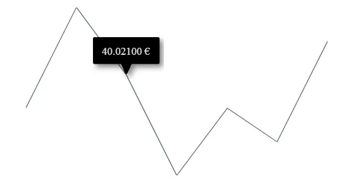

# Globalization in Blazor Sparkline Component

## What is Globalization?

Globalization is a crucial aspect of modern web applications, enabling components to adapt to various languages, cultures, and regional formats. This ensures that users from different parts of the world can interact with your application in a way that feels natural and familiar to them. Globalization typically involves formatting numbers, dates, times, and currencies according to the user's locale, as well as supporting different writing systems and text directions.

In the Sparkline component, the [Format](https://help.syncfusion.com/cr/blazor/Syncfusion.Blazor.Charts.SfSparkline-1.html#Syncfusion_Blazor_Charts_SfSparkline_1_Format) property is used to globalize number, date, and time values. The following example shows the tooltip globalized to currency format in the Deutsch culture.

```cshtml

@using Syncfusion.Blazor.Charts

<SfSparkline DataSource="new double[]{ 300.00, 600.00, 400.21, 100.20, 300.70, 200.04, 500.00 }" Height="200px" Width="350px" Format="C">
    <SparklineTooltipSettings TValue="double" Visible="true"></SparklineTooltipSettings>
</SfSparkline>

```

N> Refer to the [localization documentation for Blazor Server](https://blazor.syncfusion.com/documentation/common/localization#enable-localization-in-blazor-server-application) and [Blazor WebAssembly](https://blazor.syncfusion.com/documentation/common/localization#enable-localization-in-blazor-webassembly-application) for configuration details.

On successful configuration, the Sparkline will be rendered as shown below.



## Importance of Globalization in Sparkline

The Sparkline component is often used to display compact, data-rich visualizations such as trends, performance metrics, or financial data. When presenting such information to a global audience, it is essential that the data is formatted correctly for each user's culture. For example, currency symbols, decimal separators, and date formats can vary widely between regions. By supporting globalization, the Sparkline component ensures that your data is always clear and meaningful, regardless of where your users are located.

## How Globalization Works in Blazor Sparkline

The Blazor Sparkline component leverages the `Format` property to apply culture-specific formatting to numbers, dates, and times. This property accepts standard or custom .NET format strings, allowing you to display values as currency, percentages, dates, or other formats. Additionally, the component can be configured to use the application's current culture, ensuring consistency across your entire Blazor app.

### Example Explained
In the example above, the Sparkline is configured to display tooltip values in currency format (`Format="C"`). When the application's culture is set to Deutsch (German), the currency values will be displayed using the Euro symbol and German number formatting conventions. This makes the chart intuitive for German-speaking users.

## Step-by-Step Guide to Enable Globalization

1. **Set Up Localization in Your Blazor App**: Follow the official Syncfusion documentation to enable localization for Blazor Server or WebAssembly applications.
2. **Configure the Culture**: Set the desired culture (e.g., `de-DE` for German) in your application startup or via user selection.
3. **Apply the Format Property**: Use the `Format` property in the Sparkline component to specify how values should be displayed (e.g., currency, date, percent).
4. **Test the Output**: Run your application and verify that the Sparkline displays values according to the selected culture.

## Practical Scenarios

- **Financial Dashboards**: Displaying sales, revenue, or profit trends in the user's local currency.
- **International Applications**: Adapting charts for users in different countries, each with their own number and date formats.
- **Custom Reports**: Allowing users to select their preferred culture and see all data visualizations update accordingly.


## Additional Resources

- [Blazor Sparkline Documentation](https://blazor.syncfusion.com/documentation/sparkline/getting-started)
- [Globalization in Syncfusion Blazor Components](https://blazor.syncfusion.com/documentation/common/globalization)
- [Localization in Blazor](https://docs.microsoft.com/en-us/aspnet/core/blazor/globalization-localization)

By leveraging globalization features in the Blazor Sparkline component, you can create data visualizations that are accessible and user-friendly for audiences around the world. This not only improves usability but also demonstrates a commitment to inclusivity and professionalism in your applications.
